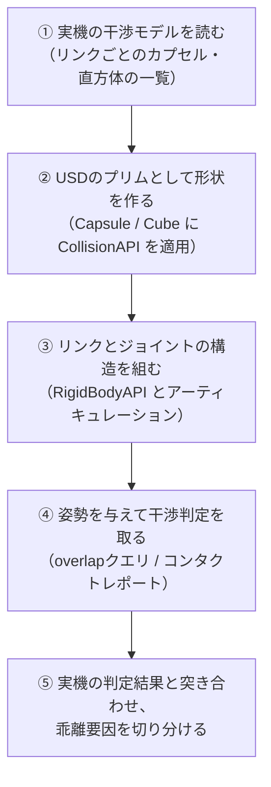
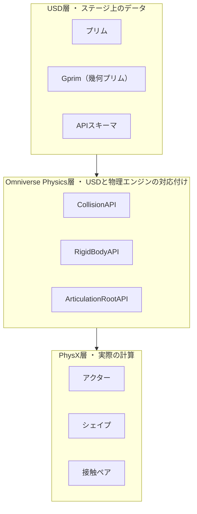

# NB-IsaacSim-Collision-00 概観

## このノートブックが解こうとしている問題

実機のロボットコントローラ（または上位のオフライン干渉チェック系）には、ロボットの各リンクを覆う**干渉モデル**が登録されている。ここでいう干渉モデルとは、「このリンクはこの範囲の空間を占有している」とコントローラに教えるための形状の集合であり、今回の対象では**カプセルと直方体だけ**で構成されている。

やりたいことは次の一点に尽きる。

> **その干渉モデルを NVIDIA Isaac Sim 6.0.1 上に忠実に再現し、実機と同じ干渉判定結果を得る。**

したがってこのノートブックは「どんな形状を設計すべきか」を扱わない。形状はすでに確定しているものとして、**「実機の判定結果とシミュレーションの判定結果が、どこで一致し、どこでずれるか」**だけを扱う。

## 前提知識について

このノートブックは、物理エンジンの内部構造を知らない読者を対象に書いている。C#/.NETの概念はアナロジーとして使うが、それ以外（USD、PhysX、剛体力学）の知識は一切仮定しない。専門用語は、使う前にその場で定義する。

## 基準バージョンと出典の扱い

- 対象は **Isaac Sim 6.0.1（Windowsネイティブ版）**。他バージョン（4.x / 5.x）の情報は本文に混入させない。
- Isaac Sim の物理演算は、内部で **Omniverse Physics** という層を経由して **PhysX 5系** の物理エンジンに渡される。したがって出典は3層に分かれる。
  - USDのデータ構造そのもの → OpenUSD の公式APIドキュメント
  - USDと物理エンジンの対応付け → Omniverse Physics の開発者ガイド
  - 物理エンジン内部の挙動 → PhysX SDK のドキュメント
- Omniverse Physics および PhysX SDK のドキュメントは Isaac Sim のバージョンとは独立に版が付いている。本ノートブックで参照したページに「Isaac Sim 6.0.1向け」と明記されたものは無いため、**Isaac Sim 6.0.1 での再確認が済んでいない事項は各ページ末尾で【未確認】として隔離する**。

## 全体フロー（このノートブックが辿る一本道）

実機の干渉モデルをIsaac Simで再現し、結果を突き合わせるまでの流れは次の5段階になる。各ページがこのどこに位置するかを、ページ冒頭で明示する。

| 段階 | 対応ページ |
|---|---|
| 前提の整理（①より前） | 01 / 02 / 03 |
| ② 形状を作る | 04 / 05 |
| ③ 構造を組む | 07 |
| ④ 判定を取る | 06 |
| ⑤ 突き合わせる | 08 / 09 |
| 引くための表 | 10 |

## 10個の観測軸

以降のページで「2つの物体の間で何が起きるか」を論じるとき、必ず次の10軸のどれかを指している。用語の定義は該当ページで行うが、全体像を先に置いておく。

| 軸 | 問い | 主に扱うページ |
|---|---|---|
| 軸1 物理シーンへの登録 | そもそも物理エンジンがその物体を知っているか | 03 |
| 軸2 ダイナミクス積分 | 重力・外力を受けて位置姿勢が更新されるか | 03 |
| 軸3 接触検出 | 2つの形状の重なりが計算されるか | 02 / 03 |
| 軸4 接触応答 | 検出した接触に対して押し戻す力が入るか | 02 / 03 |
| 軸5 貫通可否 | 双方が空間的に重なり得るか | 03 |
| 軸6 通知の取得 | 検出結果をプログラムから読み取れるか | 06 |
| 軸7 シーンクエリ | raycast / overlap / sweep のヒット対象になるか | 06 |
| 軸8 質量・慣性 | 質量がどこから決まるか | 03 |
| 軸9 物理マテリアル | 摩擦係数・反発係数が効くか | 09 |
| 軸10 レンダリング | 画面に描画されるか（物理とは独立） | 01 |

**軸3と軸4が別物である**ことが、このノートブック全体で最も重要な区別になる。日本語の「干渉」という一語がこの2つを覆い隠してしまうため、以降では「接触検出」「接触応答」と書き分ける。

## このノートブックが訂正している、よくある誤解

以下は、このテーマを扱ううえで実際に発生しやすい誤りである。該当ページの本文で正しい形を提示する。

| # | 誤解 | 正しい理解 | 該当ページ |
|---|---|---|---|
| 1 | Isaac Simの `GeomPrim` というPythonクラスを使えばコリジョンが付く | `GeomPrim(paths)` は `apply_collision_apis=True` を渡さなければ `CollisionAPI` を適用しない（[R-03](#r-03)）。状態を決めるのは**スキーマが適用されているかどうか**であって、Pythonクラスを生成したかどうかではない | 01 / 03 |
| 2 | `RigidBodyAPI` だけ適用した物体は「形状が無い」状態である | 形状（USDジオメトリ）は存在し、画面にも描画される（[R-01](#r-01)）。無いのは**衝突形状**だけ。見た目は正常なのに物理だけ壊れるため、最も気づきにくい | 01 / 03 |
| 3 | キネマティック同士は設定次第で押しのけ合える | キネマティック剛体は静的コライダーとも他のキネマティック剛体とも**衝突しない**。シーンフラグで有効化できるのは接触の「報告」であって「解決」ではない。動的とキネマティックの定義は[R-02](#r-02)を参照 | 03 |
| 4 | 「干渉」は1つの処理である | 内部では「接触検出」と「接触応答」の2段階に分かれており、成立条件が違う | 02 |

## 用語マップ

このノートブックで扱う用語は、大きく3つの層に属する。層をまたいだ用語を混ぜて話すと理解が壊れるため、どの層の話をしているかを常に意識する。

- **上から下への矢印は「解釈される方向」を表す**。USD層のデータをOmniverse Physics層が読み取り、PhysX層の内部オブジェクトを構築する。
- 逆方向、つまりPhysXが計算した結果がUSDに書き戻される経路もある（動的剛体の姿勢）。これは 03 で扱う。

## 各ページの内容

| ページ | 内容 |
|---|---|
| [[NB-IsaacSim-Collision-01-USDの構成要素とPythonラッパー]] | ステージ上の実体と、それを操作するPythonクラスの区別 |
| [[NB-IsaacSim-Collision-02-検出と応答の分離]] | 「干渉」が内部で2段階に分かれていること |
| [[NB-IsaacSim-Collision-03-アクター種別と衝突ペアの成立条件]] | 静的・キネマティック・動的の定義と、全ペアの成立可否 |
| [[NB-IsaacSim-Collision-04-衝突形状の種類と近似]] | 解析形状とメッシュ、動的剛体で三角形メッシュが使えない理由 |
| [[NB-IsaacSim-Collision-05-カプセルと直方体の寸法定義]] | 寸法属性とスケールの罠 |
| [[NB-IsaacSim-Collision-06-干渉検出結果の取得手段]] | overlapクエリ・トリガー・コンタクトレポートの比較 |
| [[NB-IsaacSim-Collision-07-アーティキュレーションと関節姿勢の同期]] | 実機の関節角度をシミュレーションに入れる方法 |
| [[NB-IsaacSim-Collision-08-実機干渉モデルの再現構成]] | 01〜07を統合した最終的なUSD階層 |
| [[NB-IsaacSim-Collision-09-実機との乖離要因]] | 判定結果がずれる要因の全列挙と切り分け方 |
| [[NB-IsaacSim-Collision-10-リファレンス]] | 属性一覧と、未確認事項の確認手順 |

---

## 理解度確認問題

1. 「干渉」という一語が覆い隠している2つの処理は何か。
2. 状態Cのような「RigidBodyAPIだけ適用した物体」が、最もデバッグしにくいと言われるのはなぜか。
3. このノートブックが扱う出典が3層（OpenUSD / Omniverse Physics / PhysX SDK）に分かれるのはなぜか。

解答

1. 接触検出（2つの形状の重なりを計算し、接触点・法線・貫通深度を求める処理）と、接触応答（検出した接触に対して力積を適用し、貫通を解消する処理）の2つ。両者は成立条件が異なる。
2. USDジオメトリは存在してビューポートに正常に描画されるため、見た目からは異常が分からない。しかし衝突形状が存在しないため、床をすり抜けるなど物理挙動だけが壊れる。「見た目が正しいのに物理が壊れている」状態は、原因の切り分けが難しい。
3. Isaac Simは、データ構造としてOpenUSDを使い、それを物理シミュレーションに対応付けるOmniverse Physicsの層を挟み、実際の計算をPhysX 5系のエンジンで行う3層構造になっているため。制約や既定値がどの層に由来するかを区別しないと、バージョンによって変わる情報と変わらない情報を混同する。

---

## 参照

- **[R-01]** Omni Physics — Colliders. https://docs.omniverse.nvidia.com/kit/docs/omni_physics/latest/dev_guide/rigid_bodies_articulations/collision.html
- **[R-02]** Omni Physics — Rigid Bodies. https://docs.omniverse.nvidia.com/kit/docs/omni_physics/latest/dev_guide/rigid_bodies_articulations/rigid_bodies.html
- **[R-03]** Isaac Sim 6.0.0 — Isaac Sim Basic Usage Tutorial（`GeomPrim` / `RigidPrim` の使用例）. https://docs.isaacsim.omniverse.nvidia.com/6.0.0/introduction/quickstart_isaacsim.html

## 未確認事項

- Isaac Sim 6.0.1 に同梱される PhysX SDK の正確なバージョン。本ノートブックのPhysX層の記述は PhysX 5.4 / 5.5 のドキュメントに基づいており、6.0.1 で同一であることは直接確認していない。確認手順は [[NB-IsaacSim-Collision-10-リファレンス]] に記載する。
- 参照した Omniverse Physics ドキュメントは `latest` 版であり、Isaac Sim 6.0.1 が固定している版と一致するかは未確認。

---

## このノートブックの目次

1. [[NB-IsaacSim-Collision-00-概観]]
2. [[NB-IsaacSim-Collision-01-USDの構成要素とPythonラッパー]]
3. [[NB-IsaacSim-Collision-02-検出と応答の分離]]
4. [[NB-IsaacSim-Collision-03-アクター種別と衝突ペアの成立条件]]
5. [[NB-IsaacSim-Collision-04-衝突形状の種類と近似]]
6. [[NB-IsaacSim-Collision-05-カプセルと直方体の寸法定義]]
7. [[NB-IsaacSim-Collision-06-干渉検出結果の取得手段]]
8. [[NB-IsaacSim-Collision-07-アーティキュレーションと関節姿勢の同期]]
9. [[NB-IsaacSim-Collision-08-実機干渉モデルの再現構成]]
10. [[NB-IsaacSim-Collision-09-実機との乖離要因]]
11. [[NB-IsaacSim-Collision-10-リファレンス]]

---

**前のページ**: なし（このページが最初）
**次のページ**: [[NB-IsaacSim-Collision-01-USDの構成要素とPythonラッパー]]
