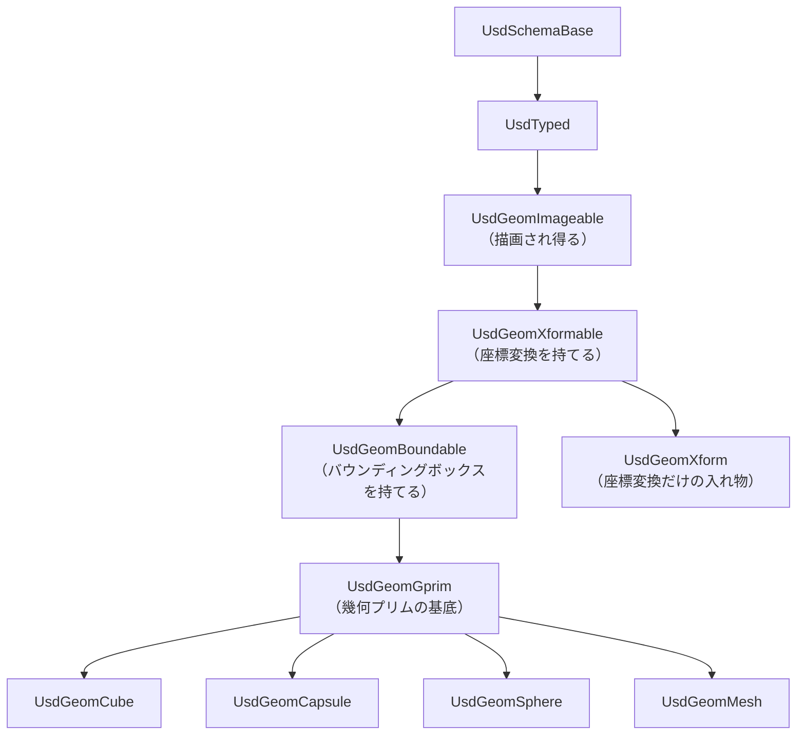

# NB-IsaacSim-Collision-01 USDの構成要素とPythonラッパー

> 全体フローにおける位置: 前提の整理（①より前）

## この仕組みが必要になった理由

3D空間のデータを扱うフォーマットは古くから多数あった。しかし従来のフォーマットの多くは「1つのファイルが1つのシーンを丸ごと持つ」構造であり、次の問題を抱えていた。

- 1つのロボットモデルに対して、モデラーが形状を、エンジニアが物理パラメータを、別々に編集したい。しかし同じファイルを編集すると衝突する。
- 「この物体には質量がある」「この物体は衝突する」といった**後から付け足したい性質**を表現する場所がない。形状フォーマットに物理の欄を作れば、物理を使わない用途では無駄になる。

USD（Universal Scene Description）はこの2つを、**「シーングラフの実体」と「後付けの性質」を分離する**ことで解決した。以降、その分離の仕組みを順に定義する。

## 用語の定義

### プリム（prim）

**プリム**は、USDのシーングラフを構成する1つのノードである。ファイルシステムのディレクトリエントリに似た、パスで一意に指される要素だと考えてよい。

```
/World                 ← プリム
/World/robot           ← プリム
/World/robot/link_0    ← プリム
```

C#で言えば、`XmlNode` のようにツリーを構成する要素であり、それぞれが名前・型・属性の集合を持つ。

### 型付きスキーマ（typed schema）

プリムには**型**がある。型は「このプリムは何であるか」を決め、そのプリムが持つ属性の集合を規定する。

```
def Cube "col_box_0"      ← 型は Cube
def Capsule "col_cap_0"   ← 型は Capsule
def Xform "link_0"        ← 型は Xform（座標変換だけを持つ、中身のない入れ物）
```

C#で言えば、型付きスキーマはクラスに相当する。`Cube` 型のプリムは `size` 属性を持つ、というのはクラスがフィールドを持つのと同じ関係である。

型は**1つのプリムに1つだけ**。あるプリムを `Cube` かつ `Capsule` にはできない。

### Gprim（幾何プリム）

**Gprim** は "geometric primitive" の略で、**画面に描画され得るプリムの共通の基底クラス**である。`Cube`・`Capsule`・`Sphere`・`Mesh` などはすべて Gprim を継承している（[R-04](#r-04)）。

Gprim が持つのは、あらゆる形状に共通する性質である。

| Gprim が持つ属性 | 意味 |
|---|---|
| `displayColor` | シェーダーが割り当てられていないときの表示色 |
| `displayOpacity` | 同じく表示の不透明度 |
| `doubleSided` | 面の裏側もレンダリングするか |
| `orientation` | 面の法線を右手系・左手系のどちらで計算するか |

継承関係は次のようになっている（[R-04](#r-04)）。



矢印は「上が親クラス、下が子クラス」を意味する。`Xform` は `Xformable` を継承するが `Gprim` ではない点に注意する。座標変換は持てるが、それ自体は描画されない。

### APIスキーマ（API schema）

**APIスキーマ**は、既存のプリムに**後から貼り付ける性質のラベル**である。型付きスキーマが1つしか付けられないのに対し、APIスキーマは**何枚でも重ねて貼れる**。

C#のアナロジーで言えば、型付きスキーマがクラス、APIスキーマはインターフェイスの実装を実行時に追加するようなものである。ただしインターフェイスと違い、APIスキーマは属性の定義も持ち込む。

USDファイル（`.usda` 形式）では次のように現れる。

```usda
def Capsule "col_cap_0" (
    prepend apiSchemas = ["PhysicsCollisionAPI"]
)
{
    float physics:approximation = "none"
    double radius = 0.05
    double height = 0.3
    uniform token axis = "Z"
}
```

- `def Capsule` の部分が型付きスキーマ
- `apiSchemas = [...]` の中身がAPIスキーマ
- `radius` / `height` / `axis` は `Capsule` 型が定義する属性
- `physics:` で始まる属性は、APIスキーマが持ち込んだ属性

このノートブックで扱う主なAPIスキーマは次の3つである。

| APIスキーマ | 貼れる対象 | 持ち込む意味 |
|---|---|---|
| `UsdPhysics.CollisionAPI` | Gprim | このプリムの形状を衝突形状として使う |
| `UsdPhysics.RigidBodyAPI` | Xformable | このプリムを剛体として扱う |
| `UsdPhysics.ArticulationRootAPI` | 剛体または関節 | ここを起点に連結構造を組む |

貼れる対象が違う点が重要である。`CollisionAPI` は形状を持つプリム（Gprim）にしか意味がないが、`RigidBodyAPI` は形状を持たない `Xform` にも貼れる。これが後のページで扱う「衝突形状なし剛体」という壊れた状態の根本原因になる。

## Pythonラッパークラス

ここまでがステージ上の実体の話である。これとは**完全に別の層**に、Pythonからそれらを操作するためのクラス群がある。

### Isaac Simのラッパークラス

Isaac Sim 6.0.1 の `isaacsim.core.experimental.prims` 拡張は、「ステージ上の1つ以上のUSDプリムをラップして、属性の読み書きやその他の操作を行うためのAPI群」として提供されている（[R-05](#r-05)）。

公式のクイックスタートに載っている使い方は次の通り（[R-06](#r-06)）。

```python
from isaacsim.core.experimental.objects import Cube
from isaacsim.core.experimental.prims import GeomPrim, RigidPrim

# ① ステージに Cube 型のプリムを作る
cube = Cube(
    paths="/dynamic_cube",
    positions=[0, -1.0, 1.0],
    sizes=0.3,
)

# ② そのプリムに RigidBodyAPI を貼る
RigidPrim(paths="/dynamic_cube")

# ③ そのプリムに CollisionAPI を貼る
GeomPrim(paths="/dynamic_cube", apply_collision_apis=True)
```

実行後のステージの状態は次のようになる。

```usda
def Cube "dynamic_cube" (
    prepend apiSchemas = ["PhysicsRigidBodyAPI", "PhysicsCollisionAPI"]
)
{
    double size = 0.3
    double3 xformOp:translate = (0, -1, 1)
    uniform token[] xformOpOrder = ["xformOp:translate"]
}
```

### ここで最も誤解されやすい点

**`GeomPrim` というクラスを生成しただけでは、コリジョンは付かない。**

`apply_collision_apis` は引数である。次の2行は、ステージに与える効果がまったく違う。

```python
GeomPrim(paths="/dynamic_cube")                            # ← CollisionAPI は貼られない
GeomPrim(paths="/dynamic_cube", apply_collision_apis=True) # ← CollisionAPI が貼られる
```

前者を実行した後のステージ。

```usda
def Cube "dynamic_cube"
{
    double size = 0.3
}
```

後者を実行した後のステージ。

```usda
def Cube "dynamic_cube" (
    prepend apiSchemas = ["PhysicsCollisionAPI"]
)
{
    double size = 0.3
}
```

つまり物体の物理的な状態を決めているのは**APIスキーマが貼られているかどうか**であって、Pythonクラスのインスタンスを作ったかどうかではない。以降のページで「状態A〜D」を分類するとき、その軸は常に**CollisionAPIの有無・RigidBodyAPIの有無**であり、`GeomPrim` / `RigidPrim` の有無ではない。

### ラッパーは実体ではない

もう1つ、混同しやすい点がある。

- `GeomPrim(...)` を呼んでも**新しいジオメトリは生まれない**。既存のプリムを掴むだけである。
- ラッパーのPythonオブジェクトをガベージコレクションで破棄しても**プリムは消えない**。
- 逆に、ラッパーを一度も作らなくても、プリムはステージ上に存在し、ビューポートに描画される。

Omniverse Physics の公式ドキュメントには、コリジョンAPIも剛体ダイナミクスも持たない純粋な視覚用のカプセル（visual capsule）という表現が現れる（[R-01](#r-01)）。**ジオメトリ単体で存在し描画される状態が、USDにおける正規の状態**であることの裏付けである。

C#のアナロジーで言えば、プリムがデータベースの行、ラッパークラスがその行を操作するリポジトリオブジェクトに近い。リポジトリを `new` しても行は増えないし、リポジトリを破棄しても行は消えない。

### なぜ `ColliderPrim` という名前ではないのか

`GeomPrim` という名前は、「コリジョンを付けるクラス」という機能から付いたのではなく、**ラップ対象のUSDスキーマ名 `Gprim` から採られている**。同じ拡張には `XformPrim`（`Xformable` をラップ）もあり、命名がスキーマ名に対応していることが分かる。

`GeomPrim` の責務はコリジョンの適用だけではない。ビジュアルマテリアルの適用（`apply_visual_materials`）など、Gprim全般に対する操作を持っている。コリジョンの適用は `apply_collision_apis` という**任意の引数**でしかない。`ColliderPrim` と名付けると「コリジョンを持たないGprimを扱えない」という誤解を招く。

一方 `RigidPrim` の側は、USDスキーマ名（`RigidBodyAPI`）ではなく物理機能名から採られており、命名基準が揃っていない。この不統一が、`GeomPrim` を「コリジョンのクラス」と読ませてしまう原因になっている。

なお、この拡張のAPIは公式に「experimental であり、非推奨サイクルを経ずに変更され得る」と明記されている（[R-05](#r-05)）。命名も含めて将来変わる可能性がある。

## まとめ

| 概念 | どこに存在するか | 生成・破棄の影響 |
|---|---|---|
| プリム | USDステージ上 | 消すとシーンから消える |
| 型付きスキーマ | プリムに1つ | プリムの型そのもの |
| APIスキーマ | プリムに複数 | 貼ると物理的な性質が付く |
| Pythonラッパー | プロセスのメモリ上 | 生成・破棄してもステージは変わらない |

---

## 理解度確認問題

1. 次のコードを実行した後、`/World/cap` に対して `CollisionAPI` は貼られているか。
   ```python
   from isaacsim.core.experimental.prims import GeomPrim
   GeomPrim(paths="/World/cap")
   ```
2. 型付きスキーマとAPIスキーマの、最も本質的な違いは何か。
3. `RigidBodyAPI` は `Xform` 型のプリム（形状を持たない入れ物）にも貼れる。これがなぜ問題の種になるのか。

<details>
<summary>解答</summary>

1. 貼られていない。`apply_collision_apis=True` を渡していないため、`GeomPrim` はプリムをラップするだけで `CollisionAPI` を適用しない。ステージ上の `/World/cap` の `apiSchemas` は空のままになる。
2. 型付きスキーマは1つのプリムに1つだけで、プリムが「何であるか」を決める。APIスキーマは何枚でも重ねられ、既存のプリムに「後から性質を追加する」ためのもの。前者はクラス、後者は実行時に追加されるインターフェイス実装に近い。
3. 形状が無いプリムを剛体にできてしまうため。剛体として物理シーンに登録されるが衝突形状を1つも持たないという状態が作れる。この状態でも子孫にコリジョン付きプリムがあれば正常に動くが、無ければ「重力で落ち続けて何にも当たらない」物体になる。ビューポート上は正常に見えるため発見が遅れる。

</details>

---

## 参照

- <a id="r-01"></a>**[R-01]** Omni Physics — Colliders. https://docs.omniverse.nvidia.com/kit/docs/omni_physics/latest/dev_guide/rigid_bodies_articulations/collision.html
- <a id="r-04"></a>**[R-04]** OpenUSD — UsdGeomCapsule Class Reference（Gprim を含む継承関係）. https://openusd.org/release/api/class_usd_geom_capsule.html
- <a id="r-05"></a>**[R-05]** Isaac Sim — isaacsim.core.experimental.prims 拡張のドキュメント（experimental である旨の記載を含む）. https://docs.isaacsim.omniverse.nvidia.com/latest/py/source/extensions/isaacsim.core.experimental.prims/docs/index.html
- <a id="r-06"></a>**[R-06]** Isaac Sim 6.0.0 — Isaac Sim Basic Usage Tutorial. https://docs.isaacsim.omniverse.nvidia.com/6.0.0/introduction/quickstart_isaacsim.html

## 未確認事項

- `GeomPrim` / `RigidPrim` の継承関係（`XformPrim` を継承しているか等）は、公式ドキュメントのクラス階層図で直接確認していない。`C:\isaacsim\exts\` 配下のソースで確認できる。手順は [[NB-IsaacSim-Collision-10-リファレンス]] に記載する。
- `apply_collision_apis` の既定値が `False` であることは、公式サンプルが常に明示的に `True` を渡していることからの推定であり、シグネチャで直接確認していない。

---

## このノートブックの目次

1. [[NB-IsaacSim-Collision-00-概観]]
2. [[NB-IsaacSim-Collision-01-USDの構成要素とPythonラッパー]]
3. [[NB-IsaacSim-Collision-02-検出と応答の分離]]
4. [[NB-IsaacSim-Collision-03-アクター種別と衝突ペアの成立条件]]
5. [[NB-IsaacSim-Collision-04-衝突形状の種類と近似]]
6. [[NB-IsaacSim-Collision-05-カプセルと直方体の寸法定義]]
7. [[NB-IsaacSim-Collision-06-干渉検出結果の取得手段]]
8. [[NB-IsaacSim-Collision-07-アーティキュレーションと関節姿勢の同期]]
9. [[NB-IsaacSim-Collision-08-実機干渉モデルの再現構成]]
10. [[NB-IsaacSim-Collision-09-実機との乖離要因]]
11. [[NB-IsaacSim-Collision-10-リファレンス]]

---

**前のページ**: [[NB-IsaacSim-Collision-00-概観]]
**次のページ**: [[NB-IsaacSim-Collision-02-検出と応答の分離]]
