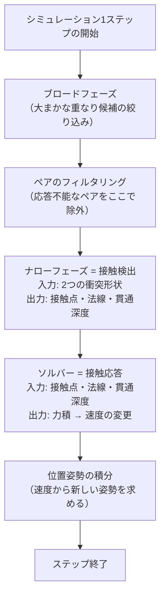

# NB-IsaacSim-Collision-02 検出と応答の分離

> 全体フローにおける位置: 前提の整理（①より前）

## 「干渉」という一語が起こす取り違え

日本語で「AとBが干渉する」と言うとき、話者は状況によって少なくとも次の2つの別々のことを指している。

- **(a) AとBの占有空間が重なっていることが分かる**（実機の干渉チェックはこちら）
- **(b) AとBがぶつかって押し合い、それ以上めり込まない**（物理シミュレーションの直感はこちら）

物理エンジンの内部では、この2つは**別々の処理フェーズ**として実装されており、**成立条件が異なる**。片方が成立してももう片方は成立しないことが普通に起こる。したがって以降は用語を分ける。

| 用語 | 対応する処理 | 上の (a)(b) との対応 |
|---|---|---|
| **接触検出**（contact generation） | 2つの形状が重なっているかを判定し、重なりの詳細を計算する | (a) |
| **接触応答**（contact resolution） | 検出結果に基づいて力を加え、重なりを解消する | (b) |

## 接触検出フェーズが行うこと

接触検出は、2つの形状を入力として、以下を出力する。

| 出力 | 意味 |
|---|---|
| **接触点**（contact point） | 2つの形状が触れている空間座標。1ペアに複数個できることもある |
| **法線**（normal） | 接触面に垂直な向きの単位ベクトル。「どちら向きに押し戻せばよいか」を表す |
| **貫通深度**（penetration depth） | どれだけめり込んでいるかの距離。めり込んでいなければ負の値（隙間の距離） |

Omniverse Physicsのコンタクトレポートが返すデータ構造にも、この3つが `position` / `normal` / `separation` として現れる（[R-07](#r-07)）。`separation` は隙間の値で、めり込みは負値になる。

### 接触検出には何が必要か

**両方の物体が衝突形状を持っていること**。これだけである。形状が無い側があれば、重なりを計算する対象そのものが存在しない。

## 接触応答フェーズが行うこと

接触応答は、検出された接触点・法線・貫通深度を入力として、**力積**（impulse）を計算し、物体の速度を変更する。

**力積**とは、力に時間を掛けた量である。物理シミュレーションは離散的な時間刻み（タイムステップ）で進むため、「1ステップの間にどれだけ速度を変えるか」を直接扱うほうが安定する。単位はニュートン秒で、質量×速度変化に等しい。

コンタクトレポートのデータにも `impulse` が含まれている（[R-07](#r-07)）。

### 接触応答には何が必要か

**少なくとも片方が、力積を受け取って動ける物体であること**。

力積を受け取って速度が変わるということは、その物体の位置姿勢がシミュレーションによって書き換えられるということである。Omniverse Physics のドキュメントは、この「書き換えられるかどうか」を剛体の種別の定義そのものとして説明している（[R-02](#r-02)）。

- **動的剛体**: 姿勢が物理シミュレーションによって**書き込まれる**
- **キネマティック剛体**: 姿勢は物理シミュレーションによって**読み取られる**（アプリケーションが書く）

つまり接触応答が意味を持つのは、片側以上が動的剛体である場合に限られる。

## 2フェーズの関係

この図で決定的に重要なのは、**フィルタリングが接触検出より前にある**ことである。

PhysXは「どちらも力積を受け取れないペア」を、接触検出に到達する前に除外する。理由は明快で、応答できないペアの接触を計算しても結果を捨てるだけの無駄になるからである。この結果として、次の一見不思議な挙動が生じる。

> **静的コライダー同士は、空間的に完全に重なっていても、接触が一切検出されない。**

これは「重なりを検出したうえで無視している」のではなく、「そもそも検出処理に入っていない」。PhysXのシーンフラグのドキュメントは、キネマティック対静的のペアについて、既定では接触が抑制されフィルタ機構にすら渡されないと明記している（[R-08](#r-08)）。

### 「検出はするが応答しない」を作りたい場合

上の図から分かる通り、既定の経路では「検出だけして応答しない」は作れない。これを実現する仕組みは別途用意されている。

- **トリガーシェイプ**: 接触を生成せず、重なりの開始・終了だけを通知する
- **シーンクエリ（overlap）**: シミュレーションの経路とは別に、任意のタイミングで重なりを問い合わせる

いずれも [[NB-IsaacSim-Collision-06-干渉検出結果の取得手段]] で扱う。実機の干渉モデルを再現する目的では、こちらが本命の経路になる。

## 実機の干渉チェックとの対応

ここが本ノートブックの主題に直結する。

実機のコントローラが行う干渉チェックは、ほぼ確実に**接触検出だけ**を行っている。ロボットのリンクを「押し戻す」必要はなく、「重なったら止める・警告する」ためのものだからである。

対して、Isaac Sim を素直に使うと動的剛体による接触応答が働く。つまり**そのままでは実機と違う処理を再現していることになる**。

| | 実機のコントローラ | Isaac Simで素直に組んだ場合 |
|---|---|---|
| 接触検出 | 行う | 行う |
| 接触応答 | 行わない（形状は指令通りに動く） | 行う（指令姿勢から逸脱する） |
| 指令姿勢の再現性 | 完全に一致 | 接触時に一致しない |

この不一致を避けるための構成は [[NB-IsaacSim-Collision-08-実機干渉モデルの再現構成]] で組み立てる。結論だけ先に書けば、**接触応答を意図的に成立させず、接触検出だけを別経路で取り出す**構成にする。

## 責務の対応表

| 何を与えるか | 誰が与えるか | 無いとどうなるか |
|---|---|---|
| 形（占有する空間の境界） | `CollisionAPI` が適用されたGprim | 接触検出が始まらない |
| 動く資格（力積を受け取れること） | `RigidBodyAPI`（かつキネマティックでないこと） | 接触応答が起こらず、そのためペアが検出前に除外される |

「GeomPrim = 形、RigidPrim = 動き」という覚え方でよいが、正確には「CollisionAPI = 形、RigidBodyAPI = 動き」である。

---

## 理解度確認問題

1. 接触検出の出力3つ（接触点・法線・貫通深度）のうち、「どちら向きに押し戻すか」を決めているのはどれか。
2. 静的コライダー同士が重なっていても何も起きない。これは「検出したうえで無視している」のか、「検出していない」のか。またその理由は何か。
3. 実機のコントローラの干渉チェックと、Isaac Simで動的剛体を使った場合とで、決定的に違うのはどのフェーズか。

解答

1. 法線。接触面に垂直な単位ベクトルであり、力積を加える向きを与える。接触点は「どこに」、貫通深度は「どれだけ」を与える。
2. 検出していない。PhysXはブロードフェーズの後のフィルタリング段階で、どちらも力積を受け取れないペアを除外する。応答できないペアの接触を計算しても結果が捨てられるだけで無駄になるため。
3. 接触応答フェーズ。実機のコントローラは重なりを検出するだけで形状を押し戻さないが、Isaac Simで動的剛体を使うとソルバーが力積を加えて姿勢を変えるため、指令した姿勢が再現されなくなる。

---

## 参照

- **[R-02]** Omni Physics — Rigid Bodies（動的剛体は姿勢が書き込まれ、キネマティック剛体は姿勢が読み取られる、という定義）. https://docs.omniverse.nvidia.com/kit/docs/omni_physics/latest/dev_guide/rigid_bodies_articulations/rigid_bodies.html
- **[R-07]** Omni Physics — Contact Reports（`position` / `normal` / `impulse` / `separation` を含む接触データの構造）. https://docs.omniverse.nvidia.com/kit/docs/omni_physics/latest/extensions/runtime/source/omni.physx/docs/dev_guide/contact_reports.html
- **[R-08]** PhysX — PxSceneFlag Struct Reference（キネマティック対静的のペアが既定で抑制され、フィルタ機構に渡されない旨の記載）. https://docs.nvidia.com/gameworks/content/gameworkslibrary/physx/apireference/files/structPxSceneFlag.html

## 未確認事項

- ブロードフェーズ・フィルタリング・ナローフェーズ・ソルバーという段階の並びは PhysX の一般的な処理構造に基づく整理であり、Isaac Sim 6.0.1 が使用する PhysX の実装で段階名・順序が同一であることを公式ドキュメントで直接確認したわけではない。

---

## このノートブックの目次

1. [[NB-IsaacSim-Collision-00-概観]]
2. [[NB-IsaacSim-Collision-01-USDの構成要素とPythonラッパー]]
3. [[NB-IsaacSim-Collision-02-検出と応答の分離]]
4. [[NB-IsaacSim-Collision-03-アクター種別と衝突ペアの成立条件]]
5. [[NB-IsaacSim-Collision-04-衝突形状の種類と近似]]
6. [[NB-IsaacSim-Collision-05-カプセルと直方体の寸法定義]]
7. [[NB-IsaacSim-Collision-06-干渉検出結果の取得手段]]
8. [[NB-IsaacSim-Collision-07-アーティキュレーションと関節姿勢の同期]]
9. [[NB-IsaacSim-Collision-08-実機干渉モデルの再現構成]]
10. [[NB-IsaacSim-Collision-09-実機との乖離要因]]
11. [[NB-IsaacSim-Collision-10-リファレンス]]

---

**前のページ**: [[NB-IsaacSim-Collision-01-USDの構成要素とPythonラッパー]]
**次のページ**: [[NB-IsaacSim-Collision-03-アクター種別と衝突ペアの成立条件]]
