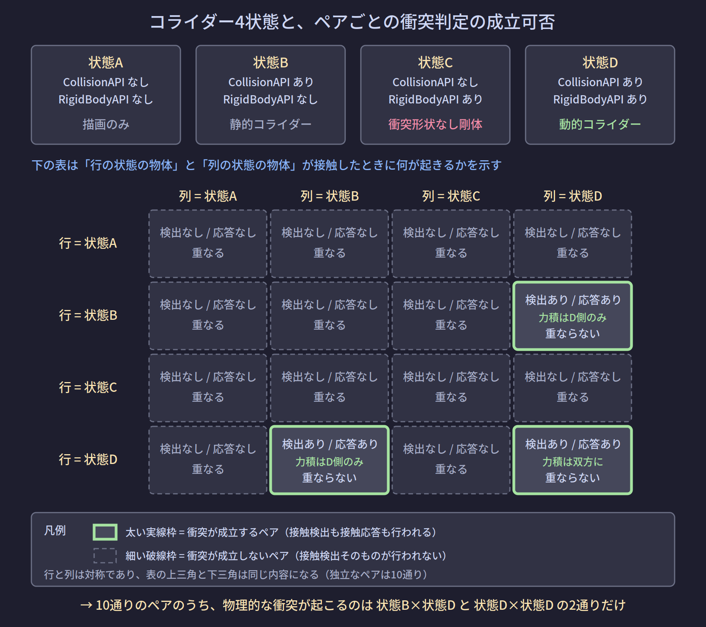

# NB-IsaacSim-Collision-03 アクター種別と衝突ペアの成立条件

> 全体フローにおける位置: 前提の整理（①より前）

## アクターとは何か

**アクター**（actor）は、PhysXが物理シーンの中で管理する1個の物体を指す語である。USD側でどう書かれていようと、Omniverse Physics がそれを解釈して PhysX 側にアクターを作る。以降で扱う「静的・キネマティック・動的」は、このアクターの種別である。

アクターは**シェイプ**（shape）を0個以上持つ。シェイプは1つの衝突形状に対応する。`CollisionAPI` が適用されたプリム1つが、シェイプ1つになる。

## 3つのアクター種別

### 静的コライダー（static collider）

`CollisionAPI` が適用され、**そのプリムにも祖先のプリムにも `RigidBodyAPI` が無い**状態。Omniverse Physics のドキュメントは、`CollisionAPI` を持つプリムまたはその祖先が `RigidBodyAPI` を持てばコライダーは剛体とともに動き、そうでなければ静的とみなされる、と明記している（[R-01](#r-01)）。

- 姿勢はシミュレーションによって一切変更されない
- 質量という概念を持たない（実質無限大として扱われる）
- 床・壁・机など、動かない環境物がこれに当たる

### キネマティック剛体（kinematic rigid body）

`RigidBodyAPI` が適用され、かつ `physics:kinematicEnabled = true` の状態。

Omniverse Physics のドキュメントは、動的とキネマティックの違いを「シミュレーションエンジンによる姿勢の読み書きの向き」で説明している（[R-02](#r-02)）。

- **動的剛体**: 姿勢がシミュレーションによって**書き込まれる**
- **キネマティック剛体**: 姿勢がシミュレーションによって**読み取られる**（アプリケーション側が書く）

キネマティックは、コンベア・移動する治具・スクリプトで直接動かしたい物体のためにある。動的剛体を押しのけるが、自分は何にも押されない。

### 動的剛体（dynamic rigid body）

`RigidBodyAPI` が適用され、`kinematicEnabled` が偽（既定）の状態。重力・外力・拘束を受けて動く。

### 補足: 剛体を無効化した場合

`rigidBodyEnabled` 属性を `False` に設定すると `RigidBodyAPI` の効果が打ち消され、その配下のコライダーは**静的コライダーとして振る舞う**（[R-02](#r-02)）。スキーマを剥がさずに状態を切り替えられるため、後のバリアント構成で使える。

## CollisionAPI と RigidBodyAPI の有無による4状態

物体の状態は、2つのAPIスキーマの有無で4通りに分かれる。**軸は「APIスキーマが適用されているか」であって、`GeomPrim` / `RigidPrim` というPythonクラスを生成したかどうかではない**（[[NB-IsaacSim-Collision-01-USDの構成要素とPythonラッパー]] を参照）。

| 状態 | CollisionAPI | RigidBodyAPI | 呼称 |
|---|---|---|---|
| A | なし | なし | 描画のみのジオメトリ |
| B | あり | なし | 静的コライダー |
| C | なし | あり | 衝突形状なし剛体 |
| D | あり | あり | 動的コライダー |

Isaac Sim のコアAPIチュートリアルも、`GeomPrim` を `RigidPrim` なしで使えば静的コライダーになり、両方を使えば完全に動的な物体になる、と説明している（[R-09](#r-09)）。

### 各状態の詳細

| 観測軸 | 状態A | 状態B | 状態C | 状態D |
|---|---|---|---|---|
| 軸1 物理シーンへの登録 | されない | 静的アクター | 動的アクター | 動的アクター |
| 軸2 ダイナミクス積分 | なし | なし | あり（落下する） | あり |
| 軸3 接触検出の相手になれるか | なれない | なれる | **なれない** | なれる |
| 軸8 質量 | 概念なし | 実質無限 | 衝突形状が無いため自動計算不可 | 衝突形状の体積×密度 |
| 軸10 レンダリング | **される** | される | **される** | される |

### 状態Cが最も危険な理由

状態Cは、**ビューポート上は完全に正常な物体に見える**。USDジオメトリは存在し、色も形も正しく描画される。しかし衝突形状が1つも無いため、次のようになる。

- 床をすり抜けて無限に落下する
- 他の物体と一切当たらない
- 質量を体積から自動計算できない

質量の既定値について、Omniverse Physics のドキュメントは明確に記述している。質量属性が明示されておらず、密度から質量を導くための衝突形状も無い場合、**質量は 1.0 質量単位になる**（[R-02](#r-02)）。なお衝突形状がある場合の既定密度は 1000 kg/m³（水の密度）である（[R-02](#r-02)）。

## ペアの成立可否

2つの物体が接触したときに何が起きるかを、全ペアについて示す。

表形式で再掲する。行と列は対称なので、独立なペアは10通りである。

| ペア | 接触検出 | 接触応答 | 重なり | 実際に起こること |
|---|---|---|---|---|
| A × A | なし | なし | 重なる | 双方が物理シーンの外側。何も起きない |
| A × B | なし | なし | 重なる | Aは未登録なので静的コライダーを素通り |
| A × C | なし | なし | 重なる | Cが落下してAを素通り |
| A × D | なし | なし | 重なる | Dが落下してAを素通り。めり込んで見える典型的なミス |
| B × B | なし | なし | 重なる | 静的同士。ペアが検出前に除外される |
| B × C | なし | なし | 重なる | Cに衝突形状が無く、床（B）を貫通して落下し続ける |
| **B × D** | あり | あり（D側のみが力積を受ける） | 重ならない | 床の上に物体が乗る。最も一般的な組み合わせ |
| C × C | なし | なし | 重なる | 双方とも衝突形状なし。並んで落下し互いを認識しない |
| C × D | なし | なし | 重なる | Cに衝突形状が無く接触点を作れない |
| **D × D** | あり | あり（双方が逆向きの力積を受ける） | 重ならない | 完全な剛体衝突。積み上げ・把持・押し出しはこの状態 |

**10通りのうち、物理的な衝突が起こるのは B×D と D×D の2通りだけ**である。

## キネマティックが絡むペア

上の4状態は `kinematicEnabled` を考慮していない。キネマティックを含めた場合の挙動を、以下に分けて示す。

### 押しのけ（接触応答）の可否

PhysX の剛体フラグのリファレンスは、キネマティックについて一文で言い切っている。**キネマティックは静的な物体とも、他のキネマティックな物体とも衝突しない**（[R-10](#r-10)）。

さらに PhysX の開発者フォーラムでは、キネマティック同士を接触させようとした際に「2つのキネマティック物体間の接触の解決は無効である。接触は解決されない」という趣旨の警告が出ることが報告されている（[R-11](#r-11)）。

| ペア | 接触応答 |
|---|---|
| キネマティック × 静的 | **起こらない** |
| キネマティック × キネマティック | **起こらない** |
| キネマティック × 動的 | 起こる（動的側だけが押される） |

### 接触の「報告」の可否

ここが誤解されやすい。PhysX にはシーンフラグとして `eENABLE_KINEMATIC_PAIRS`（キネマティック同士）と `eENABLE_KINEMATIC_STATIC_PAIRS`（キネマティック対静的）が存在する（[R-08](#r-08)）。

しかしこのフラグの説明は「これらのペアがフィルタ機構を通るようにする」であり、**接触の報告を有効化するもの**である。フラグを立てても接触が解決される（押しのけ合う）ようにはならない（[R-11](#r-11)）。

> **フラグで有効化できるのは「報告」であって「解決」ではない。**

したがって、キネマティックにしたリンク同士を「押しのけ合わせる」ことはできない。押しのけが必要なら動的剛体にするしかない。逆に「検出だけしたい」場合は、このフラグ経由よりも [[NB-IsaacSim-Collision-06-干渉検出結果の取得手段]] で扱う overlap シーンクエリのほうが確実である。

### なぜキネマティックを使うのか

姿勢確認ツールのように、**リンクを毎フレーム動かす**用途では、静的コライダーではなくキネマティックを選ぶべき理由がある。

PhysXは静的アクターを「動かさない前提」で空間分割構造を構築している。静的アクターの姿勢を毎フレーム変更するのは、この構造の想定を外れた使い方になる。一方キネマティックアクターは「アプリケーションが毎フレーム姿勢を書く」ことを前提に設計されている（[R-02](#r-02)）。

判断基準は「周囲に動的物体があるかどうか」ではなく、**「自分が毎フレーム動くかどうか」**である。

## この4状態を実機再現にどう使うか

先取りして結論を書いておく。実機の干渉モデルを再現する構成では、リンクを次のようにする。

- リンクプリム: `RigidBodyAPI` + `kinematicEnabled = true`（キネマティック）
- 干渉形状プリム: `CollisionAPI`（リンクの子孫に配置）
- 接触応答は成立させない（キネマティック同士は押しのけ合わないため、自動的にそうなる）
- 干渉の検出は overlap シーンクエリで別途取得する

詳細は [[NB-IsaacSim-Collision-08-実機干渉モデルの再現構成]] で組み立てる。

---

## 理解度確認問題

1. 状態C（衝突形状なし剛体）の物体をシーンに置き、シミュレーションを再生した。ビューポートで何が観察されるか。
2. リンク同士をキネマティック剛体にして、接触したときに押しのけ合わせたい。これは可能か。
3. 姿勢確認ツールでロボットのリンクを毎フレーム動かす場合、静的コライダーとキネマティック剛体のどちらを選ぶべきか。その判断根拠は何か。

解答

1. 物体は正常に描画されたまま、重力によって落下し続ける。床やほかの物体をすべてすり抜ける。見た目には何の異常も無いため、「なぜか落ち続ける」という症状だけが観察される。
2. 不可能。PhysXのリファレンスは、キネマティックは静的とも他のキネマティックとも衝突しないと明記している。シーンフラグ `eENABLE_KINEMATIC_PAIRS` 等で有効化できるのは接触の「報告」であって「解決」ではない。押しのけが必要なら動的剛体にするしかない。
3. キネマティック剛体。理由は「周囲に動的物体があるから」ではなく「自分が毎フレーム動くから」。PhysXは静的アクターを動かさない前提で空間分割構造を作っており、毎フレーム姿勢を変える使い方は想定外。キネマティックはアプリケーションが毎フレーム姿勢を書くことを前提に設計されている。

---

## 参照

- **[R-01]** Omni Physics — Colliders（`CollisionAPI` を持つプリムまたはその祖先に `RigidBodyAPI` があるかで、動くコライダーか静的コライダーかが決まる）. https://docs.omniverse.nvidia.com/kit/docs/omni_physics/latest/dev_guide/rigid_bodies_articulations/collision.html
- **[R-02]** Omni Physics — Rigid Bodies（動的とキネマティックの定義、`rigidBodyEnabled` を偽にした場合の挙動、既定密度 1000 kg/m³、衝突形状も質量指定も無い場合の質量 1.0）. https://docs.omniverse.nvidia.com/kit/docs/omni_physics/latest/dev_guide/rigid_bodies_articulations/rigid_bodies.html
- **[R-08]** PhysX — PxSceneFlag Struct Reference（`eENABLE_KINEMATIC_PAIRS` / `eENABLE_KINEMATIC_STATIC_PAIRS` の説明。既定では抑制され、フラグはフィルタ機構への受け渡しを有効化するもの）. https://docs.nvidia.com/gameworks/content/gameworkslibrary/physx/apireference/files/structPxSceneFlag.html
- **[R-09]** Isaac Sim — Core API Tutorial（`GeomPrim` 単独で静的コライダー、`RigidPrim` との併用で完全に動的な物体になる旨）. https://docs.isaacsim.omniverse.nvidia.com/latest/core_api_tutorials/tutorial_core_hello_world.html
- **[R-10]** PhysX — PxRigidBodyFlag Struct Reference（キネマティックは静的とも他のキネマティックとも衝突しない）. https://docs.nvidia.com/gameworks/content/gameworkslibrary/physx/apireference/files/structPxRigidBodyFlag.html
- **[R-11]** NVIDIA Developer Forums — キネマティック物体間の接触に関する議論（接触の解決が無効である旨の警告と、フラグが報告のみを有効化することの説明）. https://forums.developer.nvidia.com/t/contact-between-two-kinematic-objects-haptics/31226

## 未確認事項

- `eENABLE_KINEMATIC_PAIRS` / `eENABLE_KINEMATIC_STATIC_PAIRS` に相当する設定が、Isaac Sim 6.0.1 の `PhysxSceneAPI` からどの属性名で操作できるか（あるいは公開されていないか）は未確認。参照した PhysX リファレンスは 3.x 系のものであり、PhysX 5 系での同名フラグの存否も直接確認していない。
- 静的アクターの姿勢変更に伴う空間分割構造の再構築コストは、PhysXの一般的な設計に基づく説明であり、Isaac Sim 6.0.1 での実測値は持っていない。

---

## このノートブックの目次

1. [[NB-IsaacSim-Collision-00-概観]]
2. [[NB-IsaacSim-Collision-01-USDの構成要素とPythonラッパー]]
3. [[NB-IsaacSim-Collision-02-検出と応答の分離]]
4. [[NB-IsaacSim-Collision-03-アクター種別と衝突ペアの成立条件]]
5. [[NB-IsaacSim-Collision-04-衝突形状の種類と近似]]
6. [[NB-IsaacSim-Collision-05-カプセルと直方体の寸法定義]]
7. [[NB-IsaacSim-Collision-06-干渉検出結果の取得手段]]
8. [[NB-IsaacSim-Collision-07-アーティキュレーションと関節姿勢の同期]]
9. [[NB-IsaacSim-Collision-08-実機干渉モデルの再現構成]]
10. [[NB-IsaacSim-Collision-09-実機との乖離要因]]
11. [[NB-IsaacSim-Collision-10-リファレンス]]

---

**前のページ**: [[NB-IsaacSim-Collision-02-検出と応答の分離]]
**次のページ**: [[NB-IsaacSim-Collision-04-衝突形状の種類と近似]]
