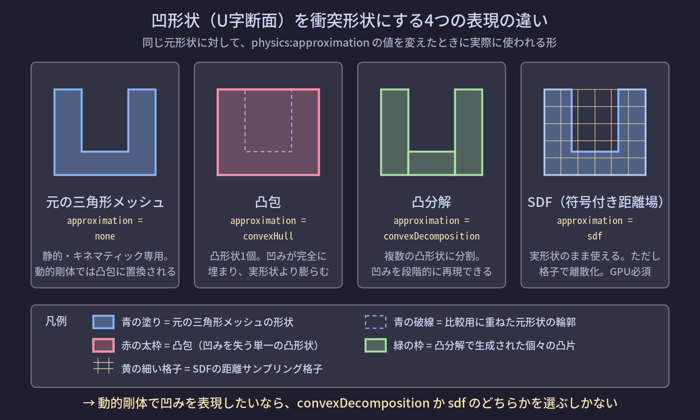

# NB-IsaacSim-Collision-04 衝突形状の種類と近似

> 全体フローにおける位置: ② 形状を作る

## 解析形状とメッシュ

衝突形状の表現は、大きく2種類に分かれる。

### 解析形状（analytic shape）

**解析形状**とは、少数のスカラー値（半径・高さなど）だけで完全に定義できる形状のことである。球なら中心と半径、カプセルなら軸・半径・高さで決まる。「解析的」というのは、形状上の点かどうかを数式1本で判定できることを指す。

Omniverse Physics が `CollisionAPI` だけで正確に対応付けられる `UsdGeom` の型は、次の5つである（[R-01](#r-01)）。

| UsdGeom型 | 形状 |
|---|---|
| `UsdGeom.Sphere` | 球 |
| `UsdGeom.Cube` | 直方体（非一様スケールで各辺の長さを変えられる） |
| `UsdGeom.Capsule` | カプセル |
| `UsdGeom.Cylinder` | 円柱 |
| `UsdGeom.Cone` | 円錐 |

ドキュメントはこれらについて「結果として得られる衝突表現がこれらのジオメトリに正確に対応する」と述べている（[R-01](#r-01)）。

### メッシュ

**メッシュ**は、頂点の座標リストと、それらを結んで面を作るインデックスのリストで表現される形状である。`UsdGeom.Mesh` 型がこれに当たる。任意の形状を表現できるが、そのままでは物理エンジンで扱えない場合がある（後述）。

## PhysX がネイティブに持つ形状

PhysX 側が内部形式として持っている形状は、球・カプセル・ボックス・凸メッシュ・三角形メッシュ・ハイトフィールド・平面である。

ここで重要なのは、**円柱と円錐はこのリストに無い**という点である。Omniverse Physics には円柱・円錐を凸メッシュで近似するための設定が用意されており、`SETTING_COLLISION_APPROXIMATE_CYLINDERS` を真にするとシーン上の全ての円柱が凸メッシュで近似される（[R-01](#r-01)）。ドキュメントは、滑らかな転がり挙動が必要でない限り、円柱を凸メッシュで近似するほうが性能面で有利だと述べている（[R-01](#r-01)）。

今回の対象である**カプセルと直方体は、どちらも PhysX のネイティブ形状に1対1で対応する**。これは実機の干渉モデルを再現するうえで最良の条件である。

- cooking（後述の事前計算）が不要
- 近似が入らないため、形状の誤差がゼロ
- Omniverse Physics のドキュメントも、球・カプセル・ボックス・平面といったプリミティブコライダーが最も効率的で、対象の形状を十分に近似できるなら第一の選択肢にすべきだと述べている（[R-01](#r-01)）

### ここで注意すべき罠

**見た目が直方体でも、プリムの型が `UsdGeom.Mesh` なら解析形状ではない。**

CADやDCCツールから書き出した「直方体の形をした三角形メッシュ」は `UsdGeom.Mesh` である。判断基準は見た目ではなく**プリムの型**であり、ステージ上でプリムを選択して型を確認する必要がある。

## MeshCollisionAPI が必要かどうか

`UsdPhysics.MeshCollisionAPI` は、`UsdGeom.Mesh` に `CollisionAPI` を適用したうえで、**どのように衝突形状へ変換するか**を指示するためのAPIスキーマである（[R-01](#r-01)）。

したがって次のようになる。

| コライダーのプリム型 | 必要なAPIスキーマ |
|---|---|
| `UsdGeom.Capsule` / `UsdGeom.Cube` 等の解析形状 | `CollisionAPI` のみ |
| `UsdGeom.Mesh` | `CollisionAPI` + `MeshCollisionAPI` |

**今回のようにコライダーがカプセルと直方体だけなら、`MeshCollisionAPI` は不要である。**

### 実際のコード例と、実行後のステージ

解析形状の場合。Omniverse Physics のドキュメントに掲載されているカプセルコライダーの作成例に沿った形（[R-01](#r-01)）。

```python
from pxr import Usd, UsdGeom, UsdPhysics, Gf
import omni.usd

stage = omni.usd.get_context().get_stage()

capsulePath = "/World/col_cap_0"
capsuleGeom = UsdGeom.Capsule.Define(stage, capsulePath)
capsuleGeom.CreateRadiusAttr(0.05)
capsuleGeom.CreateHeightAttr(0.30)
capsuleGeom.CreateAxisAttr(UsdGeom.Tokens.z)
UsdPhysics.CollisionAPI.Apply(capsuleGeom.GetPrim())

print(capsuleGeom.GetPrim().GetAppliedSchemas())
```

このコードを実行したときのコンソール出力。

```
['PhysicsCollisionAPI']
```

そしてステージの内容（`.usda` としてエクスポートした場合）。

```usda
def Capsule "col_cap_0" (
    prepend apiSchemas = ["PhysicsCollisionAPI"]
)
{
    uniform token axis = "Z"
    double height = 0.3
    double radius = 0.05
}
```

`physics:approximation` 属性が現れていない点を確認してほしい。解析形状には近似の選択肢が無いため、この属性自体が存在しない。

メッシュの場合と比較する。

```python
meshPrim = UsdGeom.Mesh.Define(stage, "/World/col_mesh_0").GetPrim()
UsdPhysics.CollisionAPI.Apply(meshPrim)
meshCollisionAPI = UsdPhysics.MeshCollisionAPI.Apply(meshPrim)
meshCollisionAPI.GetApproximationAttr().Set(UsdPhysics.Tokens.convexDecomposition)

print(meshPrim.GetAppliedSchemas())
```

コンソール出力。

```
['PhysicsCollisionAPI', 'PhysicsMeshCollisionAPI']
```

ステージの内容。

```usda
def Mesh "col_mesh_0" (
    prepend apiSchemas = ["PhysicsCollisionAPI", "PhysicsMeshCollisionAPI"]
)
{
    uniform token physics:approximation = "convexDecomposition"
    int[] faceVertexCounts = [...]
    int[] faceVertexIndices = [...]
    point3f[] points = [...]
}
```

## 動的剛体で三角形メッシュがそのまま使えない理由

ここは今回の用途に直接は関わらないが、「なぜ形状を近似しなければならないのか」を理解しておくと、後のページで扱う乖離要因の判断が正確になる。

### 表現上の問題（主因）

接触応答を計算するには、接触検出だけでは足りず、次の情報が必要になる。

| 必要な情報 | 用途 | 三角形メッシュから得られるか |
|---|---|---|
| 内外判定 | 貫通しているかの判断 | 得られない（閉じている保証が無い） |
| 貫通深度 | どれだけ押し戻すか | 得られない（内部が定義されていない） |
| 押し戻し方向 | どちらへ押し戻すか | 一意に決まらない |
| 体積 | 質量・慣性テンソルの自動計算 | 得られない（閉じていなければ体積が定義できない） |

三角形メッシュは**面の集まり**であって、体積を持つ立体ではない。凸形状であればこれらすべてが一意に定まるため、凸形状への近似が要求される。

### 性能上の問題（副因）

三角形メッシュ同士の判定は、素朴に行えば三角形数の積のオーダーになる。凸形状同士なら頂点数に依存する軽い計算で済む。

Isaac Sim のドキュメントに記載された制限事項では、性能とメモリ使用量のために GPU 互換の凸包は 64 頂点・64 面に制限されており、これが元のメッシュに対する近似品質の低下を招き得ると説明されている（[R-12](#r-12)）。

### 静的・キネマティックでは三角形メッシュが使える理由

静的な三角形メッシュに動的な凸形状がぶつかる場合、内外の情報は**凸形状の側が供給する**。メッシュ側は局所的な三角形とその法線を提供すれば足りる。片側だけが情報を持てば成立するため、この組み合わせは動作する。

Omniverse Physics のドキュメントも、三角形メッシュコライダーは静的またはキネマティックな大きく複雑な物体をモデル化する効率的な手段だと位置付けている（[R-01](#r-01)）。

## 近似方式の全列挙

`UsdPhysics.MeshCollisionAPI` の `physics:approximation` 属性が取り得る値と、それぞれが実際に生成する衝突形状は次の通り（[R-01](#r-01)）。

| `physics:approximation` の値 | 生成される衝突形状 | 凹形状の再現 |
|---|---|---|
| `none` | 三角形メッシュ | 完全（ただし動的剛体では使えない） |
| `meshSimplification` | 三角形メッシュ（簡略化） | 部分的（動的剛体では使えない） |
| `convexHull` | 凸包 1個 | できない |
| `convexDecomposition` | 複数の凸包 | 分解精度に応じてできる |
| `boundingSphere` | 球 | できない |
| `boundingCube` | 直方体 | できない |
| `sdf`（`PhysxSchema.PhysxSDFMeshCollisionAPI` を併用） | 符号付き距離場 | できる |

Isaac Sim のドキュメントは、三角形メッシュと簡略化メッシュは剛体でサポートされず凸包にフォールバックすること、そして符号付き距離場を追加すれば三角形メッシュ形状を剛体で直接使えることを述べている（[R-13](#r-13)）。



## SDF が例外である理由

**SDF**（Signed Distance Field、符号付き距離場）は、三角形メッシュに空間格子を付加し、各格子セルからメッシュ表面までの距離を格納したデータ構造である。距離は、セルがメッシュの外側なら正、内側なら負になる（[R-01](#r-01)）。

先ほどの表の「三角形メッシュから得られないもの」を、SDFはそのまま埋める。

| 欠けていた情報 | SDFが供給するもの |
|---|---|
| 内外判定 | 距離の**符号** |
| 貫通深度 | 距離の**絶対値** |
| 押し戻し方向 | 距離場の**勾配** |

つまりSDFは「三角形メッシュを速くする仕組み」ではなく、**三角形メッシュに欠けていた体積情報を外付けする仕組み**である。だから動的剛体でメッシュが使えるようになる。副次的に、メッシュ系コライダー全般の衝突検出を高速化する効果もある（[R-01](#r-01)）。

制約も重い。

- **GPU の衝突検出パイプライン専用**である（[R-14](#r-14)）
- 静的アクターではSDFはサポートされない。キネマティックアクターでは衝突挙動の改善のために任意で使用できる（[R-14](#r-14)）
- SDFは、メッシュの最長のAABB（軸平行バウンディングボックス）の辺長を解像度で割った格子間隔で計算される。高解像度はメモリ消費を増やすため、疎なSDFの使用が推奨されている（[R-01](#r-01)）
- マルチマテリアルの三角形メッシュコライダーはSDFではサポートされない（[R-01](#r-01)）

**SDFであっても、厳密には近似である。**凸形状による形状近似ではなくなるだけで、距離場を格子で離散化している以上、解像度に応じた誤差が残る。「近似が不要になる」のではなく「近似の種類が、凸分解による分割から格子による離散化に変わる」が正確な理解である。

## cooking（衝突形状の事前生成）

メッシュデータから衝突形状の近似を生成する処理は **cooking** と呼ばれ、その出力を **cooking data** と呼ぶ（[R-01](#r-01)）。

重要な性質として、**シミュレーション開始前に全てのシミュレーション対象オブジェクトの cooking data が揃っている必要がある**。このためシミュレーション開始時、メインスレッドは cooking data がキャッシュから読み込まれるまでブロックされる。キャッシュに無ければその場で計算されるため、さらにブロック時間が延びる（[R-01](#r-01)）。

解析形状（カプセル・直方体）には cooking が不要である。これは今回の構成で、シミュレーション開始が速いという実利につながる。

## 今回の構成への含意

| 判断項目 | 結論 |
|---|---|
| `MeshCollisionAPI` は必要か | 不要（コライダーが解析形状のみのため） |
| `physics:approximation` を設定するか | 設定しない（解析形状には属性が存在しない） |
| cooking のコストは | 発生しない |
| 形状の近似誤差は | ゼロ（PhysXのネイティブ形状に1対1対応） |
| 注意すべき点 | プリムの型が本当に `Capsule` / `Cube` か（`Mesh` になっていないか）を確認する |

---

## 理解度確認問題

1. コライダーが `UsdGeom.Capsule` と `UsdGeom.Cube` だけの場合、`MeshCollisionAPI` は必要か。理由も述べよ。
2. 動的剛体で三角形メッシュがそのまま使えない主な理由は、計算量が重いことか。
3. `physics:approximation = sdf` にすれば近似誤差はゼロになるか。

<details>
<summary>解答</summary>

1. 不要。`MeshCollisionAPI` は `UsdGeom.Mesh` を「どう衝突形状へ変換するか」を指示するためのAPIスキーマであり、変換が不要な解析形状には適用対象がない。`CollisionAPI` だけで PhysX のネイティブ形状に1対1で対応付けられる。
2. 違う。主因は表現上の問題。三角形メッシュは面の集まりであって体積を持つ立体ではないため、内外判定・貫通深度・押し戻し方向・体積のいずれも一意に定まらない。接触応答の計算にはこれらが必須であるため、凸形状への近似が要求される。計算量の重さは副次的な理由。
3. ならない。SDFは凸形状による形状近似ではなくなるが、距離場を空間格子で離散化しているため、解像度に応じた誤差が残る。近似の種類が変わるだけである。

</details>

---

## 参照

- <a id="r-01"></a>**[R-01]** Omni Physics — Colliders（対応する `UsdGeom` 型の一覧、`MeshCollisionAPI` と `physics:approximation` の値の一覧、SDFの定義と制約、cooking の説明、円柱の凸メッシュ近似設定、プリミティブコライダーを第一選択とする推奨）. https://docs.omniverse.nvidia.com/kit/docs/omni_physics/latest/dev_guide/rigid_bodies_articulations/collision.html
- <a id="r-12"></a>**[R-12]** Isaac Sim 5.1.0 — Omniverse Physics and PhysX SDK Limitations（GPU互換の凸包における頂点数・面数の上限）. https://docs.isaacsim.omniverse.nvidia.com/5.1.0/physics/physics_resources.html
- <a id="r-13"></a>**[R-13]** Isaac Sim — Simulation Fundamentals（三角形メッシュと簡略化メッシュは剛体で非対応で凸包にフォールバックすること、SDFで三角形メッシュを剛体に直接使えること）. https://docs.isaacsim.omniverse.nvidia.com/4.2.0/simulation_fundamentals.html
- <a id="r-14"></a>**[R-14]** PhysX 5.4 — Rigid Body Collision（動的な三角形メッシュはSDFを持つ場合のみサポートされ、SDFはGPU衝突検出パイプラインでのみ利用可能。静的アクターではSDF非対応、キネマティックでは任意）. https://nvidia-omniverse.github.io/PhysX/physx/5.4.0/docs/RigidBodyCollision.html

## 未確認事項

- GPU互換の凸包における頂点数・面数の上限（64）は Isaac Sim 5.1.0 のドキュメント記載であり、6.0.1 での値は未確認。なお Omniverse Physics のコライダーのページには「GPU互換性のため凸メッシュの最大寸法が内接球の半径の100倍を超えないこと」という別の制約が記載されており、上限値の表現が資料間で異なる。
- `SETTING_COLLISION_APPROXIMATE_CYLINDERS` / `SETTING_COLLISION_APPROXIMATE_CONES` の Isaac Sim 6.0.1 における既定値は未確認。
- 上記のPythonコード例に添えたコンソール出力とステージ内容は、USDのスキーマ定義から導いた期待値であり、Isaac Sim 6.0.1 上で実行して得た実測出力ではない。

---

## このノートブックの目次

1. [[NB-IsaacSim-Collision-00-概観]]
2. [[NB-IsaacSim-Collision-01-USDの構成要素とPythonラッパー]]
3. [[NB-IsaacSim-Collision-02-検出と応答の分離]]
4. [[NB-IsaacSim-Collision-03-アクター種別と衝突ペアの成立条件]]
5. [[NB-IsaacSim-Collision-04-衝突形状の種類と近似]]
6. [[NB-IsaacSim-Collision-05-カプセルと直方体の寸法定義]]
7. [[NB-IsaacSim-Collision-06-干渉検出結果の取得手段]]
8. [[NB-IsaacSim-Collision-07-アーティキュレーションと関節姿勢の同期]]
9. [[NB-IsaacSim-Collision-08-実機干渉モデルの再現構成]]
10. [[NB-IsaacSim-Collision-09-実機との乖離要因]]
11. [[NB-IsaacSim-Collision-10-リファレンス]]

---

**前のページ**: [[NB-IsaacSim-Collision-03-アクター種別と衝突ペアの成立条件]]
**次のページ**: [[NB-IsaacSim-Collision-05-カプセルと直方体の寸法定義]]
