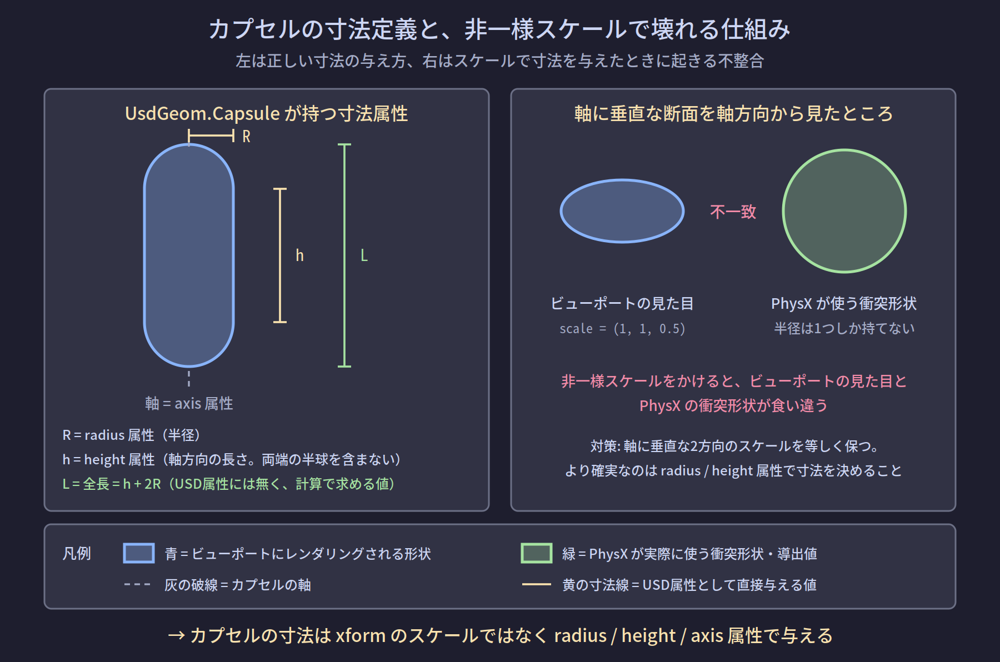

# NB-IsaacSim-Collision-05 カプセルと直方体の寸法定義

> 全体フローにおける位置: ② 形状を作る

## この節が扱う問題

実機の干渉モデルには、リンクごとに「このカプセルは半径いくつ、長さいくつ、リンク座標系のどこにどの向きで置かれている」という数値が入っている。これをUSD上で再現するとき、寸法をどこに書くかで結果が変わる。

具体的には、**xform のスケールで寸法を与えると、ビューポートの見た目とPhysXの衝突形状が食い違う**場合がある。この節ではその仕組みと回避方法を扱う。

## 座標変換の基礎

### xformOp とは

`UsdGeom.Xformable` を継承するプリム（`Cube` も `Capsule` も継承している）は、**xformOp** という一連の座標変換操作を持てる。

```usda
def Capsule "col_cap_0"
{
    double3 xformOp:translate = (0.1, 0, 0.25)
    quatf xformOp:orient = (0.7071, 0, 0.7071, 0)
    float3 xformOp:scale = (1, 1, 1)
    uniform token[] xformOpOrder = ["xformOp:translate", "xformOp:orient", "xformOp:scale"]
}
```

`xformOpOrder` は適用順序を指定する配列である。C#で言えば、行列の掛け算の順序を明示的に配列で持っているようなものだと考えてよい。

### 変換は親から累積する

プリムの最終的な姿勢は、ルートから自分までの全ての祖先の xformOp を掛け合わせたものになる。これは**スケールも同じように累積する**ことを意味する。

```
/World                   scale = (1, 1, 1)
  /robot                 scale = (1, 1, 1)
    /link_0              scale = (1, 1, 0.5)   ← ここで潰れる
      /collisions
        /col_cap_0       scale = (1, 1, 1)     ← 自分は等倍でも…
```

この場合 `col_cap_0` の実効スケールは (1, 1, 0.5) になる。**自分のプリムのスケールだけを見ても不十分**である。

## UsdGeom.Capsule の寸法属性

`UsdGeom.Capsule` は次の3つの属性で形状が完全に決まる（[R-04](#r-04)）。

| 属性 | 意味 |
|---|---|
| `radius` | カプセルの半径 |
| `height` | 指定された軸に沿った**背骨の長さ**。**両端の半球のサイズを含まない** |
| `axis` | カプセルの背骨が沿う軸（`X` / `Y` / `Z`） |

`height` の定義は誤解しやすいので強調する。OpenUSD の公式APIリファレンスは、`height` を「指定された軸に沿ったカプセルの背骨の長さであり、2つの半球のサイズを除いたもの」と定義している（[R-04](#r-04)）。

したがって全長は次の式になる。

$$
L = h + 2R
$$

- $L$ : カプセルの全長（軸方向の端から端まで）
- $h$ : `height` 属性の値
- $R$ : `radius` 属性の値

$L$ に対応するUSD属性は存在しない。必要なら計算で求める。



### 具体的な数値例

実機の干渉モデルに「半径 50 mm、全長 400 mm のカプセル」と書かれていたとする。ステージの単位がメートルの場合、USD属性は次のようになる。

$$
R = 0.05,\quad L = 0.40
$$
$$
h = L - 2R = 0.40 - 2 \times 0.05 = 0.30
$$

```python
capsuleGeom = UsdGeom.Capsule.Define(stage, "/World/robot/link_0/collisions/col_cap_0")
capsuleGeom.CreateRadiusAttr(0.05)
capsuleGeom.CreateHeightAttr(0.30)
capsuleGeom.CreateAxisAttr(UsdGeom.Tokens.z)
```

**`height` に 0.40 を入れると、全長 500 mm のカプセルになる。**片側 50 mm ずつ、合計 100 mm 大きい形状が出来上がる。この誤りは、干渉判定を安全側（過剰検出）に倒すため症状が出にくく、発見が遅れやすい。

### 検算の出力例

作った形状が意図通りか確認するには、バウンディングボックスを見るのが確実である。

```python
from pxr import UsdGeom, Usd

prim = stage.GetPrimAtPath("/World/robot/link_0/collisions/col_cap_0")
cache = UsdGeom.BBoxCache(Usd.TimeCode.Default(), [UsdGeom.Tokens.default_])
bbox = cache.ComputeLocalBound(prim)
print(bbox.ComputeAlignedRange())
```

意図通り（$R=0.05$, $h=0.30$, 軸 Z）であれば、次の出力になる。

```
[(-0.05, -0.05, -0.2), (0.05, 0.05, 0.2)]
```

Z方向の範囲が $-0.2$ から $0.2$、すなわち全長 $0.4$ である。ここが $\pm 0.25$ になっていれば `height` の取り違えである。

## UsdGeom.Cube の寸法属性

`UsdGeom.Cube` は `size` 属性を1つだけ持つ立方体である。**各辺の長さを別々に指定する属性は無い**。

したがって直方体を作るには、スケールを使うしかない。Omniverse Physics のドキュメントも、ボックスコライダーの作成例で「立方体との唯一の違いは、ボックスが非一様な軸スケールを持つことである」と述べ、`AddScaleOp` に3成分のベクトルを渡している（[R-01](#r-01)）。

```python
boxGeom = UsdGeom.Cube.Define(stage, "/World/robot/link_0/collisions/col_box_0")
boxGeom.CreateSizeAttr(1.0)
boxGeom.AddScaleOp().Set(Gf.Vec3f(0.20, 0.15, 0.40))
```

`size = 1.0` の立方体に (0.20, 0.15, 0.40) のスケールをかけているので、各辺の長さがそのままその値になる。

### 直方体では非一様スケールが正しい

ボックスは PhysX 側でも3つの半径（各軸方向の半分の長さ）を独立に持てる形状なので、非一様スケールが正しく反映される。**直方体に非一様スケールをかけるのは正常な使い方である**。

## カプセルでは非一様スケールが破綻する

PhysX のカプセルは `radius`（半径）と半分の長さという**スカラー2つ**だけで定義される。半径が1つしか無いということは、**軸に垂直な断面は必ず真円になる**ということである。

したがって次の制約が生じる。

> **軸に垂直な2方向のスケールは等しくなければならない。**

軸方向のスケールは独立でよい。長さが変わるだけで表現可能である。

### 破綻したときの症状

非一様スケール（軸に垂直な2方向が異なる値）をかけると、**ビューポートに描画される形状とPhysXが持つ衝突形状が食い違う**。

- ビューポート: 潰れた楕円断面のカプセルとして描画される（レンダラーは変換行列をそのまま適用する）
- PhysX: 楕円断面を表現できないため、真円断面のカプセルとして扱われる

この不一致は目視では気づきにくい。見た目が正しく潰れているので、コリジョンも同じように潰れていると錯覚する。

### 対処

**そもそもスケールで寸法を決めない。**

`UsdGeom.Capsule` は `radius` / `height` / `axis` という寸法属性を自前で持っている。これらで寸法を与え、`xformOp:scale` は (1, 1, 1) のままにすれば、この問題は原理的に発生しない。

加えて、親階層からの累積スケールも確認する。前述の通り、自分のプリムのスケールが (1,1,1) でも祖先に非一様スケールがあれば累積してかかる。

### 確認方法

Omniverse Physics には、コリジョン形状のデバッグ表示（Collider debug visualization）がある。ドキュメント内でも、生成された近似を分析するのに有用な表示として言及されている（[R-01](#r-01)）。ビューポートの見た目とコリジョン形状が一致しているかは、これをオンにして目視するのが確実である。

## 位置と姿勢の与え方

寸法とは別に、干渉形状をリンク座標系のどこにどの向きで置くかを指定する必要がある。

Omniverse Physics のドキュメントは、コライダープリムが剛体プリムの部分木にある場合、そのコライダーに与えた姿勢は**剛体のフレームに対する相対姿勢として表現される**と述べている（[R-02](#r-02)）。

つまり階層を次のようにしておけば、コライダーの `xformOp:translate` / `xformOp:orient` は自動的にリンク座標系での値になる。

```
/World/robot/link_0              ← RigidBodyAPI（リンク座標系の原点）
    /collisions
        /col_cap_0               ← translate / orient がリンク座標系での値
        /col_box_0
```

これは実機の干渉モデルの持ち方（多くの場合リンク座標系からのオフセットで定義される）とそのまま対応する。

### axis 属性と姿勢の関係

`UsdGeom.Capsule` の `axis` は `X` / `Y` / `Z` の3値しか取れない。実機の干渉モデルが任意方向の軸を持つ場合、`axis` を1つ選び、残りの回転を `xformOp:orient` で与えることになる。

どちらで表現しても最終的な姿勢は同じだが、**`axis` を固定して回転を xformOp に寄せるほうが、変換処理が単純になり検算しやすい**。例えば全カプセルの `axis` を `Z` に固定し、リンク座標系での軸方向ベクトルから Z 軸をそこへ向ける回転クォータニオンを計算して `orient` に入れる、という一貫した処理にできる。

## 精度に関する一般的な注意

Omniverse Physics のドキュメントは、正確な衝突検出のために、相互作用するコライダーのサイズおよび各コライダーの寸法の比率を 1/100 のスケール内に保つことを推奨している。これは浮動小数点計算の誤差がシミュレーションの安定性に影響するのを防ぐためである（[R-01](#r-01)）。

ロボットの干渉モデルでは、細い指先のカプセルと大きな胴体の直方体が同一シーンに共存することがある。この比率が 1/100 を大きく超える場合、判定結果の再現性に影響する可能性がある。

## まとめ

| 項目 | カプセル | 直方体 |
|---|---|---|
| 寸法の与え方 | `radius` / `height` / `axis` 属性 | `size` 属性 + 非一様スケール |
| 非一様スケール | **軸に垂直な2方向は等しくすること** | 正常な使い方 |
| 全長 | $L = h + 2R$（属性としては存在しない） | スケール値がそのまま各辺の長さ |
| 位置・姿勢 | 剛体プリムの子孫に置けばリンク座標系での値になる | 同左 |

---

## 理解度確認問題

1. 実機の干渉モデルに「半径 30 mm、全長 200 mm のカプセル」とある。ステージ単位がメートルのとき、`radius` と `height` に入れるべき値はいくつか。
2. カプセルの非一様スケールが禁止されるのは、具体的にどの方向のスケールか。また軸方向のスケールは問題ないか。
3. 自分のカプセルプリムの `xformOp:scale` が (1, 1, 1) であれば、非一様スケールの問題は起きないと言えるか。

<details>
<summary>解答</summary>

1. `radius` は 0.03。`height` は全長から両端の半球を引いた値なので、$0.20 - 2 \times 0.03 = 0.14$。`height` に 0.20 を入れると全長 260 mm のカプセルになってしまう。
2. 軸に垂直な2方向のスケール。PhysXのカプセルは半径をスカラー1つしか持てないため、断面は必ず真円になる。軸方向のスケールは長さが変わるだけなので独立に指定してよい。
3. 言えない。スケールはルートから自分までの全祖先の xformOp が累積してかかるため、祖先のいずれかに非一様スケールがあれば影響を受ける。祖先まで遡って確認するか、コリジョン形状のデバッグ表示で見た目と一致しているか目視する必要がある。

</details>

---

## 参照

- <a id="r-01"></a>**[R-01]** Omni Physics — Colliders（ボックスコライダーは非一様な軸スケールで作る、コライダーのデバッグ表示、寸法比を1/100スケール内に保つ推奨）. https://docs.omniverse.nvidia.com/kit/docs/omni_physics/latest/dev_guide/rigid_bodies_articulations/collision.html
- <a id="r-02"></a>**[R-02]** Omni Physics — Rigid Bodies（剛体の部分木に置いたコライダーの姿勢が剛体フレームに対する相対姿勢になること）. https://docs.omniverse.nvidia.com/kit/docs/omni_physics/latest/dev_guide/rigid_bodies_articulations/rigid_bodies.html
- <a id="r-04"></a>**[R-04]** OpenUSD — UsdGeomCapsule Class Reference（`height` が両端の半球を除く背骨の長さであること、`radius` / `axis` の定義）. https://openusd.org/release/api/class_usd_geom_capsule.html

## 未確認事項

- カプセルの軸方向に非一様スケールをかけた場合、Omniverse Physics がそれを `halfHeight` の変更として解釈するのか、端部の半球まで引き伸ばそうとして破綻するのかは、Isaac Sim 6.0.1 で確認していない。安全側の運用は、スケールを (1,1,1) に保ち `height` 属性で長さを与えることである。
- 上記のバウンディングボックス検算の出力値は、`UsdGeom.Capsule` のスキーマ定義から導いた期待値であり、Isaac Sim 6.0.1 上での実測出力ではない。
- 非一様スケール時に PhysX 側がどの軸の値を半径として採用するか（最大値・最小値・特定の軸）は未確認。

---

## このノートブックの目次

1. [[NB-IsaacSim-Collision-00-概観]]
2. [[NB-IsaacSim-Collision-01-USDの構成要素とPythonラッパー]]
3. [[NB-IsaacSim-Collision-02-検出と応答の分離]]
4. [[NB-IsaacSim-Collision-03-アクター種別と衝突ペアの成立条件]]
5. [[NB-IsaacSim-Collision-04-衝突形状の種類と近似]]
6. [[NB-IsaacSim-Collision-05-カプセルと直方体の寸法定義]]
7. [[NB-IsaacSim-Collision-06-干渉検出結果の取得手段]]
8. [[NB-IsaacSim-Collision-07-アーティキュレーションと関節姿勢の同期]]
9. [[NB-IsaacSim-Collision-08-実機干渉モデルの再現構成]]
10. [[NB-IsaacSim-Collision-09-実機との乖離要因]]
11. [[NB-IsaacSim-Collision-10-リファレンス]]

---

**前のページ**: [[NB-IsaacSim-Collision-04-衝突形状の種類と近似]]
**次のページ**: [[NB-IsaacSim-Collision-06-干渉検出結果の取得手段]]
