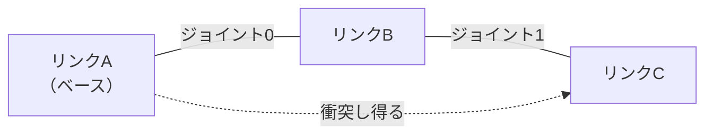

# NB-IsaacSim-Collision-07 アーティキュレーションと関節姿勢の同期

> 全体フローにおける位置: ③ リンクとジョイントの構造を組む

## 用語の定義

### ジョイント

**ジョイント**（joint）は、2つの剛体の相対運動を拘束する要素である。`UsdPhysics.RevoluteJoint`（回転1自由度）、`UsdPhysics.PrismaticJoint`（直動1自由度）、`UsdPhysics.FixedJoint`（自由度なし）などの型がある。

ジョイントは `body0` / `body1` という2つの関係（relationship）で、どの剛体とどの剛体を繋ぐかを指定する。

### アーティキュレーション

**アーティキュレーション**（articulation）は、ジョイントで連結された剛体の集まりを、**一体の機構としてまとめて解く**ための仕組みである。

Omniverse Physics のドキュメントは、アーティキュレーションが個別のジョイント付き剛体より優れる点として、設計上ジョイント誤差がゼロであること、連結された物体間の大きな質量比を扱えることを挙げている（[R-20](#r-20)）。

内部的には**縮小座標系**（reduced coordinates）で解かれる。各物体のワールド姿勢ではなく、根元の物体の姿勢と各関節角度によって全体の姿勢が決まる（[R-20](#r-20)）。

### リンク

アーティキュレーションの一部である剛体を、**リンク**（link）と呼ぶ（[R-20](#r-20)）。実機のロボットのリンクと1対1で対応させる。

## アーティキュレーションの構造はどこで決まるか

ここは直感に反するので明示する。

> **アーティキュレーションの木構造は、USDの階層構造ではなく、ジョイントの `body0` / `body1` 関係だけで決まる。**

Omniverse Physics のドキュメントは、木構造がアーティキュレーションのリンクを繋ぐジョイントの `body0` / `body1` 関係のみによって作られること、そしてUSD階層は（解析時を除いて）アーティキュレーション構造に影響しないことを明記している（[R-20](#r-20)）。ジョイントとリンクをステージツリー上でどう配置するかは自由である。

この性質は [[NB-IsaacSim-Collision-08-実機干渉モデルの再現構成]] で階層を設計するときに効く。干渉形状の管理しやすさを優先してUSD階層を組んでも、機構の構造は壊れない。

## アーティキュレーションのルート

`UsdPhysics.ArticulationRootAPI` をどこに適用するかで、アーティキュレーションの型が決まる（[R-20](#r-20)）。

| 型 | 意味 | ルートAPIの適用先 |
|---|---|---|
| 固定ベース（fixed-base） | 根元がワールドに固定されている | ワールドとベースを繋ぐ固定ジョイント、またはその祖先 |
| 浮遊ベース（floating-base） | 全体が空間を自由に動ける | ルートにしたいリンク、またはその祖先 |

産業用ロボットアームは固定ベースになる。実機の干渉モデルを再現する構成でも固定ベースを使う。

ドキュメントは、固定ジョイントのジョイントフレームは無視されるため指定不要であり、固定ジョイントの主な目的はルートリンクを指定することだと述べている（[R-20](#r-20)）。

### 固定ベースの構築例

Omniverse Physics のドキュメントに掲載されている構築例の骨格（[R-20](#r-20)）。

```python
from pxr import UsdGeom, UsdPhysics, Gf
import omni.usd

stage = omni.usd.get_context().get_stage()

# 2つのリンクを作る
link0 = UsdGeom.Xform.Define(stage, "/World/link_0")
UsdPhysics.RigidBodyAPI.Apply(link0.GetPrim())
link1 = UsdGeom.Xform.Define(stage, "/World/link_1")
UsdPhysics.RigidBodyAPI.Apply(link1.GetPrim())

# 2つのリンクを回転ジョイントで繋ぐ
revoluteJoint = UsdPhysics.RevoluteJoint.Define(stage, "/World/joint_0")
revoluteJoint.CreateAxisAttr(UsdPhysics.Tokens.z)
revoluteJoint.CreateBody0Rel().AddTarget("/World/link_0")
revoluteJoint.CreateBody1Rel().AddTarget("/World/link_1")
revoluteJoint.CreateLocalPos0Attr().Set(Gf.Vec3f(0.0, 0.0, 0.4))
revoluteJoint.CreateLocalPos1Attr().Set(Gf.Vec3f(0.0, 0.0, 0.0))

# link_0 をワールドに固定し、そこをアーティキュレーションのルートにする
fixedJoint = UsdPhysics.FixedJoint.Define(stage, "/World/root_joint")
fixedJoint.CreateBody0Rel().AddTarget("/World/link_0")
UsdPhysics.ArticulationRootAPI.Apply(fixedJoint.GetPrim())
```

`localPos0` / `localPos1` は、ジョイントが2つの剛体それぞれのローカル座標系のどこに位置するかを指定する。実機のリンク寸法（隣接する関節間の距離）がここに入る。

## 関節角度を与える

### JointStateAPI

アーティキュレーションのジョイントの各自由度は、位置と速度の属性を持つ。これらを読み書きするには `PhysxSchema.JointStateAPI` をジョイントプリムに適用する（[R-20](#r-20)）。

ドキュメントは、これがアーティキュレーションのジョイントに固有の機能であること、そしてこのAPIが無い場合、シミュレーションはジョイントの位置と速度をゼロで初期化することを述べている（[R-20](#r-20)）。

```python
from pxr import PhysxSchema, UsdPhysics

jointStateAPI = PhysxSchema.JointStateAPI.Apply(
    revoluteJoint.GetPrim(), UsdPhysics.Tokens.angular
)
jointStateAPI.CreatePositionAttr(45.0)
jointStateAPI.CreateVelocityAttr(0.0)
```

読み取りは次の通り（[R-20](#r-20)）。

```python
jointPosition = jointStateAPI.GetPositionAttr().Get()
jointVelocity = jointStateAPI.GetVelocityAttr().Get()
print(f"position = {jointPosition}, velocity = {jointVelocity}")
```

出力。

```
position = 45.0, velocity = 0.0
```

第2引数のトークンは、どの自由度を指すかを指定する。直動ジョイントなら `UsdPhysics.Tokens.linear`、球面ジョイントなら `rotX` / `rotY` / `rotZ` を使い分ける（[R-20](#r-20)）。

### 角度の単位

上の例で `45.0` と書いているのは度である。Omniverse Physics のドキュメントは、角度ジョイントの各種パラメータの単位を「degrees」として記述している（[R-20](#r-20)）。実機の関節値がラジアンで管理されている場合、変換が必要になる。

$$
\theta_{\text{deg}} = \theta_{\text{rad}} \times \frac{180}{\pi}
$$

- $\theta_{\text{deg}}$ : USDに書き込む角度（度）
- $\theta_{\text{rad}}$ : 実機コントローラから取得した角度（ラジアン）

### 非ルートリンクの姿勢を直接書いてはいけない

これは重要な制約である。

アーティキュレーションが縮小座標系で動作することの帰結として、**非ルートリンクに対して姿勢や速度を設定することはサポートされておらず、コンソールに警告が出る**（[R-20](#r-20)）。

つまり、実機の姿勢を再現するために「各リンクのワールド姿勢を順運動学で計算して直接書き込む」という方法は取れない。**関節値を与えて、シミュレーション側に順運動学を解かせる**必要がある。

これは一見不便だが、実機のコントローラも同じく関節値から順運動学でリンク姿勢を求めているため、**同じ入力から同じ経路で姿勢を求めることになり、むしろ一致しやすい**。ただし順運動学の実装（DHパラメータの解釈、関節の零点の定義）が実機と一致している必要はある。この点は [[NB-IsaacSim-Collision-09-実機との乖離要因]] で扱う。

### Fabric を有効にすると USD 経由のアクセスが効かなくなる

ドキュメントは、強化学習などの性能が要る用途で Fabric 拡張を有効にした場合、上記のUSD経由でのジョイント状態へのアクセスは動作しなくなり、代わりに PhysX のデータに直接アクセスする Tensor API の `ArticulationView` を使うことになると注意している（[R-20](#r-20)）。

[[NB-IsaacSim-Collision-06-干渉検出結果の取得手段]] で挙げた `overlap_mesh` の不具合も Fabric 絡みであった。**今回の用途では Fabric を有効にしない**のが素直である。

## 自己干渉

### 定義

**自己干渉**（self-collision）は、同じアーティキュレーションに属するリンク同士の衝突である。

有効・無効は `PhysxSchema.PhysxArticulationAPI` の `physxArticulation:enabledSelfCollisions` 属性で制御する（[R-21](#r-21), [R-22](#r-22)）。

```usda
def Xform "robot" (
    prepend apiSchemas = ["PhysicsArticulationRootAPI", "PhysxArticulationAPI"]
)
{
    bool physxArticulation:enabledSelfCollisions = 0
}
```

### 隣接リンクは常に除外される

ここが今回の主題に直結する、最も重要な制約である。

Omniverse Physics の Articulation and Robot Simulation Stability Guide は、次の内容を述べている（[R-21](#r-21)）。

- `physxArticulation:enabledSelfCollisions` で自己干渉を有効にした場合、PhysX は**親リンクと子リンクの間の衝突を自動的にフィルタする**
- リンクA・B・Cが順に繋がった3リンクのアーティキュレーションでは、AとB、BとCの衝突が自動的にフィルタされる
- **これらの衝突は常にフィルタされ、有効にすることはできない**
- 一方、非隣接のリンク（この例ではAとC）は衝突し得る

つまり次のようになる。

| リンクの関係 | 自己干渉の対象になるか |
|---|---|
| ジョイントで直結された親子（隣接） | **絶対にならない**（設定で変更不可） |
| 1つ以上離れたリンク（非隣接） | `enabledSelfCollisions` が真ならなる |



実線がジョイントによる連結、点線が衝突し得る関係を示す。隣接するAとB、BとCの間には点線が無い。

### この制約が実機再現に与える影響

実機のコントローラが隣接リンク間の干渉をどう扱っているかによって、対応が変わる。

| 実機側の扱い | Isaac Sim 側での対応 |
|---|---|
| 隣接リンクは干渉チェックの対象外 | 一致する。追加の対応は不要 |
| 隣接リンクも干渉チェックの対象 | **アーティキュレーションの自己干渉では再現できない**。overlap クエリで別途判定する |

overlap シーンクエリは、アーティキュレーションのフィルタリング設定とは独立に、形状の重なりを直接問い合わせる。したがって隣接リンク間であっても重なりを検出できる可能性がある。これが overlap クエリを主軸に据えるもう一つの理由になる。

ただし [[NB-IsaacSim-Collision-06-干渉検出結果の取得手段]] で挙げた通り、overlap クエリが自己干渉を検出しないという報告も存在する。**この点は実際に検証すべき最優先項目**である。

## 個別のペアを除外する

隣接リンク以外にも、実機側で「このペアは干渉チェックから除外する」と定義されている組み合わせがあり得る（例: 構造上どうしても近接するが物理的には当たらない配線カバー同士）。

Omniverse Physics には2つのフィルタ機構がある（[R-01](#r-01)）。

### コリジョングループフィルタ

`UsdPhysics.CollisionGroup` を使い、コライダーをグループに分け、グループ同士の衝突可否を指定する。既定は「除外リスト」方式（全て衝突し、リストに挙げたペアだけ衝突しない）だが、`PhysxSceneAPI` の `invertCollisionGroupFilter` を真にすると「許可リスト」方式に反転できる（[R-01](#r-01)）。

### ペア単位フィルタ

コリジョングループでは粒度が粗い場合、`UsdPhysics.FilteredPairsAPI` を使って特定の階層ペア間の衝突を無効化できる。**ペア単位フィルタはコリジョングループフィルタより優先される**（[R-01](#r-01)）。

```python
from pxr import UsdPhysics

filteredPairsAPI = UsdPhysics.FilteredPairsAPI.Apply(link2Prim)
filteredPairsAPI.CreateFilteredPairsRel().AddTarget("/World/robot/link_5")
```

ただしドキュメントは、フィルタリングに除外の関係が無いため、**指定した階層の全ての子オブジェクト（コライダー・剛体・アーティキュレーション）がフィルタされる**と注意している（[R-01](#r-01)）。リンク単位で指定すれば、そのリンク配下の全コライダーが対象になる。

**注意**: これらのフィルタはシミュレーション経路（接触検出・接触応答）に作用するものであり、overlap シーンクエリの結果に同じように反映されるかは別問題である。overlap クエリを主軸にする構成では、除外ペアの判定は**自前のコードで行う**ほうが確実である。

## まとめ

| 項目 | 結論 |
|---|---|
| 木構造の決まり方 | ジョイントの `body0` / `body1` のみ。USD階層は無関係 |
| 姿勢の与え方 | `JointStateAPI` に関節値を書く。非ルートリンクの姿勢を直接書くのは不可 |
| 角度の単位 | 度。実機がラジアンなら変換する |
| 隣接リンクの自己干渉 | **常にフィルタされ、有効化できない** |
| 非隣接リンクの自己干渉 | `enabledSelfCollisions` で制御 |
| Fabric | 有効にしない（USD経由のアクセスとoverlapの両方に影響する） |

---

## 理解度確認問題

1. USD階層でリンクを親子関係に並べれば、アーティキュレーションの木構造もその通りになるか。
2. 実機の姿勢を再現するために、各リンクのワールド姿勢を順運動学で計算して直接書き込む方法は使えるか。
3. 実機のコントローラが隣接リンク間の干渉もチェックしている場合、Isaac Sim のアーティキュレーション自己干渉でこれを再現できるか。

<details>
<summary>解答</summary>

1. ならない。アーティキュレーションの木構造はジョイントの `body0` / `body1` 関係だけで決まり、USD階層は（解析時を除いて）影響しない。ジョイントとリンクはステージツリー上で自由に配置してよい。
2. 使えない。アーティキュレーションは縮小座標系で解かれるため、非ルートリンクへの姿勢・速度の設定はサポートされておらず、警告が出る。関節値を `JointStateAPI` に与えて、シミュレーション側に順運動学を解かせる必要がある。
3. 再現できない。PhysXはジョイントで直結された親子リンク間の衝突を常にフィルタし、これを有効にする手段は無い。隣接リンクの干渉を判定したい場合は、シミュレーション経路とは独立の overlap シーンクエリで別途判定する必要がある。

</details>

---

## 参照

- <a id="r-01"></a>**[R-01]** Omni Physics — Colliders（`UsdPhysics.CollisionGroup` によるグループフィルタ、`invertCollisionGroupFilter`、`UsdPhysics.FilteredPairsAPI` によるペア単位フィルタと、その優先順位および子オブジェクトへの波及）. https://docs.omniverse.nvidia.com/kit/docs/omni_physics/latest/dev_guide/rigid_bodies_articulations/collision.html
- <a id="r-20"></a>**[R-20]** Omni Physics — Articulations（アーティキュレーションの定義と利点、縮小座標系、木構造が `body0` / `body1` のみで決まること、固定ベース・浮遊ベースとルートAPIの適用先、`JointStateAPI` による関節位置と速度の読み書き、角度の単位、非ルートリンクへの姿勢設定が非対応であること、Fabric 有効時の注意）. https://docs.omniverse.nvidia.com/kit/docs/omni_physics/latest/dev_guide/rigid_bodies_articulations/articulations.html
- <a id="r-21"></a>**[R-21]** Omni Physics — Articulation and Robot Simulation Stability Guide（`physxArticulation:enabledSelfCollisions` の指定、親子リンク間の衝突が自動的にフィルタされ有効化できないこと、非隣接リンクは衝突し得ること）. https://docs.omniverse.nvidia.com/kit/docs/omni_physics/latest/dev_guide/guides/articulation_stability_guide.html
- <a id="r-22"></a>**[R-22]** Omni Physics — PhysX Schema（`PhysxArticulationAPI` の `GetEnabledSelfCollisionsAttr()`）. https://docs.omniverse.nvidia.com/kit/docs/omni_physics/latest/dev_guide/schemas/physxschema.html

## 未確認事項

- `physxArticulation:enabledSelfCollisions` の既定値は未確認。URDFインポーター経由で生成されたアセットでは偽になっている例が公開資料に見られるが、スキーマ上の既定値は確認していない。
- overlap シーンクエリの結果に、`FilteredPairsAPI` やコリジョングループのフィルタ設定が反映されるかは未確認。反映されるかどうかで、除外ペアの扱いを自前のコードに寄せるべきかが変わる。
- 上記コード例に添えた出力例は、APIの仕様から導いた期待値であり、Isaac Sim 6.0.1 上での実測出力ではない。

---

## このノートブックの目次

1. [[NB-IsaacSim-Collision-00-概観]]
2. [[NB-IsaacSim-Collision-01-USDの構成要素とPythonラッパー]]
3. [[NB-IsaacSim-Collision-02-検出と応答の分離]]
4. [[NB-IsaacSim-Collision-03-アクター種別と衝突ペアの成立条件]]
5. [[NB-IsaacSim-Collision-04-衝突形状の種類と近似]]
6. [[NB-IsaacSim-Collision-05-カプセルと直方体の寸法定義]]
7. [[NB-IsaacSim-Collision-06-干渉検出結果の取得手段]]
8. [[NB-IsaacSim-Collision-07-アーティキュレーションと関節姿勢の同期]]
9. [[NB-IsaacSim-Collision-08-実機干渉モデルの再現構成]]
10. [[NB-IsaacSim-Collision-09-実機との乖離要因]]
11. [[NB-IsaacSim-Collision-10-リファレンス]]

---

**前のページ**: [[NB-IsaacSim-Collision-06-干渉検出結果の取得手段]]
**次のページ**: [[NB-IsaacSim-Collision-08-実機干渉モデルの再現構成]]
