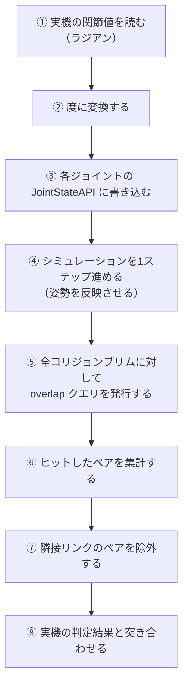

# NB-IsaacSim-Collision-08 実機干渉モデルの再現構成

> 全体フローにおける位置: ②③④の統合

## この構成が満たすべき要件

これまでのページで確認したことから、要件を整理する。

| # | 要件 | 根拠となるページ |
|---|---|---|
| 1 | 指令した関節値がそのまま実姿勢になる（接触で逸脱しない） | [[NB-IsaacSim-Collision-02-検出と応答の分離]] |
| 2 | 干渉形状は実機の干渉モデルと同じカプセル・直方体である | [[NB-IsaacSim-Collision-04-衝突形状の種類と近似]] |
| 3 | 寸法がビューポートとPhysXで食い違わない | [[NB-IsaacSim-Collision-05-カプセルと直方体の寸法定義]] |
| 4 | 任意の姿勢で全干渉ペアを列挙できる | [[NB-IsaacSim-Collision-06-干渉検出結果の取得手段]] |
| 5 | 隣接リンクの干渉も判定できる（実機がそうしている場合） | [[NB-IsaacSim-Collision-07-アーティキュレーションと関節姿勢の同期]] |
| 6 | 見た目の形状と干渉形状を独立に扱える | 全般 |

これらから導かれる構成上の決定は次の4つになる。

- リンクは**キネマティック剛体**にする（要件1）
- 干渉形状は**解析形状のプリム**にして `CollisionAPI` だけを適用する（要件2・3）
- 干渉の取得は**overlap シーンクエリ**で行う（要件4・5）
- 見た目と干渉形状を**別の階層に分ける**（要件6）

## USD階層

```
/World
  /physicsScene                       ← PhysicsScene（物理シーンの設定）
  /robot                              ← ArticulationRootAPI + PhysxArticulationAPI
    /links
      /link_0                         ← RigidBodyAPI（kinematicEnabled = true）
        /visuals                      ← Scope。purpose は default
          /mesh_body                  ← Mesh。CollisionAPI なし
        /collisions                   ← Scope。purpose = guide
          /col_cap_0                  ← Capsule + CollisionAPI
          /col_box_0                  ← Cube + CollisionAPI
      /link_1
        /visuals
          /mesh_arm
        /collisions
          /col_cap_0
          /col_cap_1
      ...
    /joints
      /root_fixed                     ← FixedJoint（body0 = link_0）
      /joint_0                        ← RevoluteJoint + JointStateAPI
      /joint_1
      ...
```

### 各要素の役割

| プリム | 型 | 適用するAPIスキーマ | 役割 |
|---|---|---|---|
| `/World/physicsScene` | `PhysicsScene` | — | 重力やソルバー設定を持つ。無いとPhysXにシーンが作られない |
| `/robot` | `Xform` | `ArticulationRootAPI`, `PhysxArticulationAPI` | アーティキュレーションの起点と自己干渉設定 |
| `/robot/links/link_N` | `Xform` | `RigidBodyAPI` | リンクの座標系原点。形状は持たない |
| `.../visuals` | `Scope` | — | 見た目用の入れ物 |
| `.../visuals/*` | `Mesh` 等 | — | 見た目。`CollisionAPI` を付けない |
| `.../collisions` | `Scope` | — | 干渉形状用の入れ物 |
| `.../collisions/col_*` | `Capsule` / `Cube` | `CollisionAPI` | 干渉形状（作成方法は[R-01](#r-01)） |
| `/robot/joints/*` | `RevoluteJoint` 等 | `JointStateAPI` | 関節と関節値 |

### なぜこの階層にするのか

- **リンクプリム自身に `CollisionAPI` を付けない**: リンクは座標系の原点でしかない。形状は子孫に分けたほうが、後から形状を差し替えやすい。剛体は自身および子孫の `CollisionAPI` 付きプリムを衝突形状として取り込む（[R-02](#r-02)）。自己干渉の設定については[R-21](#r-21)を参照。
- **`visuals` と `collisions` を分ける**: 片方を差し替えても他方に影響しない。また `collisions` に `purpose = guide` を設定すると、ビューポートの表示切り替えで干渉形状だけを可視化できる。
- **`Scope` を使う**: `Scope` は座標変換を持たない入れ物である。`Xform` を使うと不要な変換段が増えるうえ、誤ってスケールを入れる余地が生まれる。
- **`joints` を別の枝に置く**: [[NB-IsaacSim-Collision-07-アーティキュレーションと関節姿勢の同期]] の通り、アーティキュレーションの木構造は `body0` / `body1` だけで決まるため、ジョイントをどこに置いても機構は壊れない（[R-20](#r-20)）。まとめておくほうが管理しやすい。

## 構築スクリプト

以下は、リンク1本ぶんを構築する部分の全体である。実際にはこれをリンク数ぶん繰り返し、ジョイントで繋ぐ。

```python
from pxr import Usd, UsdGeom, UsdPhysics, PhysxSchema, Gf, Sdf
import omni.usd

stage = omni.usd.get_context().get_stage()

# ---- 物理シーン ----
UsdPhysics.Scene.Define(stage, "/World/physicsScene")

# ---- アーティキュレーションのルート ----
robot = UsdGeom.Xform.Define(stage, "/World/robot")
UsdPhysics.ArticulationRootAPI.Apply(robot.GetPrim())
artAPI = PhysxSchema.PhysxArticulationAPI.Apply(robot.GetPrim())
artAPI.CreateEnabledSelfCollisionsAttr(False)      # ★ 接触応答は使わないので無効化する

# ---- リンク ----
linkPath = "/World/robot/links/link_0"
link = UsdGeom.Xform.Define(stage, linkPath)
rbAPI = UsdPhysics.RigidBodyAPI.Apply(link.GetPrim())
rbAPI.CreateKinematicEnabledAttr(True)             # ★ キネマティックにする

# ---- 干渉形状の入れ物 ----
colScope = UsdGeom.Scope.Define(stage, linkPath + "/collisions")
colScope.CreatePurposeAttr(UsdGeom.Tokens.guide)   # ★ 既定では非表示になる

# ---- 干渉形状: カプセル ----
# 実機定義: 半径 50 mm、全長 400 mm、リンク座標系で Z 軸方向、原点から Z に 200 mm
R = 0.05
L = 0.40
h = L - 2.0 * R                                     # ★ height は半球を含まない

cap = UsdGeom.Capsule.Define(stage, linkPath + "/collisions/col_cap_0")
cap.CreateRadiusAttr(R)
cap.CreateHeightAttr(h)
cap.CreateAxisAttr(UsdGeom.Tokens.z)
cap.AddTranslateOp().Set(Gf.Vec3f(0.0, 0.0, 0.2))
cap.AddOrientOp().Set(Gf.Quatf(1.0))                # 回転なし
UsdPhysics.CollisionAPI.Apply(cap.GetPrim())        # ★ MeshCollisionAPI は不要

# ---- 干渉形状: 直方体 ----
# 実機定義: 200 x 150 x 400 mm、リンク座標系の原点中心
box = UsdGeom.Cube.Define(stage, linkPath + "/collisions/col_box_0")
box.CreateSizeAttr(1.0)
box.AddTranslateOp().Set(Gf.Vec3f(0.0, 0.0, 0.0))
box.AddOrientOp().Set(Gf.Quatf(1.0))
box.AddScaleOp().Set(Gf.Vec3f(0.20, 0.15, 0.40))    # ★ 直方体では非一様スケールが正しい
UsdPhysics.CollisionAPI.Apply(box.GetPrim())

# ---- 見た目 ----
visScope = UsdGeom.Scope.Define(stage, linkPath + "/visuals")
# ここに Mesh を参照で読み込む。CollisionAPI は適用しない
```

### 実行後のステージ内容

上のスクリプトを実行した結果、ステージは次の内容になる。

```usda
def Scene "physicsScene"
{
}

def Xform "robot" (
    prepend apiSchemas = ["PhysicsArticulationRootAPI", "PhysxArticulationAPI"]
)
{
    bool physxArticulation:enabledSelfCollisions = 0

    def Scope "links"
    {
        def Xform "link_0" (
            prepend apiSchemas = ["PhysicsRigidBodyAPI"]
        )
        {
            bool physics:kinematicEnabled = 1

            def Scope "collisions"
            {
                uniform token purpose = "guide"

                def Capsule "col_cap_0" (
                    prepend apiSchemas = ["PhysicsCollisionAPI"]
                )
                {
                    uniform token axis = "Z"
                    double height = 0.3
                    double radius = 0.05
                    double3 xformOp:translate = (0, 0, 0.2)
                    quatf xformOp:orient = (1, 0, 0, 0)
                    uniform token[] xformOpOrder = ["xformOp:translate", "xformOp:orient"]
                }

                def Cube "col_box_0" (
                    prepend apiSchemas = ["PhysicsCollisionAPI"]
                )
                {
                    double size = 1
                    double3 xformOp:translate = (0, 0, 0)
                    quatf xformOp:orient = (1, 0, 0, 0)
                    float3 xformOp:scale = (0.2, 0.15, 0.4)
                    uniform token[] xformOpOrder = ["xformOp:translate", "xformOp:orient", "xformOp:scale"]
                }
            }

            def Scope "visuals"
            {
            }
        }
    }
}
```

確認すべき点を挙げる。

- `col_cap_0` に `physics:approximation` が**無い**（解析形状のため）
- `col_cap_0` の `height` が 0.3（全長 0.4 から両端の半球 0.05×2 を引いた値）
- `col_cap_0` に `xformOp:scale` が**無い**（スケールで寸法を与えていない）
- `col_box_0` には `xformOp:scale` が**ある**（直方体では正しい）
- `link_0` に `PhysicsCollisionAPI` が**無い**（形状は子孫が持つ）

## 姿勢を与えて干渉を取得する

### 全体の流れ



### 実装

overlap の関数変種と、コールバックの戻り値が探索の継続可否を制御することについては[R-15](#r-15)を参照。

```python
import math
from pxr import PhysxSchema, UsdPhysics, PhysicsSchemaTools
from omni.physx import get_physx_scene_query_interface

# ---- ③ 関節値を書き込む ----
def set_joint_positions(stage, joint_paths, positions_rad):
    """joint_paths と positions_rad は同じ長さのリスト"""
    for path, rad in zip(joint_paths, positions_rad):
        prim = stage.GetPrimAtPath(path)
        api = PhysxSchema.JointStateAPI.Apply(prim, UsdPhysics.Tokens.angular)
        api.CreatePositionAttr(math.degrees(rad))   # ★ 度に変換

# ---- ⑤⑥ overlap クエリで干渉ペアを列挙する ----
def collect_overlaps(collider_paths):
    """collider_paths: 全リンクの全コリジョンプリムのパスのリスト
    戻り値: (パスA, パスB) のペアの集合。A < B に正規化して重複を除く"""
    pairs = set()

    for path in collider_paths:
        hits = []

        def report_hit(hit):
            hits.append(hit.collision)
            return True          # ★ 全件列挙するので常に継続

        encoded = PhysicsSchemaTools.encodeSdfPath(path)
        get_physx_scene_query_interface().overlap_shape(
            encoded[0], encoded[1], report_hit, False
        )

        for other in hits:
            if other == path:
                continue          # 自分自身は除外
            a, b = sorted([path, str(other)])
            pairs.add((a, b))

    return pairs

# ---- ⑦ 隣接リンクのペアを除外する ----
def link_of(collider_path):
    """/World/robot/links/link_3/collisions/col_cap_0 → /World/robot/links/link_3"""
    return collider_path.rsplit("/collisions/", 1)[0]

def filter_adjacent(pairs, adjacent_link_pairs):
    """adjacent_link_pairs: 実機側で干渉チェック対象外と定義されたリンクペアの集合"""
    result = set()
    for a, b in pairs:
        la, lb = sorted([link_of(a), link_of(b)])
        if (la, lb) in adjacent_link_pairs:
            continue
        if la == lb:
            continue              # 同一リンク内の形状同士は対象外
        result.add((a, b))
    return result
```

### 実行例と出力

リンク2の先端カプセルとリンク5の直方体が干渉する姿勢を与えた場合。

```python
joint_paths = [f"/World/robot/joints/joint_{i}" for i in range(6)]
positions_rad = [0.0, -1.2, 2.4, 0.0, 1.5, 0.0]

set_joint_positions(stage, joint_paths, positions_rad)
# ここでシミュレーションを1ステップ進める

collider_paths = [
    "/World/robot/links/link_0/collisions/col_box_0",
    "/World/robot/links/link_1/collisions/col_cap_0",
    "/World/robot/links/link_2/collisions/col_cap_0",
    "/World/robot/links/link_3/collisions/col_cap_0",
    "/World/robot/links/link_4/collisions/col_cap_0",
    "/World/robot/links/link_5/collisions/col_box_0",
]

adjacent = {
    ("/World/robot/links/link_0", "/World/robot/links/link_1"),
    ("/World/robot/links/link_1", "/World/robot/links/link_2"),
    ("/World/robot/links/link_2", "/World/robot/links/link_3"),
    ("/World/robot/links/link_3", "/World/robot/links/link_4"),
    ("/World/robot/links/link_4", "/World/robot/links/link_5"),
}

raw = collect_overlaps(collider_paths)
print("raw:", sorted(raw))

filtered = filter_adjacent(raw, adjacent)
print("filtered:", sorted(filtered))
```

出力。

```
raw: [('/World/robot/links/link_2/collisions/col_cap_0', '/World/robot/links/link_5/collisions/col_box_0'), ('/World/robot/links/link_4/collisions/col_cap_0', '/World/robot/links/link_5/collisions/col_box_0')]
filtered: [('/World/robot/links/link_2/collisions/col_cap_0', '/World/robot/links/link_5/collisions/col_box_0')]
```

`raw` にはリンク4とリンク5のペアが含まれているが、これは隣接リンクなので `filtered` では除外されている。実機のコントローラが同じ除外ルールを持っているなら、判定結果は `filtered` と突き合わせる。

## バリアントで押しのけ版を併存させる

姿勢確認だけでなく、「リンクが当たって止まる」挙動を見たくなる場合がある。同じアセットをコピーすると同期が破綻するため、USDの**バリアントセット**で切り替える。

**バリアントセット**とは、1つのプリムに対して複数の「差分の束」を定義し、そのうち1つを選択して適用する仕組みである。C#で言えば、同じオブジェクトに対する設定プロファイルの切り替えに近い。

```usda
def Xform "robot" (
    variants = { string collisionMode = "detectOnly" }
    prepend variantSets = "collisionMode"
)
{
    variantSet "collisionMode" = {
        "detectOnly" {
            over "links" {
                over "link_0" { bool physics:kinematicEnabled = 1 }
                over "link_1" { bool physics:kinematicEnabled = 1 }
            }
            bool physxArticulation:enabledSelfCollisions = 0
        }
        "pushApart" {
            over "links" {
                over "link_0" { bool physics:kinematicEnabled = 0 }
                over "link_1" { bool physics:kinematicEnabled = 0 }
            }
            bool physxArticulation:enabledSelfCollisions = 1
        }
    }
}
```

- ジオメトリ・ジョイント・寸法はベース側に1つだけ置き、**物理属性の差分だけをバリアントに閉じ込める**
- `pushApart` 側では実姿勢が指令値から逸脱する。これは仕様であって不具合ではない

## チェックリスト

構成が正しいかを確認する項目。

- [ ] `/World/physicsScene` が存在する
- [ ] 各リンクプリムに `RigidBodyAPI` があり、`kinematicEnabled = true` である
- [ ] 各リンクプリムに `CollisionAPI` が**無い**（形状は子孫が持つ）
- [ ] 各干渉形状プリムの型が `Capsule` または `Cube` である（`Mesh` になっていない）
- [ ] 各干渉形状プリムに `CollisionAPI` がある
- [ ] 各干渉形状プリムに `MeshCollisionAPI` が**無い**
- [ ] カプセルの `height` が「全長 − 2 × 半径」になっている
- [ ] カプセルに `xformOp:scale` が無い、または (1,1,1) である
- [ ] リンクから `/World` までの祖先に非一様スケールが無い
- [ ] `visuals` 配下のプリムに `CollisionAPI` が**無い**
- [ ] ジョイントの `body0` / `body1` が実機の連結順と一致している
- [ ] Fabric が無効になっている

---

## 理解度確認問題

1. リンクプリム自身に `CollisionAPI` を付けず、子孫の `collisions` 配下に付けるのはなぜか。
2. `collisions` の入れ物に `Xform` ではなく `Scope` を使う理由は何か。
3. `pushApart` バリアントに切り替えると、指令した関節値と実際の姿勢が一致しなくなる。これは設定ミスか。

<details>
<summary>解答</summary>

1. リンクは座標系の原点でしかなく、形状を持つ必然性がないため。剛体は自身および子孫の `CollisionAPI` 付きプリムを衝突形状として取り込むので、子孫に分けても機能は変わらない。分けておくと、形状の差し替えやバリアントによる切り替えが、リンクの定義に影響を与えずに行える。
2. `Scope` は座標変換を持たない入れ物であるため。`Xform` を使うと不要な変換段が増え、誤ってスケールを入れてしまう余地が生まれる。特にカプセルは非一様スケールで壊れるため、変換を持てる階層を減らすことに意味がある。
3. 設定ミスではない。押しのけとは、ソルバーが指令姿勢からの逸脱を作ることそのものである。指令通りの姿勢を保証することと、押しのけを許すことは同時には成立しない。姿勢の再現性が必要なら `detectOnly` を使う。

</details>

---

## 参照

- <a id="r-02"></a>**[R-02]** Omni Physics — Rigid Bodies（剛体プリムとその子孫が一体として動くこと、剛体の部分木にあるコライダーがその剛体の一部になること、`kinematicEnabled` の設定方法）. https://docs.omniverse.nvidia.com/kit/docs/omni_physics/latest/dev_guide/rigid_bodies_articulations/rigid_bodies.html
- <a id="r-01"></a>**[R-01]** Omni Physics — Colliders（`CollisionAPI` の適用方法、カプセル・ボックスコライダーの作成例）. https://docs.omniverse.nvidia.com/kit/docs/omni_physics/latest/dev_guide/rigid_bodies_articulations/collision.html
- <a id="r-20"></a>**[R-20]** Omni Physics — Articulations（`ArticulationRootAPI` の適用先、`JointStateAPI` による関節値の書き込み、角度の単位）. https://docs.omniverse.nvidia.com/kit/docs/omni_physics/latest/dev_guide/rigid_bodies_articulations/articulations.html
- <a id="r-15"></a>**[R-15]** Omni Physics — Scene Queries（overlap の関数変種とコールバックの戻り値の意味）. https://docs.omniverse.nvidia.com/kit/docs/omni_physics/latest/extensions/runtime/source/omni.physx/docs/dev_guide/scene_queries.html
- <a id="r-21"></a>**[R-21]** Omni Physics — Articulation and Robot Simulation Stability Guide（`physxArticulation:enabledSelfCollisions`）. https://docs.omniverse.nvidia.com/kit/docs/omni_physics/latest/dev_guide/guides/articulation_stability_guide.html

## 未確認事項

- `overlap_shape` の正確な引数の並び（パスを2つの整数にエンコードして渡す形か、別の形式か）は Isaac Sim 6.0.1 で確認していない。上記コードは `overlap_mesh` の公開実例からの類推である。実行前にシグネチャを確認すること。
- `PhysxSchema.PhysxArticulationAPI.CreateEnabledSelfCollisionsAttr` というメソッド名は、スキーマドキュメントに記載された `GetEnabledSelfCollisionsAttr` からの類推である。
- 上記の出力例はすべて構成の意図を示すための期待値であり、Isaac Sim 6.0.1 上での実測出力ではない。
- `purpose = "guide"` を設定したコリジョン形状が、overlap シーンクエリの対象から外れないことは未確認。`purpose` はレンダリングのトラバーサル制御であって物理には関係しないはずだが、確認すべき項目である。

---

## このノートブックの目次

1. [[NB-IsaacSim-Collision-00-概観]]
2. [[NB-IsaacSim-Collision-01-USDの構成要素とPythonラッパー]]
3. [[NB-IsaacSim-Collision-02-検出と応答の分離]]
4. [[NB-IsaacSim-Collision-03-アクター種別と衝突ペアの成立条件]]
5. [[NB-IsaacSim-Collision-04-衝突形状の種類と近似]]
6. [[NB-IsaacSim-Collision-05-カプセルと直方体の寸法定義]]
7. [[NB-IsaacSim-Collision-06-干渉検出結果の取得手段]]
8. [[NB-IsaacSim-Collision-07-アーティキュレーションと関節姿勢の同期]]
9. [[NB-IsaacSim-Collision-08-実機干渉モデルの再現構成]]
10. [[NB-IsaacSim-Collision-09-実機との乖離要因]]
11. [[NB-IsaacSim-Collision-10-リファレンス]]

---

**前のページ**: [[NB-IsaacSim-Collision-07-アーティキュレーションと関節姿勢の同期]]
**次のページ**: [[NB-IsaacSim-Collision-09-実機との乖離要因]]
