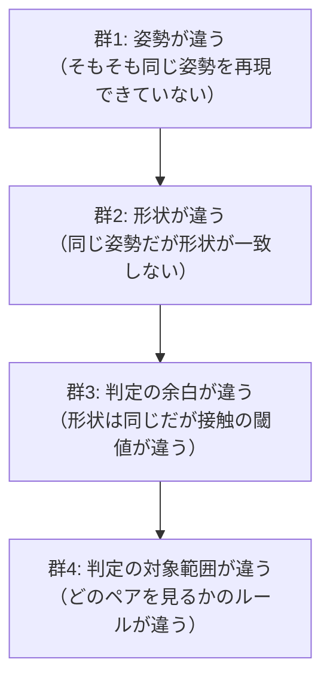

# NB-IsaacSim-Collision-09 実機との乖離要因

> 全体フローにおける位置: ⑤ 実機の判定結果と突き合わせ、乖離要因を切り分ける

## この節の位置づけ

前ページの構成を組んでも、実機の判定結果とシミュレーションの判定結果は完全には一致しない。一致しない箇所が出たとき、原因を当てずっぽうで探すと時間を溶かす。

そこで**乖離要因を先に全列挙し、それぞれの切り分け方を決めておく**。要因は大きく4群に分かれる。



**この順に切り分ける**。上流の群が解決していない状態で下流を調べても意味がないためである。

## 群1: 姿勢が違う

### 要因1-1: 角度の単位

Omniverse Physics は角度ジョイントのパラメータを度で扱う（[R-20](#r-20)）。実機がラジアンで管理している場合、変換を忘れると姿勢がまったく違うものになる。

**症状**: 全く違う姿勢になる。目視で即座に分かる。
**切り分け**: 単一関節に既知の値（例えば 90 度）を入れ、ビューポートで姿勢を目視する。

### 要因1-2: 関節の零点の定義

実機のコントローラが「関節値 0」と定義する姿勢と、USD上でジョイントの `JointStateAPI` の位置が 0 のときの姿勢が一致していない場合。

これはジョイントの `localPos0` / `localRot0` / `localPos1` / `localRot1` の与え方で決まる。

**症状**: 個々の関節がオフセットした姿勢になる。関節を1つずつ動かすと、実機と同じ向きに同じ量だけ動くが、初期姿勢がずれている。
**切り分け**: 全関節を 0 にした姿勢を、実機の「原点姿勢」と目視で比較する。

### 要因1-3: 回転の向き

USD の物理インターフェイスは、USD ジョイントがアーティキュレーションのトポロジに従う必要が無いため、USDからPhysXアーティキュレーションへの解析時に**ジョイント制限を入れ替えたりジョイントドライブの目標値を反転したりし得る**（[R-20](#r-20)）。

ドキュメントは、PhysXのデータに直接アクセスする拡張を使う場合、USDとPhysXのトポロジが同一になるようアーティキュレーションを構成すべきだと推奨している（[R-20](#r-20)）。具体的には、`body0` がPhysXアーティキュレーション上の親リンクを指すようにする。

**症状**: 特定の関節だけ逆方向に回る。
**切り分け**: 各関節に正の値を入れ、実機と同じ向きに回るかを1つずつ確認する。

### 要因1-4: リンク寸法

ジョイントの `localPos0` / `localPos1` に入れた値が、実機のリンク寸法と一致していない場合。

**症状**: 姿勢の形は似ているが、先端の位置が徐々にずれる。根元の関節ほど影響が大きい。
**切り分け**: 既知の姿勢で先端リンクのワールド座標を計算し、実機の順運動学の出力と比較する。

## 群2: 形状が違う

### 要因2-1: カプセルの height の取り違え

[[NB-IsaacSim-Collision-05-カプセルと直方体の寸法定義]] の通り、`height` は両端の半球を含まない（[R-04](#r-04)）。全長をそのまま入れると、片側 R ずつ大きくなる。

**症状**: 干渉が過剰に検出される。特に細長いカプセルの端付近で顕著。
**切り分け**: 各カプセルのローカルバウンディングボックスを出力し、軸方向の範囲が「全長」と一致するか確認する。

```python
from pxr import UsdGeom, Usd

cache = UsdGeom.BBoxCache(Usd.TimeCode.Default(), [UsdGeom.Tokens.default_, UsdGeom.Tokens.guide])
for path in collider_paths:
    prim = stage.GetPrimAtPath(path)
    rng = cache.ComputeLocalBound(prim).ComputeAlignedRange()
    print(path, rng.GetSize())
```

半径 0.05・全長 0.40 のカプセルが正しく作られていれば、次の出力になる。

```
/World/robot/links/link_0/collisions/col_cap_0 (0.1, 0.1, 0.4)
```

`height` に全長を入れてしまっていた場合の出力。

```
/World/robot/links/link_0/collisions/col_cap_0 (0.1, 0.1, 0.5)
```

### 要因2-2: 非一様スケールの混入

カプセルの軸に垂直な2方向のスケールが異なる場合、ビューポートとPhysXの形状が食い違う。祖先からの累積スケールも対象になる。

**症状**: ビューポートの見た目と干渉判定が合わない。目視では気づきにくい。
**切り分け**: 各コリジョンプリムのワールド変換行列からスケール成分を取り出し、軸に垂直な2成分が等しいことを確認する。

### 要因2-3: プリムの型がメッシュになっている

CADから取り込んだ「直方体の形をしたメッシュ」を使っている場合、解析形状ではなく凸包などの近似が入る。

**症状**: 微妙な形状差。角の丸まりなど。
**切り分け**: 全コリジョンプリムの型名を出力する。

```python
for path in collider_paths:
    prim = stage.GetPrimAtPath(path)
    print(path, prim.GetTypeName(), prim.GetAppliedSchemas())
```

期待される出力。

```
/World/robot/links/link_0/collisions/col_cap_0 Capsule ['PhysicsCollisionAPI']
/World/robot/links/link_0/collisions/col_box_0 Cube ['PhysicsCollisionAPI']
```

型が `Mesh` になっている、あるいは `PhysicsMeshCollisionAPI` が付いていれば、そこが原因である。

### 要因2-4: 干渉形状の位置・姿勢

リンク座標系での形状の配置が実機と一致していない場合。

**症状**: 特定のリンクだけ判定がずれる。
**切り分け**: 各コリジョンプリムのリンク座標系での変換行列を出力し、実機の定義値と数値で比較する。

## 群3: 判定の余白が違う

ここが、形状が完全に一致していても判定結果が食い違う原因になる部分である。

### contactOffset と restOffset

Omniverse Physics には、コライダープリムに `PhysxSchema.PhysxCollisionAPI` を適用することで設定できる2つのオフセット属性がある（[R-01](#r-01)）。

| 属性 | 定義 |
|---|---|
| **contactOffset**（衝突オフセット） | 衝突ジオメトリの表面から、**接触の生成が始まる距離** |
| **restOffset**（静止オフセット） | 衝突ジオメトリの表面から、**実効的な接触が起こる距離** |

ドキュメントの記述を整理すると次のようになる（[R-01](#r-01)）。

- contactOffset の既定値は自動生成され、シーンの重力・シミュレーションのタイムステップ・ジオメトリの大きさを考慮して決まる
- 高速に動く物体や薄い物体が1タイムステップで互いをすり抜ける場合、この値を大きくすることが推奨される
- ただし contactOffset を大きくすると生成される接触が増えるため、性能上のペナルティがあり得る
- restOffset は正・ゼロ・負のいずれも取れる。例えば表示メッシュが衝突ジオメトリよりわずかに小さい場合に、適切な負の restOffset を設定すると視覚的に正しい距離で接触が起こる

### なぜこれが乖離要因になるか

**contactOffset は既定で自動決定される**。つまり明示的に設定しない限り、シーンの設定によって値が変わる。実機のコントローラが「形状が幾何学的に重なったら干渉」と定義しているのに対し、PhysXのシミュレーション経路は「contactOffset の分だけ手前から接触を生成する」ため、**シミュレーションのほうが早めに干渉と判定する**ことになる。

ただし重要な区別がある。

| 経路 | contactOffset の影響 |
|---|---|
| シミュレーション経路（接触検出・接触応答・コンタクトレポート） | **受ける** |
| overlap シーンクエリ | **受けない可能性が高い**（幾何学的な重なりを直接問う） |

前ページの構成は overlap クエリを主軸にしているため、この要因の影響を受けにくい設計になっている。ただし「受けない」ことは公式ドキュメントで確認できていないため、**検証項目に含めるべきである**。

### 安全マージンをどちらで持つか

実機には位置決め誤差・たわみ・熱変位があるため、干渉モデルには意図的な余裕が含まれていることが多い。

| マージンの持たせ方 | 利点 | 欠点 |
|---|---|---|
| 形状の寸法に含める（実機と同じ値を使う） | 実機と完全に同じ形状になる | 形状を変えると再検証が必要 |
| contactOffset で表現する | 形状を変えずに一様なマージンを与えられる | overlap クエリでは効かない可能性がある |

**実機の干渉モデルの再現が目的なら、前者を選ぶ。**実機側の形状定義にすでにマージンが含まれているなら、その値をそのままUSDに入れればよい。二重計上を避けるため、シミュレーション側で追加のマージンを入れない。

## 群4: 判定の対象範囲が違う

### 要因4-1: 隣接リンクの扱い

[[NB-IsaacSim-Collision-07-アーティキュレーションと関節姿勢の同期]] の通り、PhysXのアーティキュレーションは親子リンク間の衝突を常にフィルタし、有効化できない（[R-21](#r-21)）。

実機のコントローラが隣接リンクも干渉チェック対象にしているなら、この差が乖離になる。前ページの構成では overlap クエリで判定し、除外は自前のコードで行うことでこの差を吸収する。

### 要因4-2: 除外ペアの定義

実機側で「このリンクとこのリンクは構造上近接するが干渉扱いしない」というペアが定義されている場合、同じ除外リストをシミュレーション側にも持たせる必要がある。

シミュレーション経路のフィルタ（`FilteredPairsAPI`・コリジョングループ）が overlap クエリの結果に反映されるかは未確認であるため、**除外は自前のコードで行うのが確実**である。

### 要因4-3: 同一リンク内の形状同士

1つのリンクが複数の干渉形状を持つ場合、それらは物理的に重なっていて当然である（同じ物体を複数の形状で覆っているため）。これを干渉として報告しないよう除外する必要がある。

前ページの `filter_adjacent` で `la == lb` の場合を除外しているのがこれに当たる。

### 要因4-4: 自己干渉が overlap で検出されるか

[[NB-IsaacSim-Collision-06-干渉検出結果の取得手段]] で挙げた通り、Isaac Lab の議論では `overlap_mesh` が自己干渉を検出しないという報告がある（[R-17](#r-17)）。

**これは構成全体の前提を覆し得る最大のリスクである。**構成が組み上がった直後、他の検証より先にこれを確認する。

## 検証手順

以上を踏まえた検証の順序を示す。

| 段階 | 検証内容 | 判定基準 |
|---|---|---|
| 検証0 | 自己干渉が overlap クエリで検出されるか | 意図的に重ねた2リンクの形状がペアとして返る |
| 検証1 | 姿勢が一致するか（群1） | 既知の関節値に対し、先端リンクのワールド姿勢が実機の順運動学と一致する |
| 検証2 | 形状が一致するか（群2） | 全コリジョンプリムのローカルバウンディングボックスが実機定義値と一致する |
| 検証3 | 境界での判定が一致するか（群3） | 干渉の境界付近で関節値を細かく振り、判定が切り替わる関節値が実機と一致する |
| 検証4 | 対象範囲が一致するか（群4） | 判定されたペアの集合が実機の出力と一致する |

### 検証0の具体的な手順

最も重要なので手順を明示する。

1. リンク2とリンク5が確実に重なる関節値を1つ用意する（ビューポートで目視して重なりを確認する）
2. その姿勢を与えてシミュレーションを1ステップ進める
3. リンク2のコリジョンプリムを入力にして overlap クエリを実行する
4. 結果にリンク5のコリジョンプリムが含まれるかを確認する

```python
encoded = PhysicsSchemaTools.encodeSdfPath("/World/robot/links/link_2/collisions/col_cap_0")
hits = []
get_physx_scene_query_interface().overlap_shape(encoded[0], encoded[1],
                                                lambda h: (hits.append(h.collision), True)[1],
                                                False)
print(hits)
```

期待される出力。

```
['/World/robot/links/link_5/collisions/col_box_0']
```

空リストが返る場合、自己干渉が検出されていない。その場合の代替案を次に示す。

### 検証0が失敗した場合の代替案

| 代替案 | 内容 | 懸念 |
|---|---|---|
| 案A | ロボットを2つのアーティキュレーションに分割し、互いを「別の物体」にする | 機構が変わるため姿勢の同期が複雑になる |
| 案B | 干渉判定専用に、アーティキュレーションに属さない独立した剛体としてコリジョン形状を複製し、リンクの姿勢に追従させる | 形状の二重管理になるが、判定は素直になる |
| 案C | overlap クエリを使わず、幾何計算を自前で実装する（カプセルと直方体だけなら実装は現実的） | Isaac Sim の物理を使わないことになるが、実機の判定式と完全に一致させられる |

案Cは一見後退に見えるが、**実機の判定式と完全に一致させられる**という決定的な利点がある。実機のコントローラがカプセル間距離を解析的に計算しているなら、同じ式を実装するほうが、物理エンジンの内部挙動に依存するより再現性が高い。目的が「実機と同じ判定結果を得ること」である以上、案Cは真面目な選択肢である。

## クリアランス（余裕距離）を数値で取りたい場合

「干渉しているかどうか」だけでなく「あとどれだけ余裕があるか」を知りたい場合、overlap クエリでは足りない。真偽値しか返さないためである。

取り得る手段は次の3つ。

| 手段 | 得られるもの | 制約 |
|---|---|---|
| コンタクトレポートの `separation` | 隙間の値（めり込みは負） | 接触応答が起きるペアでしか発火しない |
| sweep クエリ | 指定方向に動かしたとき最初に当たるまでの距離 | 方向を決める必要がある |
| contactOffset を段階的に振る | 判定が切り替わる閾値から距離を挟み撃ちする | 試行回数がかかるが確実 |

前ページの構成（キネマティック）ではコンタクトレポートが使えないため、実用的なのは3番目である。contactOffset を大きくしていき、判定が偽から真に切り替わった値が、おおよその隙間の距離になる。

## 乖離要因の一覧

最後に全要因を1つの表にまとめる。

| 群 | # | 要因 | 主な症状 |
|---|---|---|---|
| 1 姿勢 | 1-1 | 角度の単位（度とラジアン） | 全く違う姿勢になる |
| 1 姿勢 | 1-2 | 関節の零点の定義 | 一定量オフセットした姿勢になる |
| 1 姿勢 | 1-3 | 回転の向き | 特定の関節が逆方向に回る |
| 1 姿勢 | 1-4 | リンク寸法 | 先端の位置が徐々にずれる |
| 2 形状 | 2-1 | カプセルの `height` の取り違え | 干渉が過剰に検出される |
| 2 形状 | 2-2 | 非一様スケールの混入 | 見た目と判定が合わない |
| 2 形状 | 2-3 | プリムの型がメッシュ | 微妙な形状差 |
| 2 形状 | 2-4 | 形状の位置・姿勢 | 特定リンクだけずれる |
| 3 余白 | 3-1 | contactOffset の自動決定 | 早めに干渉と判定される |
| 3 余白 | 3-2 | restOffset | 接触距離がずれる |
| 3 余白 | 3-3 | 安全マージンの二重計上 | 一律に過剰検出される |
| 4 範囲 | 4-1 | 隣接リンクの扱い | 特定ペアだけ結果が違う |
| 4 範囲 | 4-2 | 除外ペアの定義 | 同上 |
| 4 範囲 | 4-3 | 同一リンク内の形状同士 | 常に干渉と報告される |
| 4 範囲 | 4-4 | 自己干渉が検出されない | 何も検出されない |

---

## 理解度確認問題

1. 乖離要因を群1から群4の順に切り分けるべき理由は何か。
2. contactOffset が乖離要因になるのはなぜか。また、前ページの構成がこの影響を受けにくいのはなぜか。
3. 検証0（自己干渉が overlap で検出されるか）を最優先で行うべき理由は何か。

<details>
<summary>解答</summary>

1. 上流の群が解決していない状態で下流を調べても意味がないため。例えば姿勢が一致していない（群1）状態で形状の一致（群2）を調べても、判定結果の差がどちらに由来するか分離できない。姿勢が一致して初めて形状の差が観測でき、形状が一致して初めて判定の余白の差が観測できる。
2. contactOffset は「衝突ジオメトリの表面から、接触の生成が始まる距離」であり、既定では自動決定される。実機が幾何学的な重なりで干渉を判定するのに対し、PhysXのシミュレーション経路はこの距離だけ手前から接触を生成するため、シミュレーションのほうが早めに干渉と判定する。前ページの構成は overlap シーンクエリを主軸にしており、これは幾何学的な重なりを直接問うため、この影響を受けにくいと考えられる（ただし未確認）。
3. 自己干渉が overlap クエリで検出されないという報告が存在し、もし検出されないなら構成全体の前提が崩れるため。他の検証をいくら積み上げても、この前提が成立していなければすべて無駄になる。失敗した場合は構成そのものを案A〜Cのいずれかに切り替える必要がある。

</details>

---

## 参照

- <a id="r-01"></a>**[R-01]** Omni Physics — Colliders（`PhysxSchema.PhysxCollisionAPI` による contactOffset / restOffset の定義、contactOffset の既定値が重力・タイムステップ・ジオメトリの大きさから自動生成されること、値を大きくした場合の性能上の影響、restOffset が正・ゼロ・負を取れること）. https://docs.omniverse.nvidia.com/kit/docs/omni_physics/latest/dev_guide/rigid_bodies_articulations/collision.html
- <a id="r-04"></a>**[R-04]** OpenUSD — UsdGeomCapsule Class Reference（`height` が両端の半球を除く背骨の長さであること）. https://openusd.org/release/api/class_usd_geom_capsule.html
- <a id="r-17"></a>**[R-17]** isaac-sim/IsaacLab — Discussion #560（`overlap_mesh` が自己干渉を検出しないという報告）. https://github.com/isaac-sim/IsaacLab/discussions/560
- <a id="r-20"></a>**[R-20]** Omni Physics — Articulations（角度の単位、USDからPhysXへの解析時にジョイント制限の入れ替えやドライブ目標値の反転が起こり得ること、USDとPhysXのトポロジを一致させる推奨）. https://docs.omniverse.nvidia.com/kit/docs/omni_physics/latest/dev_guide/rigid_bodies_articulations/articulations.html
- <a id="r-21"></a>**[R-21]** Omni Physics — Articulation and Robot Simulation Stability Guide（親子リンク間の衝突が常にフィルタされ有効化できないこと）. https://docs.omniverse.nvidia.com/kit/docs/omni_physics/latest/dev_guide/guides/articulation_stability_guide.html

## 未確認事項

- overlap シーンクエリの結果が contactOffset / restOffset の影響を受けるかどうかは未確認。本ページでは「受けない可能性が高い」と書いたが、これは overlap が幾何学的な重なりを問うものであることからの推定であり、公式ドキュメントで確認していない。**検証3の実施時に必ず確認すること。**
- overlap シーンクエリの結果に `FilteredPairsAPI` やコリジョングループのフィルタが反映されるかは未確認。
- `purpose = "guide"` が overlap クエリの対象に影響しないことは未確認。
- 上記コード例に添えた出力例は、APIの仕様から導いた期待値であり、Isaac Sim 6.0.1 上での実測出力ではない。

---

## このノートブックの目次

1. [[NB-IsaacSim-Collision-00-概観]]
2. [[NB-IsaacSim-Collision-01-USDの構成要素とPythonラッパー]]
3. [[NB-IsaacSim-Collision-02-検出と応答の分離]]
4. [[NB-IsaacSim-Collision-03-アクター種別と衝突ペアの成立条件]]
5. [[NB-IsaacSim-Collision-04-衝突形状の種類と近似]]
6. [[NB-IsaacSim-Collision-05-カプセルと直方体の寸法定義]]
7. [[NB-IsaacSim-Collision-06-干渉検出結果の取得手段]]
8. [[NB-IsaacSim-Collision-07-アーティキュレーションと関節姿勢の同期]]
9. [[NB-IsaacSim-Collision-08-実機干渉モデルの再現構成]]
10. [[NB-IsaacSim-Collision-09-実機との乖離要因]]
11. [[NB-IsaacSim-Collision-10-リファレンス]]

---

**前のページ**: [[NB-IsaacSim-Collision-08-実機干渉モデルの再現構成]]
**次のページ**: [[NB-IsaacSim-Collision-10-リファレンス]]
