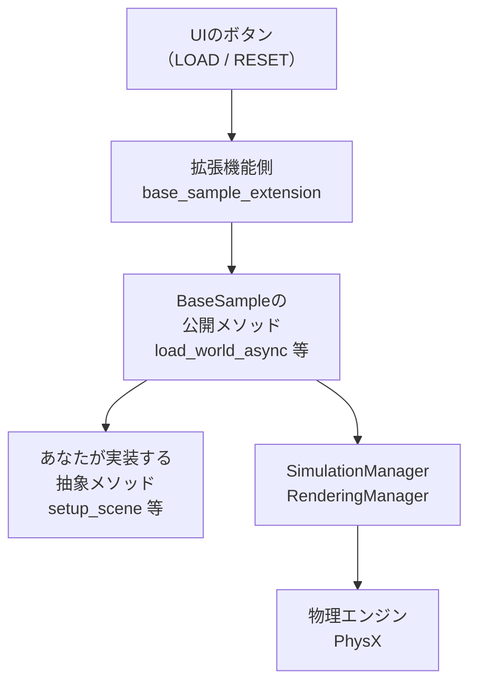
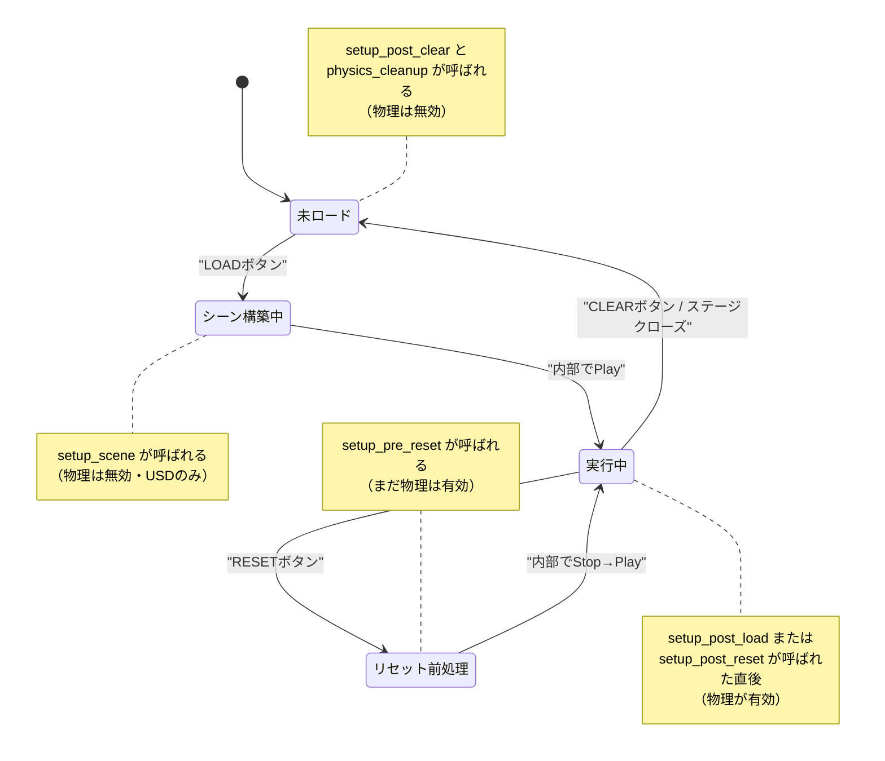

# BaseSampleの立ち位置とライフサイクル

対象バージョン: **Isaac Sim 6.0.1**（Windowsネイティブ）。他バージョンの情報は含まない。

## 0. このページの前提（用語の定義）

| 用語 | 定義 |
|---|---|
| **Kit** | Omniverseのアプリケーション基盤。Isaac SimはKitの上に載ったアプリの1つ |
| **拡張機能（Extension）** | Kitアプリに機能を足す部品。Pythonなら `omni.ext.IExt` を継承したクラスが入口になる |
| **ステージ（USDステージ）** | メモリ上のシーングラフ。primの階層、位置、質量などの「設計値」を持つ |
| **prim** | ステージ上の1ノード。C#で言えばシーングラフのGameObjectに相当 |
| **Timeline** | Kitが持つ再生ヘッド。Play / Pause / Stop の3状態 |
| **物理ハンドル** | 「Playすると生成され、Stopで破棄される物理エンジン側のデータ一式」を指す本ノートブック内の呼称。中身の詳細は別ページで扱う |
| **async / await** | Pythonの非同期構文。`async def` で定義した関数は呼んだだけでは実行されず、`await` されるか実行キューに載せられて初めて動く |

---

## 1. 解決しようとした課題：例題ごとに操作が違うと学習コストが上がる

Isaac Simには「Examples Browser」という、公式サンプルが並ぶウィンドウがある。ここには数十のサンプルが登録されている。

もしサンプルごとに以下がバラバラだったら、利用者は毎回作法を学び直すことになる。

- シーンを組むタイミング
- ロボットを掴む（Pythonオブジェクトとして参照を得る）タイミング
- リセットしたときに何が初期化されるか
- ウィンドウを閉じたときの後始末

さらに厄介なのは、**Isaac Simでは「シーンを組む」と「物理オブジェクトを掴む」を同じ場所で書けない**という制約があること。物理エンジン側のデータはPlayするまで存在しないため、シーン構築の直後にロボットの速度を読もうとしても失敗する。この「2段階に分けなければならない」という制約を、サンプル作者ごとに自己流で処理させると事故が起きる。

## 2. 解決策：ボタン操作に対応する空のメソッドを定義しておく

`BaseSample` は、この2段階制約を**抽象メソッドの並びとして固定化**したクラス。利用者は「どのタイミングで何をするか」を考えず、決められた名前のメソッドを埋めるだけでよくなる。

所属する拡張機能は `isaacsim.examples.base`。クラスのdocstringは次の通り。

> Base class for Isaac Sim example samples with simulation and rendering management.
> （シミュレーションとレンダリングの管理を伴う、Isaac Sim例題サンプル向けの基底クラス）

**名前と所属が示す通り、これは「例題サンプル用」の足場**であり、ユーザー拡張機能の必須基底クラスではない。

### 適用範囲の判断

| 状況 | BaseSampleを使うべきか | 理由 |
|---|---|---|
| チュートリアルを写経して仕組みを学ぶ | **使う** | 記述量が最小で、ライフサイクルの型が身につく |
| LOAD/RESET/CLEARボタン付きのデモを短時間で作る | **使ってよい** | UI結線が既にある |
| 社内ツール・本番用の拡張機能を作る | **使わない** | `isaacsim.examples.*` は例題用途向けであり、APIの安定性が保証されていない |
| ヘッドレスでバッチ実行したい | **使わない** | BaseSampleはUIボタン駆動が前提。ボタンが無い環境では動かせない |

本番用に作る場合の入口は `omni.ext.IExt` を継承し、`on_startup(ext_id)` / `on_shutdown()` を実装する形になる。BaseSampleはその上に載る便利レイヤーに過ぎない。

---

## 3. 仕組み：ボタンから抽象メソッドまでの経路

BaseSampleは単独では何もしない。UI側の拡張機能（`base_sample_extension_experimental.py`）がボタンのクリックを受けて呼び出す。

```python
# base_sample_extension_experimental.py（6.0.1）より抜粋
def _on_load_world(self) -> None:
    async def _on_load_world_async() -> None:
        await self._sample.load_world_async()        # ← BaseSample側を呼ぶ
        await omni.kit.app.get_app().next_update_async()
        ...
        self.post_load_button_event()
    asyncio.ensure_future(_on_load_world_async())
```

つまり構造はこうなっている。



**あなたが書くのは一番下の「抽象メソッド」だけ**で、上の3層は既に用意されている。

### LOADボタンの実際の処理順序

`load_world_async()` の実装は6.0.1で以下の通り。コメントは本ノートで追記したもの。

```python
async def load_world_async(self) -> None:
    await stage_utils.create_new_stage_async()             # ① 空のステージを作る
    stage_utils.set_stage_up_axis("Z")                     # ② 上方向をZ軸に
    stage_utils.set_stage_units(meters_per_unit=...)       # ③ 単位を設定
    self.setup_scene()                                     # ④ ★あなたのコード（USDだけ）
    ViewportManager.set_camera_view(eye=[1.5, 1.5, 1.5], target=[0.01, 0.01, 0.01],
                                    camera="/OmniverseKit_Persp")   # ⑤ カメラ初期位置

    await omni.kit.app.get_app().next_update_async()       # ⑥ 1フレーム待つ

    SimulationManager.setup_simulation(dt=..., device=...) # ⑦ 物理のdtとデバイスを設定
    RenderingManager.set_dt(dt=...)                        # ⑧ 描画のdtを設定
    await omni.kit.app.get_app().next_update_async()       # ⑨ 1フレーム待つ

    app_utils.play()                                       # ⑩ ★ここでPlay。物理ハンドルが生成される
    await omni.kit.app.get_app().next_update_async()       # ⑪ 1フレーム待つ

    await self.setup_post_load()                           # ⑫ ★あなたのコード（物理が使える）
```

**④と⑫の間に⑩のPlayが挟まっている**。これがBaseSampleの本質で、「setup_scene ではUSDしか触れず、setup_post_load からは物理も触れる」という制約の正体はここにある。

### RESETボタンの処理順序

```python
async def reset_async(self) -> None:
    await self.setup_pre_reset()                    # ① ★あなたのコード（まだPlay中）
    app_utils.stop()                                # ② Stop。物理ハンドルが破棄される
    await omni.kit.app.get_app().next_update_async()
    self._reapply_physics_device()                  # ③ 物理シーンのデバイス設定を再適用
    app_utils.play()                                # ④ 再Play。物理ハンドルが再生成される
    await omni.kit.app.get_app().next_update_async()
    await self.setup_post_reset()                   # ⑤ ★あなたのコード（物理が使える）
```

`setup_pre_reset` は**Stopの前**に呼ばれる。ここでコールバックを解除するのが定石になっている理由がこれで分かる。Stop後に解除しようとしても、既に対象が消えている可能性があるため。

### CLEARボタンとステージクローズの経路

```python
async def clear_async(self) -> None:
    await stage_utils.create_new_stage_async()   # ① 新しい空ステージに差し替え
    self._physics_cleanup()                      # ② 内部で physics_cleanup() を呼ぶ
    gc.collect()                                 # ③ ガベージコレクション
    await self.setup_post_clear()                # ④ ★あなたのコード
```

`_physics_cleanup()` の中身：

```python
def _physics_cleanup(self) -> None:
    if app_utils.is_playing():
        app_utils.stop()
    self.physics_cleanup()      # ← あなたがオーバーライドするフック
```

`_physics_cleanup()` は**ステージが閉じられたときにも呼ばれる**（UI拡張の `on_stage_event` 経由）。つまり「ユーザーが別のUSDを開いた」場合にも後始末が走る。

---

## 4. ライフサイクルメソッド一覧（全6件）

6.0.1の `BaseSample` が持つオーバーライド対象は以下の6つ。**これが全部**であり、これ以外に「毎フレーム呼ばれるメソッド」の類は存在しない。

| メソッド | 同期/非同期 | 抽象/フック | 呼出契機 | その時点で物理は | ここで何をするか |
|---|---|---|---|---|---|
| `setup_scene()` | 同期 | 抽象 | LOAD押下時、ステージ作成直後 | **無効** | USDステージへのオブジェクト配置のみ。参照追加、プリミティブ生成、マテリアル適用 |
| `setup_post_load()` | 非同期 | 抽象 | LOAD押下時、Playの後 | **有効** | ラッパーの生成（`RigidPrim` 等）、物理プロパティの読み取り、コールバック登録 |
| `setup_pre_reset()` | 非同期 | 抽象 | RESET押下時、Stopの前 | **有効** | コールバックの解除、コントローラの状態リセット |
| `setup_post_reset()` | 非同期 | 抽象 | RESET押下時、再Playの後 | **有効** | コールバックの再登録、初期姿勢の再設定 |
| `setup_post_clear()` | 非同期 | 抽象 | CLEAR押下時、ステージ差し替えの後 | **無効** | 保持していた参照の破棄、UI状態のリセット |
| `physics_cleanup()` | 同期 | フック（空実装あり） | CLEAR押下時、およびステージクローズ時、拡張機能のホットリロード時 | Stop済み | リソース解放。オーバーライドは任意 |

**用語の補足**: 「抽象」は `@abstractmethod` が付いており、サブクラスで実装しないと使えないもの。「フック」は基底クラスに空の実装があり、必要なときだけオーバーライドするもの。

### 補助メソッド（オーバーライド対象ではない）

| メソッド | 用途 |
|---|---|
| `set_world_settings(physics_dt, stage_units_in_meters, rendering_dt, device)` | `setup_scene` より前（`__init__` 内など）で呼び、物理dt・描画dt・デバイスを変更する |
| `log_info(info)` | 文字列を内部のログバッファに追記する |

### デフォルト設定値（6.0.1の `__init__` より）

```python
self._world_settings = {
    "physics_dt": 1.0 / 60.0,
    "stage_units_in_meters": 1.0,
    "rendering_dt": 1.0 / 60.0,
    "device": "cpu",           # ← デフォルトはCPU。GPUで回したいなら明示変更が必要
}
```

`device` のデフォルトが `"cpu"` である点は性能面で重要になる。

---

## 5. 状態遷移図



図中の「物理が有効／無効」は、物理エンジン側のデータが存在するかどうかを指す。

---

## 6. C#/Unityのライフサイクルとの対応（誤解しやすい点を明示）

構造が根本的に違う。**Unityはオブジェクト単位、BaseSampleはアプリ全体単位**。

| Isaac Sim (BaseSample) | Unityで最も近いもの | 対応が崩れる点 |
|---|---|---|
| `setup_scene()` | `Awake()` | Unityは各GameObjectごとに呼ばれるが、`setup_scene` はサンプル全体で1回だけ |
| `setup_post_load()` | `Start()` | 「物理が有効になった後」という保証がUnityの `Start` には無い |
| `setup_pre_reset()` | 該当なし | Unityにはシーンを初期状態へ巻き戻す標準フックが無い |
| `setup_post_reset()` | `OnEnable()` に近い | 呼ばれる契機がRESETボタンのみ |
| `setup_post_clear()` | `OnDestroy()` に近い | Unityは破棄されるオブジェクトごと、こちらはサンプル全体で1回 |
| `physics_cleanup()` | `OnApplicationQuit()` に近い | ステージを開き直すたびに呼ばれる点が違う |

**対応が存在しないもの（重要）**

| Unity | Isaac Sim BaseSample |
|---|---|
| `FixedUpdate()` | **BaseSampleにメソッドは無い。** `SimulationManager.register_callback` で `SimulationEvent.PHYSICS_POST_STEP` を購読する |
| `Update()` | **BaseSampleにメソッドは無い。** `RenderingManager.register_callback` で `RenderingEvent.NEW_FRAME` を購読する |
| `LateUpdate()` | 該当なし。`order` 引数で相対順序を作る |

「毎周期呼ばれるメソッドをオーバーライドする」という発想はBaseSampleには無い。**毎周期の処理はイベント購読で実現する**というのが、Unityとの最大の構造差になる。

---

## 7. 実装：最小のBaseSample派生クラス（全メソッド実装）

6メソッドすべてに `print` を仕込み、どの順で呼ばれるかを観測する。

```python
import isaacsim.core.experimental.utils.stage as stage_utils
from isaacsim.core.experimental.objects import Cube
from isaacsim.core.experimental.prims import RigidPrim
from isaacsim.core.simulation_manager import SimulationEvent, SimulationManager
from isaacsim.examples.base.base_sample_experimental import BaseSample


class LifecycleProbe(BaseSample):
    def __init__(self) -> None:
        super().__init__()
        self._cube = None
        self._callback_id = None
        self._step_count = 0

    def setup_scene(self) -> None:
        print("[1] setup_scene: USDだけを触る段階")
        Cube("/World/Cube", positions=[[0.0, 0.0, 1.0]], sizes=[0.2])

    async def setup_post_load(self) -> None:
        print("[2] setup_post_load: 物理が有効")
        self._cube = RigidPrim("/World/Cube")
        positions, _ = self._cube.get_world_poses()
        print(f"    高さ = {positions.numpy()[0][2]:.3f}")
        self._callback_id = SimulationManager.register_callback(
            self.on_physics_step, event=SimulationEvent.PHYSICS_POST_STEP
        )
        print(f"    コールバック登録: uid={self._callback_id}")

    def on_physics_step(self, step_dt, context) -> None:
        self._step_count += 1
        if self._step_count % 60 == 0:
            positions, _ = self._cube.get_world_poses()
            print(f"    [step {self._step_count}] 高さ = {positions.numpy()[0][2]:.3f}")

    async def setup_pre_reset(self) -> None:
        print("[3] setup_pre_reset: Stopの前。ここで解除する")
        if self._callback_id is not None:
            print(f"    解除結果 = {SimulationManager.deregister_callback(self._callback_id)}")
            self._callback_id = None
        self._step_count = 0

    async def setup_post_reset(self) -> None:
        print("[4] setup_post_reset: 再Play後。ここで再登録する")
        self._callback_id = SimulationManager.register_callback(
            self.on_physics_step, event=SimulationEvent.PHYSICS_POST_STEP
        )
        print(f"    コールバック再登録: uid={self._callback_id}")

    async def setup_post_clear(self) -> None:
        print("[5] setup_post_clear: 参照を捨てる")
        self._cube = None

    def physics_cleanup(self) -> None:
        print("[6] physics_cleanup: 最終後始末")
        self._callback_id = None
```

### 実行時のコンソール出力

**LOADボタンを押したとき:**

```
[1] setup_scene: USDだけを触る段階
[2] setup_post_load: 物理が有効
    高さ = 1.000
    コールバック登録: uid=2
    [step 60] 高さ = 0.917
    [step 120] 高さ = 0.669
    [step 180] 高さ = 0.256
```

**続けてRESETボタンを押したとき:**

```
[3] setup_pre_reset: Stopの前。ここで解除する
    解除結果 = True
[4] setup_post_reset: 再Play後。ここで再登録する
    コールバック再登録: uid=3
    [step 60] 高さ = 0.917
```

RESET後にuidが `2` から `3` に変わっている点に注目。uidは登録のたびに新規発行されるので、古い値を持ち続けると解除できなくなる。

**続けてCLEARボタンを押したとき:**

```
[6] physics_cleanup: 最終後始末
[5] setup_post_clear: 参照を捨てる
```

`clear_async` の実装順（`_physics_cleanup()` → `setup_post_clear()`）通り、**physics_cleanup のほうが先**に呼ばれる。番号順ではないので注意。

---

## 理解度確認問題

1. `setup_scene()` の中で `RigidPrim("/World/Cube").get_velocities()` を呼ぶとどうなるか。理由も述べよ。
2. RESETボタンを押したとき、`setup_pre_reset` はStopの前と後のどちらで呼ばれるか。それが重要な理由は何か。
3. Unityの `FixedUpdate` に相当する処理をBaseSampleで書くにはどうするか。
4. `physics_cleanup()` と `setup_post_clear()` はどちらが先に呼ばれるか。
5. 社内の本番用ツールをBaseSampleを継承して作るべきでない理由を2つ挙げよ。
6. `_world_settings` の `device` のデフォルト値は何か。

---

## 根拠とした公式Doc・ソース

- Isaac Sim 6.0.1 実ソース `source/extensions/isaacsim.examples.base/isaacsim/examples/base/base_sample_experimental.py`（`BaseSample` クラス全体、`load_world_async` / `reset_async` / `clear_async` の実装、抽象メソッド6件、`_world_settings` のデフォルト値）
  - https://github.com/isaac-sim/IsaacSim/blob/v6.0.1/source/extensions/isaacsim.examples.base/isaacsim/examples/base/base_sample_experimental.py
- Isaac Sim 6.0.1 実ソース `base_sample_extension_experimental.py`（LOAD/RESETボタンからの呼出、ステージクローズ時の `_physics_cleanup` 呼出）
  - https://github.com/isaac-sim/IsaacSim/blob/v6.0.1/source/extensions/isaacsim.examples.base/isaacsim/examples/base/base_sample_extension_experimental.py
- `Core API Hello World`（BaseSampleを使ったチュートリアルの標準的な書き方）
  - https://docs.isaacsim.omniverse.nvidia.com/6.0.0/core_api_tutorials/tutorial_core_hello_world.html
- `Workflows`（GUI / Extension / Standalone の3ワークフローの定義と使い分け）
  - https://docs.isaacsim.omniverse.nvidia.com/6.0.0/introduction/workflows.html

---

## 目次

- [[01_SimulationManagerのコールバック契約]]
- [[02_BaseSampleの立ち位置とライフサイクル]]（このページ）
- [[03_IsaacSimドキュメントの読み方]]
- [[04_物理OFF時に使えるAPIの判定]]
- [[05_FPS低下時のボトルネック判定]]
- [[06_Standaloneで使えない機能とその有効化]]

前のページ: [[01_SimulationManagerのコールバック契約]]
次のページ: [[03_IsaacSimドキュメントの読み方]]
