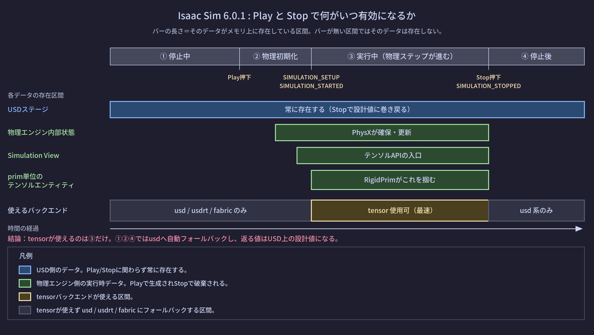
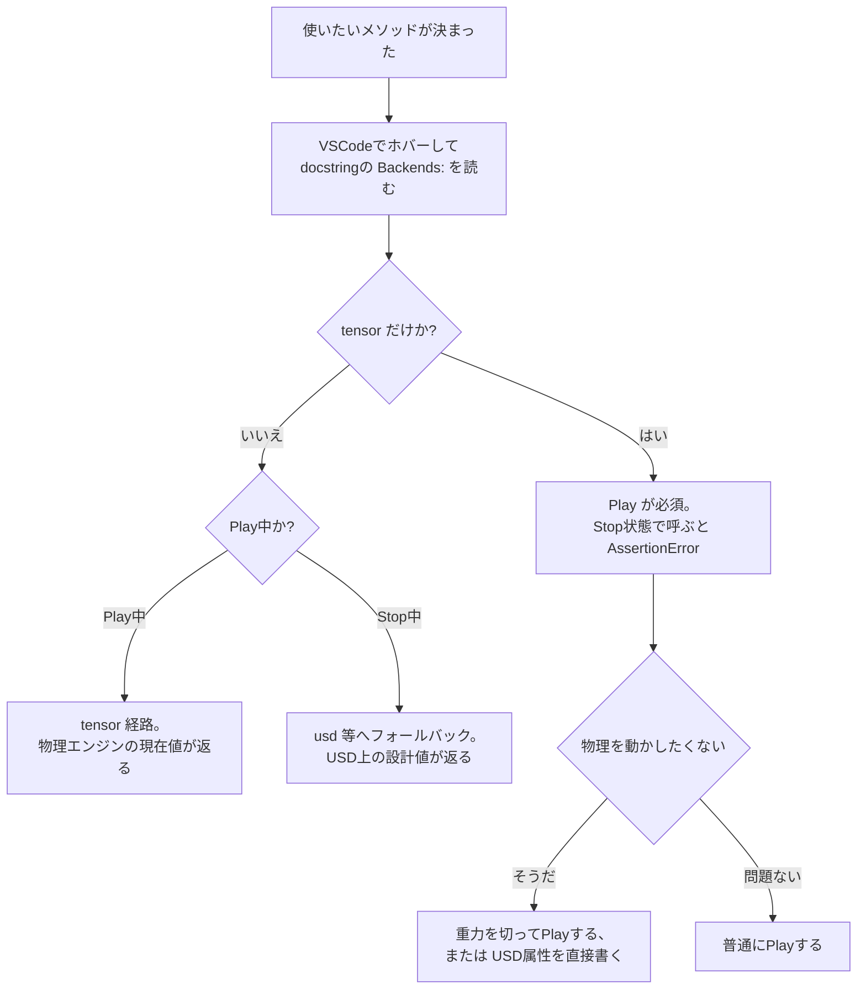

# 物理OFF時に使えるAPIの判定

対象バージョン: **Isaac Sim 6.0.1**（Windowsネイティブ）。他バージョンの情報は含まない。

## 0. このページで答えること

- 「Playしていない状態で呼べるAPI」をどう見分けるか
- 物理シミュレーションなしでロボットの姿勢をコードから変えたいとき、何が使えるか

---

## 1. 時系列：何がいつ生成され、いつ消えるか

判定の前に、**Play/Stopで何が生まれて何が消えるか**を押さえる必要がある。「tensorが使えない」の「使えない」が何を指しているのかが、これで確定する。



### 登場する4つのデータ（空間的な内訳）

| 名前 | 実体 | 生存期間 | 中身 |
|---|---|---|---|
| **USDステージ** | メモリ上のシーングラフ。ディスクの `.usd` に対応する | アプリ起動〜ステージクローズ | prim階層、Transform、質量、マテリアル等の「設計値」 |
| **物理エンジン内部状態** | PhysX（またはNewton）が確保したソルバー用データ | Play〜Stop | 剛体・関節・接触の実行時状態 |
| **Physics Simulation View** | `omni.physics.tensors.api.SimulationView` のインスタンス | Play〜Stop | 上記内部状態への一括読み書き入口 |
| **prim単位のテンソルエンティティ** | `RigidPrim` の内部に持たれる物理ビュー | Play〜Stop | そのラッパーが掴むprim群への窓 |

**「群」と書いているのはなぜか**: `RigidPrim` は1個のprimを掴むとは限らない。コンストラクタのパスに正規表現を書けば複数primを掴む。`RigidPrim("/World/Cube")` なら1体、`RigidPrim("/World/envs/env_.*/Cube")` なら100体。よってこのテンソルエンティティは「そのラッパーが掴んでいるprim群」への窓になる。1体しか掴んでいなければ、群の要素数が1というだけ。

### 時系列（Play → Stopの全経過）

| # | タイミング | 実際に起きること | 発火イベント |
|---|---|---|---|
| 0 | アプリ起動・ステージ作成後 | USDステージのみ存在。他3つは未生成 | — |
| 1 | Playボタン押下 | Kitの**Timeline**（再生ヘッド。Play/Pause/Stopの3状態を持つKitの機能）がPlay状態になり、これを購読している `SimulationManager` の内部処理が走る | — |
| 2 | 物理初期化 | `SimulationManager.initialize_physics()` が動く。USDから物理を読み込みエンジンを起動し、Simulation Viewを生成する | — |
| 3 | 初期化完了 | 上表の下3つが揃う。**この瞬間から `tensor` バックエンドが使える** | `SIMULATION_SETUP` |
| 4 | 進行準備完了 | ユーザーコードの準備処理はここが推奨 | `SIMULATION_STARTED` |
| 5 | 毎物理ステップ（前） | ソルバー実行前 | `PHYSICS_PRE_STEP` |
| 6 | 毎物理ステップ（後） | ソルバー実行後。値が更新済み | `PHYSICS_POST_STEP` |
| 7 | Pause | 内部状態は保持されたまま停止 | `SIMULATION_PAUSED` |
| 8 | Stop | `SimulationManager.invalidate_physics()` が動く。Simulation Viewを無効化し内部状態をリセット。USDステージは設計値に戻る | `SIMULATION_STOPPED` |

**「TimelineがSimulationManagerに通知する」の意味**: TimelineはKitが持つイベント配信元で、状態が変わると購読者にイベントを流す。`SimulationManager` はその購読者の1つ。C#で言えば、`Timeline.StateChanged += SimulationManager.OnStateChanged` の関係にある。Timeline自身が能動的に何かを判断しているのではなく、状態変化を購読者に配っているだけ。

公式ドキュメントは、Play/Pause/Stopの各イベントがアプリケーションウィンドウのボタンからも、Core Experimental APIの `play()` / `pause()` / `stop()` ユーティリティ関数からもトリガーでき、後者は `omni.timeline` APIの薄いラッパーであると説明している。

---

## 2. 判定方法：名前空間では分からない

**結論を先に述べる。importする名前空間では判定できない。分割されていない。**

```python
from isaacsim.core.experimental.prims import RigidPrim

cube = RigidPrim("/World/Cube")

cube.get_world_poses()      # Stop状態でも呼べる
cube.get_contact_forces()   # Stop状態では AssertionError
```

どちらも同じクラス、同じimportパス。**唯一の判定材料はdocstringの `Backends:` 行**。

### 判定ルール

| `Backends:` の記述 | Play中でないときの挙動 | 判定 |
|---|---|---|
| `tensor` のみ | `AssertionError` | **Play必須** |
| `tensor, usd` | `usd` にフォールバック | Playなしでも呼べる |
| `tensor, usd, usdrt, fabric` | `usd` 等にフォールバック | Playなしでも呼べる |
| `usd` のみ | 常に `usd` | Play無関係 |

公式ドキュメントの記述がそのままルールになっている。tensorバックエンドはシミュレーションが実行中であることを要求し、このバックエンドだけで実装されたプロパティやメソッドを呼ぶと、シミュレーションが動いていない場合にAssertionErrorが発生する。複数のバックエンドをサポートする実装で、かつシミュレーションが動いていない場合は、リストの次のバックエンド（通常はusd）にフォールバックする。

### VSCodeでの確認手順

1. メソッド名にマウスホバー、または `Ctrl` + クリックで定義へジャンプ
2. docstringの2行目付近にある `Backends:` の行を読む

```python
# rigid_prim.py（6.0.1）の実際の記述
def get_world_poses(self, ...):
    """Get the poses (positions and orientations) in the world frame of the prims.

    Backends: tensor, usd, usdrt, fabric.       ← Playなしでも呼べる
    """

def get_contact_forces(self, ...):
    """...

    Backends: tensor.                            ← Play必須
    """
```

---

## 3. 実際に何が起きるか（コードと出力）

```python
from isaacsim.core.experimental.prims import RigidPrim
import isaacsim.core.experimental.utils.app as app_utils

cube = RigidPrim("/World/Cube")   # USD上の初期位置は (0, 0, 1.0)

# --- Stop状態 ---
positions, _ = cube.get_world_poses()
print("Stop:", positions.numpy()[0])
# 出力:
# Stop: [0. 0. 1.]              ← USDの設計値

lin, ang = cube.get_velocities()
print("Stop velocity:", lin.numpy()[0])
# 出力:
# Stop velocity: [0. 0. 0.]     ← USDには速度が書かれていないので0

try:
    cube.get_contact_forces()
except AssertionError as e:
    print("Stop contact:", type(e).__name__)
# 出力:
# Stop contact: AssertionError

# --- Play後、しばらく落下させてから ---
app_utils.play()
# ... 60ステップ経過 ...
positions, _ = cube.get_world_poses()
print("Play:", positions.numpy()[0])
# 出力:
# Play: [0.  0.  0.917]         ← 物理エンジンが計算した現在位置
```

**同じ関数呼び出しで、返る値の出所が変わる**。これが最も引っかかる点。「値が更新されない」と悩んだら、まずPlay状態を疑う。

### RigidPrim（6.0.1）の内訳

`rigid_prim.py` の `Backends:` 注記を集計すると次のようになる。

| 記述 | 件数 | 主な該当メソッド |
|---|---|---|
| `tensor` のみ | 15 | 速度の設定、力の印加、接触力の取得、慣性テンソル関連 |
| `tensor, usd` | 9 | 速度の取得、質量、密度 |
| `tensor, usd, usdrt, fabric` | 4 | ワールド姿勢、ローカル姿勢などの変換系 |
| `usd` のみ | 6 | 衝突有効フラグ、CCD設定などUSD属性系 |

**傾向として、「読む」系は複数バックエンド対応で、「物理エンジンに命令する」系は tensor のみ**になっている。物理エンジンが存在しないときに命令だけしても意味がないので、当然の切り分けと言える。

---

## 4. 用途別：物理Simなしでロボットの姿勢を動かしたい場合

### やりたいこと

物理を動かさず、関節角度をコードから指定して姿勢をパキパキ変えたい（IKの確認、干渉チェック、プレゼン用の姿勢作り、データ生成など）。

### 使えるもの・使えないもの

| やりたい操作 | 使うAPI | `Backends:` | Stop状態で使えるか |
|---|---|---|---|
| primの位置・姿勢を設定する | `XformPrim.set_world_poses()` | `usd, usdrt, fabric` を含む | **使える** |
| primの位置・姿勢を読む | `XformPrim.get_world_poses()` | `tensor, usd, usdrt, fabric` | **使える** |
| 関節角度を設定する | `Articulation.set_dof_positions()` | `tensor` のみ | **使えない** |
| 関節角度の目標値を設定する | `Articulation.set_dof_position_targets()` | `tensor` のみ | **使えない** |
| 質量を設定する | `RigidPrim.set_masses()` | `tensor, usd` | **使える** |
| 速度を設定する | `RigidPrim.set_velocities()` | `tensor` のみ | **使えない** |

**注意**: 上表のうち `Articulation` 系の `Backends:` 記述は、実際に6.0.1の `articulation.py` をVSCodeで確認して裏を取ること。ここでは `RigidPrim` の傾向（物理エンジンへの命令系は tensor のみ）から推定している。【未確認：`articulation.py` の各メソッドの `Backends:` 記述】

### 2つの選択肢

**選択肢A: USD属性を直接書き換える（Play不要）**

関節角度をUSD属性として書く方法。`UsdPhysics` スキーマの関節prim（`RevoluteJoint` など）は、関節そのものの定義を持つが、「現在の関節角度」はUSD上の属性としては持たない。姿勢を変えたいなら、**リンクのTransformを直接書き換える**ことになる。

```python
from isaacsim.core.experimental.prims import XformPrim
import numpy as np

link = XformPrim("/World/Robot/link2")
link.set_world_poses(
    positions=np.array([[0.3, 0.0, 0.5]]),
    orientations=np.array([[0.7071, 0.0, 0.7071, 0.0]]),   # wxyz
)
# Play不要。USDステージ上の値が直接書き換わり、ビューポートにも反映される
```

この方法の欠点は、**関節の拘束を自分で守る責任が発生する**こと。リンクを個別に動かすので、関節でつながっているはずのリンクがバラバラの位置に飛ぶことがありうる。順運動学を自分で計算する必要がある。

**選択肢B: Playした状態で、重力を切って関節角度を直接指定する**

物理は動かすが、重力とダイナミクスの影響を実質的に消す。

```python
from isaacsim.core.simulation_manager import PhysxScene
import isaacsim.core.experimental.utils.app as app_utils
from isaacsim.core.experimental.prims import Articulation
import numpy as np

physx_scene = PhysxScene("/World/physicsScene")
physx_scene.set_enabled_gravity(False)     # 重力を無効化

app_utils.play()                            # Playする（tensorが使えるようになる）

robot = Articulation("/World/Robot")
robot.set_dof_positions(np.array([[0.0, -1.5, 0.0, -1.5, 0.0, 1.5, 0.5]]))
# 関節角度を直接セット。関節の拘束は物理エンジンが守ってくれる
```

`set_enabled_gravity` は `PhysicsScene` クラスのメソッドとして公式ドキュメントに定義されている。

### どちらを選ぶか

| 判断基準 | 選択肢A（USD直書き） | 選択肢B（Play + 重力off） |
|---|---|---|
| Play操作が要るか | 不要 | 必要 |
| 関節の拘束を守ってくれるか | **守られない**（自分で順運動学を計算） | 守られる |
| 干渉チェックができるか | できない（物理エンジンが動いていない） | できる |
| 姿勢がUSDに保存されるか | される | Stopで巻き戻る |
| 実装の手間 | 大きい（FK計算が必要） | 小さい |

**多関節ロボットの姿勢を動かしたいなら、選択肢Bのほうが現実的**。「物理Simなしで」という要件が「重力で崩れてほしくない・接触で吹き飛んでほしくない」という意味なら、Bで満たせる。

「Playすら押したくない」（USDファイルを編集して保存したい）という要件なら、Aしか無い。この場合はロボットの順運動学を自前で計算するか、USD Composerのような編集ツール側の機能を使うことになる。

### 「USDにフォールバックして設計値が返っても構わない」というケース

USD属性を書き換えれば、次に読んだときはその書き換え後の値が返る。つまり「設計値が返る」ことは情報の欠落ではない。

```python
link = XformPrim("/World/Robot/link2")

link.set_world_poses(positions=np.array([[0.3, 0.0, 0.5]]))   # Stop状態で書く
positions, _ = link.get_world_poses()                          # Stop状態で読む
print(positions.numpy()[0])
# 出力:
# [0.3 0.  0.5]        ← 書いた値がそのまま返る
```

この往復が成立するので、**「物理を使わずUSDだけで完結する編集ワークフロー」は成立する**。ただし関節拘束は前述の通り自分で守る必要がある。

---

## 5. まとめ：判定フロー



---

## 理解度確認問題

1. `RigidPrim` と `Articulation` は同じimportパス配下にあるのに、Play必須のメソッドとそうでないメソッドが混在する。判定材料は何か。
2. Stop状態で `get_world_poses()` を呼んだとき、返る値は何を意味するか。
3. `RigidPrim("/World/Cube")` が掴む剛体は1体なのに、内部のテンソルエンティティを「群への窓」と表現するのはなぜか。
4. `tensor` バックエンドが使えるようになるのは、Playボタンを押してからどのイベントの時点か。
5. 物理を動かさずに多関節ロボットの姿勢を変えたい。USD属性の直書きで済ませようとすると何が問題になるか。
6. 「重力を切ってPlayする」方式が、USD直書きより優れている点を2つ挙げよ。

---

## 根拠とした公式Doc・ソース

- `Core Experimental API`（4バックエンドの定義表、tensorがPlay中限定であること、AssertionErrorが発生する条件、フォールバック規則、単一primラッパーが存在しないこと）
  - https://docs.isaacsim.omniverse.nvidia.com/6.0.0/py/docs/overview/experimental.html
- `[isaacsim.core.simulation_manager] Isaac Sim Core Simulation Manager`（`SIMULATION_SETUP` の定義とウォームアップステップの説明、シミュレーションライフサイクル図、`initialize_physics()` / `invalidate_physics()` の仕様、`PhysicsScene.set_enabled_gravity()`、Play/Pause/Stopが `omni.timeline` の薄いラッパーであること）
  - https://docs.isaacsim.omniverse.nvidia.com/6.0.0/py/source/extensions/isaacsim.core.simulation_manager/docs/index.html
- Isaac Sim 6.0.1 実ソース `source/extensions/isaacsim.core.experimental.prims/python/impl/rigid_prim.py`（各メソッドの `Backends:` 注記、正規表現によるprimマッチ、`get_world_poses` のtensor/USD分岐実装）
  - https://github.com/isaac-sim/IsaacSim/blob/v6.0.1/source/extensions/isaacsim.core.experimental.prims/python/impl/rigid_prim.py
- `Physics Data Flow and Engine Integration`（USD / Fabric / Physics Tensors の3経路と、Play前後でのUSDの役割）
  - https://docs.isaacsim.omniverse.nvidia.com/6.0.0/physics/new_physics_engine.html

---

## 目次

- [[01_SimulationManagerのコールバック契約]]
- [[02_BaseSampleの立ち位置とライフサイクル]]
- [[03_IsaacSimドキュメントの読み方]]
- [[04_物理OFF時に使えるAPIの判定]]（このページ）
- [[05_FPS低下時のボトルネック判定]]
- [[06_Standaloneで使えない機能とその有効化]]

前のページ: [[03_IsaacSimドキュメントの読み方]]
次のページ: [[05_FPS低下時のボトルネック判定]]
