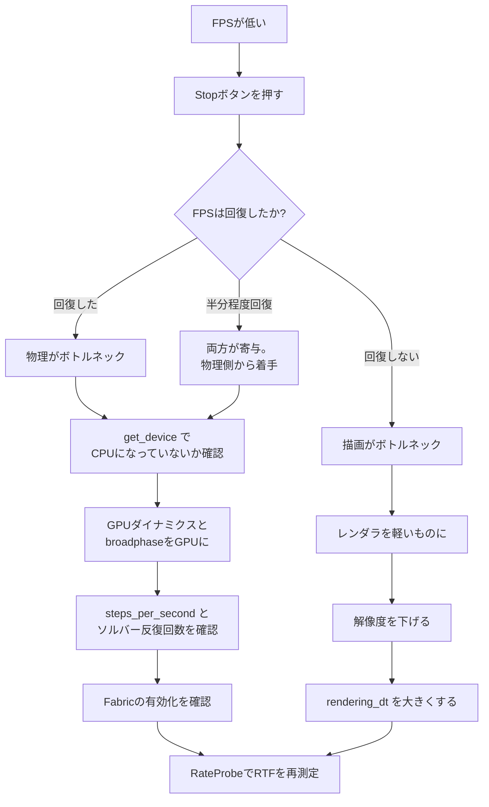

# FPS低下時のボトルネック判定

対象バージョン: **Isaac Sim 6.0.1**（Windowsネイティブ）。他バージョンの情報は含まない。

## 0. このページの前提（用語の定義）

| 用語 | 定義 |
|---|---|
| **物理ステップ** | 物理エンジンが1回分の時間を進める処理。1回あたりの時間幅を `physics_dt` で決める |
| **描画フレーム** | 画面を1枚描く処理。1枚あたりの時間幅を `rendering_dt` で決める |
| **FPS** | Frames Per Second。1秒あたりに描画されたフレーム数。**描画側の指標であり、物理の速さは表していない** |
| **リアルタイムファクタ (RTF)** | シミュレーション内の経過時間 ÷ 実世界の経過時間。1.0なら実時間と同じ速さ、0.2なら5倍遅い |
| **ソルバー** | 物理エンジンが拘束（関節・接触）を解く計算部分 |
| **Fabric** | Omniverseの高速シーンデータ経路。物理結果をUSDに書き戻さず描画側へ渡す仕組み |

---

## 1. なぜFPSだけ見ても切り分けできないのか

物理ステップと描画フレームは**別カウントで進む独立した処理**。BaseSampleの設定値がそれを直接示している。

```python
# base_sample_experimental.py（6.0.1）の __init__ より
self._world_settings = {
    "physics_dt": 1.0 / 60.0,      # 物理の刻み
    "rendering_dt": 1.0 / 60.0,    # 描画の刻み
    "device": "cpu",
    ...
}
```

設定先も別のクラスになっている。

```python
SimulationManager.setup_simulation(dt=self._world_settings["physics_dt"], device=...)
RenderingManager.set_dt(dt=self._world_settings["rendering_dt"])
```

**画面のFPSが10まで落ちたとき、原因は3通りありうる。**

1. 描画1枚に時間がかかっている（描画がボトルネック）
2. 物理1ステップに時間がかかり、描画がその完了を待っている（物理がボトルネック）
3. 両方

FPSという1つの数字からは、この3つを区別できない。だから**切り分けの手順が要る**。

---

## 2. 切り分け手順：まずStopを押す

最も少ない手数で決着がつく方法。

### 手順

1. 現在の状態（Play中、FPS 10）で、画面右上のFPS表示を控える
2. **Stopボタンを押す**（物理が完全に止まる。描画は続く）
3. FPS表示がどう変わるか見る

### 判定

| Stop後のFPS | 結論 | 次に見るべきもの |
|---|---|---|
| 10のまま（変わらない） | **描画がボトルネック** | レンダラ設定、解像度、ライト、メッシュのポリゴン数、テクスチャ |
| 50〜60に回復した | **物理がボトルネック** | ソルバー設定、GPU/CPUデバイス、接触点数、ロボット台数 |
| 25〜35程度に回復（半分程度） | **両方が寄与** | 物理側から先に手を付ける（改善幅が大きいことが多い） |

Stopすると物理エンジンの内部状態が破棄され、物理ステップは一切走らなくなる。描画だけが残る。だからStop後のFPSは「描画だけにしたときの上限」を意味する。

### この手順が有効な理由

Stopは1クリックで済み、コードの変更もプロファイラの導入も不要。**最初にやるべき測定**として費用対効果が最も高い。

---

## 3. 数値で測る：物理ステップ数と描画フレーム数を自分で数える

Stopによる二択で足りない場合、実際のレートを数値化する。6.0.1のAPIだけで実装できる。

### 使うAPI

| API | 返り値 | 用途 |
|---|---|---|
| `SimulationManager.get_num_physics_steps()` | int | これまでに実行された物理ステップの累計 |
| `SimulationManager.get_simulation_time()` | float | シミュレーション内の経過時間[秒] |
| `RenderingManager.register_callback(RenderingEvent.NEW_FRAME, callback=...)` | int (uid) | 描画フレームごとのコールバック |
| `RenderingManager.get_dt()` | float | 描画の刻み[秒] |

### 計測コード

```python
import time
from isaacsim.core.rendering_manager import RenderingEvent, RenderingManager
from isaacsim.core.simulation_manager import SimulationManager


class RateProbe:
    def __init__(self):
        self._frames = 0
        self._t0 = time.perf_counter()
        self._steps0 = SimulationManager.get_num_physics_steps()
        self._simtime0 = SimulationManager.get_simulation_time()
        self._callback_id = RenderingManager.register_callback(
            RenderingEvent.NEW_FRAME, callback=self.on_frame
        )

    def on_frame(self, event, *args, **kwargs):
        self._frames += 1
        if self._frames % 60 != 0:
            return
        now = time.perf_counter()
        wall = now - self._t0
        steps = SimulationManager.get_num_physics_steps() - self._steps0
        simtime = SimulationManager.get_simulation_time() - self._simtime0

        print(f"実時間 {wall:6.2f}s | "
              f"描画 {self._frames / wall:6.2f} FPS | "
              f"物理 {steps / wall:7.2f} steps/s | "
              f"RTF {simtime / wall:5.3f}")

    def stop(self):
        RenderingManager.deregister_callback(self._callback_id)


probe = RateProbe()   # Play中に実行する
```

### 出力の読み方

**ケース1: 描画がボトルネック**

```
実時間   6.02s | 描画   9.97 FPS | 物理  598.34 steps/s | RTF 0.997
```

物理は毎秒600ステップ（`physics_dt = 1/600` 相当）を実時間通りにこなしており、RTFはほぼ1.0。**シミュレーションは実時間で進んでいて、絵だけが出ていない**。描画側の問題。

**ケース2: 物理がボトルネック**

```
実時間   6.01s | 描画   9.98 FPS | 物理   59.87 steps/s | RTF 0.166
```

RTFが0.166。**シミュレーション内で1秒進むのに実時間で6秒かかっている**。物理が全体を律速している。

**ケース3: 両方**

```
実時間   6.03s | 描画  10.02 FPS | 物理  120.15 steps/s | RTF 0.401
```

RTFが0.4で物理も遅いが、描画も10FPSまで落ちている。

### RTFという指標の価値

**FPSではなくRTFを見るのが本質**。FPSは「絵が何枚出たか」でしかないが、RTFは「シミュレーションが実時間に対してどれだけ遅れているか」を直接表す。ロボットシミュレーションで本当に困るのは、RTFが1.0を大きく下回ることのほう。

なお、Isaac Simには `Isaac Real Time Factor` というOmniGraphノードが用意されており、これをグラフに組み込めば同じ指標を取得できる。GUI上でのRTF表示の有無と場所については【未確認】。

---

## 4. 物理がボトルネックだった場合の確認項目

ロボット数台でFPSが10まで落ちる、という症状に対して、優先度順に並べる。

### 4-1. 【最優先】シミュレーションデバイスがCPUになっていないか

**BaseSampleのデフォルトは `"device": "cpu"`**。チュートリアルをそのまま動かしている場合、物理はCPUで解かれている。

```python
from isaacsim.core.simulation_manager import SimulationManager
device = SimulationManager.get_device()
print(type(device), device)
# 出力例:
# <class 'warp._src.context.Device'> cpu      ← これならCPU
```

変更方法（BaseSampleを使っている場合）：

```python
class MySample(BaseSample):
    def __init__(self) -> None:
        super().__init__()
        self.set_world_settings(device="cuda:0")     # ← GPUを指定
```

`set_world_settings` は `physics_dt` / `stage_units_in_meters` / `rendering_dt` / `device` の4つを受け取る。`setup_scene` が呼ばれる前（`__init__` 内）に実行する必要がある。

### 4-2. GPUダイナミクスが有効か

デバイスをGPUにするだけでなく、PhysXシーン側のGPUダイナミクスも有効化する。

```python
from isaacsim.core.simulation_manager import PhysxScene, PhysicsScene

for path in PhysicsScene.get_physics_scene_paths():
    scene = PhysxScene(path)
    print(path, scene.get_enabled_gpu_dynamics(), scene.get_broadphase_type())
# 出力例:
# /World/physicsScene False MBP        ← CPU設定になっている

    scene.set_enabled_gpu_dynamics(True)
    scene.set_broadphase_type("GPU")
```

**注意**: GPUダイナミクスを有効にすると、連続衝突判定（CCD）は自動的に無効になる。公式ドキュメントに「GPUダイナミクスが有効な場合、CCDはサポートされないため自動的に無効化される」と明記されている。高速で動く薄い物体の貫通が問題になるシーンではトレードオフになる。

なお、BaseSampleの `_reapply_physics_device()` は、`device` 設定に応じて `set_enabled_gpu_dynamics` と `set_broadphase_type("MBP" if is_cpu else "GPU")` を自動で行う。RESETボタンを押すたびにこれが走るので、`set_world_settings(device="cuda:0")` を設定しておけば手動での上書きは不要。

### 4-3. 物理ステップ数が多すぎないか

```python
from isaacsim.core.simulation_manager import PhysxScene
scene = PhysxScene("/World/physicsScene")
print(scene.get_steps_per_second())
# 出力例:
# 60
```

秒あたりのステップ数が240や480になっていると、単純に4倍・8倍の計算量になる。関節の安定性のために上げているケースがあるが、必要以上に高くないか確認する。

```python
scene.set_steps_per_second(60)     # 下げる
```

### 4-4. ソルバー反復回数

```python
print(scene.get_max_solver_iterations())
# 出力例:
# -1        ← -1はソルバーのデフォルトに任せる、の意味

print(scene.get_solver_type())
# 出力例:
# TGS
```

`get_max_solver_iterations()` は最大反復回数を返し、`-1` は「ソルバーが既定値を選ぶ」を意味する。明示的に大きな値（100など）が設定されていれば、下げる余地がある。

### 4-5. Fabricが有効か

Fabricを有効にすると、物理結果をUSDへ書き戻す処理をバイパスできる。

```python
print(SimulationManager.is_fabric_enabled())
# 出力例:
# True

SimulationManager.enable_fabric(True)
```

**注意**: これはPhysXにのみ適用される。Newtonなど他の物理エンジンではno-op（何もしない）になる、と公式ドキュメントに明記されている。

---

## 5. 描画がボトルネックだった場合の確認項目

### 5-1. レンダラの種類

Standaloneワークフローの場合、`SimulationApp` の設定に `renderer` がある。**6.0.1のデフォルト値は `"RealTimePathTracing"`**（ソース上の `DEFAULT_LAUNCHER_CONFIG` で確認）。

選べる値と、コメントに書かれている説明：

| 値 | 説明 |
|---|---|
| `RealTimePathTracing` | デフォルト |
| `PathTracing` | パストレーシング |
| `RaytracedLighting` | レイトレース照明 |
| `MinimalRendering` | 最小限の描画 |

パストレーシング系は重い。FPSが目的なら軽いものに切り替える。

```python
from isaacsim import SimulationApp
simulation_app = SimulationApp({
    "headless": False,
    "renderer": "RaytracedLighting",     # 軽くする
})
```

GUI起動時のレンダラ既定値と、GUI上での切替え手順については【未確認】。GUIの場合はRender Settingsの該当項目を確認すること。

### 5-2. 解像度

```python
simulation_app = SimulationApp({
    "headless": False,
    "width": 1280,      # デフォルト
    "height": 720,      # デフォルト
})
```

### 5-3. 描画dtを下げる（描画回数を減らす）

物理は60Hzのまま、描画だけ20Hzにする。

```python
from isaacsim.core.rendering_manager import RenderingManager
RenderingManager.set_dt(1.0 / 20.0)
```

BaseSampleなら：

```python
self.set_world_settings(physics_dt=1.0/60.0, rendering_dt=1.0/20.0)
```

**これでRTFが1.0に近づくなら、描画がボトルネックだった証拠になる。** 切り分けと対策を兼ねた手段。

### 5-4. ビューポート更新の停止（Standalone・ヘッドレスの場合）

`SimulationApp` の設定に `disable_viewport_updates` がある。ソースのdocstringには「ビューポート更新を無効化して性能を改善する。既定はFalse」と書かれている。ただし6.0.1の実装ではこの設定が効くのは `headless` が真の場合に限られる。

---

## 6. プロファイラを使う（数値で内訳を出す）

上記の切り分けでも原因が絞れない場合、プロファイラを使う。

`SimulationApp` の設定に `profiler_backend` があり、`"tracy"` と `"nvtx"` の2つに対応している（6.0.1のソースで確認）。

```python
simulation_app = SimulationApp({
    "headless": False,
    "profiler_backend": ["tracy"],
})
```

これを指定すると、内部で `--/app/profileFromStart=true` と `--/profiler/enabled=true` が渡される。

GUIワークフローでのプロファイラウィンドウの場所と操作手順については【未確認】。Kitの標準機能としてプロファイラウィンドウが存在するので、Windowメニューから探すこと。

---

## 7. 判定フロー



---

## 8. まとめ：見る順番

1. **Stopを押す** — 描画か物理かの二択を1クリックで決める
2. **RTFを測る** — FPSではなくRTFで「本当に遅いのか」を判定する
3. 物理側なら: `get_device()` → GPUダイナミクス → `steps_per_second` → ソルバー反復 → Fabric
4. 描画側なら: レンダラ種別 → 解像度 → `rendering_dt`
5. 絞れなければプロファイラ（tracy / nvtx）

**「ロボット数台で10FPS」という症状で最も可能性が高いのは、BaseSampleのデフォルト `device="cpu"` のまま多関節ロボットをCPUソルバーで解いているケース。** まずここを確認する価値が高い。

---

## 理解度確認問題

1. FPSが10まで落ちた。Stopを押したらFPSが55に回復した。ボトルネックはどちらか。
2. FPSは10だがRTFが0.99だった。何が起きているか説明せよ。
3. `SimulationManager.get_device()` が `cpu` を返した。BaseSampleを使っている場合、どこで何を変えるか。
4. GPUダイナミクスを有効にすると自動的に無効化される機能は何か。それが問題になるのはどんなシーンか。
5. `rendering_dt` を `1/60` から `1/20` に変えたらRTFが0.4から0.95に改善した。何が分かるか。
6. `get_max_solver_iterations()` が `-1` を返した。この値の意味は何か。

---

## 根拠とした公式Doc・ソース

- Isaac Sim 6.0.1 実ソース `source/extensions/isaacsim.examples.base/isaacsim/examples/base/base_sample_experimental.py`（`_world_settings` のデフォルト値 `device: "cpu"`、`set_world_settings` の引数、`_reapply_physics_device` の実装）
  - https://github.com/isaac-sim/IsaacSim/blob/v6.0.1/source/extensions/isaacsim.examples.base/isaacsim/examples/base/base_sample_experimental.py
- Isaac Sim 6.0.1 実ソース `source/extensions/isaacsim.simulation_app/isaacsim/simulation_app/simulation_app.py`（`DEFAULT_LAUNCHER_CONFIG` の `renderer` 既定値と選択肢、`profiler_backend` の対応値と渡されるコマンドライン引数、`disable_viewport_updates` の条件）
  - https://github.com/isaac-sim/IsaacSim/blob/v6.0.1/source/extensions/isaacsim.simulation_app/isaacsim/simulation_app/simulation_app.py
- `[isaacsim.core.simulation_manager] Isaac Sim Core Simulation Manager`（`get_num_physics_steps` / `get_simulation_time` / `get_device` / `enable_fabric` / `is_fabric_enabled` の仕様、`PhysxScene` の GPUダイナミクス・broadphase・solver・steps_per_second の各メソッド、GPUダイナミクス有効時にCCDが自動無効化される旨、Fabricの有効化がPhysX限定である旨）
  - https://docs.isaacsim.omniverse.nvidia.com/6.0.0/py/source/extensions/isaacsim.core.simulation_manager/docs/index.html
- `[isaacsim.core.rendering_manager] Isaac Sim Core Rendering Manager`（`RenderingEvent.NEW_FRAME`、`register_callback` / `deregister_callback` / `get_dt` / `set_dt` の仕様）
  - https://docs.isaacsim.omniverse.nvidia.com/6.0.0/py/source/extensions/isaacsim.core.rendering_manager/docs/index.html
- `Isaac Real Time Factor`（RTFを取得するOmniGraphノード）
  - https://docs.isaacsim.omniverse.nvidia.com/6.0.0/py/source/extensions/isaacsim.core.nodes/docs/ogn/OgnIsaacRealTimeFactor.html
- `Workflows`（Standaloneワークフローでは物理と描画のステップを個別に制御できること）
  - https://docs.isaacsim.omniverse.nvidia.com/6.0.0/introduction/workflows.html

---

## 目次

- [[01_SimulationManagerのコールバック契約]]
- [[02_BaseSampleの立ち位置とライフサイクル]]
- [[03_IsaacSimドキュメントの読み方]]
- [[04_物理OFF時に使えるAPIの判定]]
- [[05_FPS低下時のボトルネック判定]]（このページ）
- [[06_Standaloneで使えない機能とその有効化]]

前のページ: [[04_物理OFF時に使えるAPIの判定]]
次のページ: [[06_Standaloneで使えない機能とその有効化]]
