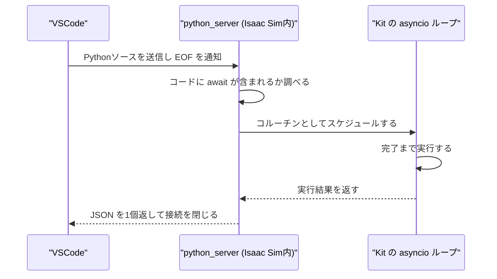
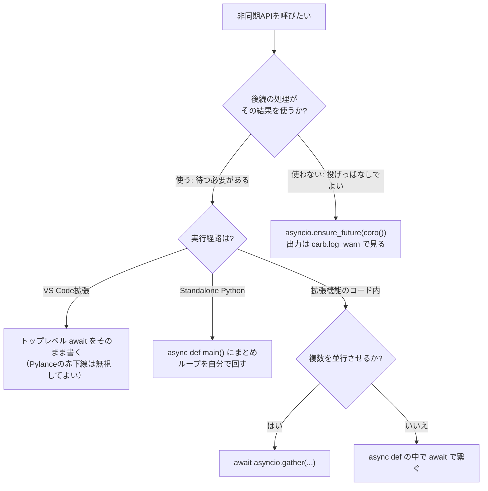

# 非同期実行とトップレベルawait

対象バージョン: Isaac Sim 6.0.1（Windowsネイティブ）

## このノートブック全体の流れ

このノートブックは3ページで、Isaac Sim上で「いつ何が起きるか」を制御するための知識を扱う。全体は次の一本の流れになっている。

1．**（このページ）Pythonのコードをどう起動し、どこで待つか**
2．**Isaac Simの中で何が周期的に進んでいるか**
3．**その2つを使って、物理シミュレーションを止めたまま連番画像を撮る**

このページは1番目にあたる。ここで扱うのは「非同期のコードを書いたとき、それがいつ実行され、いつ結果が返るか」であり、次のページで扱う「何を待つべきか」の前提になる。

---

## 1. 課題: 「呼ぶためにawaitが必要」に見える問題

### 1-1. まず用語を定義する

これ以降で使う言葉を先に定義する。

| 用語 | 定義 |
|---|---|
| コルーチン | `async def` で定義した関数を呼び出したときに得られるオブジェクト。関数の中身はまだ1行も実行されていない、「実行の予定」を表す値 |
| イベントループ | コルーチンを預かり、少しずつ実行を進める仕組み。1つのスレッド上で複数のコルーチンを交代で進める |
| Kit | Isaac Simの土台になっているアプリケーション基盤。Isaac SimはKitの上に構築されたアプリケーションであり、Pythonの実行環境もKitが用意している |
| Script Editor | Isaac SimのGUIウィンドウの1つ。Pythonコードを貼り付けて実行できる |
| stdout | 標準出力。Pythonの `print()` が書き込む先 |
| Carbonite | Kitの下層にあるC++基盤。ログ出力の仕組みもここに含まれる。Pythonからは `carb` モジュールで触る |

### 1-2. C#との対比

C#では、`async` メソッドを呼ぶ方法が2つある。

```csharp
// 方法1: 呼び出し側も async にして await する
async Task CallerAsync()
{
    await DoWorkAsync();          // 完了を待つ
}

// 方法2: 待たずに投げっぱなしにする（fire and forget）
void Caller()
{
    _ = DoWorkAsync();            // Task が返るが、待たない
}
```

Pythonでもこの2つの区別は同じように存在する。ただしPythonには、C#にはない**構文上の制約**がある。

### 1-3. Pythonの構文制約

Pythonの `await` は、`async def` で定義された関数の内側にしか書けない。ファイルの一番外側（トップレベル）に書くと構文エラーになる。

```python
# ファイルのトップレベル
import asyncio
await asyncio.sleep(0.1)     # SyntaxError: 'await' outside function
```

VSCodeで書いているときに `await` に赤い下線が引かれるのは、Pylance（VSCodeのPython静的解析ツール）がこの規則に従って判定しているためである。

ここで多くの人が次のように考えて手が止まる。

> `await` を使うには `async def` で包まないといけない。
> でもその `async def` で包んだ関数を呼ぶには、また `await` が必要ではないか。
> 一番外側はどうやって呼び出せばいいのか。

**この考えの誤りは、後半にある。** `async def` で包んだ関数を呼ぶ方法は `await` だけではない。C#の `_ = DoWorkAsync();` に相当する「待たずに投げる」方法が、Pythonにも用意されている。

---

## 2. 解決策: イベントループを外部が持ち、そこにコルーチンを載せる

素のPythonスクリプトでは、イベントループが最初は存在しない。だから `asyncio.run(main())` のような呼び出しで「ループを作って、コルーチンを1つ載せて、終わるまで回して、ループを閉じる」という一連の処理を行う。

Kitはこれとは違う方針を採っている。**Kitはアプリケーション起動の瞬間からイベントループを1つ作り、アプリケーションが終了するまで回し続ける。** GUIの再描画も、ファイルの読み込みも、すべてこのループの上で動いている。

この方針の帰結が2つある。

- ユーザーがループを作る必要がない。既にあるループにコルーチンを載せるだけでよい
- ユーザーがループを作ってはいけない。既にループが回っているスレッドで新しいループを作ろうとすると失敗する

コルーチンを既存のループに載せる関数が `asyncio.ensure_future()` である。これは同期的な関数から呼べる。C#の `_ = DoWorkAsync();` に相当する。

---

## 3. 仕組み

### 3-1. 3つの実行経路

Isaac SimでPythonコードを実行する経路は3つあり、`await` の扱いがそれぞれ違う。

| 経路 | 何をするものか | トップレベル `await` |
|---|---|---|
| Script Editor | Isaac SimのGUI内のウィンドウにコードを貼って実行する | 【未確認】 |
| VS Code拡張 | VSCodeで書いたコードをTCP経由で実行中のIsaac Simに送って実行する | **使える** |
| Standalone Python | `python.bat` からスクリプトを起動し、その中でIsaac Simを立ち上げる | 使えない（通常のPython規則どおり） |

Script Editorの欄が【未確認】なのは、公式ドキュメントに記載を見つけられなかったためである。確認方法は4-1のサンプルコードをそのまま貼って実行すればよい。

### 3-2. VS Code拡張の実行経路

VS Code拡張は2つの拡張の組み合わせで動いている。

- `isaacsim.code_editor.vscode`（Isaac Sim側）: VSCodeとの連携メニューを提供する
- `isaacsim.code_editor.python_server`（Isaac Sim側）: 実際にコードを受け取って実行するTCPサーバ。既定で `127.0.0.1:8226` を待ち受ける

コードを実行したときの流れは次のとおり。



サーバが返すJSONは次のフィールドを持つ。

| フィールド | 内容 |
|---|---|
| `status` | 成功なら `"ok"`、失敗なら `"error"` |
| `output` | 実行中に `print()` が書いた文字列 |
| `result` | 式を評価した場合のみ、その値 |
| `traceback` | エラー時のみ、トレースバック文字列のリスト |
| `ename` | エラー時のみ、例外クラス名 |
| `evalue` | エラー時のみ、例外メッセージ |

### 3-3. なぜトップレベルawaitが動くのか

python_serverは、送られてきたコードをそのまま `exec()` に渡しているわけではない。**コードの中に `await` が含まれる場合、それを非同期のコルーチンとしてコンパイルし直し、Kitのイベントループにスケジュールし、完了を待ってからJSONを返す。**

つまり、あなたが書いた

```python
import asyncio
await asyncio.sleep(0.1)
print("done")
```

というコードは、サーバ側で概念的に次のように包み直されてから実行されている。

```python
async def __wrapped():
    import asyncio
    await asyncio.sleep(0.1)
    print("done")
# これを Kit のループにスケジュールし、完了を待つ
```

したがって、トップレベル `await` は「動く」。あなたが手で `async def` を書かなくても、サーバが代わりに書いている。

### 3-4. なぜPylanceが赤下線を引くのか

Pylanceはコードを実行せず、テキストとして読んで判定する。Pylanceから見えているのは「モジュールのトップレベルに `await` がある」という事実だけであり、そのコードが後でTCPで送られて別のプロセスでコルーチンに包み直される、という事情は知りようがない。

したがって赤下線は**静的解析の限界によるものであり、実行時エラーの予告ではない**。

赤下線を消す方法は2つある。

| 方法 | やり方 | 副作用 |
|---|---|---|
| `async def` で包む | 自分で `async def main():` を書き、末尾に `asyncio.ensure_future(main())` を置く | 待てなくなる（3-5で述べるとおり `print` も消える）。待ちたい場合は不向き |
| Pylanceの診断を抑える | ワークスペース設定で当該ファイルの診断レベルを下げる | 【未確認】トップレベル `await` は構文エラー扱いのため、個別抑制が効くかは確認していない |

**実務上の推奨は「赤下線を消さない」である。** 実行に支障がなく、包み直すと後述の副作用が出るため、下線が出たままトップレベル `await` を使うのが最も素直になる。

### 3-5. printが消える仕組み

3-2で述べたとおり、python_serverは実行中の stdout を捕捉してJSONの `output` に詰め、実行が終わったらJSONを返して接続を閉じる。

`await` した場合とそうでない場合で、捕捉の成否が分かれる。

| 書き方 | サーバから見た「実行の終わり」 | printの行き先 |
|---|---|---|
| トップレベル `await` | コルーチンが完了した時点 | 捕捉される。JSONの `output` に入り、VSCodeのパネルに表示される |
| `asyncio.ensure_future()` | スケジュールした直後（コルーチンはまだ動いていない） | 捕捉されない。コルーチンが実際に動くのはJSONを返した後なので、捕捉する相手がいない |

これが「awaitの中で使っているprintがConsoleに出なかった」現象の正体である。printが出ていないのではなく、**printは実行されているが、その出力を受け取る仕組みが既に閉じている**。

なお公式ドキュメントは、awaitされたコルーチン内のprintは同期コードと同じように捕捉されると明記している。裏を返せば、awaitされていないコルーチンは対象外である。

### 3-6. Carboniteログという別経路

stdoutとは別に、Carboniteのログという経路がある。Pythonからは次の4関数で書き込む。

| 関数 | ログレベル |
|---|---|
| `carb.log_info(msg)` | Info |
| `carb.log_warn(msg)` | Warning |
| `carb.log_error(msg)` | Error |
| `carb.log_fatal(msg)` | Fatal |

これらの出力先はIsaac Sim本体のConsoleウィンドウであり、stdout捕捉の開始・終了とは無関係に届く。したがって `ensure_future` で投げたコルーチンの中からでも確実に出る。

VSCode側のパネルにもCarboniteログを出したい場合は、python_serverの `carb_logs` 設定を有効にする必要がある。有効にすると同じホスト・ポートでUDPソケットが開き、登録したクライアントにログがブロードキャストされる。

| 設定名 | 既定値 | 内容 |
|---|---|---|
| `/exts/isaacsim.code_editor.python_server/host` | `"127.0.0.1"` | 待ち受けIPアドレス |
| `/exts/isaacsim.code_editor.python_server/port` | `8226` | TCPポート番号 |
| `/exts/isaacsim.code_editor.python_server/carb_logs` | `false` | CarboniteログのUDP配信を有効にする |

`carb_logs` は既定で無効であり、公式ドキュメントには特定の状況下でアプリケーションがフリーズする可能性があるという警告が付いている。有効化はこのリスクを承知の上で行う。

`carb.log_info` ではなく `carb.log_warn` を推奨する理由は、ConsoleウィンドウのフィルタでInfoレベルが非表示になっていることが多く、Warningなら既定設定でも見えるためである。

---

## 4. 実装

### 4-1. 検証用サンプル1: トップレベルawaitが動くことの確認

VSCodeで新規ファイルを作り、以下を貼り付けて、Isaac Sim VS Code Editionの Run で実行する。

```python
import asyncio
import time

import omni.kit.app

print("A: 開始")                                    # ★ await より前
start = time.time()

await asyncio.sleep(0.5)                            # ★ ここが赤下線になるが動く
print(f"B: asyncio.sleep のあと ({time.time() - start:.2f} 秒経過)")

for i in range(3):
    await omni.kit.app.get_app().next_update_async()  # ★ アプリのフレームを3回進める
print("C: アプリのフレームを3回進めたあと")

print("D: 終了")
```

**期待される出力**（Isaac Sim VS Code Edition の出力パネル）:

```
A: 開始
B: asyncio.sleep のあと (0.50 秒経過)
C: アプリのフレームを3回進めたあと
D: 終了
```

4行すべてが出れば、この経路でトップレベル `await` が使えていることの確認になる。もし `SyntaxError` が返るなら、その経路はトップレベル `await` に対応していない。

### 4-2. 検証用サンプル2: ensure_future ではprintが消えることの確認

同じ処理を2通りで実行し、出力の差を見る。

```python
import asyncio


async def work(tag: str) -> None:
    await asyncio.sleep(0.2)
    print(f"[{tag}] コルーチンの中の print")


print("--- 1回目: await する ---")
await work("await")                    # ★ 完了を待つ

print("--- 2回目: ensure_future で投げる ---")
asyncio.ensure_future(work("投げっぱなし"))   # ★ 待たない

print("--- スクリプト終了 ---")
```

**期待される出力**:

```
--- 1回目: await する ---
[await] コルーチンの中の print
--- 2回目: ensure_future で投げる ---
--- スクリプト終了 ---
```

`[投げっぱなし] コルーチンの中の print` は出ない。この行は0.2秒後に実行されるが、そのときには既にJSONが返って接続が閉じている。

**同じコードでCarboniteログを使うと消えない**ことを確認するには、`print` を `carb.log_warn` に変えて、Isaac Sim本体のConsoleウィンドウを見る。

```python
import asyncio

import carb


async def work(tag: str) -> None:
    await asyncio.sleep(0.2)
    carb.log_warn(f"[{tag}] コルーチンの中のログ")   # ★ print から変更


asyncio.ensure_future(work("投げっぱなし"))
carb.log_warn("スクリプト終了")
```

**Isaac Sim本体のConsoleウィンドウに現れる出力**:

```
[Warning] [__main__] スクリプト終了
[Warning] [__main__] [投げっぱなし] コルーチンの中のログ
```

順序が逆転していることに注意する。`ensure_future` は待たないので、後に書いた行が先に出る。この順序こそが「待っていない」ことの証拠である。

### 4-3. 待ちたい場合のくるみ方（4パターン）

#### パターン1: トップレベル await

```python
import asyncio


async def step(n: int) -> int:
    await asyncio.sleep(0.1)
    print(f"step {n} 完了")
    return n * 10


a = await step(1)          # ★ 戻り値を受け取れる
b = await step(2)
print(f"合計 = {a + b}")
```

**出力**:

```
step 1 完了
step 2 完了
合計 = 30
```

VS Code拡張から実行する場合はこれが最も簡潔である。

#### パターン2: async def + await（外側は ensure_future）

```python
import asyncio


async def step(n: int) -> int:
    await asyncio.sleep(0.1)
    carb_print = f"step {n} 完了"
    print(carb_print)
    return n * 10


async def main() -> None:                # ★ 全体を1つの async def にまとめる
    a = await step(1)
    b = await step(2)
    print(f"合計 = {a + b}")


asyncio.ensure_future(main())            # ★ 起動だけする。ここでは待てない
```

**VS Code拡張から実行したときの出力**:

```
（何も出ない）
```

`main()` の中のprintは、JSONが返った後に実行されるため捕捉されない。Script Editorで実行した場合はScript Editorの出力欄に遅れて表示される。この書き方はPylanceの赤下線が出ない代わりに、出力が見えなくなるという交換になっている。

#### パターン3: add_done_callback（完了後に別の処理を走らせる）

```python
import asyncio

import carb


async def step(n: int) -> int:
    await asyncio.sleep(0.1)
    return n * 10


def on_done(task: asyncio.Task) -> None:      # ★ 完了時に呼ばれる同期関数
    carb.log_warn(f"完了しました。戻り値 = {task.result()}")


task = asyncio.ensure_future(step(3))
task.add_done_callback(on_done)
carb.log_warn("コールバックを登録しました")
```

**Consoleウィンドウの出力**:

```
[Warning] [__main__] コールバックを登録しました
[Warning] [__main__] 完了しました。戻り値 = 30
```

`task.result()` は完了後にしか呼べない。完了前に呼ぶと `InvalidStateError` になる。

#### パターン4: asyncio.gather（複数を並行させて全部待つ）

```python
import asyncio
import time


async def step(n: int) -> int:
    await asyncio.sleep(0.5)
    return n * 10


start = time.time()
results = await asyncio.gather(step(1), step(2), step(3))   # ★ 3つ同時に走る
print(f"結果 = {results}, 経過 = {time.time() - start:.2f} 秒")
```

**出力**:

```
結果 = [10, 20, 30], 経過 = 0.50 秒
```

逐次に `await` を3回書くと1.5秒かかるところが、0.5秒で済んでいる。ただしIsaac Simの多くのAPIはUSDステージを触るためメインスレッドでの逐次実行が前提であり、並行させてよいのは互いに独立した待ち（ファイルI/Oやスリープ）に限られる。

### 4-4. 待たなくていい場合のくるみ方

処理の完了を後続コードが前提にしない場合は、投げっぱなしでよい。典型はGUIのボタンハンドラである。

```python
import asyncio

import carb


async def long_task() -> None:
    for i in range(3):
        await asyncio.sleep(1.0)
        carb.log_warn(f"進捗 {i + 1}/3")


def on_button_clicked() -> None:          # ★ 同期関数。GUIから呼ばれる
    asyncio.ensure_future(long_task())    # ★ 投げてすぐ抜ける。GUIが固まらない
    carb.log_warn("処理を開始しました")
```

`on_button_clicked()` を呼んだときのConsole出力:

```
[Warning] [__main__] 処理を開始しました
[Warning] [__main__] 進捗 1/3
[Warning] [__main__] 進捗 2/3
[Warning] [__main__] 進捗 3/3
```

もう1つの起動関数として `omni.kit.async_engine.run_coroutine()` がある。

```python
import omni.kit.async_engine

omni.kit.async_engine.run_coroutine(long_task())
```

### 4-5. 正式・非正式の区分

「正式」を「Isaac Sim 6.0の公式ドキュメントに記載があり、その用法が例示されているもの」と定義する。

| API・書き方 | 区分 | 根拠と補足 |
|---|---|---|
| トップレベル `await`（VS Code拡張経由） | 正式 | Python Serverのドキュメントに Async Code Support の節があり、対応が明記されている |
| `asyncio.ensure_future(coro())` | 正式 | Kitの公式Usage Examplesが実際にこの形で記述している |
| `task.add_done_callback(fn)` | 正式 | Python標準ライブラリの機能であり、Kit固有の制約を受けない |
| `asyncio.gather(...)` | 正式 | 同上 |
| `omni.kit.async_engine.run_coroutine(coro())` | 準正式 | Kit内部実装で `asyncio.ensure_future` からの置き換えが進んでいるが、ユーザー向けドキュメントでの用法例は確認していない。Isaac Sim 6.0.1への同梱も【未確認】 |
| `asyncio.run(coro())` | 誤用 | Kit内で呼ぶと既存のイベントループと衝突する。公式ドキュメント内にこの記述を含む例が存在するが、Kit内実行の文脈では従ってはいけない |
| `while not task.done(): pass` | 誤用 | 5章で述べるとおりデッドロックする |

`omni.kit.async_engine` が使えるかは1行で確認できる。

```python
import omni.kit.async_engine
print(omni.kit.async_engine.run_coroutine)
```

**使える場合の出力**:

```
<function run_coroutine at 0x00000239A1B2C3D0>
```

**使えない場合の出力**:

```
ModuleNotFoundError: No module named 'omni.kit.async_engine'
```

---

## 5. やってはいけないこと

### 5-1. 同期的なブロッキング待ち

```python
import asyncio

task = asyncio.ensure_future(some_coroutine())
while not task.done():        # ★ これをやってはいけない
    pass
```

**何が起きるか**: Isaac Simが完全にフリーズし、強制終了以外に復帰できなくなる。

**なぜか**: Kitのイベントループはメインスレッド上で回っている。`while` ループがメインスレッドを占有すると、イベントループは1回も進めない。イベントループが進まないので `task` は永久に完了しない。完了しないので `while` も終わらない。相互に待ち合う状態、すなわちデッドロックである。

### 5-2. time.sleep()

```python
import time
time.sleep(1.0)               # ★ これをやってはいけない
```

**何が起きるか**: 1秒間、Isaac Simの画面が完全に止まる。

**なぜか**: 5-1と同じ理由で、メインスレッドがブロックされる。正しくは `await asyncio.sleep(1.0)` を使う。こちらは待っている間に制御をイベントループへ返すため、他の処理が進む。

### 5-3. asyncio.run()

```python
import asyncio
asyncio.run(main())           # ★ Kit内では使ってはいけない
```

**何が起きるか**: 次のエラーが出る。

```
RuntimeError: asyncio.run() cannot be called from a running event loop
```

**なぜか**: `asyncio.run()` は新しいイベントループを作ろうとするが、Kitのループが既にそのスレッドで回っているため作れない。

なお `asyncio.run()` が正しく使えるのは、Isaac Simの外側から接続するクライアント側スクリプト（Isaac Simのプロセスではない別のPythonプロセス）である。公式ドキュメントのPython Serverクライアント例で `asyncio.run()` が使われているのは、その例が外部プロセスから接続するコードだからである。

---

## 6. 判断フローチャート



---

## 7. 理解度確認問題

**問1.** 次のコードをVS Code拡張から実行したとき、出力パネルには何が表示されるか。

```python
import asyncio


async def f():
    await asyncio.sleep(0.1)
    print("X")


asyncio.ensure_future(f())
print("Y")
```

<details>
<summary>解答</summary>

`Y` のみが表示される。

`ensure_future` はコルーチンをスケジュールするだけで即座に戻る。サーバはこの時点で実行終了と判断し、stdout捕捉を閉じてJSONを返す。`f()` の中の `print("X")` は0.1秒後に実行されるが、そのときには捕捉する相手がいない。

`X` も見たい場合は、`asyncio.ensure_future(f())` を `await f()` に変えるか、`print("X")` を `carb.log_warn("X")` に変えてIsaac Sim本体のConsoleウィンドウを見る。
</details>

**問2.** VSCodeでトップレベルに `await` を書くと赤い下線が出る。この下線が出たままコードを実行した場合、実行は成功するか失敗するか。理由も述べよ。

<details>
<summary>解答</summary>

VS Code拡張（`isaacsim.code_editor.python_server`）経由なら**成功する**。

赤下線はPylanceによる静的解析の結果であり、「モジュールのトップレベルに `await` がある」という文法規則の判定に基づく。しかしpython_serverは、送られてきたコードに `await` が含まれる場合、それをコルーチンとしてコンパイルし直してからKitのイベントループで実行する。Pylanceはこの実行時の包み直しを知らないため、実際には問題ないコードに警告を出している。

ただしStandalone Python（`python.bat` から起動するスクリプト）では、この包み直しが行われないため実行は失敗する。
</details>

**問3.** 次のコードを実行するとIsaac Simがフリーズする。フリーズを解消するには何をどう書き換えればよいか。

```python
import asyncio
import time

task = asyncio.ensure_future(some_work())
while not task.done():
    time.sleep(0.01)
print("完了")
```

<details>
<summary>解答</summary>

`while` ループ全体を削除し、`await` に置き換える。

```python
await some_work()
print("完了")
```

理由は2つある。1つ目は、Kitのイベントループがメインスレッドで回っているため、`while` と `time.sleep()` がメインスレッドを占有するとイベントループが1回も進まないこと。2つ目は、イベントループが進まなければ `task` は永久に完了せず、`while` の終了条件が満たされないこと。この2つが噛み合ってデッドロックになる。

`await` を使えば、待っている間に制御がイベントループへ戻るため、コルーチンが進行できる。
</details>

**問4.** `carb.log_info()` ではなく `carb.log_warn()` を使うことが推奨される理由を述べよ。

<details>
<summary>解答</summary>

Isaac SimのConsoleウィンドウは、既定の表示フィルタでInfoレベルのログを非表示にしていることが多いため。Warningレベルなら既定設定でも表示される。

デバッグ目的で一時的に出力する場合、フィルタ設定を疑う手間を省ける分だけWarningのほうが確実である。
</details>

---

## 8. 参照元URL一覧

- Python Server (Remote Code Execution) — Isaac Sim Documentation
  `https://docs.isaacsim.omniverse.nvidia.com/latest/development_tools/python_server.html`
  （トップレベルawaitの対応、JSONレスポンスのフィールド、stdout捕捉の仕様、`carb_logs` を含む設定一覧の根拠）
- Visual Studio Code (VS Code) — Isaac Sim Documentation
  `https://docs.isaacsim.omniverse.nvidia.com/6.0.0/development_tools/vscode.html`
  （`isaacsim.code_editor.vscode` と `isaacsim.code_editor.python_server` の関係の根拠）

## 9. 未確認事項

- Script Editor（GUI内のスクリプトエディタ）がトップレベル `await` に対応するか。4-1のサンプルコードで確認できる
- `omni.kit.async_engine` がIsaac Sim 6.0.1に同梱されているか。4-5の1行スクリプトで確認できる
- Pylanceでトップレベル `await` の診断のみを選択的に抑制する設定が存在するか

---

## 目次

1. **非同期実行とトップレベルawait**（このページ）
2. [[02_周期進行の仕組み]]
3. [[03_PlayOFFでの連番キャプチャ]]

前のページ: なし（このノートブックの最初のページ）
次のページ: [[02_周期進行の仕組み]]
