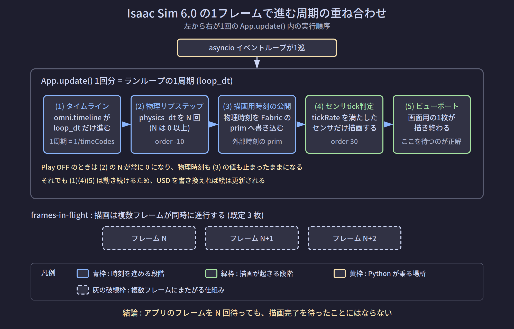
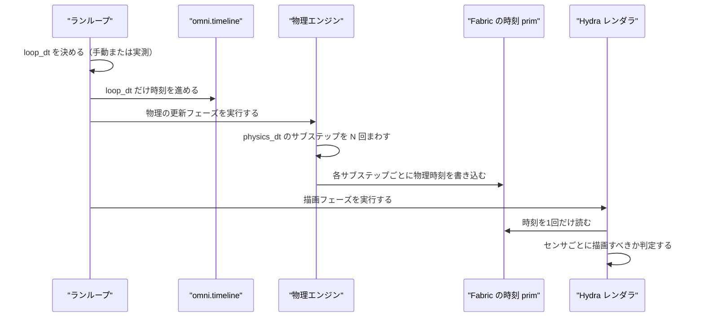

# 周期進行の仕組み

対象バージョン: Isaac Sim 6.0.1（Windowsネイティブ）

前のページで「非同期のコードをどう起動し、どこで待つか」を扱った。このページでは「そもそも何を待てるのか」、すなわちIsaac Simの中で周期的に進行しているものを全て列挙して説明する。

---

## 1. 課題: 「1フレーム」と言ったとき、何が1つ進むのか

### 1-1. 具体的な失敗例

USDの属性を書き換えてから画面を撮影したい、という場面を考える。書き換えた直後に撮ると変更前の絵が写ってしまうため、少し待つ必要がある。そこで次のようなコードがよく書かれる。

```python
apply_pose(pose)                                       # USD属性を書き換える
for _ in range(3):                                     # ★ 3回待つ
    await omni.kit.app.get_app().next_update_async()
capture(file_path)                                     # 撮影する
```

この `3` に根拠はない。2でも5でも書ける場所であり、実際に多くのサンプルコードでこの種の数字が場当たり的に選ばれている。

問題は数字そのものではなく、**`next_update_async()` が待っているものと、撮影が必要としているものが別物である**ことにある。

- `next_update_async()` が待つのは「アプリケーションが1回まわること」
- 撮影が必要とするのは「画面が1枚描き終わること」

この2つが常に一致する保証はない。したがって3回待って動いたとしても、それは偶然その環境で足りていただけであり、シーンが重くなったりレンダラの設定が変わったりすれば足りなくなる。

### 1-2. なぜ一致しないのか

Isaac Simの内部では、**互いに独立した速度で進む周期が9個ある**。「1フレーム」という言葉は、そのうちどれを指すかによって意味が変わる。

このページの目的は、9個すべてを列挙し、それぞれ何が1周期なのか、どうやって待つのかを明確にすることである。

---

## 2. 解決策: 関心ごとに独立したクロックを持たせる設計

なぜ1つにまとめないのか。理由は用途ごとに適切な周期が違うためである。

- 物理シミュレーションは、精度のために細かい刻み（例: 1/120秒）で進めたい
- 画面の描画は、人間の目に足りる粗さ（例: 1/60秒）でよい
- カメラセンサは、実機の仕様に合わせた速度（例: 30Hz）で撮りたい
- 別のカメラセンサは、また別の速度（例: 10Hz）で撮りたい

これらを1つの周期に強制すると、最も細かい要求に全体を合わせることになり、無駄な計算が大量に発生する。そこでIsaac Simは、それぞれを独立したクロックとして持ち、必要な箇所でだけ同期させる設計を採っている。

Isaac Sim 6.0の公式ドキュメントは、このうち中核となる3つを「三つのクロック」として明示的に定義している。残りの6つは、その3つを取り巻く仕組みである。

---

## 3. 仕組み

### 3-1. 全体像



図が示しているのは、1回の `App.update()` の中で5つの段階が順に進むこと、それ全体を包む形でasyncioイベントループが1巡すること、そして描画だけは複数フレームが同時進行することである。以降でこれらを1つずつ定義する。

### 3-2. 三つのクロック

Isaac Sim 6.0の公式ドキュメントが定義する3つのクロックは次のとおりである。

| クロック | 何によって進むか | 誰が設定するか | 誰が読むか |
|---|---|---|---|
| ランループ時刻 / `omni.timeline` 時刻 | アプリの更新1回ごとに、実測の経過時間ぶん、または手動設定した固定の時間ぶん進む | `RenderingManager.set_dt(...)`、`/app/runLoops/main/rateLimitFrequency` | タイムラインUI、`timeCodesPerSecond`、ステージ更新のスケジューリング |
| 物理シミュレーション時刻 | 物理ステップのたびに「累積ステップ数 ÷ 毎秒ステップ数」として再計算される | `PhysicsScene.set_dt(...)`、`SimulationManager.setup_simulation(dt=...)` | `SimulationManager.get_simulation_time()`、ROS 2などのタイムスタンプ |
| レンダラのシミュレーション時刻 | 物理ステップのたびに、物理時刻の写しがFabric上のprimへ書き込まれる | `isaacsim.core.simulation_manager` | センサごとの描画判定を行うスケジューラ |

「Fabric」はUSDのデータをレンダリング向けに高速に受け渡すためのメモリ上のデータ層である。ここでは「USDファイルとは別に存在する、実行時専用の高速なデータ置き場」と理解すればよい。

**重要な事実**: レンダラはもはや `omni.timeline` から現在時刻を取得していない。`/ExternalSimulationTime` というprimの `omni:time` 属性をFabricから読んでいる。物理が毎回のステップでその属性を書き、レンダラがそれを読む、という受け渡しになっている。

### 3-3. 1フレーム内の実行順序

タイムラインが再生中のとき、1回の `App.update()` で起きることは次の4段階である。



ここで `N` は0以上の整数であり、ループの経過時間に追いつくために必要な回数だけ物理が刻まれる。

### 3-4. physics_dt と loop_dt の比による挙動

物理の刻み幅を `physics_dt`、ループの刻み幅を `loop_dt` と書く。両者の大小関係で挙動が3通りに分かれる。

| 設定 | 1回の更新あたりの物理ステップ数 | タイムライン時刻と物理時刻の関係 | センサの描画 |
|---|---|---|---|
| `physics_dt == loop_dt` | 1回 | 毎フレーム一致する | 予定どおり |
| `physics_dt < loop_dt` | 1回以上 | 毎フレーム一致する | 予定どおり |
| `physics_dt > loop_dt` | 0回または1回 | 物理側が最大 `physics_dt` ぶん遅れ、物理が進んだときに再同期する | 時刻が進んだフレームでのみ描画される |

3つ目のケースで注意すべきなのは、**物理ステップが起きなかったフレームでは、描画パイプラインは動くのにセンサは1枚も出力しない**ことである。時刻が進んでいないため、センサ側の描画判定が「まだ次の番ではない」と判断する。

公式ドキュメントは、この不整合を避ける方法として、`SimulationManager.setup_simulation(dt=1.0/hz)` と `RenderingManager.set_dt(1.0/hz)` の両方を同じ値で呼び、`physics_dt == loop_dt` にすることを推奨している。

### 3-5. useFixedTimeStepping と useFastMode による分岐

3-4の表は `/app/player/useFixedTimeStepping` が `false` のときの挙動である。これはStandalone Pythonでの既定値である。

Isaac SimのGUIアプリケーションはこの設定を `true` にしている。`true` のとき、タイムラインはランループの実測時間を無視し、1回の更新につき `1 / timeCodesPerSecond` だけ強制的に進む。この場合のシミュレーション時間の進み方は次の式になる。

記号の意味を先に定義する。

- `sim_advance_per_wall_sec`: 現実の1秒あたりに進むシミュレーション時間（秒）
- `timeCodesPerSecond`: ステージに設定された、1秒あたりのタイムコード数
- `loop_hz_wall`: 現実の1秒あたりにランループが回る回数

```
sim_advance_per_wall_sec = (1 / timeCodesPerSecond) * loop_hz_wall
```

この式から3つの結果が導ける。

| 条件 | 結果 |
|---|---|
| `loop_hz_wall == timeCodesPerSecond`（既定は両方60） | 式の値が1.0となり、シミュレーションが現実時間どおりに進む |
| `loop_hz_wall < timeCodesPerSecond` | 式の値が1未満となり、スローモーションになる |
| `loop_hz_wall > timeCodesPerSecond` | `/app/player/useFastMode` の値で分岐する（下記） |

3つ目の分岐は次のとおりである。

- `useFastMode = false`（既定）: タイムラインは間引いて進む。ランループが速く回ってもシミュレーション時間は設定どおりの速度を保つ
- `useFastMode = true`: 間引きが無効になり、ランループが回るたびにタイムラインが進む。結果としてシミュレーション時間が現実時間より速く進む

2つ目は、オフラインでのデータ生成のように「現実の1秒あたりにできるだけ多くのシミュレーション時間を消化したい」場合に意図的に使うものである。`timeline.set_play_every_frame(True)` を呼ぶとこの状態になる。

**よくある罠**: `/app/runLoops/main/rateLimitFrequency` だけを変更して `timeCodesPerSecond` を変更しないと、上の式によりシミュレーション速度が現実時間から乖離する。片方だけ設定してはいけない。

### 3-6. 9つの周期の個別説明

ここまでに出てきたものを含め、9つを順に定義する。

#### 周期1: ランループ（run loop）

- **1周期にあたるもの**: `App.update()` の1回の呼び出し
- **何をするか**: タイムライン更新・物理・描画を含む、アプリケーション全体の1回ぶんの処理
- **トリガ**: アプリケーションが自律的に回す
- **設定**: `/app/runLoops/main/rateLimitFrequency`（1秒あたりの回数）、`RenderingManager.set_dt(dt)`
- **待ち方**: `await omni.kit.app.get_app().next_update_async()`
- **観測方法**: 後述の4-1のコードでフレーム番号を出力する

#### 周期2: asyncioイベントループ

- **1周期にあたるもの**: 待機中のコルーチンを一巡ぶん進めること
- **何をするか**: Pythonで書かれた非同期処理を進める
- **トリガ**: ランループに同期して進む。ランループが止まればこちらも止まる
- **待ち方**: `await` で待つのがこのループそのものである
- **注意**: メインスレッドを同期的にブロックするとこのループが止まり、アプリケーション全体が固まる

#### 周期3: タイムライン（omni.timeline）

- **1周期にあたるもの**: `1 / timeCodesPerSecond` 秒
- **何をするか**: シーン内の「現在時刻」を保持する。USDのアニメーションの再生位置を決める
- **トリガ**: ランループが1回まわるごとに進む。ただし停止中（Play OFF）は進まない
- **設定**: ステージの `timeCodesPerSecond`、`/app/player/useFixedTimeStepping`、`/app/player/useFastMode`
- **観測方法**: `omni.timeline.get_timeline_interface().get_current_time()`

#### 周期4: 物理シミュレーション時刻

- **1周期にあたるもの**: `physics_dt` 秒（サブステップ1回）
- **何をするか**: 剛体の運動、関節の拘束、衝突の解決を1ステップぶん進める
- **トリガ**: ランループの物理更新フェーズ。ステージ更新順序で `-10` の位置に置かれている
- **設定**: `SimulationManager.setup_simulation(dt=...)`、`PhysicsScene.set_dt(...)`。既定は1/60秒
- **待ち方・フック**: `SimulationManager` にコールバックを登録する（4-3参照）
- **Play OFFのとき**: 1回も起きない。したがって物理時刻は止まったままになる

#### 周期5: レンダラのシミュレーション時刻

- **1周期にあたるもの**: 物理時刻が更新されるたびに1回
- **何をするか**: 物理時刻の写しを、Fabric上の `/ExternalSimulationTime` primの `omni:time` 属性に書き込む
- **トリガ**: 物理の各ステップの完了時
- **誰が読むか**: センサごとの描画判定スケジューラ
- **止め方**: `/app/player/playSimulations` を `false` にすると、`App.update()` が物理を進めなくなるため、この時刻が凍結する。`RenderingManager.render()` はこの設定を一時的に切り替えることで「物理を進めずに描画する」を実現している

#### 周期6: ステージアップデート順序（stage update order）

- **1周期にあたるもの**: 周期ではなく、1フレーム内での実行順を決める整数の並び
- **何をするか**: 1回の `App.update()` の中で、どの処理を先に走らせるかを決める
- **具体的な値**: 物理は `-10`、Hydraによる描画は `30`。数値が小さいほど先に実行される
- **なぜ重要か**: 物理が `-10` で書いた時刻を、描画が `30` で読む。この順序が保証されているからこそ、同じフレーム内で最新の時刻が使える
- **注意**: これは9個の中で唯一「時間の周期」ではなく「順序の定義」である。他の8個と並べているのは、1フレーム内の出来事の前後関係を理解するのに不可欠なため

#### 周期7: センサごとのティック（multi-tick rendering）

- **1周期にあたるもの**: `1 / omni:sensor:tickRate` 秒
- **何をするか**: そのセンサを描画するかどうかを判定し、時期が来ていれば描画する
- **トリガ**: 描画フェーズ（順序30）で、レンダラのシミュレーション時刻と前回描画時刻を比較する
- **設定**: センサprimの `omni:sensor:tickRate` 属性（単位はHz）。既定値は `0` で、これは「毎フレーム描画する」を意味する
- **有効・無効**: Isaac Sim 6.0以降、この仕組みは既定で有効。`/rtx/hydra/supportMultiTickRate` を `false` にすると5.x以前の毎フレーム描画に戻る
- **適用対象**: `Camera` primと `OmniLidar` prim。`OmniRadar` primでは6.0 GA時点で `tickRate` が無視され、常に毎フレーム描画される

#### 周期8: ビューポートフレーム

- **1周期にあたるもの**: ビューポート（画面に表示されている3Dビュー）が1枚描き終わること
- **何をするか**: 現在のカメラから見た画像を生成する
- **トリガ**: 描画フェーズ
- **待ち方**: `await next_viewport_frame_async(viewport)`
- **なぜ重要か**: 1-1で述べた「撮影の前に待つべきもの」がこれである。`next_update_async()` とは別物であり、こちらを待たなければ描画完了の保証にならない

#### 周期9: frames-in-flight（FIF）

- **1周期にあたるもの**: 描画パイプラインの1スロット
- **何をするか**: 複数フレームの描画を同時並行で処理する。既定のスロット数は3
- **なぜ存在するか**: GPUを遊ばせないため。フレームNの結果を待たずにフレームN+1の処理を始める
- **観測されうる影響**: 描画を開始してから結果が使えるまでに、複数フレームぶんの遅延がある。公式ドキュメントには、RTX RadarとRTX Lidarを併用したシーンで、この仕組みに起因する競合状態がシミュレーション開始直後の1〜2秒間に発生しうるという既知の問題が記載されている
- **待ち方**: 直接待つAPIはない。周期8を待つことで間接的に解消する

---

## 4. 実装

### 4-1. ランループを待つ

```python
import omni.kit.app

app = omni.kit.app.get_app()

for i in range(5):
    before = app.get_update_number()                # ★ 現在のフレーム番号
    await app.next_update_async()                   # ★ 1回まわるのを待つ
    after = app.get_update_number()
    print(f"{i}: {before} -> {after} (差分 {after - before})")
```

**期待される出力**:

```
0: 128340 -> 128341 (差分 1)
1: 128341 -> 128342 (差分 1)
2: 128342 -> 128343 (差分 1)
3: 128343 -> 128344 (差分 1)
4: 128344 -> 128345 (差分 1)
```

フレーム番号の絶対値は起動からの経過に依存するため環境ごとに異なる。差分が常に1になることが確認できればよい。

Isaac Sim 6.0では、複数フレームぶんをまとめて進める関数も用意されている。

```python
import isaacsim.core.experimental.utils.app as app_utils

await app_utils.update_app_async(steps=3)           # ★ 3フレームぶん進める
print("3フレーム進めた")
```

**期待される出力**:

```
3フレーム進めた
```

公式ドキュメントは、センサの描画判定を正しく進めるために、単一の描画出力を対象とする古いヘルパーではなくこの関数を使うよう案内している。

### 4-2. ビューポートフレームを待つ

```python
import time

from omni.kit.viewport.utility import get_active_viewport, next_viewport_frame_async

viewport = get_active_viewport()

start = time.time()
await next_viewport_frame_async(viewport)           # ★ 1枚描き終わるのを待つ
print(f"1フレーム描画完了 ({time.time() - start:.3f} 秒)")

start = time.time()
await next_viewport_frame_async(viewport, 3)        # ★ 3枚ぶん待つ
print(f"3フレーム描画完了 ({time.time() - start:.3f} 秒)")
```

**期待される出力**（60Hzで動作している場合）:

```
1フレーム描画完了 (0.017 秒)
3フレーム描画完了 (0.050 秒)
```

経過時間はシーンの重さとレンダラの設定に依存する。重要なのは、3枚待ったときの時間がおよそ3倍になることである。

### 4-3. 物理ステップをフックする

物理ステップごとに処理を差し込むには、`omni.physx` のステップイベントを購読する。

```python
import carb
import omni.physx

counter = {"steps": 0}


def on_physics_step(dt: float) -> None:
    counter["steps"] += 1
    if counter["steps"] <= 5:
        carb.log_warn(f"物理ステップ {counter['steps']} 回目, dt={dt:.6f}")


subscription = omni.physx.get_physx_interface().subscribe_physics_step_events(
    on_physics_step
)
carb.log_warn("購読を開始した。ここでPlayを押す")
```

**Play OFFのままにした場合のConsole出力**:

```
[Warning] [__main__] 購読を開始した。ここでPlayを押す
```

これ以降、何も出ない。**物理ステップが1回も起きていない**ことの直接の確認になる。

**Playを押した後のConsole出力**:

```
[Warning] [__main__] 購読を開始した。ここでPlayを押す
[Warning] [__main__] 物理ステップ 1 回目, dt=0.016667
[Warning] [__main__] 物理ステップ 2 回目, dt=0.016667
[Warning] [__main__] 物理ステップ 3 回目, dt=0.016667
[Warning] [__main__] 物理ステップ 4 回目, dt=0.016667
[Warning] [__main__] 物理ステップ 5 回目, dt=0.016667
```

`dt` が `0.016667` になっているのは、既定の `physics_dt` が1/60秒だからである。

購読を解除するには次のようにする。

```python
subscription = None                                  # ★ 参照を捨てると解除される
carb.log_warn("購読を解除した")
```

**Console出力**:

```
[Warning] [__main__] 購読を解除した
```

### 4-4. シミュレーション速度を一貫して設定する

3-4と3-5で述べた3つの時計を、まとめて同じ速度に揃える手順である。片方だけ設定してはいけない、という罠を避けるための書き方になっている。

```python
import carb
from isaacsim.core.rendering_manager import RenderingManager
from isaacsim.core.simulation_manager import SimulationManager

HZ = 30.0
dt = 1.0 / HZ

SimulationManager.setup_simulation(dt=dt)            # ★ physics_dt を設定
RenderingManager.set_dt(dt)                          # ★ loop_dt と timeCodesPerSecond を設定

carb.log_warn(f"physics_dt = {SimulationManager.get_physics_dt()}")
```

**Console出力**:

```
[Warning] [__main__] physics_dt = 0.03333333333333333
```

この2行を必ずセットで呼ぶ。`RenderingManager.set_dt()` はランループの速度、タイムラインの目標フレームレート、ステージの `timeCodesPerSecond` の3つをまとめて揃えるが、物理シーンの刻み幅までは変更しない。物理側は `SimulationManager.setup_simulation()` の担当である。

### 4-5. 物理を進めずに描画だけ行う

```python
from isaacsim.core.rendering_manager import RenderingManager

RenderingManager.render()                            # ★ 物理を進めずに1回描画する
print("物理を進めずに描画した")
```

**出力**:

```
物理を進めずに描画した
```

この関数は内部で `/app/player/playSimulations` を1回の更新のあいだだけ `false` にしている。周期5で述べたとおり、この設定が `false` のあいだは `App.update()` が物理を進めないため、レンダラのシミュレーション時刻も凍結する。

---

## 5. どの周期を待つべきかの判断表

| やりたいこと | 待つべき対象 | 使うAPI |
|---|---|---|
| USDを書き換えた結果を画面に反映させてから撮影したい | 周期8（ビューポートフレーム） | `next_viewport_frame_async(viewport)` |
| センサの出力が更新されるのを待ちたい | 周期1（ランループ）を複数回 | `app_utils.update_app_async(steps=N)` |
| GUIの操作結果が反映されるのを待ちたい | 周期1（ランループ） | `next_update_async()` |
| 物理が1ステップ進むごとに処理をしたい | 周期4（物理ステップ） | `subscribe_physics_step_events(fn)` |
| 一定のシミュレーション時間だけ進めたい | 周期3（タイムライン）と周期4を揃えた上で周期1を回す | `SimulationManager.setup_simulation` + `RenderingManager.set_dt` |
| 物理を止めたまま絵だけ更新したい | 周期8 | USD書き換え後に `next_viewport_frame_async` |

---

## 6. 落とし穴集

### 6-1. omni.timelineの時刻をタイムスタンプに使ってはいけない

公式ドキュメントが明示的に禁止している。`physics_dt > loop_dt` の設定では、タイムライン時刻と物理時刻が毎フレームずれ、物理が進んだときにだけ再同期するため、一貫性のないタイムスタンプが生成される。

正しくは `SimulationManager.get_simulation_time()` を使う。この値は、レンダラが見ているのと同じ物理由来の時刻である。

### 6-2. rateLimitFrequencyだけを変更してはいけない

3-5の式のとおり、`loop_hz_wall` だけを下げると `timeCodesPerSecond` との比によってスローモーションになる。速度を変えたい場合は4-4の2行をセットで呼ぶ。

### 6-3. アプリのフレームを数えて描画完了の代用にしてはいけない

1-1で述べた `range(3)` の問題である。ランループ（周期1）とビューポートフレーム（周期8）は別の周期であり、加えて周期9（frames-in-flight）により描画は複数フレームにまたがる。数えた回数が足りるかどうかはシーンの重さに依存し、保証がない。

### 6-4. RTX Path Tracingでは1フレームの描画完了が絵の完成を意味しない

RTX Real-Timeモードでは1フレームで絵が確定するが、Path Tracingモードはサンプルを累積して収束させる方式である。したがって周期8を1回待っても、絵はまだノイズを含んでいる。Path Tracingで撮影する場合は追加の待ちが必要になる。

### 6-5. Play OFFでは周期4と周期5が完全に停止する

物理ステップが起きないため、物理シミュレーション時刻もレンダラのシミュレーション時刻も進まない。周期7（センサごとのティック）はレンダラのシミュレーション時刻を基準に判定するため、これも進まない。

一方、周期1・2・3・8は動き続ける。したがって「USDを書き換えて画面を更新する」ことは可能である。次のページで扱う連番キャプチャは、この性質を利用している。

---

## 7. 理解度確認問題

**問1.** `await omni.kit.app.get_app().next_update_async()` を10回実行した。このとき、物理シミュレーションは必ず10ステップ進んでいると言えるか。

<details>
<summary>解答</summary>

言えない。理由は3つある。

1つ目は、タイムラインが停止中（Play OFF）なら物理は0ステップである。
2つ目は、`physics_dt < loop_dt` の設定なら、1回の更新につき物理は複数ステップ進むため10より多くなる。
3つ目は、`physics_dt > loop_dt` の設定なら、物理ステップが起きないフレームがあるため10より少なくなる。

物理ステップ数を正確に知りたい場合は `subscribe_physics_step_events` でコールバックを登録して数える。
</details>

**問2.** カメラセンサの `omni:sensor:tickRate` を30に設定した。しかしシミュレーションを走らせても、このセンサは1秒あたり10枚程度しか出力しない。考えられる原因を1つ挙げよ。

<details>
<summary>解答</summary>

`physics_dt > loop_dt` の設定になっており、物理ステップが毎フレームは起きていない可能性がある。

センサの描画判定は、レンダラのシミュレーション時刻（`/ExternalSimulationTime`）を基準に行われる。この時刻は物理ステップのたびにしか更新されないため、物理が進まないフレームではセンサの判定も進まず、描画されない。

対処は、`SimulationManager.setup_simulation(dt=1/hz)` と `RenderingManager.set_dt(1/hz)` を同じ値で呼び、`physics_dt == loop_dt` にすることである。
</details>

**問3.** 「ステージアップデート順序」が他の8つと性質が異なる点を述べよ。

<details>
<summary>解答</summary>

他の8つが「時間的な周期」であるのに対し、ステージアップデート順序は「1フレームの内側での実行順を決める整数の並び」であり、時間の刻みではない。

このノートで並べて扱っている理由は、物理が順序 `-10` で書いた時刻を描画が順序 `30` で読む、という前後関係が保証されているからこそ、同じフレーム内で最新の時刻が使える、という因果を説明するために不可欠だからである。
</details>

**問4.** Play OFFの状態で、ロボットの関節角度を書き換えてから画面を撮影したい。9つの周期のうち、待つ必要があるのはどれか。また、その理由を述べよ。

<details>
<summary>解答</summary>

周期8（ビューポートフレーム）を待つ。

理由は、撮影が必要としているのが「画面が1枚描き終わっていること」だからである。周期1（ランループ）を待っても、その1回の中でビューポートの描画が完了しているとは限らず、加えて周期9（frames-in-flight）により描画は複数フレームにまたがって処理される。

周期4（物理ステップ）と周期5（レンダラのシミュレーション時刻）はPlay OFFでは進まないため、待っても永久に来ない。
</details>

---

## 8. 参照元URL一覧

- Multi-Tick Rendering — Isaac Sim Documentation
  `https://docs.isaacsim.omniverse.nvidia.com/latest/sensors/isaacsim_sensors_multitick_rendering.html`
  （三つのクロックの定義、1フレーム内の実行順序、`physics_dt` と `loop_dt` の比による挙動、`useFixedTimeStepping` と `useFastMode` の分岐、ステージ更新順序の値、`omni:sensor:tickRate`、`/app/player/playSimulations`、frames-in-flightの既知の問題の根拠）
- Isaac Sim Core Rendering Manager — Isaac Sim API
  `https://docs.isaacsim.omniverse.nvidia.com/6.0.0/py/source/extensions/isaacsim.core.rendering_manager/docs/index.html`
  （`RenderingManager.set_dt()` が何を設定し何を設定しないかの根拠）
- Troubleshooting — Isaac Sim Documentation
  `https://docs.isaacsim.omniverse.nvidia.com/6.0.0/overview/troubleshooting.html`
  （3つの速度設定を個別に変えたときの症状の根拠）
- Physics Data Flow and Engine Integration — Isaac Sim Documentation
  `https://docs.isaacsim.omniverse.nvidia.com/6.0.0/physics/new_physics_engine.html`
  （Play押下時に物理エンジンがUSDを解析してシミュレーションオブジェクトを構築し、毎フレームの更新結果をFabricへ書き出す流れの根拠）
- Kit Viewport API
  `https://docs.omniverse.nvidia.com/kit/docs/omni.kit.viewport.docs/latest/api.html`
  （`next_viewport_frame_async` と非同期待機メソッドの根拠）

## 9. 未確認事項

- `isaacsim.core.simulation_manager.SimulationManager` 経由でも物理ステップのコールバックを登録できるが、その引数指定方法は未確認である。4-3では `omni.physx` の購読を用いた
- frames-in-flightのスロット数を変更する設定があるか
- `omni.kit.app.IApp.get_update_number()` がIsaac Sim 6.0.1で利用可能か。4-1のコードで確認できる

---

## 目次

1. [[01_非同期実行とトップレベルawait]]
2. **周期進行の仕組み**（このページ）
3. [[03_PlayOFFでの連番キャプチャ]]

前のページ: [[01_非同期実行とトップレベルawait]]
次のページ: [[03_PlayOFFでの連番キャプチャ]]
