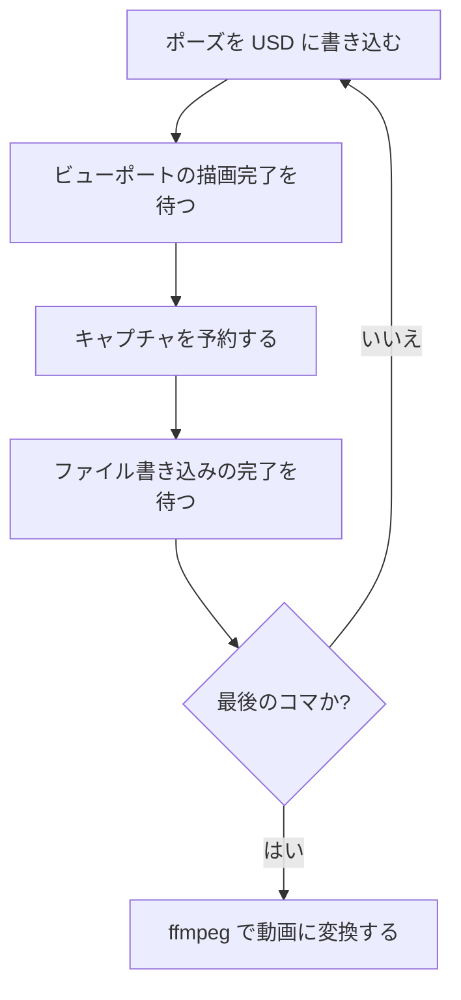
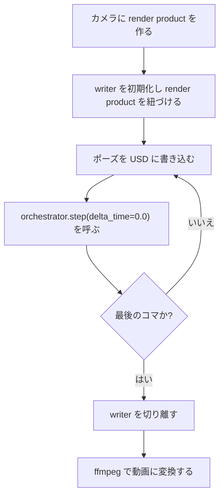

# Play OFFでの連番キャプチャ

対象バージョン: Isaac Sim 6.0.1（Windowsネイティブ）

このページはリファレンス型のノートである。前の2ページで扱った「非同期の待ち方」と「何を待つべきか」を使って、実際に物理シミュレーションを止めたまま連番画像を撮り、動画にするまでの手順を示す。

---

## 1. 目的と適用範囲

### 1-1. 何をするノートか

ロボットの姿勢を1コマずつ変えながら画像を保存し、それをつないで動画にする。このとき物理シミュレーションは一切動かさない。

### 1-2. 用語の定義

| 用語 | 定義 |
|---|---|
| Play OFF | `omni.timeline` のタイムラインが再生されていない状態。Isaac SimではPhysXのステップ実行がタイムライン再生に紐づくため、Play OFF は物理が1ステップも進まない状態と等価である |
| 連番PNG | `frame_00000.png`、`frame_00001.png` のように連番の名前を持つ画像ファイルの集合 |
| ビューポート | Isaac SimのGUIに表示されている3Dビュー。画面に映っているものそのもの |
| render product | ビューポートとは別に用意される、オフスクリーン（画面に表示しない）のレンダリング出力 |

### 1-3. なぜMovie Captureでは要件を満たせないか

Kitに付属する `omni.kit.capture.viewport`（Movie Capture）は、タイムラインを再生してフレームを進める設計である。撮影を開始するとPlay状態になり、物理が動き出す。これは仕様であり、設定で回避する手段はない。

したがって、Play OFFのまま撮るには別の方法が要る。以下に2方式を示す。

### 1-4. 適用範囲外

- 音声の記録
- Path Tracingモードでの高品質レンダリング（追加の収束待ちが必要。5-3参照）
- タイムラインを再生しながらの撮影（それはMovie Captureの担当範囲である）

---

## 2. 方式の選択基準

| 観点 | 方式A: ビューポートキャプチャ | 方式B: Replicatorキャプチャ |
|---|---|---|
| 撮る対象 | ビューポートに映っている絵そのもの | ビューポートと独立したrender product |
| 解像度 | ビューポートの解像度に固定される | 任意に指定できる |
| カメラ | ビューポートのアクティブカメラ | 任意のカメラ、複数同時も可能 |
| セットアップの行数 | 10行程度 | 30行程度 |
| 追加のVRAM消費 | なし | render productのぶん増える |
| ファイル名の管理 | 自分で決める | writerが規則に従って付ける |
| RGB以外の出力 | 不可 | 深度・セグメンテーション等も同時に取得可能 |

**判断の指針**: 「見た目を確認するための動画」が目的なら方式Aで足りる。方式Bを選ぶ理由になるのは次の3つのいずれかに該当する場合だけである。

- ビューポートより高い解像度で出力したい
- 複数カメラの絵を同時に撮りたい
- RGB以外のアノテーション（深度、セグメンテーションマスク等）も同時に欲しい

RTX 3060（VRAM 8GB）のような構成では、render productの追加がVRAM圧迫の要因になる。該当しなければ方式Aを選ぶ。

---

## 3. 方式A: ビューポートキャプチャ

### 3-1. 1コマぶんの処理順序



各段階が何を待っているかは次のとおりである。

| 段階 | 待つ対象 | 待たないとどうなるか |
|---|---|---|
| 描画完了を待つ | ビューポートフレーム | 書き換え前の絵が保存される |
| 書き込み完了を待つ | ファイルI/O | 書き込み途中のファイルが残る、または次のコマの絵で上書きされる |

### 3-2. 使用するAPI一覧

#### `omni.kit.viewport.utility.capture_viewport_to_file`

ビューポートの内容をファイルに保存する。タイムラインには一切触れない。

| 引数 | 型 | 既定値 | 意味 |
|---|---|---|---|
| `viewport_api` | ViewportAPI | 必須 | どのビューポートを撮るか。`get_active_viewport()` で取得する |
| `file_path` | str | 必須 | 保存先のフルパス。拡張子で形式が決まる |
| `is_hdr` | bool | `False` | HDR（高ダイナミックレンジ）形式で保存するか。`True` にすると `.exr` などの形式が必要になる |
| `render_product_path` | str | `None` | ビューポート以外のrender productを指定する場合に使う。方式Aでは指定しない |
| `format_desc` | dict | `None` | 画像形式の詳細指定。既定のままでよい |
| `frame_to_capture` | int | `None` | 撮影するフレーム番号の指定。既定のままでよい |

戻り値は、完了を待つための `wait_for_result` メソッドを持つオブジェクトである。

#### `omni.kit.viewport.utility.next_viewport_frame_async`

ビューポートが次の1枚を描き終わるのを待つ。

| 引数 | 型 | 既定値 | 意味 |
|---|---|---|---|
| `viewport` | ViewportAPI | 必須 | 対象のビューポート |
| `n_frames` | int | `0` | 追加で待つフレーム数。`0` なら次の1枚だけ待つ |

#### `wait_for_result`

キャプチャの完了を待つ。`capture_viewport_to_file` の戻り値に対して呼ぶ。

| 引数 | 型 | 既定値 | 意味 |
|---|---|---|---|
| `completion_frames` | int | 【未確認】 | 完了とみなすまでに待つフレーム数と推測されるが、公式APIリファレンスに説明が見当たらない |

**推奨は引数なしで呼ぶこと**である。Kitの公式サンプルには `completion_frames=30` と書かれたものがあるが、同じ拡張の別バージョンのドキュメントでは引数なしで呼んでおり、既定値で足りることを示唆している。意味を確認していない数値をコードに残すと、後で読んだときに「なぜ30なのか」を再調査する羽目になる。

`completion_frames` の実際の定義をローカルで確認する場合は次のコマンドを使う。

```powershell
Get-ChildItem -Path C:\isaacsim\kit\exts -Recurse -Filter *.py |
    Select-String -Pattern "completion_frames" |
    Select-Object Path, LineNumber, Line
```

### 3-3. 完全なコード

VS Code拡張またはScript Editorにそのまま貼って実行できる形である。`OUT_DIR` と `POSES`、`apply_pose` の中身を自分の環境に合わせて書き換える。

```python
import os

import carb
import omni.usd
from omni.kit.viewport.utility import (
    capture_viewport_to_file,
    get_active_viewport,
    next_viewport_frame_async,
)
from pxr import Usd, UsdGeom

# ---- 設定 --------------------------------------------------------------
OUT_DIR = r"C:\temp\capture"           # 出力先ディレクトリ
ROBOT_ROOT = "/World/robot"            # ロボットのルートprimのパス
FRAME_COUNT = 60                       # 撮るコマ数
# ------------------------------------------------------------------------


def apply_pose(stage: Usd.Stage, frame_index: int) -> None:
    """1コマぶんの姿勢をUSDに書き込む。

    ここは自分のロボットに合わせて書き換える。
    以下はルートprimをZ軸まわりに回転させるだけの最小例。
    """
    prim = stage.GetPrimAtPath(ROBOT_ROOT)
    if not prim.IsValid():
        raise RuntimeError(f"prim が見つからない: {ROBOT_ROOT}")

    xformable = UsdGeom.Xformable(prim)
    angle = frame_index * 6.0                        # 60コマで1回転する

    # 既存のrotateZ opがあれば再利用し、なければ追加する
    rotate_op = None
    for op in xformable.GetOrderedXformOps():
        if op.GetOpName() == "xformOp:rotateZ":
            rotate_op = op
            break
    if rotate_op is None:
        rotate_op = xformable.AddRotateZOp()

    ok = rotate_op.Set(angle)                        # ★ 戻り値を必ず確認する
    if not ok:
        raise RuntimeError(f"属性の書き込みに失敗した: frame={frame_index}")


async def capture_sequence() -> None:
    os.makedirs(OUT_DIR, exist_ok=True)
    stage = omni.usd.get_context().get_stage()
    viewport = get_active_viewport()

    for i in range(FRAME_COUNT):
        apply_pose(stage, i)

        # ★ アプリのフレーム数ではなく、ビューポートの描画完了を待つ
        await next_viewport_frame_async(viewport)

        file_path = os.path.join(OUT_DIR, f"frame_{i:05d}.png")
        helper = capture_viewport_to_file(viewport, file_path=file_path)

        # ★ ファイル書き込みの完了を待つ。引数なしで既定値を使う
        await helper.wait_for_result()

        if i % 10 == 0:
            carb.log_warn(f"撮影中 {i + 1}/{FRAME_COUNT}")

    carb.log_warn(f"完了。{FRAME_COUNT} 枚を {OUT_DIR} に保存した")


await capture_sequence()                             # ★ トップレベル await
```

`Usd.Attribute.Set()` および `UsdGeom.XformOp.Set()` は失敗しても例外を投げず `False` を返す。上のコードで戻り値を確認しているのはこのためである。

### 3-4. 実行結果

**Isaac Sim本体のConsoleウィンドウの出力**:

```
[Warning] [__main__] 撮影中 1/60
[Warning] [__main__] 撮影中 11/60
[Warning] [__main__] 撮影中 21/60
[Warning] [__main__] 撮影中 31/60
[Warning] [__main__] 撮影中 41/60
[Warning] [__main__] 撮影中 51/60
[Warning] [__main__] 完了。60 枚を C:\temp\capture に保存した
```

**出力ディレクトリの中身**:

```
C:\temp\capture\
    frame_00000.png
    frame_00001.png
    frame_00002.png
    ...
    frame_00059.png
```

各PNGの解像度はビューポートの解像度と一致する。ビューポートが `1280x720` なら、保存されるPNGも `1280x720` になる。

### 3-5. レンダラモード別の注意

| レンダラモード | 1フレームの描画完了で絵が確定するか | 必要な待ち |
|---|---|---|
| RTX Real-Time | する | `next_viewport_frame_async` を1回 |
| RTX Path Tracing | しない（サンプルを累積して収束させる） | 収束するまで追加で待つ必要がある |

Path Tracingで撮る場合は、`next_viewport_frame_async(viewport, n_frames=N)` の `N` を増やして収束を待つ。この `N` は「レンダラが収束するまでのサンプル数」という物理的な意味を持つ数字であり、根拠なく選ぶ数字とは性質が違う。適切な値はシーンの複雑さとレンダラ設定に依存するため、実測して決める。

現在のレンダラモードは次のコードで確認できる。

```python
import carb

settings = carb.settings.get_settings()
print(settings.get("/rtx/rendermode"))
```

**RTX Real-Timeの場合の出力**:

```
RaytracedLighting
```

**RTX Path Tracingの場合の出力**:

```
PathTracing
```

---

## 4. 方式B: Replicatorキャプチャ

### 4-1. Replicatorの構成要素

Replicatorは機械学習用の合成データを生成するためのフレームワークである。3つの部品からなる。

| 部品 | 役割 |
|---|---|
| render product | カメラに紐づいた、画面に表示しないレンダリング出力。解像度を任意に指定できる |
| writer | render productの出力をファイルとしてディスクに書く。`BasicWriter` がRGB等の基本的な出力を担当する |
| orchestrator | 「今1フレームぶんキャプチャしろ」という号令を出す司令塔 |

`orchestrator.step()` を1回呼ぶと1枚のファイルが出力される。

### 4-2. 1コマぶんの処理順序



方式Aと違い、描画完了を明示的に待つ処理がない。`orchestrator.step()` の中で描画と書き出しの完了まで面倒を見るためである。

### 4-3. orchestrator.step の引数

| 引数 | 型 | 既定値 | 意味 |
|---|---|---|---|
| `rt_subframes` | int | `-1` | レイトレーシングのサブフレーム数。マテリアルやライティングの収束のために、1枚の出力につき何回レンダリングを繰り返すか。`-1` は既定設定に従う |
| `pause_timeline` | bool | `True` | ステップの完了後にタイムラインを一時停止するか |
| `delta_time` | float | `None` | このステップでタイムラインをどれだけ進めるか。`None` はタイムラインのレート分だけ進む。`0.0` は進めない。正の値はその秒数だけ進める |
| `wait_for_render` | bool | `True` | レンダリングの完了を待ってから戻るか |

**このノートの目的では `delta_time=0.0` が要となる。** これによりタイムラインが進まず、したがって物理も1ステップも進まない。

### 4-4. 完全なコード

```python
import carb
import omni.replicator.core as rep
import omni.usd
from pxr import Usd, UsdGeom

# ---- 設定 --------------------------------------------------------------
OUT_DIR = r"C:\temp\capture_rep"       # 出力先ディレクトリ
CAMERA_PATH = "/World/Camera"          # 撮影に使うカメラprimのパス
RESOLUTION = (1920, 1080)              # 出力解像度。ビューポートと独立に指定できる
ROBOT_ROOT = "/World/robot"            # ロボットのルートprimのパス
FRAME_COUNT = 60                       # 撮るコマ数
# ------------------------------------------------------------------------


def apply_pose(stage: Usd.Stage, frame_index: int) -> None:
    """1コマぶんの姿勢をUSDに書き込む。方式Aと同じ内容。"""
    prim = stage.GetPrimAtPath(ROBOT_ROOT)
    if not prim.IsValid():
        raise RuntimeError(f"prim が見つからない: {ROBOT_ROOT}")

    xformable = UsdGeom.Xformable(prim)
    angle = frame_index * 6.0

    rotate_op = None
    for op in xformable.GetOrderedXformOps():
        if op.GetOpName() == "xformOp:rotateZ":
            rotate_op = op
            break
    if rotate_op is None:
        rotate_op = xformable.AddRotateZOp()

    ok = rotate_op.Set(angle)
    if not ok:
        raise RuntimeError(f"属性の書き込みに失敗した: frame={frame_index}")


stage = omni.usd.get_context().get_stage()

# ★ カメラに render product を作る（画面には表示されない）
render_product = rep.create.render_product(CAMERA_PATH, RESOLUTION)

# ★ writer を初期化して render product を紐づける
writer = rep.WriterRegistry.get("BasicWriter")
writer.initialize(output_dir=OUT_DIR, rgb=True)
writer.attach([render_product])

for i in range(FRAME_COUNT):
    apply_pose(stage, i)

    # ★ delta_time=0.0 でタイムラインを進めずに1枚だけ撮る
    rep.orchestrator.step(delta_time=0.0, rt_subframes=8)

    if i % 10 == 0:
        carb.log_warn(f"撮影中 {i + 1}/{FRAME_COUNT}")

writer.detach()                                      # ★ 後始末を忘れない
render_product.destroy()

carb.log_warn(f"完了。{FRAME_COUNT} 枚を {OUT_DIR} に保存した")
```

`rt_subframes=8` を明示しているのは、Play OFFのままステップするとマテリアルやライティングが収束しきらないことがあるためである。値を大きくすると品質が上がり、時間がかかる。

### 4-5. 実行結果

**Consoleウィンドウの出力**:

```
[Warning] [__main__] 撮影中 1/60
[Warning] [__main__] 撮影中 11/60
[Warning] [__main__] 撮影中 21/60
[Warning] [__main__] 撮影中 31/60
[Warning] [__main__] 撮影中 41/60
[Warning] [__main__] 撮影中 51/60
[Warning] [__main__] 完了。60 枚を C:\temp\capture_rep に保存した
```

**出力ディレクトリの中身**:

```
C:\temp\capture_rep\
    rgb_0000.png
    rgb_0001.png
    rgb_0002.png
    ...
    rgb_0059.png
```

ファイル名は `BasicWriter` が決める。`rgb_` という接頭辞は出力の種類（RGB画像）を表し、続く4桁がステップ番号である。`writer.initialize()` で `distance_to_camera=True` などを追加で指定すると、`distance_to_camera_0000.npy` のような別系統のファイルも同じディレクトリに出力される。

各PNGの解像度は `RESOLUTION` で指定した `1920x1080` になる。ビューポートの解像度とは無関係である。

---

## 5. 連番PNGから動画への変換

方式A・方式Bのどちらも、得られるのは連番PNGである。動画化には外部ツールが必要になる。ここではffmpegを使う。

### 5-1. 基本のコマンド

方式A（`frame_00000.png` 形式）の場合:

```
ffmpeg -framerate 30 -i C:\temp\capture\frame_%05d.png -c:v libx264 -pix_fmt yuv420p -crf 18 out.mp4
```

方式B（`rgb_0000.png` 形式）の場合:

```
ffmpeg -framerate 30 -i C:\temp\capture_rep\rgb_%04d.png -c:v libx264 -pix_fmt yuv420p -crf 18 out.mp4
```

### 5-2. 各オプションの意味

| オプション | 意味 | 変えるとどうなるか |
|---|---|---|
| `-framerate 30` | 入力の連番画像を毎秒何枚として扱うか | 小さくすると遅い動画、大きくすると速い動画になる。撮影時のコマ数とは独立に決められる |
| `-i ...%05d.png` | 入力ファイルのパターン。`%05d` は5桁のゼロ埋め連番を意味する | 桁数がファイル名と一致していないとファイルが見つからない。`frame_00000.png` なら `%05d`、`rgb_0000.png` なら `%04d` |
| `-c:v libx264` | 映像コーデックにH.264を使う | `libx265` にするとファイルサイズが小さくなるが、再生環境の対応が狭くなる |
| `-pix_fmt yuv420p` | 画素形式をYUV 4:2:0にする | 指定しないと、再生ソフトによっては映像が表示されない。互換性のために事実上必須 |
| `-crf 18` | 画質の指定。0が無劣化、51が最低画質 | 数値を下げると高画質・大容量になる。18は「ほぼ劣化が分からない」とされる値。既定値は23 |

### 5-3. 開始番号がゼロでない場合

方式Bの出力が `rgb_0001.png` から始まる場合など、連番がゼロ始まりでないときは開始番号を明示する。

```
ffmpeg -framerate 30 -start_number 1 -i C:\temp\capture_rep\rgb_%04d.png -c:v libx264 -pix_fmt yuv420p out.mp4
```

| オプション | 意味 |
|---|---|
| `-start_number 1` | 連番の開始値を指定する。省略すると0から探し、見つからないとエラーになる |

### 5-4. 実行結果

**ffmpegの出力（末尾のみ）**:

```
frame=   60 fps= 45 q=-1.0 Lsize=     842kB time=00:00:01.90 bitrate=3628.7kbits/s speed=1.43x
video:840kB audio:0kB subtitle:0kB other streams:0kB global headers:0kB muxing overhead: 0.238093%
```

`frame= 60` が処理した画像の枚数、`time=00:00:01.90` が生成された動画の長さである。60枚を30fpsで並べたので2秒になっている。

---

## 6. トラブルシューティング

| 症状 | 原因 | 対処 |
|---|---|---|
| 撮影を開始すると勝手にPlayになる | Movie Capture（`omni.kit.capture.viewport`）を使っている。この拡張はタイムライン再生でフレームを進める設計である | 方式Aまたは方式Bを使う |
| 保存された画像が全部同じ絵 | 描画完了を待たずに撮影している | `next_viewport_frame_async` を挟む。`next_update_async` では代用にならない |
| 保存された画像が1コマぶん遅れている | 同上。または `wait_for_result` を呼んでいない | 上記に加えて `await helper.wait_for_result()` を入れる |
| 画像がノイズだらけ | RTX Path Tracingモードで、収束前に撮影している | `next_viewport_frame_async(viewport, n_frames=N)` の `N` を増やす。または `rt_subframes` を増やす |
| ポーズを書き換えても絵が変わらない | `Set()` が `False` を返して黙って失敗している | 戻り値を確認する。3-3のコードのように例外を投げるようにする |
| Isaac Simがフリーズする | 同期的なブロッキング待ち、または `time.sleep()` を使っている | `await` を使う |
| `print` の出力が見えない | `asyncio.ensure_future` で投げたコルーチンの中で `print` している | トップレベル `await` にする。または `carb.log_warn` を使う |
| 方式Bで VRAM が足りなくなる | render productがビューポートとは別にVRAMを消費する | `RESOLUTION` を下げる。または方式Aに切り替える |
| ffmpegが「No such file or directory」で止まる | 連番の桁数指定がファイル名と一致していない、または開始番号がゼロでない | `%04d` と `%05d` を確認する。`-start_number` を指定する |

---

## 7. 理解度確認問題

**問1.** 方式Aのコードから `await next_viewport_frame_async(viewport)` の1行を削除した。保存される画像はどうなるか。

<details>
<summary>解答</summary>

書き換え前の姿勢の絵が保存される、または保存される絵とファイル名の対応がずれる。

USD属性を書き換えても、その変更が画面に反映されるのは後続の描画フェーズである。描画完了を待たずにキャプチャを予約すると、まだ更新されていない画面の内容が撮られる。

なおこの1行を `await omni.kit.app.get_app().next_update_async()` に置き換えても解決の保証はない。アプリのフレームが1回進むことと、ビューポートが1枚描き終わることは別の周期だからである。
</details>

**問2.** `rep.orchestrator.step()` の `delta_time` に `0.0` ではなく `None` を渡すと何が起きるか。

<details>
<summary>解答</summary>

タイムラインがそのレート分だけ進む。タイムラインが進むと物理も進むため、Play OFFのまま撮るという目的が達成できなくなる。

`delta_time` の既定値は `None` であり、これは「タイムラインのレート分だけ進める」を意味する。したがって引数を省略した場合も同じ結果になる。物理を止めたまま撮りたい場合は `delta_time=0.0` を明示する必要がある。
</details>

**問3.** 60枚のPNGを撮影した。これを「5秒間の動画」にしたい。ffmpegのコマンドをどう書けばよいか。

<details>
<summary>解答</summary>

`-framerate 12` を指定する。

60枚 ÷ 5秒 = 12枚/秒 だからである。

```
ffmpeg -framerate 12 -i frame_%05d.png -c:v libx264 -pix_fmt yuv420p out.mp4
```

`-framerate` は入力の連番画像を毎秒何枚として扱うかの指定であり、撮影時のコマ数とは独立に決められる。同じ60枚から、`-framerate 60` なら1秒の動画、`-framerate 6` なら10秒の動画が作れる。
</details>

**問4.** ビューポートの解像度が `1280x720` の環境で、`3840x2160` の連番画像を撮りたい。方式Aと方式Bのどちらを選ぶべきか。理由も述べよ。

<details>
<summary>解答</summary>

方式Bを選ぶ。

方式A（`capture_viewport_to_file`）はビューポートに映っている絵をそのまま保存するため、出力解像度がビューポートの解像度に固定される。`1280x720` のビューポートからは `1280x720` の画像しか得られない。

方式Bはビューポートとは独立したrender productを作るため、`rep.create.render_product(camera_path, (3840, 2160))` のように任意の解像度を指定できる。

ただし `3840x2160` のrender productはVRAMを大きく消費する。VRAM 8GBの環境では、シーンの規模によっては不足する可能性がある。
</details>

---

## 8. 参照元URL一覧

- Kit Viewport API
  `https://docs.omniverse.nvidia.com/kit/docs/omni.kit.viewport.docs/latest/api.html`
  （`capture_viewport_to_file` の引数、キャプチャが非同期であること、`wait_for_result` による完了待ち、`next_viewport_frame_async` の根拠）
- SDG Workflows — Isaac Sim Documentation
  `https://docs.isaacsim.omniverse.nvidia.com/6.0.0/replicator_tutorials/tutorial_replicator_sdg_workflows.html`
  （`rep.orchestrator.step()` の4引数の意味、`delta_time=0.0` がタイムラインを進めないことの根拠）
- Multi-Tick Rendering — Isaac Sim Documentation
  `https://docs.isaacsim.omniverse.nvidia.com/latest/sensors/isaacsim_sensors_multitick_rendering.html`
  （Play OFF時に物理時刻が凍結すること、`/app/player/playSimulations` の挙動の根拠）

## 9. 未確認事項

- `wait_for_result` の `completion_frames` 引数の正確な定義。3-2のPowerShellコマンドでローカル確認できる
- 3-3および4-4のコードは、公式ドキュメントで署名を確認したAPIのみで構成しているが、Play OFF状態での実機動作は未検証である
- `Synthetic Data Recorder` 拡張のGUIに、タイムラインを再生させないためのオプションが露出しているか
- 方式Bで `rt_subframes` をいくつにすべきかの目安。シーン依存のため実測が必要

---

## 目次

1. [[01_非同期実行とトップレベルawait]]
2. [[02_周期進行の仕組み]]
3. **Play OFFでの連番キャプチャ**（このページ）

前のページ: [[02_周期進行の仕組み]]
次のページ: なし（このノートブックの最後のページ）
