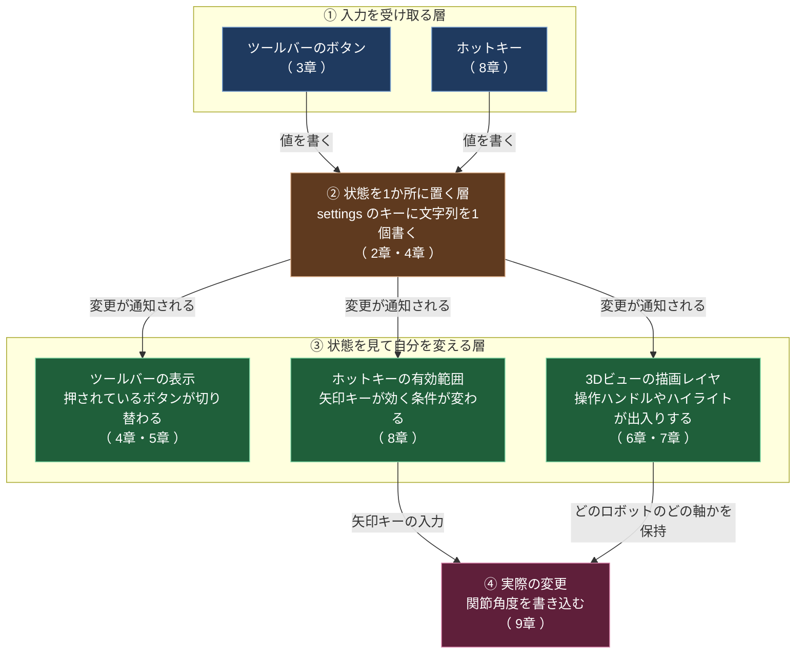

# ツールバーに独自モードを追加する仕組み（目次）

## このノートブックが答える問い

Isaac Sim のツールバーには、並進・回転・スケール・選択のアイコンが並んでいる。1つを押すと他が解除され、モードから抜けると3Dビューに出ていた矢印や回転リングが消える。

ここに5つ目のモード（ロボットアームの関節角度を矢印キーで変更するモード）を、同じ作りで足したい。そのために必要な仕組みを、前提知識ゼロから積み上げる。

## 前提バージョン

| 項目 | 値 |
|---|---|
| Isaac Sim | 6.0.1（Windows ネイティブ、`C:\isaacsim`） |
| 基盤 | Omniverse Kit SDK 110.1.2 [^1] |
| 想定読者 | C# の経験があり、Omniverse Kit の UI 拡張は未経験 |

Isaac Sim 6.0.1 は Kit SDK 110.1.2 の上に構築されている。6.0.0 が 110.1.1 で、6.0.1 でパッチが1つ上がった [^1]。このノートブックで扱う UI の仕組みはすべて Kit SDK 側の機能であり、Isaac Sim 固有の機能ではない。

## 全体フロー

ボタンを押してから画面が変わるまでに、4つの段階を通る。以下の図がこのノートブック全体の骨格になる。

図の読み方は次のとおり。

- 矢印は「上流が下流に働きかける向き」を表す。上から下へ時間が進む。
- 青い箱は入力、茶色い箱は状態の保管場所、緑の箱は状態を見て自分を変える側、赤い箱は最終的な変更を表す。
- 入力から緑の箱へ直接伸びる矢印は1本もない。ここがこの設計の核心で、入力側は「値を書く」だけを行い、表示を消す処理を持たない。

この構造から、「モードを抜けたら操作ハンドルが消える」という挙動の実装場所が決まる。
消す処理はボタン側ではなく、緑の箱の側（描画レイヤ自身）にある。

## ページ一覧

| # | ページ | 型 | 扱う段階 |
|---|---|---|---|
| 1 | [[01_用語と登場人物]] | 概念 | 全体の前提 |
| 2 | [[02_settingsは状態の置き場所]] | 概念 | ② |
| 3 | [[03_ツールバーの構造]] | 概念 | ① |
| 4 | [[04_モードが排他になる仕組み]] | 概念 | ①→②→③ |
| 5 | [[05_ツールバーのコンテキスト]] | 概念 | ③のうち表示 |
| 6 | [[06_操作ハンドルと描画レイヤ]] | 概念 | ③のうち3Dビュー |
| 7 | [[07_複数の操作ハンドルの譲り合い]] | 概念 | ③のうち3Dビュー |
| 8 | [[08_ホットキー]] | 概念 | ①と③のうちキー入力 |
| 9 | [[09_関節角度モードの組み立て]] | 概念 | ①〜④の統合 |
| 10 | [[10_リファレンス]] | 表 | 引くための一覧 |

## 現時点で未確認の事項

このノートブックは公式ドキュメントで裏が取れた内容と、手元で確認しないと確定しない内容を分けて書く。
後者には【未確認】を付けている。着手時点で判明している未確認事項は3つある。

| #   | 未確認の内容                          | 確定させるページ                |
| --- | ------------------------------- | ----------------------- |
| 1   | 選択モードのとき、モードを保持するキーに何という文字列が入るか | [[02_settingsは状態の置き場所]] |
| 2   | ボタンの実装がどのファイルのどのクラスにあるか         | [[04_モードが排他になる仕組み]]     |
| 3   | コンテキスト切替時に、既定コンテキストのボタンが残るか消えるか | [[05_ツールバーのコンテキスト]]     |

いずれも手元の Isaac Sim で実行するスクリプトを各ページに載せてあり、実行すれば確定する。

## 理解度確認問題

1. ツールバーのボタンを押したとき、3Dビューの操作ハンドルを消す処理はどの層にあるか。ボタン側と描画レイヤ側のどちらか。
2. このノートブックが対象とする Isaac Sim のバージョンと、その基盤となる Kit SDK のバージョンはいくつか。

解答

1. 描画レイヤ側にある。ボタン側は状態を1か所に書くだけで、表示を消す処理を持たない。
2. Isaac Sim 6.0.1、Kit SDK 110.1.2。

## 目次

- [[00_目次とツールバー拡張の全体像]]（このページ）
- [[01_用語と登場人物]]
- [[02_settingsは状態の置き場所]]
- [[03_ツールバーの構造]]
- [[04_モードが排他になる仕組み]]
- [[05_ツールバーのコンテキスト]]
- [[06_操作ハンドルと描画レイヤ]]
- [[07_複数の操作ハンドルの譲り合い]]
- [[08_ホットキー]]
- [[09_関節角度モードの組み立て]]
- [[10_リファレンス]]

次のページ: [[01_用語と登場人物]]

[^1]: [Release Notes — Isaac Sim Documentation 6.0.1](https://docs.isaacsim.omniverse.nvidia.com/6.0.1/overview/release_notes.html)
