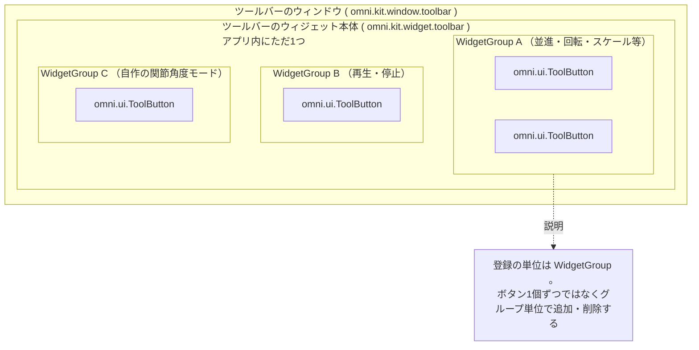

# ツールバーの構造

## 解決したい課題：各拡張機能が勝手にボタンを描くと衝突する

ツールバーに置きたいボタンは、1つの拡張機能から出てくるわけではない。並進・回転・スケールは1つの拡張機能が、再生・停止は別の機能が、独自モードは自作の拡張機能が持ち込む。

各拡張機能が自分でウィンドウを作ってボタンを描くと、画面に小さなウィンドウが乱立する。1つのウィンドウを共有させるにしても、置く位置を各自が決めると重なりが起きる。

## 解決の方針：1つの登録簿に登録させる

Kit は、ツールバーそのものをアプリ内に1つだけ持ち、そこへ**登録**する形にした [^1]。各拡張機能は自分のボタンの集合を作り、優先度の数値を添えて登録する。並べる処理はツールバー側が行う。

## 仕組み

### 3階層の入れ子になっている



図の読み方は次のとおり。

- 入れ子の外側ほど大きな入れ物を表す。いちばん外がウィンドウ、その中がウィジェット本体、その中がグループ、いちばん内側が個々のボタンになる。
- 点線の矢印は本体の構造ではなく、注釈への引き出し線を表す。

### 3つのクラスの役割

| クラス名 | 所属拡張機能 | 役割 |
|---|---|---|
| `Toolbar` | `omni.kit.widget.toolbar` | 登録簿と UI 枠を兼ねる。グループを受け取り、並べて描く [^1] |
| `WidgetGroup` | `omni.kit.widget.toolbar` | ツールバーに置く `omni.ui` 部品のまとまり。継承して自作する基底クラス [^1] |
| `SimpleToolButton` | `omni.kit.widget.toolbar` | ボタン1個だけを持つ `WidgetGroup` の実装例であり、そのまま使える道具でもある [^1] |

### Toolbar の主なメソッド

`Toolbar` クラスが公開しているメソッドのうち、このノートブックで使うものは次の6つになる [^2]。

| メソッド | 説明 |
|---|---|
| `add_widget(widget_group, priority, context='')` | グループを登録する。`priority` は数値が小さいほど先（横並びなら左）に置かれる |
| `remove_widget(widget_group)` | 登録を外す |
| `get_widget(name)` | ウィジェット名から `omni.ui.Widget` を1個取り出す。見つからなければ `None` |
| `acquire_toolbar_context(context)` | 現在のコンテキストを切り替える。詳細は [[05_ツールバーのコンテキスト]] |
| `release_toolbar_context(token)` | 切り替えを戻す |
| `get_context()` | 現在のコンテキストを取得する |

`add_widget` の第3引数については [[05_ツールバーのコンテキスト]] で扱う。このページでは省略した既定の状態だけを使う。

### WidgetGroup の生存期間

`WidgetGroup` を継承して自作する場合、上書きするメソッドは次の6つになる [^3]。

| メソッド | 呼ばれるタイミング | 用途 |
|---|---|---|
| `create(default_size)` | ツールバーが描画を組み立てるとき | `omni.ui` 部品を作って返す |
| `get_style()` | 描画の組み立て時 | 部品の見た目を辞書で返す |
| `clean()` | 破棄前 | 購読の解除など後始末を行う |
| `on_added(context)` | `add_widget` で追加されたとき | 追加時に指定されたコンテキスト名を受け取る |
| `on_removed()` | `remove_widget` で外されたとき | 外されたことを知る |
| `on_toolbar_context_changed(context)` | ツールバーの実効コンテキストが変わったとき | 新しいコンテキスト名を受け取る |

`create` の戻り値は、名前から部品への辞書にできる。辞書を返しておくと、他のグループから `Toolbar.get_widget(name)` でその部品を取り出せるようになる [^3]。

C# との対応で言えば、`create` がコンストラクタ相当、`clean` が `Dispose` 相当になる。`clean` を呼ばずに参照を捨てると、購読が残って通知が飛び続ける。

## 実装

### ボタンを1個追加する

`SimpleToolButton` を使う場合、継承せずにそのまま組み立てられる。Script Editor に貼り付ける全文になる。

```python
# ===== 目的：ツールバーにトグルボタンを1個追加する =====
import carb
from carb.input import KeyboardInput as Key
from omni.kit.widget.toolbar import SimpleToolButton, get_instance


def _on_toggled(checked: bool):
    """ボタンの押下状態が変わったときに呼ばれる。"""
    carb.log_warn(f"[demo] toggled = {checked}")


# name はウィジェット名。Toolbar.get_widget(name) で引くときの鍵になる
_demo_button = SimpleToolButton(
    name="demo_joint_mode",
    tooltip="デモ用のトグルボタン",
    icon_path="${glyphs}/lock_open.svg",       # 押されていないときの絵
    icon_checked_path="${glyphs}/lock.svg",    # 押されているときの絵
    hotkey=Key.L,                              # L キーでも切り替わる
    toggled_fn=_on_toggled,
)

_toolbar = get_instance()
_toolbar.add_widget(widget_group=_demo_button, priority=100)
carb.log_warn("[demo] added")
```

実行するとツールバーの右端付近に錠前のアイコンが1個増える。クリックすると Console に次の行が出る。

```text
[demo] added
[demo] toggled = True
[demo] toggled = False
```

アイコンのパスに書いた `${glyphs}` は、Kit が用意している標準アイコン置き場を指す変数になる。自作のアイコンを使う場合は、`.svg` ファイルの絶対パスをそのまま渡す。

`priority=100` は既存のボタンより大きい値なので、既存のボタンより後ろ（横並びなら右）に並ぶ。

### 追加したボタンを外す

```python
# ===== 目的：上で追加したボタンを外し、後始末する =====
import carb
from omni.kit.widget.toolbar import get_instance

_toolbar = get_instance()
_toolbar.remove_widget(_demo_button)   # ツールバーから外す
_demo_button.clean()                   # 内部の購読などを解除する
del _demo_button
carb.log_warn("[demo] removed")
```

実行するとアイコンが消え、Console に次の行が出る。

```text
[demo] removed
```

`remove_widget` だけを呼んで `clean` を呼ばないと、ツールバーからは消えるが、ボタンが内部で持っていた購読が残る。追加と削除を繰り返すと通知が二重・三重に飛ぶようになるので、2つを必ず対で呼ぶ。

### ボタンを2個まとめて追加する

複数のボタンを1つのグループにする場合は `WidgetGroup` を継承する。公式ドキュメントの例では、2個のトグルボタンを1グループに入れている [^4]。

```python
# ===== 目的：2個のボタンを1つのグループとして登録する =====
import carb
import omni.ui as ui
from omni.kit.widget.toolbar import WidgetGroup, get_instance


class DemoPairGroup(WidgetGroup):
    """トグルボタンを2個持つグループ。"""

    def __init__(self, icon_path: str):
        super().__init__()
        self._icon_path = icon_path
        self._sub1 = None
        self._sub2 = None

    def get_style(self):
        # "Button.Image::名前" が通常時、":checked" 付きが押下時の絵を指す
        return {
            "Button.Image::demo_a": {"image_url": f"{self._icon_path}/plus.svg"},
            "Button.Image::demo_a:checked": {"image_url": f"{self._icon_path}/minus.svg"},
            "Button.Image::demo_b": {"image_url": f"{self._icon_path}/minus.svg"},
            "Button.Image::demo_b:checked": {"image_url": f"{self._icon_path}/plus.svg"},
        }

    def create(self, default_size):
        def on_value_changed(index, model):
            carb.log_warn(f"[pair] button {index} = {model.get_value_as_bool()}")

        button_a = ui.ToolButton(name="demo_a", width=default_size, height=default_size)
        self._sub1 = button_a.model.subscribe_value_changed_fn(
            lambda model, index=1: on_value_changed(index, model)
        )

        button_b = ui.ToolButton(name="demo_b", width=default_size, height=default_size)
        self._sub2 = button_b.model.subscribe_value_changed_fn(
            lambda model, index=2: on_value_changed(index, model)
        )

        # 名前から部品への辞書を返すと、他のグループから get_widget で引ける
        return {"demo_a": button_a, "demo_b": button_b}

    def clean(self):
        self._sub1 = None
        self._sub2 = None
        super().clean()


# ${glyphs} はスタイル辞書の中では展開されないため、実パスを渡す必要がある
import omni.kit.app
_ext_manager = omni.kit.app.get_app().get_extension_manager()
_ext_id = _ext_manager.get_enabled_extension_id("omni.kit.widget.toolbar")
_icons = _ext_manager.get_extension_path(_ext_id) + "/icons"

_pair = DemoPairGroup(_icons)
get_instance().add_widget(widget_group=_pair, priority=101)
carb.log_warn(f"[pair] added, icons from {_icons}")
```

実行するとボタンが2個増える。押すと Console に次の行が出る。

```text
[pair] added, icons from C:\isaacsim\kit\exts\omni.kit.widget.toolbar/icons
[pair] button 1 = True
[pair] button 2 = True
```

アイコンの絵が出ない場合は、`icons` フォルダに `plus.svg` と `minus.svg` が無いことを意味する。そのフォルダの中身は次で一覧できる。

```python
import os
print(os.listdir(_icons))
```

**このグループに入れた2個のボタンは互いに排他にならない。** 両方同時に押した状態にできる。ボタンどうしを排他にする仕組みはグループの機能ではなく、次のページで扱う別の層にある。

### 外す

```python
_toolbar = get_instance()
_toolbar.remove_widget(_pair)
_pair.clean()
del _pair
```

## 理解度確認問題

1. `Toolbar.add_widget` に渡す `priority` の値を小さくすると、ボタンは左右どちらに寄るか。
2. `remove_widget` を呼んだあとに `clean` を呼ばないと何が起きるか。
3. 1つの `WidgetGroup` に入れた2個のトグルボタンは、片方を押すともう片方が自動的に解除されるか。

<details>
<summary>解答</summary>

1. 左（縦置きなら上）に寄る。数値が小さいほど先に置かれる。
2. ツールバーからは消えるが、ボタンが内部で持っていた購読が残る。追加と削除を繰り返すと通知が重複する。
3. されない。グループは登録・スタイル・生存期間の単位であり、排他の仕組みは持たない。

</details>

## 目次

- [[00_目次とツールバー拡張の全体像]]
- [[01_用語と登場人物]]
- [[02_settingsは状態の置き場所]]
- [[03_ツールバーの構造]]（このページ）
- [[04_モードが排他になる仕組み]]
- [[05_ツールバーのコンテキスト]]
- [[06_操作ハンドルと描画レイヤ]]
- [[07_複数の操作ハンドルの譲り合い]]
- [[08_ホットキー]]
- [[09_関節角度モードの組み立て]]
- [[10_リファレンス]]

前のページ: [[02_settingsは状態の置き場所]]
次のページ: [[04_モードが排他になる仕組み]]

[^1]: [Extension: omni.kit.widget.toolbar — Overview](https://docs.omniverse.nvidia.com/kit/docs/omni.kit.widget.toolbar/latest/Overview.html)
[^2]: [omni.kit.widget.toolbar — Toolbar クラス](https://docs.omniverse.nvidia.com/kit/docs/omni.kit.widget.toolbar/latest/omni.kit.widget.toolbar/omni.kit.widget.toolbar.Toolbar.html)
[^3]: [omni.kit.widget.toolbar — WidgetGroup クラス](https://docs.omniverse.nvidia.com/kit/docs/omni.kit.widget.toolbar/1.6.2+106/omni.kit.widget.toolbar/omni.kit.widget.toolbar.WidgetGroup.html)
[^4]: [omni.kit.widget.toolbar — WidgetGroup Usage Example](https://docs.omniverse.nvidia.com/kit/docs/omni.kit.widget.toolbar/1.7.2/USAGE_WIDGET_GROUP.html)
