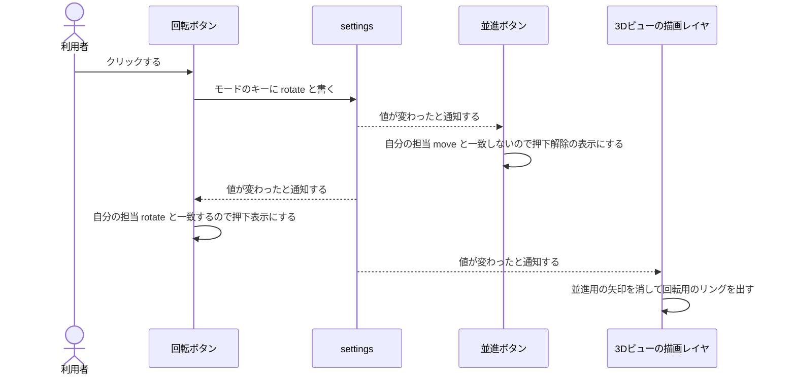

# モードが排他になる仕組み

## 解決したい課題：ボタンどうしが互いを知ると増やせなくなる

並進・回転・スケール・選択は、同時に1つしか有効にならない。素朴に作るなら、あるボタンが押されたときに他の3個を解除する処理を書く。

この作り方だと、5つ目のモードを足すときに既存4個すべてを書き換えることになる。さらに、モードを提供する拡張機能が別々だと、他人の拡張機能のオブジェクトを直接触ることになり、有効化の順序に依存して壊れる。

## 解決の方針：状態を1個の値にして、ボタンをその写像にする

[[02_settingsは状態の置き場所]] で見た settings を使い、現在のモードを1個の文字列として持つ。

- 1個のキーには1個の値しか入らないので、**排他はデータ構造の性質として自動的に成立する**。
- 各ボタンは自分の押下状態を持たず、「そのキーの値が自分の担当と一致するか」を見て見た目を決める。

この方針の効果は、ボタンどうしの依存が0本になることにある。5つ目のモードを足しても既存のボタンは書き換えない。

## 仕組み

### 3層に分かれている

| 層 | 担当 | 具体物 |
|---|---|---|
| 状態 | 現在のモードを1個保持する | settings のキー `/app/transform/operation` |
| 見た目 | 状態を読んで押下状態を表示する | `omni.ui.ToolButton` とそのモデル |
| 書き込み | クリックされたら状態を書き換える | ボタンのクリック処理 |

`omni.ui.ToolButton` が押下状態を自分の中に持たず、外部のモデルに問い合わせる作りになっていることが、この分離を可能にしている。`SimpleToolButton` のコンストラクタにも `model` という引数がある [^1]。

### 押してから表示が変わるまでの順序



この図で重要な点は、回転ボタンから並進ボタンへ向かう矢印が1本もないことになる。両者は settings を介してのみ間接的につながる。

### この3層のうち、どこまでが確認済みか

| 内容 | 状態 |
|---|---|
| モードのキーが存在し、並進・回転・スケールの値を取ること | 公式ドキュメントで確認済み [^2] |
| `omni.ui.ToolButton` が外部モデルから押下状態を取ること | 公式ドキュメントで確認済み [^1] |
| どのクラスがこのキーを読み書きしているか | 【未確認】 |

3つ目は公式ドキュメントに書かれていない。ただし [[01_用語と登場人物]] で述べたとおり、`omni.kit.` 系拡張機能の Python ファイルは平文で手元に入っているため、読めば確定する。以下がその手順になる。

## 実装

### 手順1：モードのキーを読み書きしているファイルを特定する

Script Editor に貼り付ける全文になる。実行すると、該当する行がファイルパスと行番号つきで並ぶ。

```python
# ===== 目的：モードのキーを読み書きしている .py を、拡張機能フォルダから探し出す =====
import os
import inspect

import omni.kit.widget.toolbar
import omni.kit.manipulator.prim.core
import omni.kit.manipulator.selector

# 探す文字列。先頭の "/app/" を含めないことで、
# "/app/transform/operation" と "/persistent/app/transform/operation" の両方に当たる
NEEDLE = "transform/operation"

MODULES = [
    omni.kit.widget.toolbar,
    omni.kit.manipulator.prim.core,
    omni.kit.manipulator.selector,
]


def extension_root(module):
    """Python パッケージのファイル位置から、拡張機能フォルダの絶対パスを逆算する。

    例: <ext>/omni/kit/widget/toolbar/__init__.py から <ext> を得る。
        モジュール名のドット区切りの数だけ上へ登れば omni の親に着く。
    """
    path = inspect.getsourcefile(module)
    parts = module.__name__.count(".") + 1   # "omni.kit.widget.toolbar" なら 4
    for _ in range(parts + 1):               # __init__.py 自身の分で 1 つ多く登る
        path = os.path.dirname(path)
    return path


for mod in MODULES:
    root = extension_root(mod)
    print("=" * 78)
    print(f"module  : {mod.__name__}")
    print(f"ext dir : {root}")

    for dirpath, _dirnames, filenames in os.walk(root):
        for name in filenames:
            if not name.endswith(".py"):
                continue
            full = os.path.join(dirpath, name)
            try:
                with open(full, "r", encoding="utf-8", errors="ignore") as f:
                    lines = f.read().splitlines()
            except OSError:
                continue
            for lineno, line in enumerate(lines, start=1):
                if NEEDLE in line:
                    print(f"  HIT {full}:{lineno}: {line.strip()}")
```

出力の形は次のようになる。ファイル名・行番号・クラス名は環境で決まるため、値そのものは【未確認】になる。

```text
==============================================================================
module  : omni.kit.widget.toolbar
ext dir : C:\isaacsim\kit\exts\omni.kit.widget.toolbar
  HIT C:\isaacsim\kit\exts\omni.kit.widget.toolbar\omni\kit\widget\toolbar\<ファイル名>.py:<行>: <その行のソース>
==============================================================================
module  : omni.kit.manipulator.prim.core
ext dir : C:\isaacsim\kit\extscache\omni.kit.manipulator.prim.core-<版>
  HIT ...
```

`HIT` が1件も出ない場合は、モードのキーがこの3つの拡張機能の外で扱われていることを意味する。その場合は `MODULES` に `omni.kit.manipulator.transform` を足すか、`ext dir` の1つ上の階層（拡張機能が並んでいるフォルダ）を `os.walk` の対象にして探索範囲を広げる。

### 手順2：見つかったクラスの実装を読む

該当ファイルが分かったら、クラス単位でソースを取り出せる。

```python
# ===== 目的：クラスの実装をそのまま出力する =====
import inspect
from omni.kit.widget.toolbar import WidgetGroup, SimpleToolButton, Toolbar

for cls in (WidgetGroup, SimpleToolButton, Toolbar):
    print("=" * 78)
    print(f"{cls.__module__}.{cls.__name__}  <-  {inspect.getsourcefile(cls)}")
    print(inspect.getsource(cls))
```

出力はクラス定義のソースがそのまま並ぶ形になる。

```text
==============================================================================
omni.kit.widget.toolbar.simple_tool_button.SimpleToolButton  <-  C:\isaacsim\kit\exts\...\simple_tool_button.py
class SimpleToolButton(WidgetGroup):
    ...（以下、実際のソース）
```

メソッド単位でも取れる。

```python
import inspect
from omni.kit.widget.toolbar import Toolbar
print(inspect.getsource(Toolbar.add_widget))
```

### 手順3：モデルの正体を確かめる

`Toolbar.get_widget(name)` は、ウィジェット名から `omni.ui.Widget` を1個取り出す [^3]。取り出したボタンのモデルの型を見れば、押下状態をどこから取っているかが分かる。

```python
# ===== 目的：既存のモードボタンのモデルの型を調べる =====
import carb
from omni.kit.widget.toolbar import get_instance

toolbar = get_instance()

# 名前の候補。手順1で判明した実装ファイルに書かれている name をここに入れる
CANDIDATES = ["select", "move", "rotate", "scale", "snap"]

for name in CANDIDATES:
    widget = toolbar.get_widget(name)
    if widget is None:
        carb.log_warn(f"{name!r} -> 見つからない")
        continue
    model = getattr(widget, "model", None)
    carb.log_warn(f"{name!r} -> widget={type(widget).__name__} model={type(model).__name__}")
```

出力の形は次のようになる。名前が合っていない場合は「見つからない」が並ぶので、手順1で判明した実際の名前に差し替える。

```text
'select' -> 見つからない
'move' -> widget=ToolButton model=<モデルのクラス名>
```

モデルのクラス名が判明したら、そのクラスのソースを手順2と同じ方法で読む。ここでモードのキーを読み書きしている行が見つかれば、このページの仕組みの説明が実装で裏付けられたことになる。

### 自作モードを同じ仕組みに載せる場合の注意

自作モードの状態を `/app/transform/operation` に独自の値（例えば `joint`）として書き込む案は成立しうるが、Kit 側が未知の値を想定して書かれているかは公式ドキュメントに記述がなく【未確認】になる。

安全側の作りは、自作の状態を別のキーに持ち、既存のキーには既知の値だけを書くことになる。

| キー | 用途 |
|---|---|
| `/exts/<自作拡張機能のID>/mode` | 自作モードが有効かどうかを保持する |
| `/app/transform/operation` | 自作モードに入るとき、既存の操作ハンドルを引っ込めるために既知の値を書く |

この二重管理にすると、既存の操作ハンドルの挙動が Kit 側の想定内に収まる。具体的な組み立ては [[09_関節角度モードの組み立て]] で扱う。

## 理解度確認問題

1. 回転ボタンを押したとき、並進ボタンの押下状態を解除しているのはどのコードか。回転ボタンか、並進ボタンか、settings か。
2. `/app/transform/operation` に未知の文字列を書く案の危険はどこにあるか。
3. `inspect.getsource(Toolbar.add_widget)` は何を出力するか。

<details>
<summary>解答</summary>

1. 並進ボタン自身。値が変わった通知を受け、自分の担当と一致しないことを見て自分で解除表示にする。回転ボタンは値を書くだけで、他のボタンには触らない。
2. Kit 側の既存コードが未知の値を想定して書かれているかが未確認であるため。自作のキーを別に持ち、既存キーには既知の値だけを書けば回避できる。
3. `add_widget` メソッドの Python ソースコードそのもの。

</details>

## 目次

- [[00_目次とツールバー拡張の全体像]]
- [[01_用語と登場人物]]
- [[02_settingsは状態の置き場所]]
- [[03_ツールバーの構造]]
- [[04_モードが排他になる仕組み]]（このページ）
- [[05_ツールバーのコンテキスト]]
- [[06_操作ハンドルと描画レイヤ]]
- [[07_複数の操作ハンドルの譲り合い]]
- [[08_ホットキー]]
- [[09_関節角度モードの組み立て]]
- [[10_リファレンス]]

前のページ: [[03_ツールバーの構造]]
次のページ: [[05_ツールバーのコンテキスト]]

[^1]: [omni.kit.widget.toolbar — SimpleToolButton](https://docs.omniverse.nvidia.com/kit/docs/omni.kit.widget.toolbar/1.6.2+106/omni.kit.widget.toolbar/omni.kit.widget.toolbar.SimpleToolButton.html)
[^2]: [omni.kit.property.transform — Settings](https://docs.omniverse.nvidia.com/kit/docs/omni.kit.property.transform/latest/SETTINGS.html)
[^3]: [omni.kit.widget.toolbar — Toolbar クラス](https://docs.omniverse.nvidia.com/kit/docs/omni.kit.widget.toolbar/latest/omni.kit.widget.toolbar/omni.kit.widget.toolbar.Toolbar.html)
