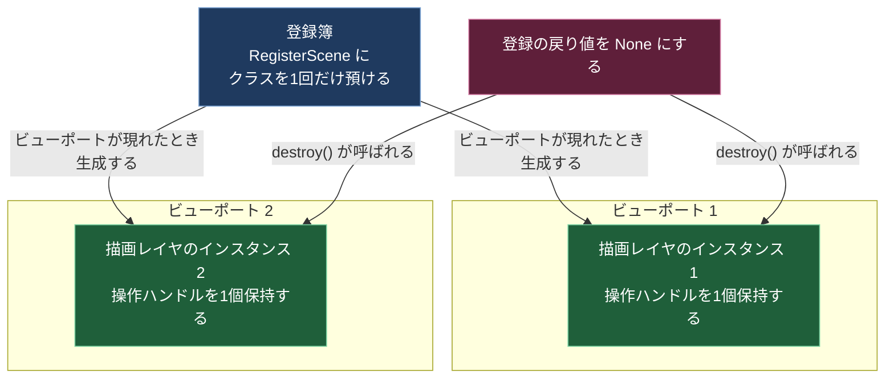

# 操作ハンドルと描画レイヤ

このページで扱う「操作ハンドル」は、3Dビューに出る矢印や回転リングを指す（[[01_用語と登場人物]] の定義）。ロボットアームの話ではない。

## 解決したい課題：ビューポートは複数あり、後から増える

Kit では3Dビューのウィンドウを同時に複数開ける。操作ハンドルは画面に描く図形なので、ビューポートが2つあれば2つ必要になる。1個のオブジェクトを2つの画面で共有することはできない。

さらに、利用者がいつウィンドウを追加・削除するかは、操作ハンドルを提供する側には分からない。「アプリ起動時に1個作る」では足りず、「ビューポートが現れるたびに作る」処理が要る。

## 解決の方針：インスタンスではなくクラスを預ける

Kit は、生成済みのオブジェクトではなく**クラスを登録簿に預ける**方式を採った。「このクラスを、ビューポートが現れるたびにインスタンス化してくれ」と依頼する形になる。

登録に使うクラス名は `RegisterScene` で、所属拡張機能は `omni.kit.viewport.registry` になる。公式のチュートリアルでは、こうして作られるクラスについて「`omni.kit.viewport.registry` または `omni.kit.manipulator.viewport` によってビューポートごとに生成され、操作ハンドルとビューポートに必要な情報を保持する」と説明されている [^1]。

## 仕組み

### ビューポートと描画レイヤの対応



図の読み方は次のとおり。

- 実線の矢印は「生成する」「破棄させる」という働きかけの向きを表す。
- 青い箱が登録の操作、緑の箱がビューポートごとに作られる実体、赤い箱が破棄の操作を表す。
- 登録は1回だけ行い、実体は複数できる。これが「クラスを預ける」方式の要点になる。

### 登録の戻り値が生存期間を表す

`RegisterScene(クラス, "名前")` の戻り値を変数に保持し、その変数を `None` にすると登録が解除され、生成済みの実体の `destroy()` が呼ばれる [^2]。

登録関数を呼びっぱなしにして後から名前で解除する方式ではない点に注意がいる。**戻り値を捨てることが解除**になる。

C# との対応で言えば、`IDisposable` を返すメソッドに近い。ただし `using` に相当する構文で囲むのではなく、変数の寿命そのものが登録の寿命になる。

### 操作ハンドルは USD prim に依存しない

操作ハンドルの基本部品を提供する拡張機能は `omni.kit.manipulator.transform` で、Kit 自身が使っているものと同一になる [^3]。この部品は、prim を直接読み書きしない。

`omni.ui.scene` のドキュメントには、操作ハンドルがモデル駆動で動き、オブジェクト・制御点・補助的な図形といった任意の対象に対して使えると書かれている [^4]。

モデルを自作する場合に必要なフィールドは4つになる [^3]。

| フィールド | 役割 |
|---|---|
| `transform` | 操作ハンドルを空間のどこに描くかを決める行列 |
| `translate` | ドラッグで移動させたときに値が書き込まれる先 |
| `rotate` | 回転させたときに値が書き込まれる先 |
| `scale` | 拡大縮小させたときに値が書き込まれる先 |

つまり操作ハンドルが知っているのは「どこに描くか」と「動かされたら誰に伝えるか」の2点だけになる。

prim を実際に書き換える処理は別の拡張機能にある。`omni.kit.manipulator.prim` がそれで、`omni.kit.manipulator.prim.core`・`omni.kit.manipulator.prim.usd`・`omni.kit.manipulator.prim.fabric` の3つを束ねたものになる [^5]。

**この分離があるため、操作ハンドルは prim を動かす以外の用途にも使える。** 例えば逆運動学の目標位置姿勢を与える用途では、ダミーの prim をステージに置かなくても、自作モデルの変数に姿勢を書かせるだけで済む。ダミー prim を置く方式だと、保存対象のデータが1個増え、Undo 履歴にも載る。

### モードから抜けたときに消える理由

[[04_モードが排他になる仕組み]] で見たとおり、ボタンは settings に値を書くだけで、描画物を消す処理を持たない。

消す責任は描画レイヤの側にある。描画レイヤは settings の変更通知を自分で購読し、自分が担当するモードでなくなった時点で自分の描画を落とす。

この分担の効果は、モードが増えてもボタン側のコードが増えないことにある。新しいモードを足す側が、自分の描画レイヤに「担当でなくなったら消える」処理を書けばよい。ロボットアームの選択ハイライトも軸のハイライトも、書く場所は同じになる。

## 実装

### 公式のサンプル

公式ドキュメントに載っている登録の形は次のとおり [^2]。

```python
class CustomScene:
    def __init__(self, desc):
        usd_context_name = desc.get("usd_context_name")
        self.__transform_manip_override = CustomPrimTransformManipulator(
            usd_context_name=usd_context_name, viewport_api=desc.get("viewport_api")
        )

    def destroy(self):
        if self.__transform_manip_override:
            self.__transform_manip_override.destroy()
            self.__transform_manip_override = None

scene = RegisterScene(CustomScene, "omni.kit.manipulator.custom")
```

1行ずつの読み方は次のとおり。

- `CustomScene` は自分で書くクラスで、描画レイヤ1枚に対応する。
- `__init__(self, desc)` の `desc` は辞書で、Kit 側が渡してくる。少なくとも `usd_context_name`（どの USD 文脈か）と `viewport_api`（どのビューポートか）を含む。自分でビューポートを探しに行く必要がない。
- `destroy()` は自分で実装する。中で保持しているものを破棄し、参照を `None` にする。
- `RegisterScene(クラス, "名前")` で登録が成立する。以後、ビューポートが現れるたびに Kit がこのクラスを呼び出す。
- `scene = None` を実行すると登録が解除され、生成済みの実体の `destroy()` が呼ばれる。

### モード連動する描画レイヤの骨組み

自作モードで使う形にしたものが次になる。Script Editor に貼り付ける全文で、そのまま実行できる。

```python
# ===== 目的：settings のモード値に連動して出入りする描画レイヤを登録する =====
import carb
import carb.settings
from omni.kit.viewport.registry import RegisterScene

MODE_KEY = "/exts/demo.joint.mode/enabled"   # 自作モードの状態を持つキー
_settings = carb.settings.get_settings()

# キーが無い状態から始めるとエラーになるので、初期値を作っておく
if _settings.get(MODE_KEY) is None:
    _settings.set(MODE_KEY, False)


class JointHighlightScene:
    """ビューポート1枚につき1個作られる描画レイヤ。

    このサンプルでは実際の描画は行わず、生成・破棄・モード変化を記録する。
    """

    def __init__(self, desc):
        self._viewport_api = desc.get("viewport_api")
        self._name = getattr(self._viewport_api, "id", "unknown")
        self._visible = False
        self._sub = _settings.subscribe_to_node_change_events(
            MODE_KEY, self._on_mode_changed
        )
        carb.log_warn(f"[scene:{self._name}] created")
        self._apply(_settings.get(MODE_KEY))

    def _on_mode_changed(self, item, event_type):
        self._apply(_settings.get(MODE_KEY))

    def _apply(self, enabled: bool):
        """モードの状態に応じて、自分の描画を出し入れする。"""
        if enabled == self._visible:
            return
        self._visible = bool(enabled)
        if self._visible:
            carb.log_warn(f"[scene:{self._name}] ハイライトを表示する")
            # ここで omni.ui.scene の図形を作る
        else:
            carb.log_warn(f"[scene:{self._name}] ハイライトを消す")
            # ここで作った図形を破棄する

    def destroy(self):
        if self._sub is not None:
            _settings.unsubscribe_to_change_events(self._sub)
            self._sub = None
        self._apply(False)
        carb.log_warn(f"[scene:{self._name}] destroyed")


_scene_registration = RegisterScene(JointHighlightScene, "demo.joint.highlight")
carb.log_warn("[scene] registered")
```

実行するとビューポートの数だけ生成の行が出る。ビューポートが1枚の場合の出力は次のようになる。

```text
[scene:Viewport] created
[scene] registered
```

モードを切り替える。

```python
_settings.set(MODE_KEY, True)
```

```text
[scene:Viewport] ハイライトを表示する
```

```python
_settings.set(MODE_KEY, False)
```

```text
[scene:Viewport] ハイライトを消す
```

**ここで値を書いているのは settings だけで、描画レイヤのオブジェクトには一切触れていない。** それでもハイライトが消えるのが、このページの仕組みの要点になる。

登録を解除する。

```python
_scene_registration = None
```

```text
[scene:Viewport] destroyed
```

新しいビューポートを開くと（メニューの Window → Viewport → Viewport 2）、登録が生きている間はそちらにも `created` の行が出る。ビューポートを閉じると、そのビューポートに対応する実体の `destroy()` が呼ばれる。

## 理解度確認問題

1. `RegisterScene` に渡すのは、生成済みのオブジェクトか、クラスか。その理由は何か。
2. 登録を解除する方法は何か。名前を指定した解除関数を呼ぶのか、別の方法か。
3. 逆運動学の目標姿勢を操作ハンドルで与えたい。ステージにダミーの prim を置く必要はあるか。

<details>
<summary>解答</summary>

1. クラスを渡す。ビューポートは複数あり後から増減するため、現れたタイミングで Kit 側にインスタンス化させる必要があるから。
2. 登録の戻り値を保持しておき、その変数を `None` にする。戻り値を捨てることが解除になる。
3. 必要ない。操作ハンドルは `transform` と `translate` / `rotate` / `scale` を持つモデルがあれば動き、prim には依存しない。ダミー prim を置くとステージと Undo 履歴が汚れる。

</details>

## 目次

- [[00_目次とツールバー拡張の全体像]]
- [[01_用語と登場人物]]
- [[02_settingsは状態の置き場所]]
- [[03_ツールバーの構造]]
- [[04_モードが排他になる仕組み]]
- [[05_ツールバーのコンテキスト]]
- [[06_操作ハンドルと描画レイヤ]]（このページ）
- [[07_複数の操作ハンドルの譲り合い]]
- [[08_ホットキー]]
- [[09_関節角度モードの組み立て]]
- [[10_リファレンス]]

前のページ: [[05_ツールバーのコンテキスト]]
次のページ: [[07_複数の操作ハンドルの譲り合い]]

[^1]: [Slider Manipulator — Omniverse Workflows](https://docs.omniverse.nvidia.com/workflows/latest/extensions/slider_manipulator.html)
[^2]: [omni.kit.manipulator.prim.core — Usage Examples](https://docs.omniverse.nvidia.com/kit/docs/omni.kit.manipulator.prim.core/107.0.5/USAGE_PYTHON.html)
[^3]: [omni.ui.scene 1.13.1 — Example（Standard Manipulators）](https://docs.omniverse.nvidia.com/kit/docs/omni.ui.scene/1.13.1/Example.html)
[^4]: [omni.ui.scene 1.10.3 — Example（Standard Manipulators）](https://docs.omniverse.nvidia.com/kit/docs/omni.ui.scene/1.10.3/Example.html)
[^5]: [Extension: omni.kit.manipulator.prim-108.0.0 — Overview](https://docs.omniverse.nvidia.com/kit/docs/omni.kit.manipulator.prim/108.0.0/Overview.html)
