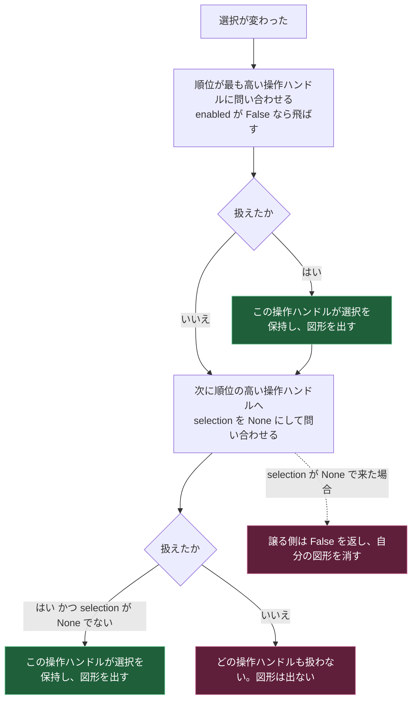

# 複数の操作ハンドルの譲り合い

## 解決したい課題：同時に複数の操作ハンドルが出ると衝突する

[[06_操作ハンドルと描画レイヤ]] の方式では、描画レイヤを登録した拡張機能の数だけ操作ハンドルが作られる。標準の並進・回転・スケール用の操作ハンドルに加えて、自作モードのハイライトを出すと、同じ prim の位置に図形が2つ重なる。

重なるだけなら見づらいだけで済むが、マウスのドラッグをどちらが受け取るかが決まらないと、操作そのものが破綻する。

各拡張機能が「他に誰がいるか」を調べて譲り合う作りにすると、[[02_settingsは状態の置き場所]] で見たのと同じ相互依存の問題が起きる。

## 解決の方針：順位を付けて、上から順に問い合わせる

Kit は専用の拡張機能 `omni.kit.manipulator.selector` を用意した。この拡張機能が提供する `ManipulatorBase` というクラスを継承すると、順位と有効条件に基づいて1つだけが選ばれる仕組みに乗れる [^1]。

ドキュメントの説明では、この基底クラスの目的は「選択変更のイベントを各自が購読する代わりに、継承して抽象メソッドを実装することで、複数種類の操作ハンドルから順位と有効条件に基づいて1つを選べるようにすること」とされている [^1]。

## 仕組み

### 実装するのは2つ

`ManipulatorBase` を継承したクラスが実装するのは、プロパティ1個とメソッド1個になる [^1]。

| 名前 | 種別 | 返すもの |
|---|---|---|
| `enabled` | プロパティ | この操作ハンドルが今そもそも有効かどうか |
| `on_selection_changed(stage, selection)` | メソッド | 渡された選択を自分が扱えたかどうか |

`on_selection_changed` の引数と戻り値の意味は次のとおり [^1]。

| 項目 | 内容 |
|---|---|
| `stage` | 選択変更が起きた USD ステージ |
| `selection` | 選択されている prim のパスのリスト |
| `selection` が `None` の場合 | **より順位の高い操作ハンドルが既に選択を処理したので、自分は譲れという意味**（空のリストとは区別される） |
| 戻り値 `True` | 自分がこの選択を扱った。順位の低い側は譲るべきである |
| 戻り値 `False` | 自分は扱えなかった |

`selection` が `None` の場合は必ず `False` を返す、と明記されている [^1]。

### 順位の指定場所

順位は settings に置かれる。パスの形は次のとおり [^1]。

```text
/persistent/exts/omni.kit.manipulator.selector/orders/<操作ハンドルの名前>
```

標準の prim 用操作ハンドルは、この形で既定値 `-1` が設定されている [^2]。

```text
/persistent/exts/omni.kit.manipulator.selector/orders/omni.kit.manipulator.prim.core = -1
```

### 「モードを抜けたら消える」の2つ目の実装点

[[06_操作ハンドルと描画レイヤ]] では、settings の変更通知を自分で購読して消える方式を見た。このページの仕組みは、それとは別のもう1つの実装点になる。

- settings の変更通知：モードが切り替わったときに消える。
- `selection` が `None` で呼ばれたとき：**他の操作ハンドルが選択を取ったときに消える。**

2つは目的が違うので、両方を実装する。前者だけだと、モードは同じまま別の操作ハンドルが選択を取った場合にハイライトが残る。

### 順位付けの問い合わせの流れ



図の読み方は次のとおり。

- 実線の矢印は処理の進む向きを表す。点線の矢印は、上流の問い合わせが `None` 付きだった場合の分岐を表す。
- 緑の箱は図形が表示される結末、赤い箱は図形が消える結末を表す。
- 上から下へ、順位の高い側から低い側へ問い合わせが進む。

## 実装

### 現在の順位を一覧する

Script Editor に貼り付ける全文になる。

```python
# ===== 目的：登録されている操作ハンドルの順位を一覧する =====
import carb
import carb.settings

ORDERS_ROOT = "/persistent/exts/omni.kit.manipulator.selector/orders"

settings = carb.settings.get_settings()
orders = settings.get(ORDERS_ROOT)

if not orders:
    carb.log_warn(f"{ORDERS_ROOT} に登録がない")
else:
    for name, value in sorted(orders.items(), key=lambda kv: kv[1]):
        carb.log_warn(f"order={value:>4}  {name}")
```

出力の形は次のようになる。並んでいる名前と数値は環境で決まるため、値そのものは【未確認】になる。

```text
order=  -1  omni.kit.manipulator.prim.core
```

`omni.kit.manipulator.selector` の順位管理には `ManipulatorOrderManager` というクラスもあり、順位の辞書を `orders_dict` プロパティで取得したり、順位の変更を購読したりできる [^3]。settings を直接読む上の方法は、その裏側にある値をそのまま見ていることになる。

### 自作の操作ハンドルの骨組み

```python
# ===== 目的：順位付けの仕組みに乗る操作ハンドルの骨組みを作る =====
import carb
from omni.kit.manipulator.selector import ManipulatorBase

MY_NAME = "demo.joint.manipulator"


class JointManipulator(ManipulatorBase):
    """関節角度モード用の操作ハンドル。

    このサンプルでは図形を描かず、選択の受け取りと譲りだけを記録する。
    """

    def __init__(self, usd_context_name: str = ""):
        super().__init__(name=MY_NAME, usd_context_name=usd_context_name)
        self._selected = None
        self._mode_enabled = True   # 実際にはモードのキーを読む

    @property
    def enabled(self) -> bool:
        """自作モードが有効なときだけ、この操作ハンドルを有効とみなす。"""
        return self._mode_enabled

    def on_selection_changed(self, stage, selection, *args, **kwargs) -> bool:
        # None は「順位の高い側が処理したので譲れ」の意味。空リストとは別物
        if selection is None:
            carb.log_warn(f"[{MY_NAME}] 譲る（ハイライトを消す）")
            self._selected = None
            return False   # None を受けた場合は必ず False を返す

        if not self.enabled or not selection:
            carb.log_warn(f"[{MY_NAME}] 扱わない selection={selection}")
            self._selected = None
            return False

        carb.log_warn(f"[{MY_NAME}] 扱う selection={selection}")
        self._selected = list(selection)
        return True   # True を返すと、順位の低い側には None が渡る

    def destroy(self):
        self._selected = None
        carb.log_warn(f"[{MY_NAME}] destroyed")
        super().destroy()


_manip = JointManipulator()
carb.log_warn(f"[{MY_NAME}] created, enabled={_manip.enabled}")
```

出力は次のようになる。

```text
[demo.joint.manipulator] created, enabled=True
```

順位を設定して、標準の操作ハンドルより先に問い合わせを受けるようにする。

```python
import carb
import carb.settings

settings = carb.settings.get_settings()
settings.set("/persistent/exts/omni.kit.manipulator.selector/orders/demo.joint.manipulator", -2)
carb.log_warn(settings.get("/persistent/exts/omni.kit.manipulator.selector/orders"))
```

```text
{'omni.kit.manipulator.prim.core': -1, 'demo.joint.manipulator': -2}
```

数値が小さいほど先に問い合わせを受けるのか、大きいほど先なのかは、公式ドキュメントに明記がなく【未確認】になる。ステージで prim を選択したときに Console に出る順番を見れば判定できる。自作側の行が先に出れば「小さいほど先」になる。

### 後始末

```python
_manip.destroy()
del _manip
```

```text
[demo.joint.manipulator] destroyed
```

## 理解度確認問題

1. `on_selection_changed` の `selection` に空のリストが来た場合と `None` が来た場合は、意味が同じか。
2. `selection` が `None` のとき、戻り値は何を返すべきか。
3. モードから抜けたときにハイライトを消す実装点は、このノートブックで2か所出てきた。それぞれ何をきっかけに消えるか。

<details>
<summary>解答</summary>

1. 違う。空のリストは「何も選択されていない」を表し、`None` は「順位の高い操作ハンドルが処理したので譲れ」を表す。
2. 必ず `False` を返す。
3. 1つは settings の変更通知で、モードが切り替わったときに消える。もう1つは `on_selection_changed` に `None` が渡されたときで、他の操作ハンドルが選択を取ったときに消える。

</details>

## 目次

- [[00_目次とツールバー拡張の全体像]]
- [[01_用語と登場人物]]
- [[02_settingsは状態の置き場所]]
- [[03_ツールバーの構造]]
- [[04_モードが排他になる仕組み]]
- [[05_ツールバーのコンテキスト]]
- [[06_操作ハンドルと描画レイヤ]]
- [[07_複数の操作ハンドルの譲り合い]]（このページ）
- [[08_ホットキー]]
- [[09_関節角度モードの組み立て]]
- [[10_リファレンス]]

前のページ: [[06_操作ハンドルと描画レイヤ]]
次のページ: [[08_ホットキー]]

[^1]: [omni.kit.manipulator.selector — kit-sdk documentation](https://docs.omniverse.nvidia.com/kit/docs/kit-sdk/latest/source/extensions/omni.kit.manipulator.selector/docs/index.html)
[^2]: [Extension: omni.kit.manipulator.prim.core-108.0.1 — Settings](https://docs.omniverse.nvidia.com/kit/docs/omni.kit.manipulator.prim.core/108.0.1/SETTINGS.html)
[^3]: [ManipulatorOrderManager — omni.kit.manipulator.selector](https://docs.omniverse.nvidia.com/kit/docs/omni.kit.manipulator.selector/latest/omni.kit.manipulator.selector/omni.kit.manipulator.selector.ManipulatorOrderManager.html)
