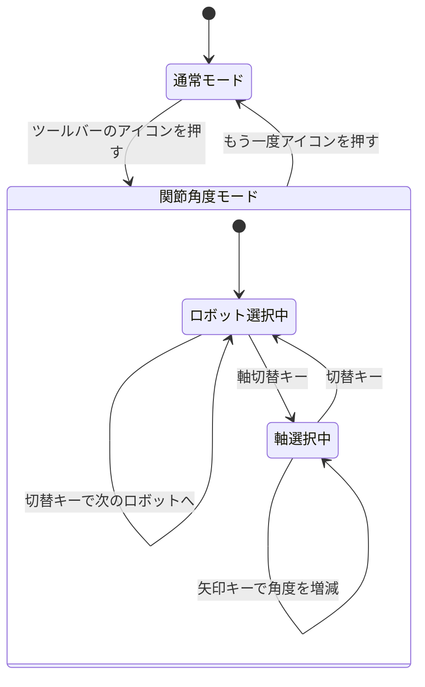

# 関節角度モードの組み立て

## 作りたいものの分解

作りたいのは、ツールバーのアイコンで入る5つ目のモードで、次の3操作を持つ。

| 操作 | 入力 | 変わる状態 |
|---|---|---|
| ロボットアームの選択を切り替える | 切替キー | 対象のロボットアーム |
| 軸（関節）を選択する | 軸切替キー | 対象の関節 |
| 角度を変える | 矢印キー | 選択中の関節の角度 |

さらに、モードから抜けたときに選択中のロボットアームと関節のハイライトが消える必要がある。

## 部品表

1章から8章までの部品を、そのまま当てはめる。

| 必要なもの | 使う仕組み | 参照 |
|---|---|---|
| ツールバーのアイコン | `SimpleToolButton` を `Toolbar.add_widget` で登録する | [[03_ツールバーの構造]] |
| モードの状態 | settings の自作キーに真偽値を持つ | [[02_settingsは状態の置き場所]] |
| 既存の操作ハンドルを引っ込める | モード開始時に `/app/transform/operation` に既知の値を書く | [[04_モードが排他になる仕組み]] |
| ロボットアームと関節のハイライト | `RegisterScene` で描画レイヤを登録し、settings の変更通知で出し入れする | [[06_操作ハンドルと描画レイヤ]] |
| 他の操作ハンドルとの譲り合い | `ManipulatorBase` を継承し、`selection` が `None` のとき消す | [[07_複数の操作ハンドルの譲り合い]] |
| 切替キー・軸切替キー・矢印キー | `omni.kit.hotkeys.core` にモード中だけ登録する | [[08_ホットキー]] |
| ロボット選択・軸選択の追加ボタン列（任意） | 独自コンテキストに登録して切り替える | [[05_ツールバーのコンテキスト]] |

## 状態の設計

自作モードが持つ状態は3つになる。すべて settings の自作キーに置くと、描画レイヤ・ホットキー・ボタンの3者が同じ値を見られる。

| キー | 型 | 意味 |
|---|---|---|
| `/exts/demo.joint.mode/enabled` | 真偽値 | モードが有効かどうか |
| `/exts/demo.joint.mode/robot_index` | 整数 | 選択中のロボットアームの番号 |
| `/exts/demo.joint.mode/joint_index` | 整数 | 選択中の関節の番号 |

ロボットアームのパス一覧や関節名の一覧は文字列の配列になるため、settings に置かず Python 側の変数で持つほうが扱いやすい。番号だけを settings に置き、番号から実体を引く表は Python 側に持つ形にする。

## モードの状態遷移



図の読み方は次のとおり。矢印はモードの遷移を表し、ラベルがその引き金になる操作を示す。外側の枠に入るときにハイライトが出て、出るときに消える。

## モードに入るときと出るときの処理

対称になるように整理すると次の表になる。左右が1対1で対応していない箇所があれば、そこが後始末の漏れになる。

| モードに入るときにやること | モードから出るときにやること |
|---|---|
| 自作キーを `True` にする | 自作キーを `False` にする |
| `/app/transform/operation` に既知の値を書き、既存の操作ハンドルを引っ込める | 元の値に戻す |
| 矢印キー・切替キー・軸切替キーを登録する | 同じ拡張機能 ID でまとめて解除する |
| （任意）独自コンテキストを取得する | 取得時のトークンで解放する |
| ハイライトを表示する | ハイライトを消す |

このうちハイライトの表示と消去だけは、モード開始・終了の処理から直接呼ばない。描画レイヤが自作キーの変更通知を購読していて、自分で出入りする（[[06_操作ハンドルと描画レイヤ]]）。表の最終行が自動的に満たされる形になる。

## 角度の書き込み先

関節角度を実際に変える経路は、シミュレーションの再生状態で2つに分かれる。

| 状態 | 書き込み先 | 反映のされ方 |
|---|---|---|
| 停止中（Play していない） | USD の関節属性を直接書く | 表示上の姿勢が変わる |
| 再生中（Play 中） | 物理エンジンが持つ関節の目標値を書く | 物理演算を経て姿勢が変わる |

停止中に物理側へ書いても反映されず、再生中に USD 属性だけを書いても物理演算に上書きされる。モードの実装では、再生状態を見てどちらの経路を通すかを分岐させる。

Isaac Sim 6.0.1 では、関節を操作する API に世代交代がある。`ArticulationAction`・`ArticulationController`・`SingleArticulation` は非推奨扱いで、まだ動くが新規実装の推奨先は `isaacsim.core.experimental.prims.Articulation` になる。名前に experimental が付いているが、公式には「実験的ではなく、採用が推奨される」と案内されている [^1]。

さらに 6.0 系では PhysX に加えて Newton という物理バックエンドが選べる [^1]。再生中の経路はバックエンドの選択に影響を受けるため、2経路の分岐は最初から入れておく。

## 最小実装

ここまでの部品を1つにまとめたものになる。Script Editor に貼り付けて実行できる。ハイライトの描画と角度の書き込みは、接続点をコメントで示した骨組みにしてある。

```python
# ===== 目的：関節角度モードの骨組みを1つにまとめる =====
import carb
import carb.settings
import omni.kit.actions.core
import omni.kit.hotkeys.core
from omni.kit.viewport.registry import RegisterScene
from omni.kit.widget.toolbar import SimpleToolButton, get_instance

EXT_ID = "demo.joint.mode"
MODE_KEY = f"/exts/{EXT_ID}/enabled"
ROBOT_KEY = f"/exts/{EXT_ID}/robot_index"
JOINT_KEY = f"/exts/{EXT_ID}/joint_index"
TRANSFORM_KEY = "/app/transform/operation"

_settings = carb.settings.get_settings()

# 初期値を作る（キーが存在しない状態からの読み出しを避ける）
for _key, _value in ((MODE_KEY, False), (ROBOT_KEY, 0), (JOINT_KEY, 0)):
    if _settings.get(_key) is None:
        _settings.set(_key, _value)

# 番号から実体を引く表。実際にはステージを走査して埋める
ROBOTS = ["/World/Robot_A", "/World/Robot_B"]
JOINTS = ["joint_1", "joint_2", "joint_3"]

_saved_transform_op = None   # モードに入る前の値を退避する


# ---------- 角度の書き込み ----------

def _apply_angle_delta(delta_deg: float):
    """選択中の関節の角度を delta_deg だけ変える。"""
    robot = ROBOTS[_settings.get(ROBOT_KEY) % len(ROBOTS)]
    joint = JOINTS[_settings.get(JOINT_KEY) % len(JOINTS)]

    import omni.timeline
    playing = omni.timeline.get_timeline_interface().is_playing()

    if playing:
        carb.log_warn(f"[joint] 再生中：{robot} の {joint} の目標値を {delta_deg:+} 度動かす")
        # ここで isaacsim.core.experimental.prims.Articulation 経由で目標値を書く
    else:
        carb.log_warn(f"[joint] 停止中：{robot} の {joint} の USD 属性を {delta_deg:+} 度動かす")
        # ここで USD の関節属性を直接書く


# ---------- ハイライトの描画レイヤ ----------

class JointHighlightScene:
    """ビューポート1枚につき1個作られる。モードの状態に連動して出入りする。"""

    def __init__(self, desc):
        self._viewport_api = desc.get("viewport_api")
        self._name = getattr(self._viewport_api, "id", "unknown")
        self._visible = False
        self._subs = [
            _settings.subscribe_to_node_change_events(key, self._on_changed)
            for key in (MODE_KEY, ROBOT_KEY, JOINT_KEY)
        ]
        self._refresh()

    def _on_changed(self, item, event_type):
        self._refresh()

    def _refresh(self):
        enabled = bool(_settings.get(MODE_KEY))
        if enabled != self._visible:
            self._visible = enabled
            state = "表示" if enabled else "消去"
            carb.log_warn(f"[scene:{self._name}] ハイライトを{state}する")
            # ここで omni.ui.scene の図形を作る／破棄する
        if enabled:
            robot = ROBOTS[_settings.get(ROBOT_KEY) % len(ROBOTS)]
            joint = JOINTS[_settings.get(JOINT_KEY) % len(JOINTS)]
            carb.log_warn(f"[scene:{self._name}] 対象 = {robot} / {joint}")

    def destroy(self):
        for sub in self._subs:
            _settings.unsubscribe_to_change_events(sub)
        self._subs = []
        self._visible = False
        carb.log_warn(f"[scene:{self._name}] destroyed")


_scene_registration = RegisterScene(JointHighlightScene, f"{EXT_ID}.highlight")


# ---------- ホットキー ----------

_action_registry = omni.kit.actions.core.get_action_registry()
_hotkey_registry = omni.kit.hotkeys.core.get_hotkey_registry()


def _next_robot():
    _settings.set(ROBOT_KEY, (_settings.get(ROBOT_KEY) + 1) % len(ROBOTS))


def _next_joint():
    _settings.set(JOINT_KEY, (_settings.get(JOINT_KEY) + 1) % len(JOINTS))


def _register_hotkeys():
    table = [
        ("joint_next_robot", "TAB", _next_robot),
        ("joint_next_joint", "A", _next_joint),
        ("joint_angle_up", "UP", lambda: _apply_angle_delta(+1.0)),
        ("joint_angle_down", "DOWN", lambda: _apply_angle_delta(-1.0)),
    ]
    for action_id, key, fn in table:
        _action_registry.register_action(EXT_ID, action_id, fn, display_name=action_id)
        _hotkey_registry.register_hotkey(EXT_ID, key, EXT_ID, action_id)
    carb.log_warn(f"[mode] hotkeys registered ({len(table)} 個)")


def _deregister_hotkeys():
    _hotkey_registry.deregister_all_hotkeys_for_extension(EXT_ID)
    _action_registry.deregister_all_actions_for_extension(EXT_ID)
    carb.log_warn("[mode] hotkeys deregistered")


# ---------- モードの出入り ----------

def _on_mode_toggled(checked: bool):
    global _saved_transform_op
    if checked:
        _saved_transform_op = _settings.get(TRANSFORM_KEY)
        _settings.set(TRANSFORM_KEY, "move")   # 既存の操作ハンドルを既知の状態に寄せる
        _settings.set(MODE_KEY, True)
        _register_hotkeys()
        carb.log_warn("[mode] 関節角度モードに入る")
    else:
        _settings.set(MODE_KEY, False)
        _deregister_hotkeys()
        if _saved_transform_op is not None:
            _settings.set(TRANSFORM_KEY, _saved_transform_op)
            _saved_transform_op = None
        carb.log_warn("[mode] 関節角度モードから出る")


_mode_button = SimpleToolButton(
    name="joint_angle_mode",
    tooltip="関節角度モード",
    icon_path="${glyphs}/lock_open.svg",
    icon_checked_path="${glyphs}/lock.svg",
    toggled_fn=_on_mode_toggled,
)
get_instance().add_widget(widget_group=_mode_button, priority=120)
carb.log_warn("[mode] ツールバーにボタンを追加した")
```

実行直後の出力は次のようになる。

```text
[scene:Viewport] destroyed
[mode] ツールバーにボタンを追加した
```

1行目が出るのは、以前に登録した同名の描画レイヤがあった場合になる。初回実行では出ない。

ツールバーの追加されたアイコンを押すと、次の順で出る。

```text
[mode] hotkeys registered (4 個)
[mode] 関節角度モードに入る
[scene:Viewport] ハイライトを表示する
[scene:Viewport] 対象 = /World/Robot_A / joint_1
```

Tab キーを押すとロボットアームの選択が変わる。

```text
[scene:Viewport] 対象 = /World/Robot_B / joint_1
```

A キーを押すと関節の選択が変わる。

```text
[scene:Viewport] 対象 = /World/Robot_B / joint_2
```

上矢印キーを押すと、停止中なら次の行が出る。

```text
[joint] 停止中：/World/Robot_B の joint_2 の USD 属性を +1.0 度動かす
```

Play ボタンを押してから同じキーを押すと、経路が切り替わる。

```text
[joint] 再生中：/World/Robot_B の joint_2 の目標値を +1.0 度動かす
```

もう一度ツールバーのアイコンを押すと、モードから出る。

```text
[mode] hotkeys deregistered
[mode] 関節角度モードから出る
[scene:Viewport] ハイライトを消去する
```

**ハイライトを消去する行は、モードの終了処理から呼ばれていない。** 終了処理が行っているのは自作キーに `False` を書くことだけで、描画レイヤがその変更通知を受けて自分で消えている。これがこのノートブック全体で追ってきた設計の帰結になる。

### 後始末

```python
from omni.kit.widget.toolbar import get_instance

_deregister_hotkeys()
_scene_registration = None
_toolbar = get_instance()
_toolbar.remove_widget(_mode_button)
_mode_button.clean()
del _mode_button
```

```text
[mode] hotkeys deregistered
[scene:Viewport] destroyed
```

## この骨組みに残っている作業

| 箇所 | やること |
|---|---|
| `ROBOTS` と `JOINTS` | 固定の配列をやめ、ステージを走査してロボットアームと関節の一覧を作る |
| `JointHighlightScene._refresh` | `omni.ui.scene` の図形を実際に作り、破棄する |
| `_apply_angle_delta` の再生中の経路 | `isaacsim.core.experimental.prims.Articulation` 経由で目標値を書く |
| `_apply_angle_delta` の停止中の経路 | USD の関節属性を直接書く |
| 譲り合い | `ManipulatorBase` を継承した実装を足し、他の操作ハンドルが選択を取ったときにハイライトを消す（[[07_複数の操作ハンドルの譲り合い]]） |
| 矢印キーの連続入力 | 押しっぱなしで連続発火するかを確認し、しない場合は更新イベントで積む構成に変える（[[08_ホットキー]]） |

## 理解度確認問題

1. モードの終了処理が明示的に呼んでいないのに、ハイライトが消えるのはなぜか。
2. 停止中と再生中で角度の書き込み先を変える必要があるのはなぜか。
3. モードに入るときに `/app/transform/operation` の値を退避しているのはなぜか。

<details>
<summary>解答</summary>

1. 描画レイヤが自作キーの変更通知を購読していて、値が `False` になったことを自分で見て消えるため。
2. 停止中に物理側へ書いても反映されず、再生中に USD 属性だけを書いても物理演算に上書きされるため。
3. モードから出たときに、入る前の並進・回転・スケールの状態へ戻すため。退避しないと、モードを抜けたあと常に並進モードになる。

</details>

## 目次

- [[00_目次とツールバー拡張の全体像]]
- [[01_用語と登場人物]]
- [[02_settingsは状態の置き場所]]
- [[03_ツールバーの構造]]
- [[04_モードが排他になる仕組み]]
- [[05_ツールバーのコンテキスト]]
- [[06_操作ハンドルと描画レイヤ]]
- [[07_複数の操作ハンドルの譲り合い]]
- [[08_ホットキー]]
- [[09_関節角度モードの組み立て]]（このページ）
- [[10_リファレンス]]

前のページ: [[08_ホットキー]]
次のページ: [[10_リファレンス]]

[^1]: [Isaac Sim 6.0 General Availability — GitHub Discussion #655](https://github.com/isaac-sim/IsaacSim/discussions/655)
