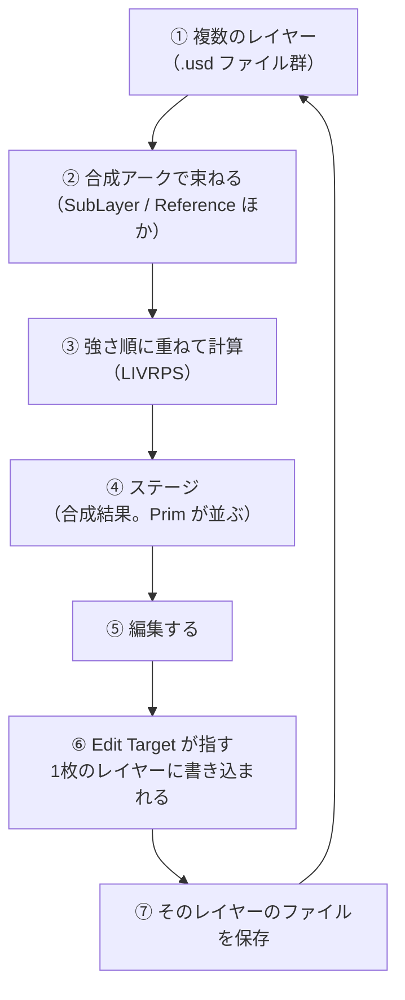

# 01. なぜレイヤーが必要か

## このノートブックの前提

- **対象読者**: OpenUSD をほぼ知らない C# エンジニア。3Dの前提知識は仮定しない
- **基準バージョン**: OpenUSD 一般の仕様。GUI の話は Isaac Sim 6.0.1（Windows ネイティブ）を基準にする
- **確信度のラベル**: 仕様として確定している内容は【確定】、こちらで実機検証していない内容は【未確認】と明記する。【未確認】には確認方法を必ず併記する
- **コード出力**: 各コードには実行結果を併記する。実機で走らせて確認したものではなく、API 仕様から導いた想定出力である。手元で食い違ったら、その場が【未確認】の実体になる

---

## 1. 歴史的課題: 1シーン＝1ファイルだった頃に困っていたこと

3Dシーンを保存する古典的なファイル形式（`.fbx`、`.obj`、各DCCツールの独自形式）は、**シーンの完成状態をまるごと1つのファイルに焼き込む**。この方式には、制作規模が大きくなると必ず壊れる3つの弱点がある。

### 弱点1: 同時に1人しか触れない

シーンが1ファイルなら、ライティング担当がそのファイルを編集している間、モデリング担当は待つしかない。片方が保存すればもう片方の変更は消える。C#で言えば、チーム全員が1個の巨大な `.cs` ファイルを共有し、マージもできない状態に近い。

### 弱点2: 部品を差し替えると、シーン側の調整が消える

ロボットのアームのモデルが更新されたとする。新しいアームをシーンに入れ直すと、シーン側で行っていた「取り付け位置を5mmずらす」「この関節の色だけ変える」という調整も一緒に消える。調整とアセットが同じファイルに混ざっているためである。

### 弱点3: 元に戻せない

「試しに全部の質量を2倍にしてみる」を実行した後、元に戻すには手作業で戻すか、ファイルのバックアップから復元するしかない。変更が元のデータを直接上書きしているためである。

---

## 2. 解決策の方針: シーンを「状態」ではなく「計算結果」にする

OpenUSD が採った方針は次の一言に尽きる。

> **シーンの完成状態をファイルに持たない。複数の断片的な記述をファイルに分けて置き、開くたびに毎回それらを重ねて計算する。**

C#のアナロジーで言えば、`Dictionary<string, object>` の「完成した1個のインスタンス」を保存するのをやめて、代わりに「差分を表す `Dictionary` を複数個」保存しておき、読み込み時に強い順に上書きマージして完成品を作る、という発想である。

この方針から3つの弱点が同時に解ける。

- **弱点1**: 記述が複数ファイルに分かれるので、別々の人が別々のファイルを同時に編集できる
- **弱点2**: 「アームのモデル」と「シーン側の調整」を別ファイルに置けるので、モデルだけ差し替えても調整は残る
- **弱点3**: 調整を書いたファイルを外せば、計算結果から調整が消えて元に戻る

この「毎回重ねて計算する」処理を **合成（composition）** と呼ぶ。そして、重ねられる1枚1枚の記述が **レイヤー（layer）** である。

---

## 3. 全体の流れ

OpenUSD でファイルを開いてから編集して保存するまでは、常に次の一本の流れになる。以降の各ページは、この流れのどこかを詳しく見ていく。



各ページの担当範囲は次の通りである。

| ページ | この流れのどこを扱うか |
|---|---|
| 02 レイヤーの実体 | ① レイヤー1枚の中身 |
| 03 レイヤースタックと SubLayer | ② 束ね方のうち SubLayer |
| 04 合成アーク総覧 | ② 束ね方の全6種類 |
| 05 強さ順序 LIVRPS | ③ 重ねる順序の規則 |
| 06 書き込み先の制御 Edit Target | ⑤⑥⑦ 編集と保存 |
| 07 構成に参加しない記述 | ①のうち④に出てこないもの |
| 08 Isaac Sim での実践 | ①〜⑦をロボットの事例で通す |
| 09 用語リファレンス | 全ページで定義した用語の一覧 |

---

## 4. この時点で押さえる用語

以降で正確に定義するが、流れを読むために最低限の意味をここで置いておく。

- **レイヤー**: 重ねられる記述の1枚。実体は1つの `.usd` ファイル（詳細は 02）
- **ステージ**: 合成した結果として得られる、いま見えているシーン全体。メモリ上にしか存在せず、ファイルではない
- **Prim**: ステージ上に並ぶ1個の要素。ロボット、リンク、カメラ、ライトなど、シーンに置かれるものはすべて Prim である。ツリー構造をとり、`/World/Robot/link1` のような**プリムパス**で一意に指す
- **合成アーク**: レイヤーどうしを束ねる方法の種類（詳細は 04）

### ステージとレイヤーは同じものではない

このノートブックで最も間違えやすい点なので、先に強調しておく。

- **レイヤーはファイル。ディスクに存在する。編集して保存できる**
- **ステージは計算結果。メモリ上にしかない。ステージそのものを保存することはできない**

「ステージを保存する」と言うとき、実際に起きているのは「ステージを構成しているレイヤーのうち、変更があったものをそれぞれのファイルに保存する」である。この区別が、後の「どのファイルに書き込まれるのか分からない」という混乱の根本にある。

---

## 5. 実装: ステージを開いて、それが何枚のレイヤーからできているか見る

```python
from pxr import Usd

stage = Usd.Stage.Open(r"C:\work\scene.usd")

# ステージの入口になっている1枚（Root Layer）
print("root:", stage.GetRootLayer().identifier)

# ステージを構成しているレイヤーを全部列挙する
for layer in stage.GetLayerStack():
    print("  stack:", layer.identifier)
```

`scene.usd` が `a.usd` と `b.usd` を束ねている場合の出力:

```text
root: C:/work/scene.usd
  stack: anon:0000023F1A2B3C40:scene-session.usda
  stack: C:/work/scene.usd
  stack: C:/work/a.usd
  stack: C:/work/b.usd
```

【確定】1行目の `anon:` で始まるレイヤーは、ステージを開いたときに自動生成されるレイヤーである（詳細は 06）。`anon:` の後ろの16進数は実行のたびに変わる。

この出力が示しているのは「`scene.usd` を開いたつもりでも、実際には4枚のレイヤーが重なった計算結果を見ている」ということである。次のページから、この1枚1枚の中身を開いていく。

---

## 理解度確認問題

**問1.** 「シーンを1ファイルに焼き込む」方式の3つの弱点のうち、「アセットを差し替えるとシーン側の調整が消える」という弱点を、OpenUSD はどうやって解消しているか。

<details><summary>解答</summary>

アセット本体の記述と、シーン側の調整の記述を**別のレイヤー（別ファイル）に分けて置き**、開くたびに重ねて計算する方式にした。アセットのファイルを新しいものに差し替えても、調整を書いたレイヤーはそのまま残るため、合成結果に調整が反映され続ける。

</details>

**問2.** 「ステージを保存する」と言ったとき、実際にディスクに書き込まれるのは何か。

<details><summary>解答</summary>

ステージそのものはメモリ上の計算結果なので保存できない。実際に書き込まれるのは、**ステージを構成しているレイヤーのうち、変更が加えられたレイヤーのファイル**である。どのレイヤーに変更が入るかは Edit Target が決める（06 で扱う）。

</details>

**問3.** `stage.GetLayerStack()` が4枚のレイヤーを返した。このとき `Usd.Stage.Open()` に渡したファイルは何枚か。

<details><summary>解答</summary>

1枚。`Usd.Stage.Open()` に渡すのは Root Layer 1枚だけであり、そこから他のレイヤーが再帰的に読み込まれて4枚になる。読み込みの仕組みは 03 で扱う。

</details>

---

## 目次

1. **01 なぜレイヤーが必要か**（このページ）
2. [[02_レイヤーの実体]]
3. [[03_レイヤースタックとSubLayer]]
4. [[04_合成アーク総覧]]
5. [[05_強さ順序LIVRPS]]
6. [[06_書き込み先の制御EditTarget]]
7. [[07_構成に参加しない記述]]
8. [[08_IsaacSimでの実践]]
9. [[09_用語リファレンス]]

前のページ: なし（最初のページ）
次のページ: [[02_レイヤーの実体]]
