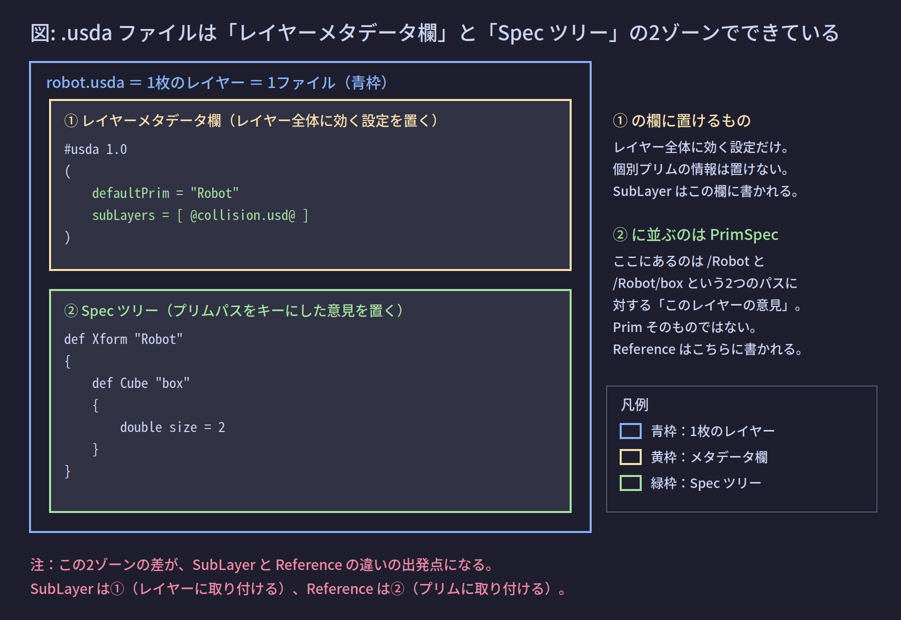
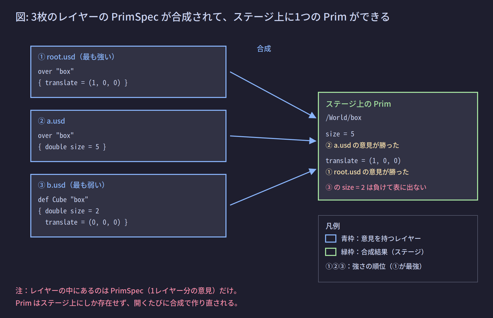

# 02. レイヤーの実体

前ページで「レイヤーは重ねられる記述の1枚であり、実体は1つの `.usd` ファイル」とだけ述べた。このページではファイルを開いて中身を見る。

## 1. この章が解く問題

OpenUSD の解説を読むと、次の2つの表現が説明なしに出てくる。

- 「SubLayer は**レイヤーに**取り付ける」
- 「Reference は**プリムに**取り付ける」

この2つの違いが分からないと、以降の話が全部あいまいになる。この違いはファイルの中身を見れば1秒で分かる。**書かれる場所が物理的に違う**からである。

---

## 2. 解決の方針: テキスト形式で開いて中身を直接見る

USD ファイルには2つの保存形式がある。

- `.usda`: テキスト形式。人間が読める
- `.usdc`: バイナリ形式。読み込みが速く、サイズが小さい

拡張子 `.usd` はどちらでもよい中立の拡張子で、中身がテキストかバイナリかは実際のデータで決まる。`.usdz` はこれらをまとめたパッケージ形式である。【確定】USD が扱うファイル形式はこの4つ（`.usda` / `.usdc` / `.usd` / `.usdz`）で全部である。

バイナリのファイルもテキストに変換して読める。

```bash
usdcat robot.usd
```

このコマンドは中身をテキスト形式で標準出力に流す。以降はこのテキストを見ながら話を進める。

---

## 3. 仕組み

### 3.1 レイヤーは2つのゾーンでできている



`robot.usda` の中身は次のようになっている。

```usda
#usda 1.0
(
    defaultPrim = "Robot"
    subLayers = [ @collision.usd@ ]
)

def Xform "Robot"
{
    def Cube "box"
    {
        double size = 2
    }
}
```

このファイルは2つのゾーンに分かれる。

**① レイヤーメタデータ欄**: 冒頭の `( ... )` の中。**レイヤー全体についての情報**を置く場所。ここに書けるのはレイヤー全体に効く設定だけで、個別の要素の情報は書けない。

**② Spec ツリー**: `def Xform "Robot"` 以降。**プリムパスをキーにした記述**を置く場所。

ここで冒頭の疑問が解ける。

- `subLayers` は**①**に書かれている → だから SubLayer は「レイヤーに取り付ける」
- `references` は**②の中**（個別のプリムの記述の中）に書かれる → だから Reference は「プリムに取り付ける」

### 3.2 レイヤーメタデータ欄に置ける項目

代表的な項目は次の通りである。

| 項目 | 何のためにあるか |
|---|---|
| `defaultPrim` | このファイルが他所から参照されたとき、どのプリムを入口にするか（04 で詳述） |
| `subLayers` | このレイヤーが束ねる他のレイヤーの並び（03 で詳述） |
| `upAxis` | このシーンで上方向がどの軸か（`"Y"` または `"Z"`） |
| `metersPerUnit` | 数値1が実世界の何メートルにあたるか（`1.0` ならメートル単位） |
| `timeCodesPerSecond` | アニメーションの時刻の刻みが1秒あたり何個か |
| `startTimeCode` / `endTimeCode` | アニメーションの開始・終了時刻 |

【未確認】この6項目以外にも登録可能なメタデータは存在する。全件はビルド構成とプラグインの登録内容で変わるため、静的に確定できない。手元のファイルで実際に何が書かれているかは次のコードで全件列挙できる。

```python
from pxr import Sdf
layer = Sdf.Layer.FindOrOpen(r"C:\work\robot.usd")
print(layer.pseudoRoot.ListInfoKeys())
```

想定出力:

```text
['defaultPrim', 'subLayers', 'upAxis', 'metersPerUnit']
```

【確定】`pseudoRoot` はレイヤーメタデータ欄を表すオブジェクトである。`ListInfoKeys()` は、そのレイヤーに**実際に書かれている**項目だけを返す。書かれていない項目は出てこない。

### 3.3 Spec とは何か

**Spec（スペック）** とは、**1枚のレイヤーが、あるパスについて持っている意見**である。「意見（opinion）」は USD の用語で、「このレイヤーはこう主張している」という1件の記述を指す。

Spec には種類がある。

- **PrimSpec**: プリムパスについての意見。`def Xform "Robot"` の1ブロックが `/Robot` の PrimSpec にあたる
- **PropertySpec**: プロパティ（属性やリレーション）についての意見。`double size = 2` が `/Robot/box.size` の PropertySpec にあたる

上の `robot.usda` には次の Spec が入っている。

| パス | Spec の種類 | 内容 |
|---|---|---|
| `/Robot` | PrimSpec | 型は `Xform` |
| `/Robot/box` | PrimSpec | 型は `Cube` |
| `/Robot/box.size` | PropertySpec | 値は `2` |

### 3.4 PrimSpec と Prim の区別

**このノートブックで最重要の区別である。**

- **PrimSpec**: レイヤーの中にある記述。**1枚のレイヤー分の意見**にすぎない
- **Prim**: ステージ上にある要素。**複数レイヤーの PrimSpec を重ねて計算した結果**

**レイヤーの中に Prim は存在しない。PrimSpec しか存在しない。Prim が存在するのはステージ上だけである。**



図の例では、同じパス `/World/box` について3枚のレイヤーがそれぞれ意見を持っている。合成の結果できあがる Prim は1個で、属性ごとに勝った意見の値を持つ。`b.usd` の `size = 2` は、より強い `a.usd` の `size = 5` に負けて表に出ない。どの意見が勝つかの規則は 05 で扱う。

C# のアナロジーで言えば次のようになる。

- PrimSpec ≒ `Dictionary<string, object>` の1個（部分的な設定の断片）
- Prim ≒ それらを強い順にマージした結果のオブジェクト

Python API でもこの区別はそのまま型に現れる。

- `Sdf.PrimSpec`: 特定のレイヤーの中の PrimSpec を指す
- `Usd.Prim`: ステージ上の合成結果の Prim を指す

### 3.5 def / over / class の3つの書き方

Spec ツリーのブロックは3種類の書き出しを持つ。【確定】この3つで全部である。

| 書き出し | 意味 | いつ使われるか |
|---|---|---|
| `def` | このプリムを**定義する**。ステージ上に実体を作る意思がある | アセット本体を書くとき |
| `over` | 定義するつもりはないが、**この属性についてはこう思う** | 他のレイヤーが定義したものを上書きするとき |
| `class` | 定義するが、**それ自体はステージのツリーに現れない雛形** | 継承元の雛形を書くとき（04 で扱う） |

`over` の実例を示す。`base.usd` が定義側だとする。

```usda
# base.usd
def Cube "box"
{
    double size = 2
}
```

これに対して `tweak.usd` は `over` だけを持つ。

```usda
# tweak.usd
over "box"
{
    double size = 5
}
```

`tweak.usd` は「`box` を定義する」とは言っていない。「`box` の `size` は5だと思う」とだけ言っている。`tweak.usd` を単独で開いても `box` はステージに現れない。`base.usd` と重ねて初めて意味を持つ。

【確定】`over` にはプリムの型（`Cube` など）を書かない。型は定義側が決めるものだからである。

### 3.6 メモリ上のレイヤーと、ファイルを持たないレイヤー

レイヤーには3つの現れ方がある。

**① ディスク上のファイル**: `.usda` / `.usdc` / `.usd` / `.usdz`

**② メモリ上の `Sdf.Layer` オブジェクト**: ファイルを開くと生成される。【確定】同じ identifier（＝ファイルパス）に対して、1プロセス内では常に同じ1個のオブジェクトが返る。

```python
from pxr import Sdf
a = Sdf.Layer.FindOrOpen(r"C:\work\robot.usd")
b = Sdf.Layer.FindOrOpen(r"C:\work\robot.usd")
print(a is b)
```

出力:

```text
True
```

これが意味するのは「2つのステージが同じファイルを使っているとき、片方で加えた変更がもう片方にも即座に見える」ということである。ファイルを2回読み込んだつもりでも、実体は1個しかない。

**③ 匿名レイヤー**: ファイルを持たないレイヤー。`Sdf.Layer.CreateAnonymous()` で作る。identifier が `anon:` で始まる。プロセスが終われば消える。

```python
from pxr import Sdf
tmp = Sdf.Layer.CreateAnonymous("scratch")
print(tmp.identifier)
print(tmp.realPath)
```

想定出力:

```text
anon:0000023F1A2B3C40:scratch
```

`realPath`（ディスク上の実際のパス）は空文字列なので、2行目は何も表示されずに改行だけが出る。前ページの `GetLayerStack()` の出力に現れた `anon:` のレイヤーは、これと同じ匿名レイヤーである。

---

## 4. 実装: レイヤーの中身を Python から見る

ステージを経由せず、レイヤー1枚だけを直接開いて中身を数える。

```python
from pxr import Sdf

layer = Sdf.Layer.FindOrOpen(r"C:\work\robot.usd")

print("identifier :", layer.identifier)
print("defaultPrim:", layer.defaultPrim)
print("subLayers  :", list(layer.subLayerPaths))

def walk(spec, depth=0):
    for child in spec.nameChildren:
        props = [p.name for p in child.properties]
        print("  " * depth + f"{child.specifier} {child.typeName or '(型なし)'} "
              f"{child.path} props={props}")
        walk(child, depth + 1)

walk(layer.pseudoRoot)
```

このページ冒頭の `robot.usda` に対する想定出力:

```text
identifier : C:/work/robot.usd
defaultPrim: Robot
subLayers  : ['@collision.usd@']
SdfSpecifierDef Xform /Robot props=[]
  SdfSpecifierDef Cube /Robot/box props=['size']
```

読み取れることは3つある。

- `subLayers` はレイヤー全体の情報として、Spec ツリーとは独立に取れている
- 出てきているのは `Sdf.PrimSpec` であって `Usd.Prim` ではない。ステージを一度も開いていないので Prim は存在しない
- `specifier` が `SdfSpecifierDef` になっている。`over` なら `SdfSpecifierOver`、`class` なら `SdfSpecifierClass` が入る

---

## 理解度確認問題

**問1.** 「SubLayer はレイヤーに取り付ける」「Reference はプリムに取り付ける」の違いを、ファイルの中身の言葉で説明せよ。

<details><summary>解答</summary>

`subLayers` はファイル冒頭の**レイヤーメタデータ欄**（`( ... )` の中）に書かれる。一方 `references` は **Spec ツリーの中の、特定のプリムのブロックの中**に書かれる。書かれる物理的な場所が違う。

</details>

**問2.** 次のファイルを `Usd.Stage.Open()` で単独で開いた。ステージ上に `box` という Prim は現れるか。

```usda
#usda 1.0
over "box"
{
    double size = 5
}
```

<details><summary>解答</summary>

現れない。`over` は「定義するつもりはないが、この属性についてはこう思う」という意見にすぎず、プリムを定義していない。他のレイヤーで `def` されている `box` と重ねて初めて意味を持つ。

</details>

**問3.** `Sdf.Layer.FindOrOpen()` で同じパスを2回開き、片方に変更を加えた。もう片方にその変更は見えるか。理由も述べよ。

<details><summary>解答</summary>

見える。同じ identifier に対して1プロセス内では同一の `Sdf.Layer` オブジェクトが返るため、2つの変数が同じ実体を指している。ファイルを2回読み込んだつもりでも、メモリ上のレイヤーは1個しかない。

</details>

---

## 目次

1. [[01_なぜレイヤーが必要か]]
2. **02 レイヤーの実体**（このページ）
3. [[03_レイヤースタックとSubLayer]]
4. [[04_合成アーク総覧]]
5. [[05_強さ順序LIVRPS]]
6. [[06_書き込み先の制御EditTarget]]
7. [[07_構成に参加しない記述]]
8. [[08_IsaacSimでの実践]]
9. [[09_用語リファレンス]]

前のページ: [[01_なぜレイヤーが必要か]]
次のページ: [[03_レイヤースタックとSubLayer]]
