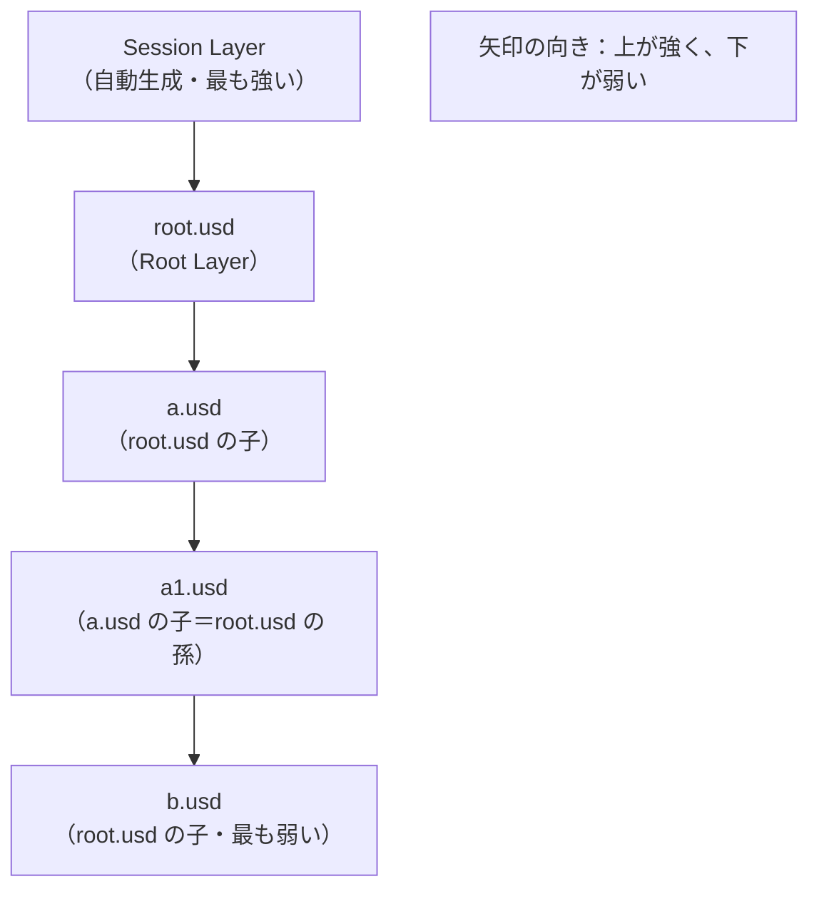

# 03. レイヤースタックと SubLayer

## 1. この章が解く問題

前ページで、レイヤー1枚の中身が「レイヤーメタデータ欄」と「Spec ツリー」に分かれることを見た。ここで残った問題は次の通りである。

- `subLayers = [ @a.usd@, @b.usd@ ]` と書いたとき、`a.usd` と `b.usd` はどう扱われるのか
- SubLayer が入れ子になったら（`a.usd` がさらに SubLayer を持ったら）どうなるのか
- 「ルートレイヤースタックに属する」とは具体的に何を意味するのか

---

## 2. 解決の方針: 再帰的に展開して1本の並びに潰す

OpenUSD は `subLayers` を次のように扱う。

> **起点となる1枚のレイヤーから `subLayers` を再帰的にたどり、すべてを1本の強さ順の並びに平坦化する。**

この平坦化された並びを **レイヤースタック（layer stack）** と呼ぶ。

「起点となる1枚」がステージを開くときに渡したファイルである場合、そのレイヤースタックを特に **ルートレイヤースタック** と呼び、起点の1枚を **Root Layer** と呼ぶ。

---

## 3. 仕組み

### 3.1 展開の規則

次の2ファイルがあるとする。

```usda
# root.usd
#usda 1.0
(
    subLayers = [
        @a.usd@,
        @b.usd@
    ]
)
```

```usda
# a.usd
#usda 1.0
(
    subLayers = [
        @a1.usd@
    ]
)
```

`Usd.Stage.Open("root.usd")` としたときのルートレイヤースタックは次の並びになる。



規則は3つある。【確定】

**規則1: `subLayers` の記述順がそのまま強さ順**。リストの先頭に近いほど強い。`a.usd` が `b.usd` より先に書かれているので `a.usd` の方が強い。

**規則2: 再帰的**。`a.usd` の SubLayer である `a1.usd` も、同じルートレイヤースタックに属する。**直接の子だけではない**。孫でも曾孫でも同じである。展開の位置は「親である `a.usd` の直後、次の兄弟である `b.usd` の前」になる。

**規則3: Session Layer が先頭に入る**。ステージを開いたときに自動生成される匿名レイヤーが、常に最も強い位置に入る（詳細は 06）。

### 3.2 再帰はどこで止まるか

**Reference と Payload の境界で止まる。**【確定】

`root.usd` が `robot.usd` を Reference していて、その `robot.usd` がさらに `robot_base.usd` を SubLayer していたとする。このとき `robot.usd` と `robot_base.usd` は、`robot.usd` を起点とする**別のレイヤースタック**を作る。ルートレイヤースタックには入らない。

```text
[ルートレイヤースタック]              [参照先レイヤースタック]
  Session Layer
  root.usd          ── Reference ──→   robot.usd
  a.usd                                robot_base.usd
  a1.usd
  b.usd
```

この境界がなぜ重要かというと、**Edit Target に選べるレイヤーの範囲がこの境界で決まる**からである（06 で扱う）。左側の5枚は選べて、右側の2枚は選べない。

### 3.3 SubLayer はパスを変えない

SubLayer で束ねられたレイヤーの Spec は、**プリムパスがそのまま**合成される。`a.usd` の中の `/World/Arm/link1` は、ステージ上でも `/World/Arm/link1` である。

これは当たり前に聞こえるが、Reference（04 で扱う）はパスを付け替えるので、対比として重要な性質である。

### 3.4 SubLayer にできないこと

パスを変えないという性質から、SubLayer には構造的にできないことが2つある。

**できないこと1: 同じファイルを2箇所に置く**

`subLayers = [ @arm.usd@, @arm.usd@ ]` と書いても、両方が同じパスに意見を持つだけで、腕が2本になることはない。必ず1つに潰れる。

**できないこと2: 置き場所を指定する**

`a.usd` の中身を `/World/Robot` の下に置きたい、という指定はできない。`a.usd` に書かれたパスがそのまま使われる。

この2つが、部品を配置する用途に SubLayer を使えない理由である。部品の配置には Reference が要る。

### 3.5 SubLayer が向いている用途

パスを変えないという性質は、逆に言えば「**複数のファイルが、同じプリムについて意見を言い合える**」ということである。だから SubLayer は次の用途に向く。

- **1つのシーンを目的別のファイルに分担する**: ジオメトリの層／マテリアルの層／物理設定の層／ライティングの層
- **設定のバリエーションを重ねて試す**: 同じロボットに対する干渉モデルの案Aと案Bを別ファイルにして、上下を入れ替えて比較する

---

## 4. 実装

### 4.1 レイヤースタックを列挙する

```python
from pxr import Usd

stage = Usd.Stage.Open(r"C:\work\root.usd")
for i, layer in enumerate(stage.GetLayerStack()):
    print(i, layer.identifier)
```

3.1 の構成に対する想定出力:

```text
0 anon:0000023F1A2B3C40:root-session.usda
1 C:/work/root.usd
2 C:/work/a.usd
3 C:/work/a1.usd
4 C:/work/b.usd
```

インデックスが小さいほど強い。孫の `a1.usd` が同じ並びに入っていること、`b.usd` より前に来ていることを確認できる。

### 4.2 SubLayer を追加する

`subLayerPaths` はリストとして直接操作できる。

```python
from pxr import Sdf

root = Sdf.Layer.FindOrOpen(r"C:\work\root.usd")

print("before:", list(root.subLayerPaths))

# 先頭に挿す（＝いちばん強い SubLayer になる）
root.subLayerPaths.insert(0, "collision.usd")

# 末尾に足す（＝いちばん弱い SubLayer になる）
root.subLayerPaths.append("lighting.usd")

print("after :", list(root.subLayerPaths))
root.Save()
```

想定出力:

```text
before: ['./a.usd', './b.usd']
after : ['collision.usd', './a.usd', './b.usd', 'lighting.usd']
```

保存後の `root.usd` のレイヤーメタデータ欄は次のようになる。

```usda
#usda 1.0
(
    subLayers = [
        @collision.usd@,
        @./a.usd@,
        @./b.usd@,
        @lighting.usd@
    ]
)
```

【確定】このリストの順序がそのまま強さ順になる。先頭が最も強い。

### 4.3 Isaac Sim の GUI での対応

【確定】Isaac Sim / Omniverse Kit の Layer ウィンドウには、SubLayer を操作するコマンドが用意されている。`omni.kit.usd.layers` が公開しているコマンドクラスは次の通りである。

| コマンド | 何をするか |
|---|---|
| `CreateSublayerCommand` | SubLayer を新規作成、または既存ファイルを挿入する |
| `RemoveSublayerCommand` | 親レイヤーから SubLayer を外す |
| `MoveSublayerCommand` | SubLayer の位置を移動する（＝強さ順を変える） |
| `ReplaceSublayerCommand` | SubLayer を別のファイルに差し替える |
| `MergeLayersCommand` | 2枚のレイヤーを統合する |
| `SetEditTargetCommand` | レイヤーを Edit Target にする（06 で扱う） |

`CreateSublayerCommand` は引数 `create_or_insert`（真偽値）ひとつで「新規作成」と「既存挿入」を切り替える。

- 真: 指定パスに空のレイヤーを新規作成して挿す（GUI の Create Sublayer）
- 偽: 既存ファイルを挿すだけで新規作成しない（GUI の Insert Sublayer）

もうひとつの引数 `transfer_root_content` を真にすると、Root Layer に既にある Spec を、新しく作った SubLayer へ移動する。

【未確認】Isaac Sim 6.0.1 の Layer ウィンドウが、これらのコマンドのうち具体的に何をメニュー項目として露出しているかは確認していない。右クリックメニューの項目名を実機で確認するのが確実である。

---

## 理解度確認問題

**問1.** `root.usd` の `subLayers` が `[@a.usd@, @b.usd@]` で、`a.usd` の `subLayers` が `[@a1.usd@]` のとき、`a1.usd` は `b.usd` より強いか弱いか。

<details><summary>解答</summary>

強い。`a1.usd` は親である `a.usd` の直後、次の兄弟である `b.usd` の前に展開される。並びは `root.usd` → `a.usd` → `a1.usd` → `b.usd` となる。

</details>

**問2.** `subLayers = [ @arm.usd@, @arm.usd@ ]` と書いて、腕を2本にできるか。

<details><summary>解答</summary>

できない。SubLayer はプリムパスを変えないため、2枚とも同じパスに意見を持つだけで、必ず1つに潰れる。同じ部品を複数配置するには Reference が必要である（04 で扱う）。

</details>

**問3.** `root.usd` が `robot.usd` を Reference し、`robot.usd` が `robot_base.usd` を SubLayer している。`robot_base.usd` はルートレイヤースタックに属するか。

<details><summary>解答</summary>

属さない。SubLayer の再帰展開は Reference の境界で止まる。`robot.usd` と `robot_base.usd` は、`robot.usd` を起点とする別のレイヤースタックを作る。

</details>

---

## 目次

1. [[01_なぜレイヤーが必要か]]
2. [[02_レイヤーの実体]]
3. **03 レイヤースタックと SubLayer**（このページ）
4. [[04_合成アーク総覧]]
5. [[05_強さ順序LIVRPS]]
6. [[06_書き込み先の制御EditTarget]]
7. [[07_構成に参加しない記述]]
8. [[08_IsaacSimでの実践]]
9. [[09_用語リファレンス]]

前のページ: [[02_レイヤーの実体]]
次のページ: [[04_合成アーク総覧]]
