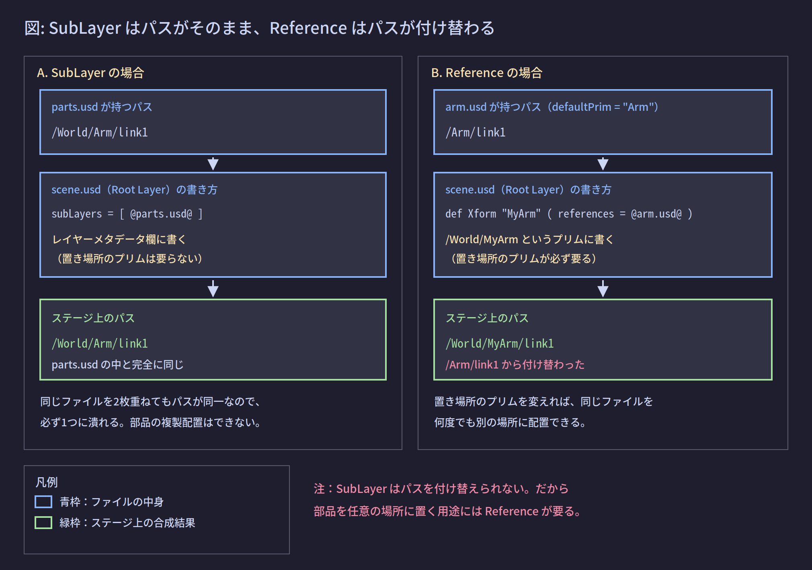

# 04. 合成アーク総覧

## 1. この章が解く問題

前ページまでで扱ったのは SubLayer 1種類だけだった。しかし SubLayer では「同じ部品を2箇所に置く」「部品を任意のプリムの下に置く」ができない。この2つは3Dシーンの組み立てに必須である。

ここでは、レイヤーどうしを束ねる方法の**全種類**を定義し、それぞれが何のためにあるかを整理する。

---

## 2. 解決の方針: 束ね方を複数用意する

OpenUSD は、レイヤーの内容を持ち込む方法を6種類用意した。この6種類を **合成アーク（composition arc）** と呼ぶ。

「アーク」は「弧」の意味で、グラフ理論の有向辺に由来する。「このレイヤー（またはプリム）から、あちらのレイヤー（またはプリム）へ内容を持ち込む」という**有向のつながり1本**を指す。

---

## 3. 仕組み

### 3.1 合成アークは6種類

【確定】OpenUSD の合成アークは次の6種類で全部である。頭文字をつなげて **LIVRPS** と呼ばれる（この順序の意味は 05 で扱う）。

| 略号 | アーク名 | 取り付ける先 | 何のためにあるか |
|---|---|---|---|
| L | Sublayers | レイヤー | 同じシーンへの記述を複数ファイルに分担する |
| I | Inherits | プリム | 雛形プリムの内容を、複数のプリムに継承させる |
| V | VariantSets | プリム | 1つのプリムに複数の選択肢を持たせ、1つを選ぶ |
| R | References | プリム | 別ファイルの内容を、指定したプリムの下に配置する |
| P | Payloads | プリム | Reference と同じことを、遅延ロード可能な形で行う |
| S | Specializes | プリム | 別プリムを土台にしつつ、自分の意見を必ず優先させる |

**L だけがレイヤーに取り付き、残り5種はプリムに取り付く。** これが 02 で見た「書かれる場所の違い」の全体像である。

以下、SubLayer 以外の5つを順に定義する。

### 3.2 References

**定義**: 別のレイヤーの内容を、指定したプリムの下に配置する合成アーク。

```usda
# scene.usd
def Xform "World"
{
    def Xform "MyArm" (
        references = @arm.usd@
    )
    {
    }
}
```

`arm.usd` の中身が次だとする。

```usda
# arm.usd
#usda 1.0
(
    defaultPrim = "Arm"
)

def Xform "Arm"
{
    def Xform "link1"
    {
    }
}
```

このとき、ステージ上には次のパスが現れる。

```text
/World
/World/MyArm
/World/MyArm/link1
```

`arm.usd` の中では `/Arm/link1` だったものが、ステージ上では `/World/MyArm/link1` になっている。この**パスの付け替え**が Reference の中核である。



Reference には3つの重要な性質がある。

**性質1: パスを付け替える**。参照先の内容は、配置先プリムの下にぶら下がる。参照先の中の相対的な構造（`Arm` の下に `link1`）は保たれるが、先頭が付け替わる。

**性質2: 同じファイルを何度でも配置できる**。配置先プリムが違えば、同じ `arm.usd` を左腕と右腕の2箇所に置ける。

```usda
def Xform "World"
{
    def Xform "LeftArm"  ( references = @arm.usd@ ) { }
    def Xform "RightArm" ( references = @arm.usd@ ) { }
}
```

ステージ上のパスは `/World/LeftArm/link1` と `/World/RightArm/link1` の2組になる。

**性質3: 名前空間をカプセル化する**。参照先は、参照先ファイルを起点とする**別のレイヤースタック**になる。この境界を越えて構造を書き換えることはできない。具体的には次ができない。

- 参照元のレイヤーから、参照先のファイルに書き込む
- `/World/MyArm/link1` を `/World/OtherPlace/link1` に移動する

参照元から書けるのは `over` だけであり、`over` は**同じパスにしか書けない**。プリムの移動は「別のパスに置き直す」ことなので、`over` では表現できない。

### 3.3 defaultPrim: 参照されたときの入口

上の `arm.usd` には `defaultPrim = "Arm"` が書かれていた。

**定義**: `defaultPrim` は**レイヤーメタデータ欄**（02 参照）に置く項目で、「このファイルが他所から参照されたとき、プリムパスの指定がなければどのプリムを持っていくか」を指定する。値はルートレベルのプリム名である。

【確定】必須ではない。設定されていないファイルは正当に存在する。

設定されていない場合、`references = @arm.usd@` と書いても**何も持ち込まれない**。ステージ上に `/World/MyArm` は空の `Xform` として現れるだけで、`link1` は出てこない。

回避策は2つある。

- ファイル側に `defaultPrim` を設定する
- 参照側でプリムパスを明示する: `references = @arm.usd@</Arm>`

【確定】`defaultPrim` は「参照されたときの入口」の指定でしかない。そのファイルを `Usd.Stage.Open()` で**直接開いた場合は無関係**であり、ルートレベルのプリムがすべてステージに現れる。

【未確認】Isaac Sim 6.0.1 の URDF Importer が変換後の USD に `defaultPrim` を設定するかどうかは確認していない。次の1行で確認できる。

```python
from pxr import Sdf
print(Sdf.Layer.FindOrOpen(r"C:\work\robot.usd").defaultPrim)
```

空文字列が返れば未設定である。

### 3.4 Payloads

**定義**: Reference とほぼ同じことをするが、**明示的にロードするまでステージに構成されない**合成アーク。

```usda
def Xform "MyArm" (
    payload = @arm.usd@
)
{
}
```

Reference との違いは1点だけである。

- **Reference**: ステージを開いた時点で必ず読み込まれる
- **Payload**: ステージを開いた時点では読み込まれない。`prim.Load()` するか、ステージを `Usd.Stage.LoadAll` で開くまで中身が出てこない

何のためにあるかというと、**重いアセットを含む巨大なシーンを、軽く開けるようにするため**である。工場のシーンに100台のロボットがあるとき、全部の詳細ジオメトリを読み込むと開くだけで数分かかる。Payload にしておけば、必要なものだけ読み込める。

```python
from pxr import Usd

# Payload を読み込まずに開く
stage = Usd.Stage.Open(r"C:\work\factory.usd", Usd.Stage.LoadNone)
prim = stage.GetPrimAtPath("/World/Robot01")
print("children before:", [c.GetName() for c in prim.GetChildren()])

prim.Load()
print("children after :", [c.GetName() for c in prim.GetChildren()])
```

想定出力:

```text
children before: []
children after : ['link1', 'link2', 'link3']
```

### 3.5 Inherits

**定義**: 雛形となるプリムの内容を、複数のプリムに継承させる合成アーク。

C# の継承に最も近い。ただし継承されるのは「型」ではなく「意見」である。

```usda
class "_BoltStyle"
{
    double physics:mass = 0.05
    color3f[] primvars:displayColor = [(0.7, 0.7, 0.7)]
}

def Xform "bolt_A" ( inherits = </_BoltStyle> ) { }
def Xform "bolt_B" ( inherits = </_BoltStyle> ) { }
def Xform "bolt_C" ( inherits = </_BoltStyle> ) { }
```

`_BoltStyle` は `class` で書かれている（02 参照）ので、それ自体はステージのツリーに現れない。しかし `bolt_A` / `bolt_B` / `bolt_C` の3つは、いずれも `physics:mass = 0.05` を持つ。

Inherits の特徴は **後から一括で変えられる**ことである。`_BoltStyle` の `physics:mass` を `0.08` に書き換えれば、3つとも同時に変わる。Reference で3回コピーした場合、3箇所を書き換える必要がある。

### 3.6 VariantSets

**定義**: 1つのプリムに複数の選択肢を持たせ、そのうち1つを選ぶ合成アーク。

```usda
def Xform "Gripper" (
    variants = { string modelVariant = "wide" }
    prepend variantSets = "modelVariant"
)
{
    variantSet "modelVariant" = {
        "narrow" {
            def Cube "pad" { double size = 0.02 }
        }
        "wide" {
            def Cube "pad" { double size = 0.05 }
        }
    }
}
```

選択されている `"wide"` の中身だけがステージに構成される。`"narrow"` の中身はファイルに存在するがステージに出てこない（07 で扱う）。

選択は実行時に切り替えられる。

```python
vset = prim.GetVariantSets().GetVariantSet("modelVariant")
print("current:", vset.GetVariantSelection())
print("choices:", vset.GetVariantNames())
vset.SetVariantSelection("narrow")
print("after  :", vset.GetVariantSelection())
```

想定出力:

```text
current: wide
choices: ['narrow', 'wide']
after  : narrow
```

### 3.7 Specializes

**定義**: 別のプリムを土台にしつつ、**自分の意見を必ず優先させる**合成アーク。

Inherits と似ているが、強さの扱いが逆になる。

- **Inherits**: 継承元の意見は比較的強い。継承元を書き換えると、継承先の個別の設定を押しのけることがある
- **Specializes**: 特殊化元の意見は**常に最も弱い**。特殊化先が自分で値を持っていれば、必ず特殊化先が勝つ

何のためにあるかというと、「**基本のマテリアルを土台にして、個別に上書きした部分だけは絶対に守りたい**」という場面である。土台側をいくらいじっても、上書きした値は上書きされない。

### 3.8 SubLayer と Reference を選ぶ基準

実務で迷うのはこの2つなので、判断基準を独立して書いておく。

| 判断 | 使うアーク |
|---|---|
| 別のものを**置きたい**（部品の配置） | Reference |
| 同じものへの記述を**分けたい**（担当の分割） | SubLayer |

言い換えると次のようになる。

- 置き場所のプリムを指定したいなら Reference。SubLayer には指定する場所がない
- 同じファイルを複数箇所に置きたいなら Reference。SubLayer では潰れる
- ファイルどうしが同じプリムについて意見を言い合ってほしいなら SubLayer

**この2つは競合する選択肢ではない。** 実際のシーンでは両方を同時に使う（08 で実例を扱う）。

---

## 4. 実装

### 4.1 Reference を追加して、パスの変化を確認する

```python
from pxr import Usd, UsdGeom, Sdf

stage = Usd.Stage.CreateNew(r"C:\work\scene.usd")
world = UsdGeom.Xform.Define(stage, "/World")
arm = UsdGeom.Xform.Define(stage, "/World/MyArm")

arm.GetPrim().GetReferences().AddReference(r"C:\work\arm.usd")

for prim in stage.Traverse():
    print(prim.GetPath())
```

`arm.usd` が `defaultPrim = "Arm"` を持ち、その下に `link1` がある場合の想定出力:

```text
/World
/World/MyArm
/World/MyArm/link1
```

`defaultPrim` が未設定だった場合の想定出力:

```text
/World
/World/MyArm
```

`link1` が現れないので、`defaultPrim` の設定漏れはこの差で判別できる。

### 4.2 プリムがどのレイヤーの意見でできているか調べる

```python
prim = stage.GetPrimAtPath("/World/MyArm/link1")
for spec in prim.GetPrimStack():
    print(spec.layer.identifier, spec.path)
```

想定出力:

```text
C:/work/arm.usd /Arm/link1
```

出力に外部ファイルが現れれば、そのプリムは Reference（または Payload）で持ち込まれたものである。`C:/work/scene.usd` だけしか出てこなければ、そのプリムはルートレイヤースタックの中で直接定義されている。この判別は 08 で重要になる。

`spec.path` が `/Arm/link1`（ステージ上のパス `/World/MyArm/link1` ではない）になっている点に注目してほしい。参照先のレイヤーの中では、あくまで元のパスのままである。ステージ上のパスは合成時に付け替えられた姿である。

---

## 理解度確認問題

**問1.** 合成アークは全部で何種類あり、そのうちレイヤーに取り付くものはどれか。

<details><summary>解答</summary>

6種類（Sublayers / Inherits / VariantSets / References / Payloads / Specializes）。このうちレイヤーに取り付くのは Sublayers だけで、残り5種はプリムに取り付く。

</details>

**問2.** `references = @arm.usd@` と書いたのに、配置先プリムの下に何も現れなかった。最も可能性が高い原因は何か。

<details><summary>解答</summary>

`arm.usd` の `defaultPrim` が設定されていない。プリムパスを指定しない Reference は `defaultPrim` を入口にするため、未設定だと何も持ち込まれない。`references = @arm.usd@</Arm>` のようにパスを明示するか、ファイル側に `defaultPrim` を設定すれば解決する。

</details>

**問3.** Reference で配置した `/World/MyArm/link1` を、`/World/Other/link1` に移動したい。参照元のレイヤーだけで実現できるか。

<details><summary>解答</summary>

できない。Reference は名前空間をカプセル化しており、参照元から書けるのは同じパスに対する `over` だけである。プリムの移動は別のパスへの置き直しなので `over` では表現できない。配置先プリムを変えて Reference を張り直すか、レイヤーをフラット化する必要がある（08 で扱う）。

</details>

---

## 目次

1. [[01_なぜレイヤーが必要か]]
2. [[02_レイヤーの実体]]
3. [[03_レイヤースタックとSubLayer]]
4. **04 合成アーク総覧**（このページ）
5. [[05_強さ順序LIVRPS]]
6. [[06_書き込み先の制御EditTarget]]
7. [[07_構成に参加しない記述]]
8. [[08_IsaacSimでの実践]]
9. [[09_用語リファレンス]]

前のページ: [[03_レイヤースタックとSubLayer]]
次のページ: [[05_強さ順序LIVRPS]]
