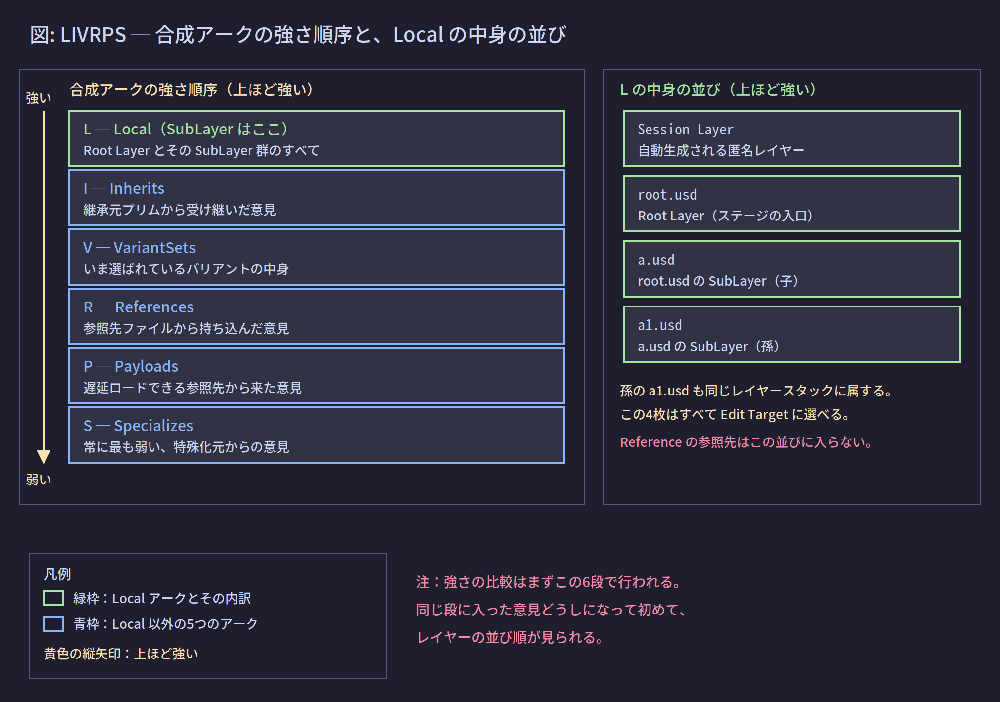

# 05. 強さ順序 LIVRPS

## 1. この章が解く問題

前ページまでで、同じプリムパスに対して複数の場所から意見が来ることが分かった。

- SubLayer で束ねた4枚のレイヤーが、それぞれ `/World/box` の `size` について意見を持つ
- さらに Reference で持ち込んだファイルも `size` について意見を持つ
- Inherits の継承元も `size` について意見を持つ

**どの意見が勝つのか。** これを決める規則がなければ、合成の結果が予測できない。

---

## 2. 解決の方針: 固定された優先順位を1つ定める

OpenUSD は、意見の強さを決める順序を**仕様として固定**した。この順序は設定で変えられない。

順序は合成アークの種類で決まり、頭文字をつなげて **LIVRPS** と呼ばれる。【確定】

---

## 3. 仕組み

### 3.1 強さは2段階で決まる

ここが最も誤解されやすい点である。強さの比較は**1段階ではなく2段階**で行われる。

- **第1段階**: 意見がどの合成アーク経由で来たかを比較する。LIVRPS の順に強い
- **第2段階**: 同じアークに属する意見どうしになって初めて、レイヤーの並び順を見る



### 3.2 第1段階: アークの順序

| 順位 | 略号 | アーク | この段に入る意見 |
|---|---|---|---|
| 1（最強） | L | Local | そのレイヤースタック全体（Root Layer とすべての SubLayer）に書かれた意見 |
| 2 | I | Inherits | 継承元プリムから受け継いだ意見 |
| 3 | V | VariantSets | いま選ばれているバリアントの中身の意見 |
| 4 | R | References | 参照先ファイルから持ち込んだ意見 |
| 5 | P | Payloads | 遅延ロードされる参照先から来た意見 |
| 6（最弱） | S | Specializes | 特殊化元からの意見 |

### 3.3 L は「Root Layer」ではなく「レイヤースタック全体」

**この点を取り違えると、以降の判断がすべて狂う。**

LIVRPS の L は Local である。Local が指すのは Root Layer 1枚ではなく、**そのレイヤースタックに属するレイヤー全部**である。03 で見た通り、これには Session Layer・Root Layer・すべての SubLayer（孫以降を含む）が入る。

ここから重要な帰結が出る。

> **最も弱い SubLayer に書いた意見でも、Reference で持ち込んだ意見には必ず勝つ。**

`root.usd` の SubLayer リストの一番下に置いた `b.usd` は、レイヤースタックの中では最弱である。しかしそれは L の中での話であり、L 全体は R より強い。だから `b.usd` の意見は、Reference 先の `arm.usd` の意見に勝つ。

### 3.4 第2段階: 同じアーク内での順序

同じ段に入った意見どうしは、次の規則で比較される。

- **L の中**: レイヤースタックの並び順。先頭（Session Layer 側）が強い
- **R の中**: 1つのプリムに複数の Reference が張られている場合、リストの後ろに書かれたものが強い【未確認】この順序は仕様として定義されているが、実機での挙動確認はしていない。`prim.GetPrimStack()` の並びで確認できる
- **I / V / P / S の中**: それぞれ同様に、そのアークのリスト順で決まる

### 3.5 具体例で追う

次の構成を考える。

```usda
# root.usd  ← Root Layer
#usda 1.0
(
    subLayers = [ @a.usd@, @b.usd@ ]
)

over "World"
{
    over "MyArm"
    {
        over "link1"
        {
            double physics:mass = 10
        }
    }
}
```

```usda
# a.usd  ← root.usd の SubLayer（強い方）
#usda 1.0

over "World" { over "MyArm" { over "link1" { double physics:mass = 20 } } }
```

```usda
# b.usd  ← root.usd の SubLayer（弱い方）
#usda 1.0

def Xform "World"
{
    def Xform "MyArm" ( references = @arm.usd@ )
    {
    }
}
```

```usda
# arm.usd  ← Reference される側
#usda 1.0
(
    defaultPrim = "Arm"
)

def Xform "Arm"
{
    def Xform "link1"
    {
        double physics:mass = 99
        double physics:density = 1000
    }
}
```

`/World/MyArm/link1` の `physics:mass` は何になるか。

意見は4件ある。

| 出所 | 値 | アーク | L 内の順位 |
|---|---|---|---|
| `root.usd` | 10 | L | 2番目（Session Layer の次） |
| `a.usd` | 20 | L | 3番目 |
| `b.usd` | なし | L | 4番目 |
| `arm.usd` | 99 | R | ─ |

第1段階で `arm.usd` の 99 は R なので、L の3件に負けて脱落する。第2段階で L の中を比較すると、`root.usd` が `a.usd` より強い。

**答え: `physics:mass` は 10 になる。**

一方 `physics:density` については、意見を持っているのが `arm.usd` の1件だけである。競合相手がいないので **1000 がそのまま採用される**。

ここが合成の性質を表している。**属性ごとに独立して勝敗が決まる。** 「`arm.usd` が負けたからその中身が全部消える」わけではない。

### 3.6 弱い意見はどこへ行くのか

負けた意見は消えるのではなく、**そのレイヤーに書かれたまま残る**。合成結果に現れないだけである。

だから、強いレイヤーを外す（SubLayer リストから削除する、無効化する）と、下に埋もれていた意見が表に出てくる。これが 01 で述べた「弱点3: 元に戻せない」の解消である。

---

## 4. 実装

### 4.1 勝った意見と、その出所を調べる

```python
from pxr import Usd

stage = Usd.Stage.Open(r"C:\work\root.usd")
attr = stage.GetPrimAtPath("/World/MyArm/link1").GetAttribute("physics:mass")

print("value:", attr.Get())
for spec in attr.GetPropertyStack(Usd.TimeCode.Default()):
    print("  opinion:", spec.layer.identifier, "=", spec.default)
```

3.5 の構成に対する想定出力:

```text
value: 10.0
  opinion: C:/work/root.usd = 10.0
  opinion: C:/work/a.usd = 20.0
  opinion: C:/work/arm.usd = 99.0
```

【確定】`GetPropertyStack()` は、その属性についての意見を**強い順**に返す。先頭が勝った意見である。`b.usd` は `physics:mass` について意見を持たないので現れない。

この関数は、後のページで扱う「書き込んだのに反映されない」問題の診断に直接使える。自分が書き込んだレイヤーが2番目以降に出てきていれば、負けているということである。

### 4.2 属性ごとに独立して勝敗が決まることを確認する

```python
prim = stage.GetPrimAtPath("/World/MyArm/link1")
for name in ["physics:mass", "physics:density"]:
    a = prim.GetAttribute(name)
    winner = a.GetPropertyStack(Usd.TimeCode.Default())[0]
    print(f"{name:18s} = {a.Get():8.1f}  from {winner.layer.identifier}")
```

想定出力:

```text
physics:mass       =     10.0  from C:/work/root.usd
physics:density    =   1000.0  from C:/work/arm.usd
```

同じプリムでありながら、属性ごとに勝ったレイヤーが違う。

### 4.3 プリムがどのアークで構成されているか調べる

```python
from pxr import Usd

prim = stage.GetPrimAtPath("/World/MyArm/link1")
print(prim.GetPrimIndex().DumpToString())
```

**PrimIndex** とは、そのプリムを構成するために辿ったアークの木構造そのものである。`DumpToString()` は、その木をテキストで書き出す。

想定出力（抜粋）:

```text
Node 0:
    Type: root
    Path: /World/MyArm/link1
    Layer Stack: [root.usd, a.usd, b.usd]
Node 1:
    Type: reference
    Path: /Arm/link1
    Layer Stack: [arm.usd]
```

【未確認】`DumpToString()` の出力書式は OpenUSD のバージョンで変わりうる。ここに示したのは構造の説明のための簡略形であり、実際の出力はより詳細な項目を含む。

`Type: root` のノードがルートレイヤースタック（＝L）、`Type: reference` のノードが Reference 経由（＝R）である。ノード0が最も強い。

---

## 理解度確認問題

**問1.** `root.usd` の SubLayer リストの最後尾に置いた `z.usd` に `size = 3` と書いた。Reference 先の `part.usd` には `size = 7` と書かれている。合成結果の `size` はいくつか。

<details><summary>解答</summary>

3。`z.usd` はレイヤースタックの中では最弱だが、それは L の中での順位にすぎない。L 全体は R より強いので、`z.usd` の意見が `part.usd` の意見に勝つ。

</details>

**問2.** LIVRPS の L が指すのは Root Layer 1枚か、それともレイヤースタック全体か。

<details><summary>解答</summary>

レイヤースタック全体。Session Layer・Root Layer・すべての SubLayer（孫以降を含む）が L に入る。

</details>

**問3.** Reference 先が `mass` と `density` の2つの属性を持ち、ルートレイヤースタック側は `mass` だけに意見を持っている。`density` はどうなるか。

<details><summary>解答</summary>

Reference 先の値がそのまま採用される。勝敗は属性ごとに独立して決まるため、競合相手のいない `density` は Reference 先の意見がそのまま通る。「Reference が負けたから中身が全部消える」ということは起きない。

</details>

---

## 目次

1. [[01_なぜレイヤーが必要か]]
2. [[02_レイヤーの実体]]
3. [[03_レイヤースタックとSubLayer]]
4. [[04_合成アーク総覧]]
5. **05 強さ順序 LIVRPS**（このページ）
6. [[06_書き込み先の制御EditTarget]]
7. [[07_構成に参加しない記述]]
8. [[08_IsaacSimでの実践]]
9. [[09_用語リファレンス]]

前のページ: [[04_合成アーク総覧]]
次のページ: [[06_書き込み先の制御EditTarget]]
