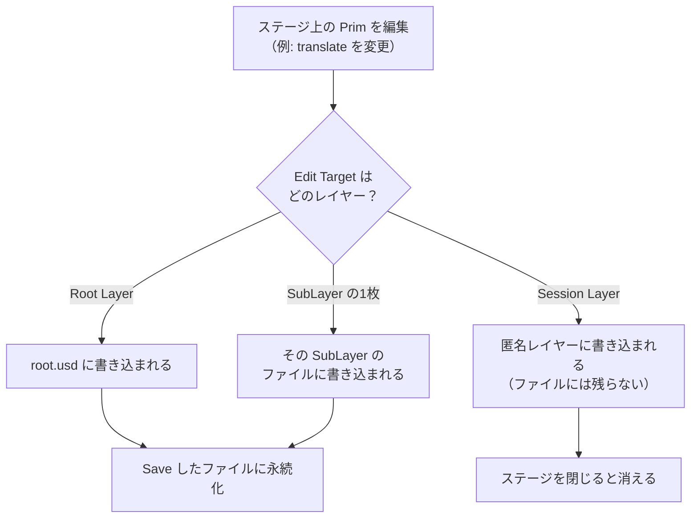

# 06. 書き込み先の制御 Edit Target

## 1. この章が解く問題

ここまでは「読む側」の話だった。複数のレイヤーがどう重なって、何が見えるかを扱ってきた。

このページは「書く側」を扱う。問題は次の1点である。

> **ステージ上のプリムを編集したとき、その変更はどのファイルに書き込まれるのか。**

ステージ自体はメモリ上の計算結果なので保存できない（01 参照）。だから編集内容は必ず、ステージを構成しているレイヤーのどれか1枚に書き込まれる。「どれか1枚」を決める仕組みが必要になる。

---

## 2. 解決の方針: 書き込み先を1つ指名しておく

OpenUSD は、ステージごとに「いまの書き込み先」を1つ保持する。これを **Edit Target（編集ターゲット）** と呼ぶ。

Omniverse / Isaac Sim の GUI では同じものを **Authoring Layer（オーサリングレイヤー）** と呼ぶ。Layer パネルで対象レイヤーをダブルクリックすると切り替わり、選ばれているレイヤーが色付きで表示される。

Photoshop などの画像編集ソフトで「いま選択しているレイヤーに描画される」のと同じ発想である。

---

## 3. 仕組み

### 3.1 Edit Target はステージの状態であって、ファイルの情報ではない

**Edit Target はどのファイルにも保存されない。** ステージを開いている間だけ存在するセッション状態である。既定値は Root Layer である。

ここで 04 で扱った `defaultPrim` と混同しやすいので、対比しておく。名前が似ているだけで、まったく無関係である。

| | defaultPrim | Edit Target |
|---|---|---|
| 何を決めるか | 参照されたときの入口プリム | 編集の書き込み先レイヤー |
| どこに存在するか | レイヤーメタデータ欄（ファイルに保存される） | ステージのセッション状態（保存されない） |
| 値の型 | プリム名（トークン） | レイヤーの指定 |
| いつ効くか | 他所から Reference / Payload されたとき | 編集操作を行うたび |

### 3.2 書き込みの流れ



### 3.3 Edit Target に選べる範囲

【確定】Edit Target に選べるのは、**そのステージのルートレイヤースタックに属するレイヤー**である。

03 で見た通り、ルートレイヤースタックには次が入る。

- Session Layer
- Root Layer
- すべての SubLayer（直接の子だけでなく、孫・曾孫も含む）

逆に選べないのは次である。

- **Reference / Payload で持ち込まれたレイヤー**。別のレイヤースタックに属するため
- **ロックされたレイヤー**（後述）
- **書き込み不可のレイヤー**（読み取り専用のファイル、書き込みに対応しない形式）

実用上は次の対応で覚えればよい。

> **Layer ウィンドウのツリーに表示されているものが、そのままルートレイヤースタックである。ツリーの深さは関係ない。**

### 3.4 書き込まれる内容は `def` ではなく `over`

Edit Target が、そのプリムを定義していないレイヤーだった場合、書き込みは `over` の形になる（02 参照）。

`b.usd` が定義側だとする。

```usda
# b.usd
def Xform "box"
{
    double3 xformOp:translate = (0, 0, 0)
    uniform token[] xformOpOrder = ["xformOp:translate"]
}
```

Edit Target を `a.usd` にして `box` を移動すると、`a.usd` に次が書かれる。

```usda
# a.usd
over "box"
{
    double3 xformOp:translate = (1, 0, 0)
}
```

`def` ではなく `over` になっている。「この `box` を定義するつもりはないが、`translate` についてはこう思う」という意見だけが書かれる。

### 3.5 「書き込みは成功したのに、見た目が変わらない」

実務でいちばん時間を溶かす現象なので、独立した節にする。

**Edit Target への書き込みは、レイヤーへの書き込みとしては必ず成功する。しかし、合成結果に現れるとは限らない。**

3.4 の例で、`a.usd` と `b.usd` の強さ関係が2通りありうる。

- **`a.usd` の方が強い場合**: `over` が勝ち、ビューポート上で `box` が動く。期待通り
- **`b.usd` の方が強い場合**: `over` は `a.usd` に確かに書かれているが、`b.usd` の意見に負けて**ビューポートは動かない**

後者が「Save したのに反映されない」の正体である。ファイルを開けば `over` は存在する。書き込みが失敗したわけではない。

診断は 05 の `GetPropertyStack()` でできる。自分が書き込んだレイヤーが2番目以降に出てくれば負けている。

**この現象は、属性の書き込みが失敗するケースとは別物である。** 区別しておく。

| | 書き込み自体が失敗 | 書けたが負けている |
|---|---|---|
| `Usd.Attribute.Set()` の戻り値 | `False` | `True` |
| レイヤーのファイルの中身 | 何も書かれていない | `over` が書かれている |
| 主な原因 | インスタンスプロキシへの書き込み、ステージ参照の陳腐化、必要なスキーマが未適用 | Edit Target より強いレイヤーが同じ属性に意見を持っている |
| 診断方法 | `Set()` の戻り値を確認する | `GetPropertyStack()` の並びを確認する |

【確定】`Usd.Attribute.Set()` は失敗しても例外を投げず `False` を返す。戻り値を捨てていると、どちらの現象なのか区別できなくなる。

### 3.6 Session Layer

**定義**: ステージを開いたときに**自動生成される匿名レイヤー**であり、ルートレイヤースタックの**最上位（最も強い位置）**に載る。

性質は4つある。【確定】

- `stage.GetSessionLayer()` で取得できる
- 匿名レイヤー（02 参照）なので、通常はファイルとして保存されない。ステージを閉じれば消える
- ルートレイヤースタックの一員なので、**Edit Target に選べる**
- 最も強いので、ここに書いた意見は他のどのレイヤーにも負けない

何のためにあるかというと、**元のアセットを1バイトも汚さずに、一時的な意見を足すため**である。典型的な用途は次の3つである。

- ビューポートの表示状態のような、保存したくない設定
- 共同編集セッション中の差分の一時置き場
- 可視化用のプリムや属性を、検証中だけ追加する

最後の用途が最も実用的である。可視化用のプリムを Session Layer に書けば、次の3つが同時に手に入る。

- Root Layer にも参照先アセットにも一切書き込まれない
- ステージを閉じれば自動で消えるので、後片付けが要らない
- 最強レイヤーなので、下のどのレイヤーが何を言っていても可視化が勝つ

### 3.7 レイヤーの保護

複数人で作業する場合、Edit Target の取り違えは事故に直結する。【確定】Isaac Sim / Omniverse Kit の `omni.kit.usd.layers` には、保護のためのコマンドが用意されている。

| 機構 | コマンドクラス | 何をするか |
|---|---|---|
| Layer Locking | `LockLayerCommand` | レイヤー単位で書き込み禁止にする。Edit Target に選べなくなる |
| Spec Locking | `LockSpecsCommand` | プリム単位で編集禁止にする |
| Spec Linking | `LinkSpecsCommand` | 特定のプリムを特定のレイヤーに紐付け、そこにしか書けなくする |
| Auto Authoring | `AutoAuthoring` | Edit Target を自動的に振り分けるモード。公式ドキュメント上は実験的機能とされている |
| Live Session | `LiveSession` | Session Layer 経由でリアルタイム同期し、終了時にマージする |

【未確認】Isaac Sim 6.0.1 の Layer ウィンドウが、これらのうち何を GUI として露出しているかは確認していない。コマンドクラスの存在は API ドキュメントで確認済みだが、UI の有無は別問題である。

---

## 4. 実装

### 4.1 いまの Edit Target を確認する

```python
from pxr import Usd

stage = Usd.Stage.Open(r"C:\work\root.usd")
print("edit target:", stage.GetEditTarget().GetLayer().identifier)
```

想定出力:

```text
edit target: C:/work/root.usd
```

既定では Root Layer が Edit Target になっている。

### 4.2 Edit Target を切り替えて書き込む

`Usd.EditContext` を使うと、`with` ブロックの中だけ書き込み先を変えられる。ブロックを抜けると元に戻る。

```python
from pxr import Usd, UsdGeom, Sdf

stage = Usd.Stage.Open(r"C:\work\root.usd")
a_layer = Sdf.Layer.FindOrOpen(r"C:\work\a.usd")

prim = stage.GetPrimAtPath("/World/box")

with Usd.EditContext(stage, a_layer):
    ok = UsdGeom.Xformable(prim).AddTranslateOp().Set((1.0, 0.0, 0.0))
    print("Set() returned:", ok)
    print("writing to    :", stage.GetEditTarget().GetLayer().identifier)

print("back to       :", stage.GetEditTarget().GetLayer().identifier)
a_layer.Save()
```

想定出力:

```text
Set() returned: True
writing to    : C:/work/a.usd
back to       : C:/work/root.usd
```

保存後の `a.usd` の中身:

```usda
#usda 1.0

over "World"
{
    over "box"
    {
        double3 xformOp:translate = (1, 0, 0)
        uniform token[] xformOpOrder = ["xformOp:translate"]
    }
}
```

`/World` も `over` になっている点に注目してほしい。`box` に意見を書くには親の `World` も記述する必要があるが、`a.usd` は `World` を定義するつもりはないので `over` になる。

### 4.3 Session Layer に書き込む

```python
from pxr import Usd, UsdGeom

stage = Usd.Stage.Open(r"C:\work\root.usd")

with Usd.EditContext(stage, stage.GetSessionLayer()):
    marker = UsdGeom.Sphere.Define(stage, "/World/_DebugMarker")
    marker.GetRadiusAttr().Set(0.05)

print("root layer dirty  :", stage.GetRootLayer().dirty)
print("session has marker:", bool(stage.GetSessionLayer().GetPrimAtPath("/World/_DebugMarker")))
print(stage.GetSessionLayer().ExportToString())
```

想定出力:

```text
root layer dirty  : False
session has marker: True
#usda 1.0

over "World"
{
    def Sphere "_DebugMarker"
    {
        double radius = 0.05
    }
}
```

`dirty` が `False` なので、Root Layer には何も書かれていない。可視化用のプリムは Session Layer の中だけに存在する。ステージを閉じれば消える。

### 4.4 「書けたが負けている」を診断する

```python
from pxr import Usd

attr = stage.GetPrimAtPath("/World/box").GetAttribute("xformOp:translate")

stack = attr.GetPropertyStack(Usd.TimeCode.Default())
for rank, spec in enumerate(stack):
    mark = "  <= 勝ち" if rank == 0 else ""
    print(f"{rank}: {spec.layer.identifier} = {spec.default}{mark}")
```

`a.usd` に書いたが `b.usd` の方が強かった場合の想定出力:

```text
0: C:/work/b.usd = (0, 0, 0)  <= 勝ち
1: C:/work/a.usd = (1, 0, 0)
```

自分が書いた `a.usd` が1番目（インデックス1）に来ている。書き込みは成功しているが負けている、という状態がこれで確定する。

対処は2つある。

- `a.usd` を `b.usd` より強い位置に移動する（`subLayerPaths` の順序を変える）
- そもそも Edit Target を `b.usd` より強いレイヤーに変える

---

## 理解度確認問題

**問1.** `defaultPrim` と Edit Target の違いを、「どこに保存されるか」の観点で説明せよ。

<details><summary>解答</summary>

`defaultPrim` はレイヤーメタデータ欄に書かれ、**ファイルに保存される**。Edit Target はステージのセッション状態であり、**どのファイルにも保存されない**。ステージを閉じれば失われ、次に開いたときは既定値の Root Layer に戻る。

</details>

**問2.** `a.usd` を Edit Target にして `/World/box` の `size` を変更し、保存した。ビューポートは変わらなかった。`a.usd` を開いたら変更は書かれていた。何が起きているか。

<details><summary>解答</summary>

書き込みは成功しているが、`a.usd` より強いレイヤーが同じ属性に意見を持っていて負けている。`GetPropertyStack()` を呼べば、勝っているレイヤーが先頭に出てくるので特定できる。対処は `a.usd` の位置を強くするか、Edit Target をより強いレイヤーに変えることである。

</details>

**問3.** 検証用の可視化プリムを、元のアセットを一切汚さずに追加したい。どのレイヤーを Edit Target にすべきか。理由も述べよ。

<details><summary>解答</summary>

Session Layer。ルートレイヤースタックの最上位に載るので他のどの意見にも負けず、匿名レイヤーなのでファイルには残らず、ステージを閉じれば自動で消えるため後片付けも要らない。

</details>

---

## 目次

1. [[01_なぜレイヤーが必要か]]
2. [[02_レイヤーの実体]]
3. [[03_レイヤースタックとSubLayer]]
4. [[04_合成アーク総覧]]
5. [[05_強さ順序LIVRPS]]
6. **06 書き込み先の制御 Edit Target**（このページ）
7. [[07_構成に参加しない記述]]
8. [[08_IsaacSimでの実践]]
9. [[09_用語リファレンス]]

前のページ: [[05_強さ順序LIVRPS]]
次のページ: [[07_構成に参加しない記述]]
