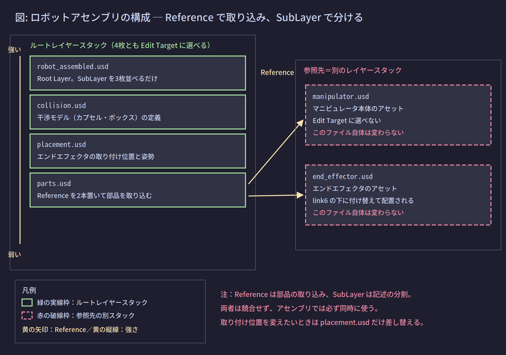

# 08. Isaac Sim での実践

ここまでの内容を、ロボットのアセンブリという具体的な場面で通す。基準は Isaac Sim 6.0.1（Windows ネイティブ）である。

## 1. この章が解く問題

実務で繰り返し出てくる問いが3つある。

- マニピュレータとエンドエフェクタを結合したロボットを、どういうファイル構成にすべきか
- 一度結合すると、プリムの親子関係を変更できなくなるのはなぜか
- 複数人でレイヤーを編集すると破綻しないか

---

## 2. 解決の方針: Reference と SubLayer を役割で使い分ける

04 の判断基準をそのまま適用する。

- **Reference**: どの部品を持ってくるか（部品の取り込み）
- **SubLayer**: その記述をどのファイルに置くか（記述の分割）

この2つは対立する選択肢ではない。アセンブリでは**必ず両方を同時に使う**。

---

## 3. 仕組み

### 3.1 アセンブリのファイル構成



構成は次のようになる。

```usda
# robot_assembled.usd  ← Root Layer
#usda 1.0
(
    defaultPrim = "World"
    subLayers = [
        @collision.usd@,
        @placement.usd@,
        @parts.usd@
    ]
)
```

```usda
# parts.usd  ← 部品の取り込みだけを書く
#usda 1.0

def Xform "World"
{
    def Xform "Robot" (
        references = @manipulator.usd@
    )
    {
    }
}

over "World"
{
    over "Robot"
    {
        over "link6"
        {
            def Xform "EE" (
                references = @end_effector.usd@
            )
            {
            }
        }
    }
}
```

```usda
# placement.usd  ← 取り付け位置と姿勢だけを書く
#usda 1.0

over "World" { over "Robot" { over "link6" { over "EE"
{
    double3 xformOp:translate = (0, 0, 0.085)
    uniform token[] xformOpOrder = ["xformOp:translate"]
} } } }
```

```usda
# collision.usd  ← 干渉モデルの定義だけを書く
#usda 1.0

over "World" { over "Robot" { over "link6"
{
    def Capsule "collision_link6"
    {
        double height = 0.12
        double radius = 0.045
    }
} } }
```

### 3.2 この構成から得られるもの

**得られるもの1: 部品ファイルが汚れない**

`manipulator.usd` と `end_effector.usd` は Reference 先なので、ルートレイヤースタックに属さない。Edit Target に選べないので、通常の操作では書き換えられない（06 参照）。

**得られるもの2: 取り付け位置のバリエーションを差し替えられる**

取り付け位置を変えたいときは `placement.usd` だけを差し替える。`subLayerPaths` の `placement.usd` を `placement_v2.usd` に置き換えれば済む。

**得られるもの3: 干渉モデルを外して比較できる**

`collision.usd` を Mute すれば（07 参照）、干渉モデルなしの状態と即座に比較できる。ファイルを消す必要はない。

**得られるもの4: 強さが期待通りになる**

`collision.usd` は L、`manipulator.usd` は R である（05 参照）。だから干渉モデル側の意見が、部品ファイルの意見に必ず勝つ。**SubLayer の並びで最下位の `parts.usd` でさえ、Reference 先より強い**という点を再確認しておいてほしい。

### 3.3 結合後にプリムの親子関係を変更できない理由

**主因は Reference の名前空間カプセル化である。**【確定】

04 で見た通り、参照元のレイヤーから書けるのは `over` だけであり、`over` は同じパスにしか書けない。したがって次の編集は、参照元のレイヤーでは**表現不可能**である。

- `/World/Robot/link6/EE` を `/World/Robot/link3/EE` に移動する

できるのは次までである。

- 属性の上書き（`over` で `translate` を変える）
- プリムの追加（`link6` の下に新しいプリムを作る）
- `active = false` による無効化（07 参照）

つまり「一度結合したら親子関係を変えられない」は、Isaac Sim の RobotAssembler の実装上の制限ではなく、**USD の合成モデルそのものの帰結**である。

### 3.4 ジョイントのパス切れは二次的な問題

`UsdPhysics.FixedJoint` の `physics:body0` / `physics:body1` はリレーション（relationship）であり、対象プリムのパスを保持している。

【確定】USD にはリレーションのパスを自動更新する仕組みがない。対象プリムをリネームまたは移動すると、リレーションは追従せず、指す先が存在しないパスになる。

ただしこれは、3.3 の理由でそもそも移動できないため、Reference 経由の構成では到達しない問題である。フラット化した後（3.5 参照）に移動する場合には現実の問題になる。

### 3.5 構造を変えたい場合の3つの手

**手1: 結合を作り直す**

結合操作をスクリプト化しておき、パラメータを変えて再実行する。最も素直で、再現性がある。

**手2: 結合操作の記述を SubLayer に切り出しておく**

3.1 の構成がまさにこれである。取り付け先を変えたいときは `parts.usd` を差し替える。

**手3: フラット化する**

**フラット化（flatten）とは**、合成アークを解決して、結果を1枚のレイヤーに焼き込む操作である。Reference で持ち込まれていた内容が、参照元のレイヤーの中に実体としてコピーされる。

フラット化すると、Reference の境界が消えるのでプリムの移動が可能になる。ただし引き換えに次を失う。

- 元アセットとの連動（`manipulator.usd` を更新しても反映されなくなる）
- ファイルサイズの節約（内容が実体としてコピーされる）

```python
from pxr import Usd, UsdUtils

stage = Usd.Stage.Open(r"C:\work\robot_assembled.usd")
flat = stage.Flatten()
flat.Export(r"C:\work\robot_flat.usd")

print("flattened prim stack:")
flat_stage = Usd.Stage.Open(r"C:\work\robot_flat.usd")
for spec in flat_stage.GetPrimAtPath("/World/Robot/link6/EE").GetPrimStack():
    print("  ", spec.layer.identifier, spec.path)
```

想定出力:

```text
flattened prim stack:
   C:/work/robot_flat.usd /World/Robot/link6/EE
```

フラット化前は `end_effector.usd` が出てきていたのが、フラット化後は自分自身のファイルだけになっている。Reference の境界が消えたことがこれで確認できる。

【確定】Isaac Sim / Omniverse Kit 側にも `FlattenLayersCommand` と `StitchPrimSpecsToLayer` が用意されている。前者はレイヤースタックを平坦化し、後者は特定のプリムだけを対象にする。

### 3.6 いま Reference 経由なのかフラットなのかを判定する

構造を変えられるかどうかは、この判定で決まる。

```python
from pxr import Usd

stage = Usd.Stage.Open(r"C:\work\robot_assembled.usd")
prim = stage.GetPrimAtPath("/World/Robot/link6/EE")

print("has authored references:", prim.HasAuthoredReferences())
print("prim stack:")
for spec in prim.GetPrimStack():
    print("  ", spec.layer.identifier, spec.path)
```

Reference 経由の場合の想定出力:

```text
has authored references: True
prim stack:
   C:/work/parts.usd /World/Robot/link6/EE
   C:/work/end_effector.usd /EE
```

フラット化済みの場合の想定出力:

```text
has authored references: False
prim stack:
   C:/work/robot_flat.usd /World/Robot/link6/EE
```

判定基準は2つある。

- `prim stack` に外部の USD ファイルが出てくれば Reference（または Payload）経由。構造は変更できない
- ルートレイヤースタックのファイルだけなら、フラットな実体。構造を変更できる

### 3.7 干渉モデルの検証における使い分け

干渉モデルをどこに書くかは、検証の段階によって変えるのが合理的である。

| 段階 | 書き込み先 | 理由 |
|---|---|---|
| 一時的な可視化（干渉島の表示など） | Session Layer | ファイルに残らず、閉じれば消える。最強なので必ず表に出る（06 参照） |
| 案の比較・検証 | 専用の SubLayer | Mute で外して比較できる。案ごとにファイルを分けられる（07 参照） |
| 確定した干渉モデル | 部品アセットのファイル本体 | 他のシーンでも使い回したいため。この場合はそのファイルを直接開いて編集する |

3段目だけは「元ファイルを書き換える」という判断である。ここで重要なのは、破壊性そのものではなく**影響範囲**である。

- 上位レイヤーに差分を書く: そのシーンにだけ効く。他のシーンには波及しない
- 部品アセットを書き換える: そのファイルを参照している**すべてのシーンに波及する**

USD 文脈で「非破壊」と言うとき、指しているのはファイルが変わるかどうかではなく、この影響範囲のことである。

---

## 4. 共同開発での破綻を防ぐ

### 4.1 破綻する運用と、しない運用

USD のレイヤーは「並行作業のために担当を分ける」ための道具である。分けなければ利点がない。

- **破綻する**: 全員が Root Layer を Edit Target にして編集する。実質的に1個の巨大ファイルを取り合うだけになり、01 の弱点1に逆戻りする
- **破綻しない**: 1レイヤー1責務・1担当者を先に決め、共有アセットはロックする

### 4.2 運用の原則

- **1レイヤー1責務**を先に決める（ジオメトリ／物理と干渉モデル／マテリアル／レイアウト／ライティング）
- **1レイヤー1担当者**にする
- 共有アセット（`manipulator.usd` など）はロックして、誰も直接書けなくする
- 変更は必ず上位レイヤーの `over` として積む

### 4.3 使える保護機構

06 で挙げた機構を、この文脈で再掲する。【確定】

| 機構 | この場面での使い方 |
|---|---|
| Layer Locking | 共有アセットのレイヤーをロックし、Edit Target に選べなくする |
| Spec Locking | 特定のプリム（ロボットのルートなど）だけを編集禁止にする |
| Spec Linking | 干渉モデルのプリムを `collision.usd` に紐付け、他のレイヤーに書かせない |
| Auto Authoring | Edit Target の指定を自動化する。公式ドキュメント上は実験的機能 |
| Live Session | Session Layer 経由でリアルタイム同期し、終了時にマージする |

【未確認】Isaac Sim 6.0.1 の Layer ウィンドウが、Locking と Spec Linking を GUI として露出しているかは確認していない。コマンドクラスの存在は API ドキュメントで確認済みだが、UI への露出は別問題である。実機の Layer ウィンドウで右クリックメニューを確認するのが確実である。

### 4.4 Enterprise Nucleus Server を使う場合

共有ワークステーション構成でレイヤーを分けるなら、3.1 の責務分割がそのままファイル単位のアクセス制御と対応する。逆に責務を分けずに1ファイルへ集約すると、サーバー側で権限を分けようがなくなる。

【未確認】Nucleus のアクセス制御の粒度（ファイル単位か、フォルダ単位か、両方か）はこちらで確認していない。構成前にサーバーのドキュメントで確認するのが確実である。

---

## 理解度確認問題

**問1.** `collision.usd` を `robot_assembled.usd` の SubLayer リストの最後尾に置いた。Reference 先の `manipulator.usd` が同じプリムの同じ属性に意見を持っている。どちらが勝つか。

<details><summary>解答</summary>

`collision.usd` が勝つ。SubLayer リストの最後尾は L の中で最弱だが、L 全体は R より強い。Reference 先の意見はどんな SubLayer にも負ける。

</details>

**問2.** `prim.GetPrimStack()` の出力に `C:/work/end_effector.usd` が現れた。このプリムの親子関係を変更できるか。

<details><summary>解答</summary>

できない。外部ファイルが prim stack に現れるということは Reference（または Payload）経由で構成されているということであり、名前空間がカプセル化されている。参照元から書けるのは同じパスへの `over` だけなので、移動は表現できない。変更するには結合を作り直すか、フラット化する必要がある。

</details>

**問3.** 干渉島の可視化プリムを一時的に追加したい。Session Layer と専用 SubLayer のどちらを選ぶべきか。判断の根拠を述べよ。

<details><summary>解答</summary>

一時的で保存する必要がないなら Session Layer。ファイルに残らず、ステージを閉じれば自動で消え、最強レイヤーなので下のどの意見にも負けない。逆に、複数の案を保存して後日比較したいなら専用 SubLayer を選ぶ。Mute で切り替えられ、ファイルとして版管理できる。

</details>

---

## 目次

1. [[01_なぜレイヤーが必要か]]
2. [[02_レイヤーの実体]]
3. [[03_レイヤースタックとSubLayer]]
4. [[04_合成アーク総覧]]
5. [[05_強さ順序LIVRPS]]
6. [[06_書き込み先の制御EditTarget]]
7. [[07_構成に参加しない記述]]
8. **08 Isaac Sim での実践**（このページ）
9. [[09_用語リファレンス]]

前のページ: [[07_構成に参加しない記述]]
次のページ: [[09_用語リファレンス]]
